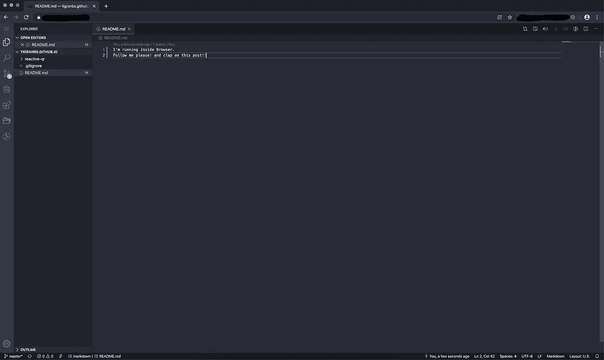

# 作为软件工程师，我的笔记本电脑独立工作流程

> 原文：<https://javascript.plainenglish.io/my-laptop-independent-workflow-as-a-software-engineer-3387614acbf2?source=collection_archive---------6----------------------->


编码不是一个容易的过程，特别是如果你必须超级专注才能相对快速且没有错误地完成它。只专注于编码是一个相当困难的挑战，但这个故事更多的是关于如何通过互联网和浏览器从任何地方进行编码的最终设置！

我们在[Hexometer.com](https://hexometer.com)经常出差，有时会在几天内频繁地切换电脑来检查我们的工具，这就是为什么我需要一个能够在任何一种有互联网和浏览器的电脑上支持相同编码流程的环境。

这可能不适合书呆子低价旅行者，因为他们通常会去便宜但网络连接不好的地方，正如你可以想象的那样，制作笔记本电脑独立编码设置的唯一方法是使用基本浏览器通过互联网，因为猜猜什么浏览器无处不在！

# 有什么优势？

我一直在追求拥有最强大的超极本，以使我的编码过程更快，代码编译时间无缝。正如你所猜测的那样，这可能很贵，而且你得到的功率会影响笔记本电脑的电池使用时间。通常情况下，MacBooks 可以编码 4-5 个小时而不用更换，这并不坏，但是，你会被限制在特定的笔记本电脑上，有时随着时间的推移，越来越难转移到新的笔记本电脑上。

老实说，在过去的 4-5 年里，我主要在我的编码项目中只使用 MacBooks，我喜欢他们构建和运行专门为他们优化的操作系统的方式，但当我开始使用远程服务器和 DevOps 时，我意识到将整个编码流程转移到服务器将利大于弊

*   **1GB/s 互联网网络！**这是一个巨大的好处，特别是如果你经常安装远程包或者拉/推 Docker 容器的话。
*   **强大的 CPU 内核，没有任何 UI 开销。**与作为笔记本电脑套装购买相比，您可以以更低的价格为您的编码服务器购买强大的至强或 i7 CPU 内核，但最显著的区别是，笔记本电脑的操作系统(全部)仅使用 3-5%的 CPU 来保持桌面 UI 运行，如果您将强大的 IDE 与它结合使用，电池消耗会更快。
*   **拥有你的**[**localhost**](http://localhost)**遥不可及！作为一名 web 开发人员，我曾经运行一个名为`ngrock`的工具来做一些远程隧道，用于向客户展示一些实验项目。现在这是非常有用的，甚至有专门的领域附加到我的开发环境，编码和共享的东西直接从一个地方在线！**
*   **非常灵活的磁盘空间。**我几乎一直在使用配有 256GB 固态硬盘的笔记本电脑，但能够动态扩展它只是让我们能够直接在编码环境中运行一些良好的数据收集测试。

所有这些都是对浏览器内部编码的主要好处的奖励，litera l **可以在任何装有浏览器的设备上运行。**

# 浏览器中的 VS 代码

有几个工具/服务可以在你的浏览器中运行 VS 代码编辑器。然而，有一个开源项目，它通过用基于 WebSocket 的服务器通信替换 Electron 的功能，在浏览器内部进行精确的 VS 代码复制。即使在移动热点上使用 3G 网络，它也能正常工作，然而，有时当互联网连接不好时，你会非常失望，但这是独立于笔记本电脑的代价。不管怎么说，你得到的好处比你一开始想象的还要多。

[Code-Server](https://github.com/cdr/vscode) 基于 VSCode，但他们改变了电子桌面应用程序的所有连接部分，以通过浏览器+ Websocket 连接工作，在服务器端运行服务并将结果传递给浏览器。Code-Server 可以在所有平台上运行，包括 MAC、Windows 和 Linux，但是在大多数情况下，我相信您会将 Linux 作为运行 code-server 的服务器操作系统。

```
# Running code-server from CLI
~# code-server --auth none --port 8888
```

这将启动代码服务器，现在您可以通过导航到`[http://localhost:8888](http://localhost:8888)`从浏览器访问 VSCode 功能

如果你打算长期运行它，并且想在它上面管理你的所有项目，你打算让它作为后台服务运行，比如说使用 SystemD(这就是我正在使用的)。

我的例子的基本 SystemD 配置如下所示

```
[Unit]
Description=Code Server[Service]
PIDFile=/tmp/coder-99.pid
User=coder
Group=coder
Restart=always
KillSignal=SIGQUIT
WorkingDirectory=/home/coder
ExecStart=/usr/local/bin/code-server --auth none --port 8080[Install]
WantedBy=multi-user.target
```

正如你所看到的，我没有直接从代码服务器使用公共端口，这是因为它实际上可以暴露我所有的项目，没有任何访问控制(他们的密码不是那么安全)。为了使它更安全，我在它前面使用 Nginx，并进行特定的配置，只代理东西，并设置 HTTP 认证+一些 SSL 配置，以确保它只能通过 VPN 访问。



# 它真的能在任何设备上工作吗？

我会答应的！而且没有！

一些设备有 Unicode 输入问题，他们使用一些字符转换服务，像大多数 Android 设备，但对于苹果设备，它工作得很好！即使在 iPad Pro 上，您也会感受到通过 VSCode 终端编码和访问服务器 CLI 的全部乐趣。

我在 Acer Chromebook 14 上工作了一段时间，这是一款非常低功耗的设备，但它对我来说非常好，因为大多数自动完成和服务处理工作都在服务器端进行，不会占用本地笔记本电脑的 CPU。

这显然不适合所有人，如果你主要是在不需要桌面视图或特定操作系统的应用程序上编码，那么你可以这样做。我甚至用 Expo 对原生编码做出了反应，它们覆盖了所有与操作系统无关的流程。

我希望你会喜欢在浏览器中编码，像我现在一样独立于笔记本电脑！