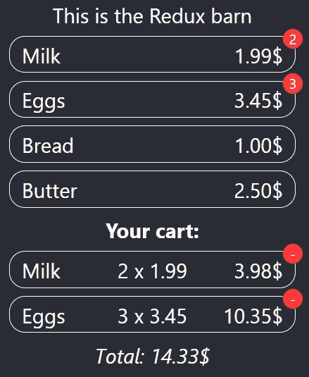
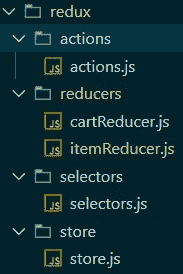
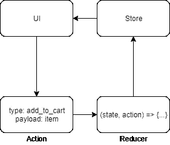
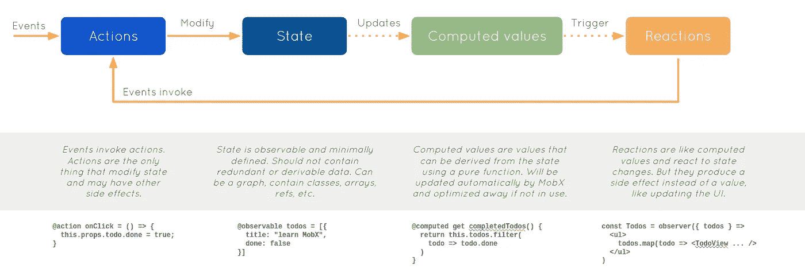
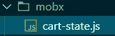

# React 中 Redux 和 MobX 的区别

> 原文：<https://javascript.plainenglish.io/my-take-on-redux-and-mobx-in-react-7585470429f9?source=collection_archive---------3----------------------->

## React 应用中 Redux 和 MobX 的状态管理有何不同？


Photo by [Greg Rosenke](https://unsplash.com/@greg_rosenke?utm_source=medium&utm_medium=referral) on [Unsplash](https://unsplash.com?utm_source=medium&utm_medium=referral)

# 介绍

> 用于构建用户界面的 JavaScript 库

这是 React 登录页面的副标题，巧妙地表达了它的主要关注点——以高效的方式呈现组件，如果你在他们的主页上做更多的阅读，也会强调这一点。

> 为应用程序中的每个状态设计简单的视图，当数据发生变化时，React 将有效地更新和呈现正确的组件。

对于开发人员来说，这意味着框架不提供管理应用程序状态的实际方式，而只提供本地组件状态。这可能是一件好事，也可能是一件坏事，这取决于你的经历——高年级学生可以自由地做他喜欢的事情，而新手则必须努力，因为国家管理可能是一项非常艰巨的任务。

对于小型应用程序来说，只使用本地组件状态可能没什么问题，特别是添加了`Context API`之后，我们就不用再深入到单个组件了。但是仍然有一个缺点——状态仍然依赖于单个组件，如果应用程序超出了最初的小范围，这可能会变成一堆蠕虫。

在`React`应用程序中有两个流行的管理状态的库:`Redux`和`MobX`，每个都有自己的方法，但是有一个共同的目标——用一个不太麻烦的工作流将状态从单个组件中分离出来。

让我们看一下每个图书馆的购物车示例。用户可以查看可用的商品并将它们添加到购物车中。可以添加多个相同类型的商品，它们可以从商品视图和购物车视图中删除。为了简单起见，两个视图都在一个页面上，尽管它们在不同的页面上不会改变任何事情。完整的源代码可以在[这里](https://github.com/MustSeeMelons/react-state-party)找到。



the greatly designed app

# Redux

它提供了一种严格但简单的管理状态的方法，要使一切工作正常，需要创建相当多的文件:



all the required files

流程本身非常简单:

*   用户界面是从包含状态的单个 store 对象派生的
*   该接口分派动作来发出状态变化的信号
*   动作由派生新状态的 reducers 处理
*   用户界面是从更新后的状态中导出的



redux flow

有几件事要记住，否则，你可能会过得不好:

*   还原剂必须是纯功能的，没有副作用
*   状态不能在还原器内(或任何其他地方)突变

现在是编写代码的时候了，让我们看看如何向购物车添加商品，从以下操作开始:

```
export **const** addToCart = **function**(item) {
    return {
        type: "add_to_cart",
        payload: {
            item
        }
    };
};
```

当我们将一个组件连接到商店时，返回一个可分派的动作，稍后使用，下一步—缩减器:

```
**const** cartReducer = **function**(state = {
    items: {}
}, action) {
    **const** itemId = action.payload && action.payload.item.id;
    if (itemId === undefined) {
        return state;
    }**const** item = state.items[itemId];
    switch (action.type) {
        case "add_to_cart":
            if (item) {
                **const** copy = {
                    ...state
                };
                copy.items[itemId].count++;
                return copy;
            } else {
                **const** copy = {
                    ...state
                };
                copy.items[itemId] = {
                    ...action.payload.item,
                    count: 1
                };
                return copy;
            }
        default:
            return state;
    }
};export { cartReducer };
```

在 reducer 中，我们检查动作类型，然后在我们的状态中添加一个新的条目，或者更新现有的条目，非常重要的是不要更新传入的状态对象，而是返回一个新的。

差不多了，现在我们必须创建商店，这是一个非常简单的考验，我们只需将所有的 reducers 传递给它。

```
export **const** store = createStore(
    combineReducers({
        itemReducer,
        cartReducer
    })
);
```

接下来，我们需要将我们的应用程序封装在一个`Provider`组件中，该组件将我们的存储作为一个参数，目前它本身并没有做太多事情。

```
**function** ReduxApp() {
    return (
        <Provider store={store}>
            <div className="App">
            <header className="App-header">
                <div>This is the Redux barn</div>
            </header>
            <ReduxList />
            <ReduxCart />
            </div>
        </Provider>
    );
}
```

我们需要从状态中获取某些东西的组件，或者需要能够分派动作的组件必须被包装在`connect`组件中，这将把我们想要的一切注入到我们的`props`中。

```
**// A component like any other component
const** ReduxItemList = props **=>** {
    return (
        <div>
        {props.items.map((item, index) **=>** {
            return (
                <Item
                    key={index}
                    item={item}
                    onAdd={props.addToCart}
                    onRemove={props.removeFromCart}
                    contained={props.contains[item.id]}
                    amounts={props.amounts}
                />
            );
        })}
        </div>
    );
};**// helper for creating props, from the state
const** mapStateToProps = state **=>** {
    return {
        items: state.itemReducer.items,
        contains: ItemInCartCheckSelector(state),
        amounts: CartItemAmountSelector(state)
    };
};**// helper for creating props, which can dispatch actions
const** mapDispatchToProps = dispatch **=>** {
    return {
        addToCart: item **=>** 
          dispatch({ type: "add_to_cart", payload: { item } }),
    };
};**// putting it all together, and exporting
const** ConnectedReduxItemList = connect(
    mapStateToProps,
    mapDispatchToProps
)(ReduxItemList);export { ConnectedReduxItemList as ReduxList };
```

*重要提示:由于我们有多个 reducer，我们必须使用* `*combineReducers*` *函数，它将从 reducer 子状态创建整个应用程序状态，映射到每个 reducer 的名称。*

```
state = {
    itemReducer: { items: []},
    cartReducer: {items: {}
}
```

您可能已经注意到我们也有一个`selectors`文件，这个文件有可选的函数，用于从状态中导出一些东西，例如，我们在购物车中有多少每种类型的商品。

```
export **const** CartItemAmountSelector = state **=>** {
    return state.itemReducer.items.reduce((acc, cartItem) **=>** {
        acc[cartItem.id] = state.cartReducer.items[cartItem.id]
          ? state.cartReducer.items[cartItem.id].count
          : 0;return acc;
    }, {});
};
```

咻，这么简单的事情却有这么多代码！在现实世界中，每个 reducer 都有自己的动作和选择器文件，进一步增加了样板代码。

# MobX

> 任何可以从应用程序状态派生的东西都应该被派生。自动地。



nice flow diagram from the documentation

乍看之下，流程看起来非常相似:

*   该接口是从状态派生的
*   动作改变状态
*   一个新的接口被导出

从完全相同的功能所需的文件开始，执行过程有很大的不同:



huh, one file?

MobX 也需要一个存储来存储数据，尽管您并不局限于一个——您可以创建任意多个，甚至可以是单例。

```
import { observable, action, toJS, computed } from "mobx";**class** CartState {
    @observable items = {};

    @action addItem = item **=>** {
        **const** itemCopy = toJS(this.items);
        if (itemCopy[item.id]) {
            itemCopy[item.id].count++;
        } else {
           itemCopy[item.id] = {
               ...item,
               count: 1
           };
        }

        this.items = itemCopy;
    };@action removeItem = item **=>** {
        **const** itemCopy = toJS(this.items);
        if (itemCopy[item.id].count === 1) {
            delete itemCopy[item.id];
        } else {
            itemCopy[item.id].count--;
        }
        this.items = itemCopy;
    };@computed **get** totalAmount() {
        return (
            Object.keys(this.items).reduce((acc, key) **=>** {
                **const** item = this.items[key];
                return acc + item.price * item.count;
            }, 0) || 0);
    }
}**const** instance = new CartState();
export { instance as CartState };
```

理想情况下，我们使用`decorators`来标记函数，但是它们也可以被包装。我们希望组件能够观察的属性必须标记为`observable`。如果一个方法改变了状态，它必须用`action`标记，如果我们想从状态中计算一些东西，我们将 getter 函数标记为`computed`。我们正在实现同样的功能，但是代码要少得多。

如果存储是单例的，那么组件中的用法可能太简单了:

```
**const** MobXItemList = observer(() **=>** {
    return (
        <div>
        {ItemListState.items.map((item, index) **=>** {
             return (
                 <Item
                     key={index}
                     item={item}
                     amounts={ItemListState.itemAmounts}
                     onAdd={() **=>** {
                         CartState.addItem(item);
                     }}
                     onRemove={() **=>** {
                         CartState.removeItem(item);
                     }}
                 />
             );
         })}
        </div>
    );
});
```

# 结论

看完这些代码样本后，可能看起来`MobX`是正确的选择，但是生活中总是如此——它并不那么简单，有一些事情需要记住。

虽然`Redux`的明确性对于这样一个简单的购物车应用程序来说有些过分，但它对于大型应用程序来说却是天赐之物，因为它更容易跟踪数据流，因为您知道自己在寻找什么:`actions`、`reducers`、`selectors`。

对于`MobX`来说，情况正好相反——对于参与人员较少的小型应用程序，如果他们都同意如何实例化和使用存储，它可以加快开发速度并保持代码非常整洁和少量——灵活性带来了更多的责任。

然而，这并不意味着应该避免使用本地状态——在必要的时候仍然应该使用本地状态，但在 redux/mobx 中，例如表单输入字段，除非某些业务需求强制使用本地状态。

重要提示——`Redux`有一个令人惊叹的 Chrome/FF 插件叫做`ReduxDevTools`，用于检查应用程序状态、分派的动作，甚至是整个状态的树形图，与之相对应的`MobX`也存在，但相比之下就相形见绌了。

***TL；DR:*** *小型应用程序可以从* `*MobX*` *中获得健康的生产力提升，而* `*Redux*` *将帮助您在处理大型应用程序时保持头脑清醒。*