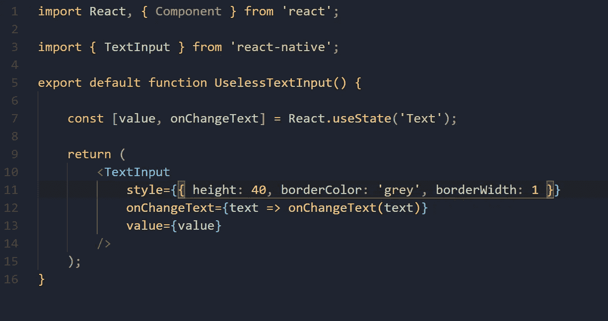
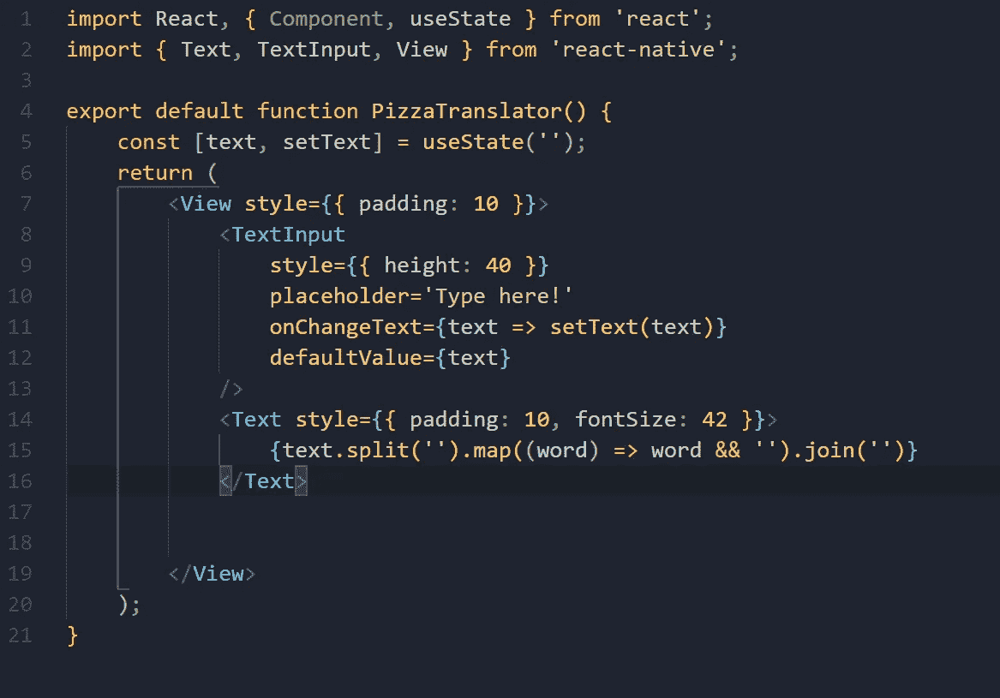
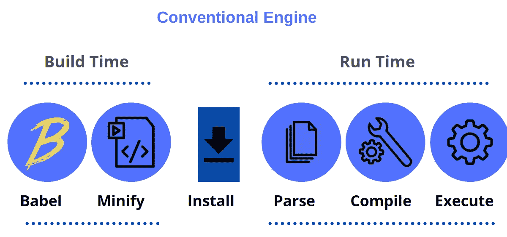

# 优化 React 原生应用的 3 种方法

> 原文：<https://javascript.plainenglish.io/my-ultimate-guide-to-optimize-your-react-native-apps-757e9a818b0c?source=collection_archive---------5----------------------->

## 改善用户体验，使开发更加灵活

当谈到优化 React-Native 应用程序时，有时您必须保持业务流程并尽可能快地进行优化，这将是我用最佳实践优化您的应用程序的指南。

# 1.渲染生命周期

React Native 将负责应用程序的渲染，但是您必须从这些构建块中定义最终接口的组件&这是您如何以正常方式完成的，而不关心**渲染生命周期。**简而言之，过多的渲染周期会导致设备上的应用程序变慢并产生延迟，要解决这个问题，你必须采用不同的方法。规则很简单，如果父组件正在重新渲染&，组件可以重新渲染，这意味着“渲染”方法可以在不改变道具的情况下运行，因为改变预览和当前道具将花费太长时间。

## 过多的渲染周期对应用程序的影响:

1.性能问题，尤其是在**低端**移动设备上。

2.你将体验到闪烁的**界面**和丢帧**(一个有更新的动画)**。

*一旦你的应用程序出现这些症状，就该进入* ***渲染生命周期了。***

## 如何优化

我能建议的最简单的解决方案是在需要时使用纯组件，你可以更好地理解下面给出的例子。

因此，几乎每个 React 本机应用程序都包含一个由组件状态控制的' **TextInput'** '，所以在上面的代码中，几乎每个设备都可以正常工作，不会出现任何错误，但是当我们优化我们的应用程序时，我们必须确保它在慢速设备上的工作效果与我们在快速移动设备上的工作效果一样好，您将面临用户快速键入并导致视图更新问题的情况。

## ***为了更好的理解，让我们把它进一步分成更小的部分。***

如果您熟悉 React-Native 中的异步特性，您将很容易理解这一点，因为用户键入并用新字母填充“TextInput ”,更新将通过 onChangeText prop 发送到 React-Native，并通过调用 setState 设置状态，随后受控组件将 JavaScript 值与本地组件值同步。这些操作很简单，除非在更新过程中，当文本**“TE”闪烁并变成“T”时，用户要以非常高的速度输入。**

为了解决这个问题，我们可以从我们的代码中删除值 prop 使数据流成为单向的，只消除所描述的问题，在对代码行进行一些更改后，它应该看起来像这样。

做了这些改变后，你的应用程序将需要更少的用户设备电池使用量，因为这将使用户的满意度更高。

# 2.选择正确的外部**库**

一个外部的**库**在使用 **React-Native、**制作企业应用程序时发挥了重要作用，在这里你可以寻找 JavaScript 库，在那里你可以实现你想要的东西，而不是从头开始创建组件，但是这个生态系统也有一些严重的缺点，因为开发人员不知道每个部分都有什么。

移动应用程序开发有自己的一套规则，而在 web 应用程序的情况下，资产的大小是至关重要的，而在 React-Native 中并不同样需要，因为文件系统由您的资产组成。为了确保您的 React-Native 在大多数必须选择正确外部**库的移动设备上提供最佳性能。**

> 更少的代码意味着更快的响应时间，并且代码的总体大小受库的影响。

任何 React-Native 应用程序都包含一个在设备内存中工作的 **JavaScript** 包，在通过 **JavaScript &解析和执行之后，由于这个过程，JavaScript 代码在这里是一个重要因素。**

## 我能推荐的最佳解决方案是:

1.  只使用较小的专用库。
2.  始终检查与您正在寻找的要求相同的备选方案。

例如，假设您的 React-Native 应用程序需要对运行时间进行操作，那么您可以使用 **day.js** (近 2Kb)而不是 **moment.js** 库(67Kb ),它可以在更少的时间内完成完全相同的操作& **消耗更少的空间。**

# 3.优化启动时间

每个用户都希望应用程序具有超强的响应能力，能够快速加载，否则，你会在应用程序商店中得到很多你不希望发生的差评。我们可以用一个单一的因素来描述启动时间，因为加载过程中有许多阶段。

## 如何优化

使用 Hermes 你可以很容易地解决这些问题，Hermes 是一个 JavaScrip 引擎，它关注 CPU 指标，比如应用程序的大小和交互时间。

爱马仕有什么不同？简而言之，Hermes 使用 **AOT** 编译器(提前)，而大多数引擎使用 **JIT** (及时)，这意味着整个包提前编译成字节码。