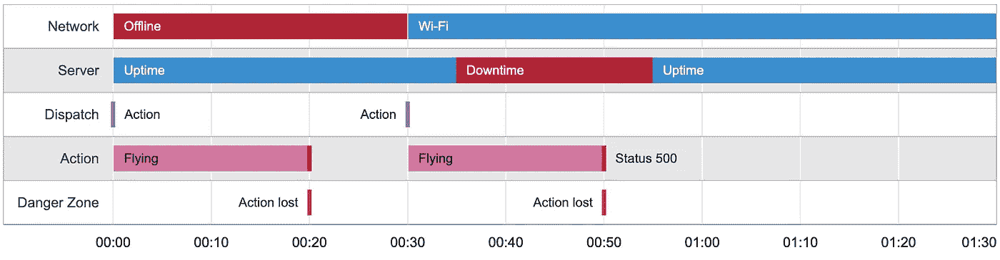
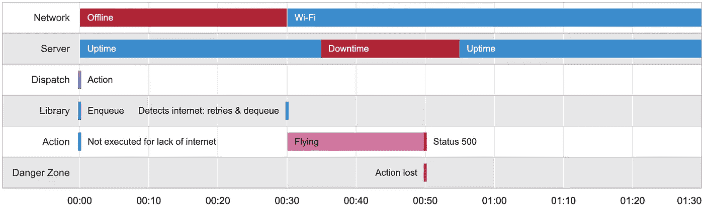
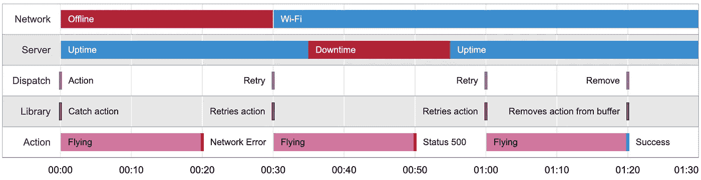
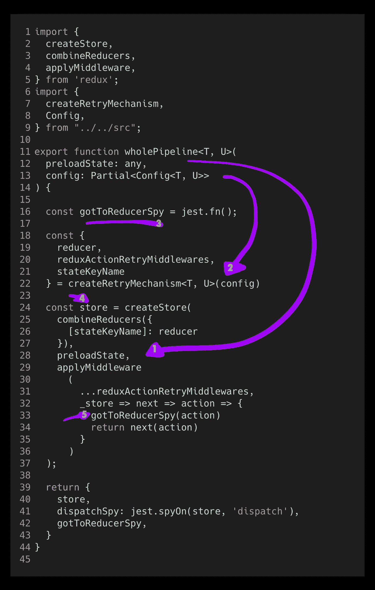
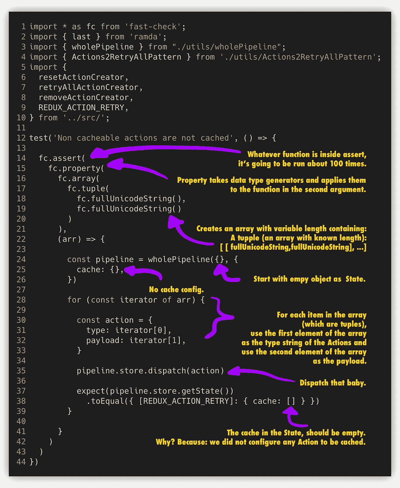
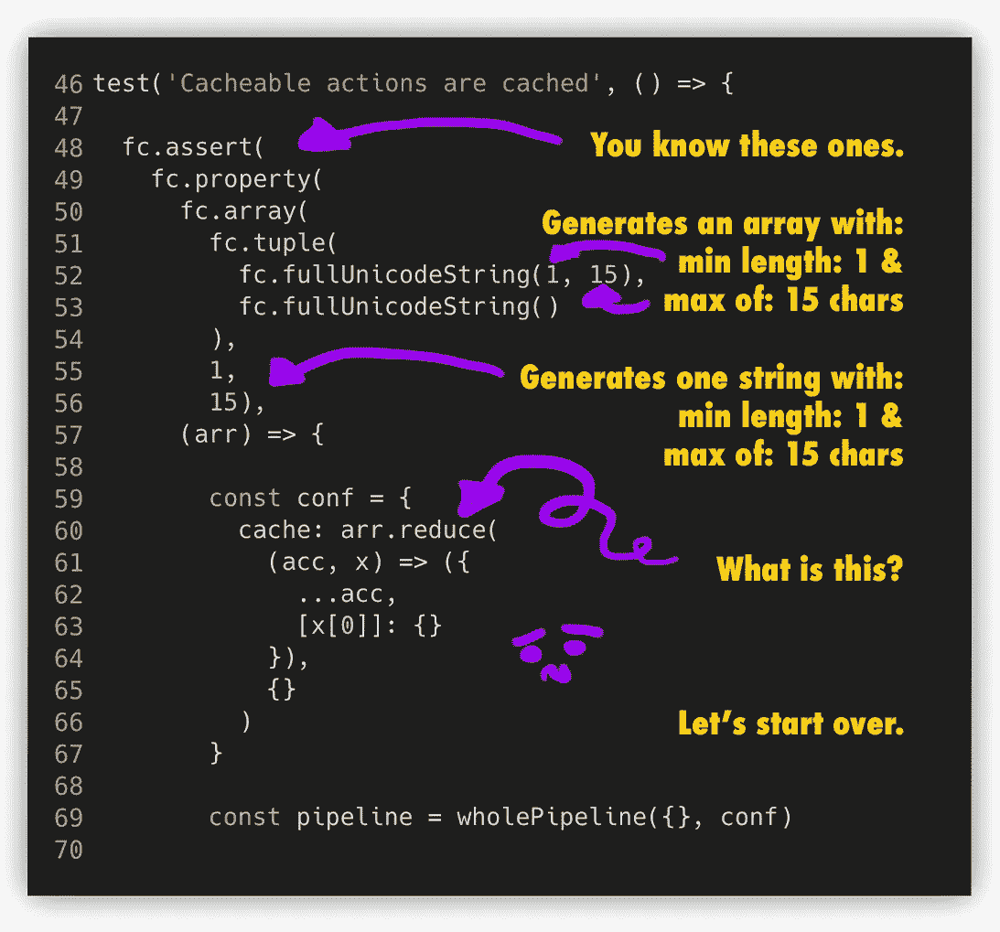
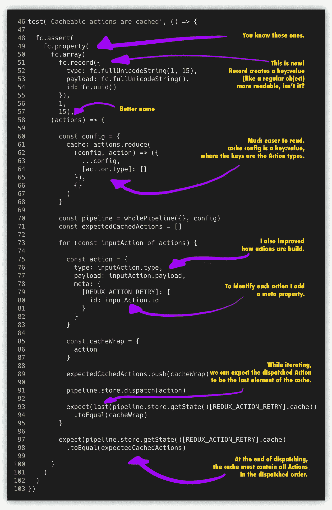
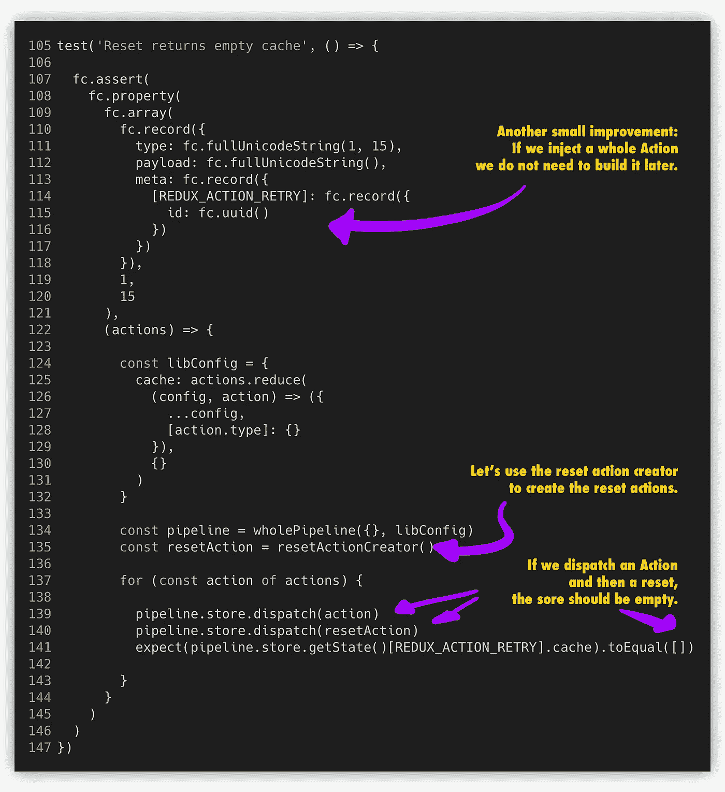
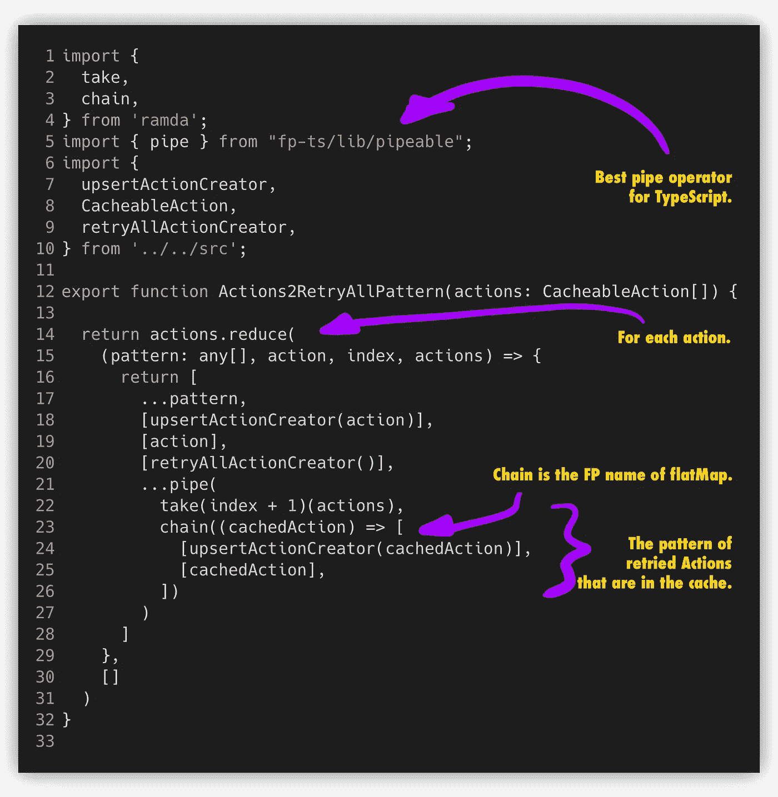

# 由测试用例叙述:Redux 动作重试

> 原文：<https://javascript.plainenglish.io/narrated-by-test-cases-redux-action-retry-b2e004c4c823?source=collection_archive---------7----------------------->

## 测试用例可能是描述技术的最佳方式，例如:

## 我如何做一个库来解决 HTTP 客户端重试。

Photo by [Simon Migaj](https://unsplash.com/@simonmigaj?utm_source=unsplash&utm_medium=referral&utm_content=creditCopyText) on [Unsplash](https://unsplash.com/collections/168922/vintage?utm_source=unsplash&utm_medium=referral&utm_content=creditCopyText)

我的团队有一个移动应用程序有一个大问题:它丢失了客户数据。

# 从产品到问题

让我给你一个从产品到问题场景的美好旅程:

## 该产品

我们的团队为快递公司开发了一个移动应用程序，其员工(快递员)在现场上传收到的包裹的签名照片。

## 堆

我们使用:

1.  [**React 原生**](https://reactnative.dev/) 并为 iOS 和 Android 打造。
2.  [**Redux**](https://redux.js.org/) 为国家管理者。
3.  [**Redux-Saga**](https://redux-saga.js.org/) 为异步副作用。
4.  [**-Redux-Persist**](https://github.com/rt2zz/redux-persist)**保存手机上的数据。**

## **应用生命周期**

**不知道你是否能想象出它已经有了堆栈，但我将向你简要解释我们的应用程序状态是如何工作的:**

1.  **我们使用 React Native 用 JavaScript 编写一个移动客户端，使用 React Native 工具，我们为 iOS 和 Android 生成构建。**
2.  **当应用程序启动时，redux-persist 从内存中检索最后的状态，作为应用程序的初始状态(再水合)。**
3.  **当用户与一个元素交互时，它[发送](https://redux.js.org/api/store#dispatchaction)一个[动作](https://redux.js.org/basics/actions)。**
4.  **当一个动作被分派时，它同步产生一个新的状态。**
5.  **分派一个动作还会触发一个[事件](https://redux-saga.js.org/docs/basics/UsingSagaHelpers.html)，它作为一个异步操作工作，并可能产生其他动作，从而引起连锁反应。**
6.  **当存储发生变化时，redux-persist 会将状态保存在内存中(这种情况经常发生，我们永远不知道应用程序何时会被关闭)。**

## **问题场景**

**我将向您描述我们的主要问题场景:**

1.  **应用程序已打开。**
2.  **商店被重新水化。**
3.  **用户上传照片。**
4.  **同步内部状态**乐观地**将图像添加到状态。**
5.  **状态保存在永久存储器中。**
6.  **saga 通过 HTTP 请求将照片上传到服务器。**
7.  **???**
8.  *****请求永远不会到达服务器。*****
9.  **该应用程序关闭和打开。**
10.  **商店被重新水化。**
11.  **照片在手机上，并出现在应用程序中。**
12.  **一天或多天过去了。**
13.  ****客户抱怨他的员工成功地将照片上传到应用程序，但照片不在报告中。****

# **分析问题**

**当你在开发一个移动应用程序时，你遇到的第一个网络困境是移动设备会比桌面更频繁地离线。自然地，我们的应用程序已经有了一个库，它对动作进行排队以便稍后重试。**

## **离线图书馆通常如何工作**

1.  **库是冗余的中间件。**
2.  **他们通常有一个机制，允许他们检测是否有互联网可用。**
3.  **如果图书馆检测到有互联网，它什么也不做。**
4.  **但是，如果库检测到没有互联网:当一个动作被分派时，库截获该动作并将其排队，执行同步操作(乐观状态)但忽略异步操作(sagas，可能保存 HTTP 请求)。**
5.  **如果库再次检测到有互联网，它调度所有排队的动作，并转到点 3。**

**起初，我们认为我们的问题是图书馆误识别了电话是否在线，发送了带有假阳性互联网连接的请求，显然，我们得到了网络错误。**

**最简单的方法是寻找一个替代方案。我们尝试了许多针对 Redux 的*【离线队列】*解决方案，都是基于添加一个中间件，将被标记为“可重试”的动作排队，和/或在手机离线时阻止 sagas 的执行。它们之间的主要区别在于它们如何检测互联网连接以及与其他库的交互(比如 redux-persist)。**

**在某个时候，我们开始分叉这些库以改进离线检测机制，并很快意识到这些库测试了网络连接，但没有测试互联网的可访问性，因此在有 Wi-Fi 但没有互联网的情况下执行 sagas 会导致排队的操作丢失，当然，这是由于网络错误而失败。**

**当时 React Native 没有现成的解决方案来检测互联网的可达性(不确定它现在是否有)，我们唯一的选择是 ping 一个服务器，看看包是否真的穿过了马路。**

**在原型化我们确保到达服务器的方法时，我们遇到了一个更大的问题:我们的服务器有短暂的错误。也就是说，我们有停机时间，这是局部的，是瞬间的事情，但我们可以注意到它。**

**设备中的网络可达性检测无法解决服务器上的瞬时错误，因此我们的客户端仍然需要在逻辑上正确处理 500 个状态代码(以不丢失数据)，因此我们决定打破常规，寻找另一种方法来解决这个问题。**

****

**Mobile app Network & Server scenario**

# **解决我们头脑中的问题**

**在研究了针对这个问题的库之后，我们能找到的只有 ***【最多一次交付】，*** 具有网络可用性意识，这阻止了在明显不好的场景中执行动作。**

**在真正分析了这个问题之后，我的脑袋在尖叫:没有办法预先知道一个行动是否会失败。预测 HTTP 请求是否会失败是徒劳的。**

**我们需要确保我们的 HTTP 请求成功，而不仅仅是在“理想的”场景中发送它(比如有互联网的时候)。至少我们可以检查我们的请求是否到达服务器，我们需要 ***“至少一次交付”*** 。**

**经过几个星期的努力寻找解决方案，我们放弃了，我说服团队让我建立我们自己的工具，这没有多大说服力，我们真的需要解决这种数据丢失。**

****

**Common libraries: At most once delivery with network availability awareness**

**在这一点上，我们已经发现我们需要一个更强大的方法，另一种思考退休行动的方式，我想到的是:**

> ****行动必须重试，直到成功、衰老或明确停止。****

## **至少一次交货**

**但是如何保证 ***【至少一次交货】*** ？嗯……这是书中最古老的把戏，当然是致谢。**

**新库不应假定何时从缓存中移除。如果我们调度了一个动作，它必须缓存在重试机制中，以便以后重试，并且它的 saga 必须显式地向重试机制发送一个确认，以删除缓存的动作。**

**它应该是这样的:**

****

**[Redux-action-retry](https://github.com/edgarjrg/redux-action-retry) main scenario**

# **开始**

**现在我们知道了解决问题应该是什么样子，让我们实际上开始编程一些东西来完成我们想要的。**

## **一个 Redux 库的剖析**

**Redux 库通常由 3 个组件组成:**

1.  **向 Redux 添加行为的中间件。**
2.  **一个 Reducer，用于更新库自身的状态，如果需要的话。**
3.  **最后是动作创建者，它们是预定义的动作，开箱即用是有意义的。**

**因此，我们的解决方案可以由这三个部分中的任何一个组成，尽可能不引人注目和最小化配置也很好，但这些都是次要的，重要的是解决问题！**

**Redux 库的内部很复杂，非常纠结，它们不会是一个好的讲述者，但是你知道会是什么吗？测试。**

## **寻找叙述者**

**当然，我首选的 JavaScript 测试框架是 [Jest](https://jestjs.io/) ，但是在经过大量的场景分析后，我发现编写这样一个库有太多可能出错的地方，仅仅 Jest 是不够的。所以我决定:**

> **让我们只关注事物的实际形状，其他的都应该是随机的。**

**所以我决定和我的朋友[一起进行“基于属性的测试”，快速检查](https://github.com/dubzzz/fast-check)。fast-check 是一个神奇的库，它可以帮助您发现奇怪的边缘情况，同时允许您只关注测试的属性，而不是短暂的值。**

**但是为什么是快速检查而不是其他？好吧，即使有其他库来帮助我们完成基于属性的测试，快速检查也是用 TypeScript 编写的，对于可能已经认识我的人来说，我完全同意这一点。**

**我将尽我所能在快速检查的帮助下讲述这个故事，但请不要太关注它的细微差别，如果你不熟悉，这些测试的价值不在于快速检查的使用。**

## **测试驱动开发(TDD)**

**我使用测试驱动开发来设计这个库应该是什么样子，然而，我是一年前做的这个库，所以我不能向你展示测试是如何塑造这个库的。你可能认为有些部分是事后做的，但它们大多是测试的迭代，例如:我提取了更容易重用的功能的公共代码，只有在我意识到它们是公共的之后。**

## **黑盒测试**

**关于这些测试的另一个重要的事情是，它们是黑盒测试，这意味着我们不会测试库的内部，而只是 Redux 本身的行为。**

**我们的测试就像我们在应用程序中实现库一样，我们将只使用库本身公开的接口。**

**不多说了，我将向您展示测试套件，它应该比其他任何套件都更好地解释了这个库的使用。**

# **核心**

**该库的核心由 5 个属性组成:**

1.  **不可缓存的操作不会被缓存。**
2.  **可缓存的操作被缓存。**
3.  **Reset 返回空缓存。**
4.  **Remove 返回没有元素的缓存。**
5.  **全部重试。**

**我在 nice 函数中提取了一些公共代码，以使测试尽可能容易编写，让我带您开始使用 Redux 管道。**

## **撕毁**

****

1.  **`preloadState`表示`createStore`的初始状态。**
2.  **`config`是对库的配置。**
3.  **`gotToReducerSpy`让我们知道我们的应用程序中的 reducers 将采取什么行动。**
4.  **`store`是我们的库的最小 Redux 存储配置的样子。**

**如您所见，`wholePipeline`返回一个初始化的 Redux 存储，以及我们的重试机制和一些工具(间谍)来帮助我们查看事情是否正常工作:`dispatchSpy`和`gotToReducerSpy`。**

**有了所有这些工具，现在我们可以将我们的测试用例集中在检查事情是否正在发生，并且我们不需要对 Redux 做任何其他的配置。**

**所有的核心测试都在一个文件`test/core.spec.ts`中。**

**好吧！不是，我们都准备好要看第一个测试场景了:**

## **不可缓存的操作不会被缓存**

**对于我们的第一个测试，我们应该检查最低配置是否有效，也就是:什么都不做。**

**如果我们没有显式地配置库来缓存任何动作，那么在分派任何动作时，缓存存储应该保持为空。**

****

**我们的测试是这样的:**

1.  **无论`assert`里面是什么函数，它都会运行大约 100 次。**
2.  **`property`获取数据类型生成器并将它们应用于第二个参数中的函数。**
3.  **我们生成的数据类型是一个可变长度的数组，包含一个元组(一个已知长度的数组)，有两个不同的字符串:
    `[ [ full unicode string, full unicode string], ... ]`**
4.  **我们用一个空对象作为状态来启动管道。**
5.  **我们将库配置为不存储任何动作。**
6.  **对于数组中的每一项(元组)，使用数组的第一个元素作为动作的`type`字符串，使用数组的第二个元素作为有效负载。**
7.  **我们迅速行动。**
8.  **处于状态的缓存应该为空。为什么？因为:我们没有配置任何要缓存的操作。**

**现在你已经熟悉了快速检查(`fc`)，`assert`让测试运行 x 次(默认为 100)，这使得`property`产生 100 种不同的情况(小数组、大数组、空字符串、奇怪的字符串)。然后，我们使用生成的数据来构建发送到商店的操作，在每个场景中，我们都应该得到一个空状态。**

## **可缓存的操作被缓存**

**对于我们的第二个测试，让我们证明我们的 lib 配置工作，如果我们说一个动作应该被缓存，它必须在缓存存储中。**

****

**这个测试的可读性可以提高一点，你不觉得吗？像`[x[0]]:{}`这样的行很难理解，我将再试一次:**

****

**测试流程是这样的:**

1.  **我们创建一个记录(对象)数组，其中包含一个至少包含 1 个字符的`type`属性，一个可以是任意字符串的`payload`属性，以及一个对于每个动作都应该是唯一的 id。**
2.  **我们配置库来存储我们生成的所有动作类型。**
3.  **我们用一个 id 来标识所有的动作，这是库所要求的，我将在后面介绍更多的细节。**
4.  **我们调度并检查该动作是否是最后添加的。**
5.  **最后，我们检查整个缓存是否包含所有已排序的操作。**

**到目前为止一切顺利，我们现在可以确信我们的动作正在被缓存！**

## **重置返回空缓存**

**我们的第一个案例基本上证明了我们的库可以无干扰地添加到 Redux 配置中，并且确保缓存存储工作正常，那么我们接下来的场景中最少要测试什么呢？我认为应用程序生命周期是一个很好的候选，它帮助我们思考库如何在应用程序中生存。**

**常见的应用程序生命周期命令:**

1.  **安装应用程序。**
2.  **打开应用程序。**
3.  **登录。**
4.  **使用。**
5.  **关闭。**
6.  **注销。👀**
7.  **已卸载。**

**如果用户启动应用程序，redux-persist 可能会恢复我们的缓存存储，库不需要做任何事情，但是，如果用户注销，我们可能希望清空我们的存储，以便为下一个登录的用户有一个干净的开始，让我们接下来这样做:**

****

**在这个测试用例中，我做了另一个改进，我在属性中构造了我们的整个动作，所以我们不需要在下面创建它，现在看起来很明显。**

**一般来说，这种情况可以通过 3 个简单的步骤来实现:**

1.  **提起诉讼。**
2.  **调度重置。**
3.  **检查缓存存储是否为空。**

## **移除返回没有元素的缓存**

**既然我们的应用程序生命周期似乎已经覆盖，我们可以转移到我们的主要工作，重试操作。我喜欢在测试中从决策树的叶子开始，这样我可以确保以后有更完整的测试场景。**

**例如，我们的重试场景可能是这样的:**

1.  **分派一个操作，并检查它是否被缓存。**
2.  **调度重试，查看重试是否发生，并检查操作是否仍在缓存中。**
3.  **分派移除操作，并检查该操作是否已不在缓存中。**

**如果我们现在做这个测试，如果我们还没有设计或者实现，我们怎么能发送一个移除动作命令呢？TDD 方式告诉我，我应该首先提出一个移除的案例。**

**与所有内容都必须删除的重置场景不同，删除必须针对单个操作，因为它们可能彼此独立地成功，删除一个元素如下所示:**

****

**我们所做的是:**

1.  **使用目标的引用(更准确地说，是要删除的目标操作的 id)创建一个删除操作。**
2.  **获取当前商店的快照。**
3.  **派遣行动。**
4.  **分派移除操作。**
5.  **断言新状态，因为我们应该已经删除了该动作，应该与缓存该动作之前的状态相同。**
6.  **最后，在我们删除每个添加的动作时，检查缓存是否为空。**

**现在我们有了重试测试用例的所有要素。**

## **重复数据删除**

**至此，我们有足够的信心来创建重试测试用例，这将比其他的更复杂一些。**

**让我们考虑一下，一个断言库是否正在正确重试的测试将不得不分派动作，并重试它们多次，看看是否都重试了。**

**如果我们重试这些操作，您能想象缓存存储应该是什么样子吗？因为一旦我们分派了重试，所有的动作都被重试，这些动作将再次进入中间件(我们的库)，但是，我们不希望它们被复制。**

**没错，我们需要准备好重复数据删除，这就是`meta.REDUX_ACTION_RETRY.id`派上用场的时候，正如我之前在 TDD 部分提到的，我已经迭代了一些测试，例如，在这一点上，我必须修改之前的测试以使用`id`属性，因为在这一点之前它不是一个要求，事实上，我花了一段时间来决定`id`必须是一个要求而不是可选属性。**

## **全部重试**

**如果我们希望每个唯一的操作在缓存中只出现一次，这意味着我们不能只使用缓存存储来断言操作被重试。如果我们分派一个可缓存的动作，分派一个重试全部，并且存储没有被明显地修改，我们如何断言我们做了什么？**

**如果我们不能使用缓存存储来证明事情正在工作，那么也许我们可以基于哪些操作符合 reducer 来构建一个“历史”,并比较它们是否按照期望的顺序到达。**

**做这个测试需要几天的时间来反复设计重试动作应该是什么样子，但是我想我想到了一个模式，它准确地描述了事情是如何工作的，并且极大地简化了测试用例。**

**在观察`redux-persist`如何工作时，我意识到库将动作分派给它自己的 reducer 中间件，这是一种非常好的可调试方式，因为它们是非常容易识别的动作。这时我想到不要插入任何通过我们的中间件自动传递的动作，而是分派一个`upsert`动作，并让缓存缩减器对其做出反应。**

**我们要做的是:我们将生成许多动作，对于每个动作，我们将分派一个动作和一个`retryAllAction`，到达我们的 reducer spy 的动作历史应该如下所示:**

1.  **`upsertAction`**
2.  **行动**
3.  **`retryAllAction`**
4.  **对应的`upsertAction`之前的每个先前分派的动作的序列。**

**更详细地说，假设我分派了动作`A`和`B`:**

1.  **调度`A`**
2.  **调度`retryAll`**
3.  **调度`B`**
4.  **调度`retryAll`**

**那么`gotToReducerSpy`一定是通过以下方式调用的:**

1.  **`upsertAction A`，Redux 中间件可以在将当前动作向下传递之前调度动作， **upsert 机制**应该这样做，以确保在处理动作和触发 reducers 和 sagas 之前缓存动作，这可能会失败甚至关闭应用程序。**
2.  **`**A**`，我们实际出动的行动。**
3.  **`**retryAll**`，我们实际出动的另一个行动。**
4.  **`upsertAction A`，**重试机构**实际上只调度了`A`，上插机构应该再次在`A`之前将`upsertAction`推下链条。**
5.  **`A`，由重试机制调度。**
6.  **`upsertAction B`，upsert 机制。**
7.  **`**B**`，我们实际出动的行动。**
8.  **`**retryAll**`，我们实际出动的最后一次行动。**
9.  **`upsertAction A`，upsert 机制。**
10.  **`A`，重试机制。**
11.  **`upsertAction B`，upsert 机制。**
12.  **`B`，重试机制。**

**如果我们对此进行归纳，我们会得到:**

****

**我们所做的:**

1.  **对于每个动作:分派动作。**
2.  **检查该操作是否是最后添加到缓存存储中的。**
3.  **给商店拍快照。**
4.  **分派“重试全部”操作。**
5.  **断言新店和上一家完全一样。**
6.  **在动作迭代器的末尾，对间谍进行全面检查，这应该与我们的模式相匹配。**
7.  **偏执地再次检查所有的动作是否都在缓存中(以另一种方式多余地断言某件事似乎是偏执的，直到这样做救了你的命)。**

## **重试所有模式的操作**

**这个测试看起来很简单，但是要完成它需要很多迭代、努力和时间。简洁代码的一个秘密是间谍调用中的抽象模式，但不用担心，我会告诉你:**

****

**这是模式现在的样子，但是为了得出在`A`、`B`动作中解释的结论，在笔记本和白板上画了很多东西。**

**您可能想知道，为什么库操作如此冗长/多余？嗯，这是最安全和更易调试的方式来表示重试的情况，如果您遇到问题，您只需使用任何 Redux 中间件打印操作，并查看什么操作先出现，什么操作被认为需要增加等等，顺序和原子性得到了保证。没有那些`upsertAction`能做到吗？是的，它会变得不那么健谈，但是保持沉默不是一个好的生产系统。**

# **好消息**

**我有几个好消息要告诉你:**

## **你已经到达终点了**

**你把这些都吃完了！感谢你一直读到这一部分，我真的希望这些测试的见解能帮助你做出更好的测试。**

## **还有更多**

**更多好消息，还有更多功能！在编写这个库的时候，我尽最大努力做到模块化，并开发了我们刚刚隐含介绍的核心特性:**

1.  **向上插入。**
2.  **重置。**
3.  **移除。**
4.  **全部重试。**
5.  **垃圾收集器，👀还是我们没有？**

**但是，这个库中还有更多东西帮助我们实现了真正强大的解决方案:**

1.  **垃圾收集器。**
2.  **次数(或重试次数)。**
3.  **冷却时间。**
4.  **是时候活下去了。**

**我没有包括这些情况，因为这篇文章很长，这是我第一次发表这种格式，所以我不知道添加其他 4 个更复杂的规范会有什么反应，但是，如果你想让我做，请告诉我。**

## **开源代码库**

**这个库是开源的！去[https://github.com/edgarjrg/redux-action-retry](https://github.com/edgarjrg/redux-action-retry)，评论，启动，分叉，使用，看其他测试用例，来个爆款。**

**我一年前做了这个库，我工作的公司很酷，允许我发布它，但是，我没有收到任何请求，所以我没有对它做任何维护，但是如果你愿意，我可以做一个依赖项的快速更新，或者你喜欢或需要的任何其他内容。**

## **x 状态**

**我正在认真考虑将这个库移植到 XState，以带来一个更清晰的解决方案，因为 Statecharts 可能更好地表示内部情况，我认为这太乱了，无法在本文中展示，而是让测试用例讲述一个更好的故事。**

## **我写了更多**

**[我有一份简讯，你可能会喜欢](http://eepurl.com/hg7AeP)，我还写了其他可能对你有帮助的文章，比如[为我改变 JavaScript 的 6 个工具](https://medium.com/javascript-in-plain-english/the-6tools-that-changed-javascript-for-me-3ee1faf40585)、[永远不要使用箭头函数的两种情况](https://medium.com/javascript-in-plain-english/you-should-never-use-an-arrow-function-in-any-of-these-two-situations-8bc2fbbc39b8)和[管理如何限制你作为开发人员的潜力](https://medium.com/better-programming/how-management-is-limiting-your-potential-as-a-developer-abb46f18e097)，希望我的故事能给你带来一些价值。**

**谢谢你这么牛逼！**

## ****简明英语团队的笔记****

**你知道我们有四份出版物和一个 YouTube 频道吗？你可以在我们的主页[**plain English . io**](https://plainenglish.io/)找到所有这些内容——关注我们的出版物并 [**订阅我们的 YouTube 频道**](https://www.youtube.com/channel/UCtipWUghju290NWcn8jhyAw) **来表达你的爱吧！****