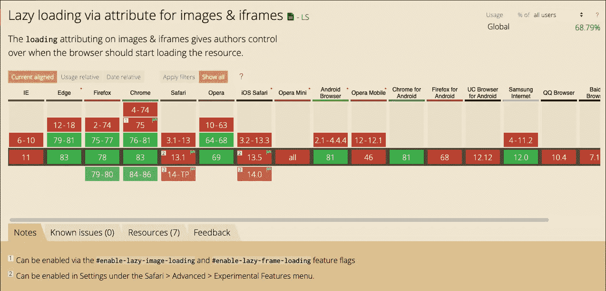

# 原生延迟加载具有单个 HTML 属性的 iFrame

> 原文：<https://javascript.plainenglish.io/natively-lazy-loading-an-iframe-5de05beb05d3?source=collection_archive---------15----------------------->


Photo by [Pankaj Patel](https://unsplash.com/@pankajpatel?utm_source=medium&utm_medium=referral) on [Unsplash](https://unsplash.com?utm_source=medium&utm_medium=referral)

你知道你可以像加载图片、样式和脚本一样延迟加载 iframe 吗？使用一个名为`loading`的 HTML 属性和它的值`lazy`，您可以在 iframe 显示在可视窗口中时立即加载它。

```
<iframe 
  src="https://www.weather.gov/" 
  loading="lazy" 
  onload="alert('iframe loaded')"
></iframe>
```

通过此演示了解它的实际应用:

Iframe Lazy Load Demo

很神奇，对吧？不再需要通过事件监听器动态改变`src`。我喜欢这背后的原生支持，但对于最近发布的所有功能，浏览器支持非常有限。



loading=”lazy” Browser Support

不管怎样，看到标准实践被原生集成到浏览器中真的很好！

*更多内容尽在*[***plain English . io***](http://plainenglish.io/)