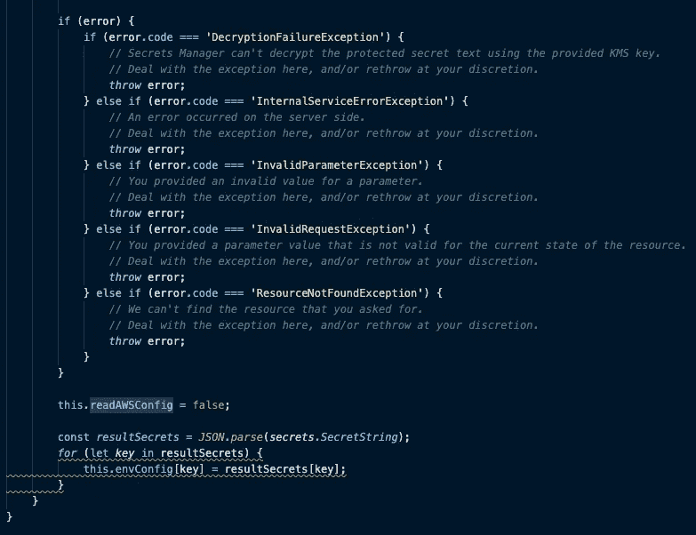
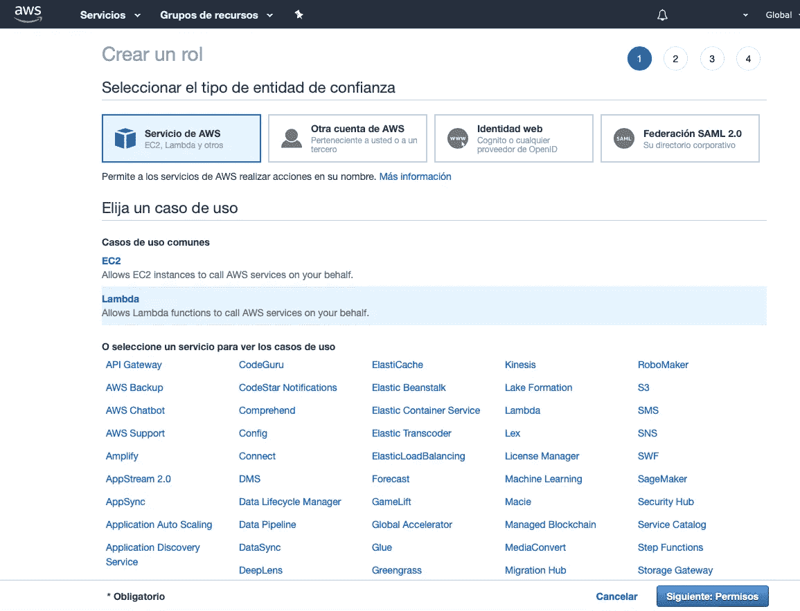

# 带有 MongoDB Atlas 和 AWS Secret Manager 的 NestJS 无服务器应用程序

> 原文：<https://javascript.plainenglish.io/nestjs-serverless-app-with-mongodb-atlas-e8dec9ae7405?source=collection_archive---------1----------------------->


正如 AWS 提到的，无服务器是创建和部署应用程序的一种经济有效的方式，您可以创建任何类型的后端应用程序，并使用 API 网关的优势来连接您的前端或您需要的任何其他服务。

本指南是在 AWS 环境下用 NestJS，Serverless 和 MondoDB Atlas 创建一个无服务器应用程序。为了澄清我将使用图像来共享代码，我更喜欢这种方式，因为它更容易阅读，所以当你编码时要小心。

几周前我开始使用 serverless，我爱上了它，我在 NestJS 中开发后端(顺便说一下，我也喜欢，请尝试一下)。所以我想把这两种技术结合起来，我做了一些研究，事实上 serverless.com 创造了一种连接这两种技术的方法，所以我把我的测试建立在这个基础上。

希望这个指南对你有用，如果你有任何问题或疑问，请联系我。

# 为什么没有服务器？

无服务器是云的原生架构，使您能够将更多的运营责任转移到 AWS，从而提高您的敏捷性和创新性。无服务器允许您构建和运行应用程序和服务，而无需考虑服务器。它消除了基础架构管理任务，如服务器或群集配置、修补、操作系统维护和容量配置。您可以为几乎任何类型的应用程序或后端服务构建它们，并且为您处理运行和扩展具有高可用性的应用程序所需的一切。

# 为什么使用无服务器？

无服务器使您能够以更高的灵活性和更低的总拥有成本构建[现代应用](https://aws.amazon.com/modern-apps/)。构建无服务器应用程序意味着您的开发人员可以专注于他们的核心产品，而不用担心管理和操作服务器或运行时，无论是在云中还是在本地。这种减少的开销让开发人员可以节省时间和精力，用于开发可扩展且可靠的优秀产品。

【https://aws.amazon.com/serverless/ 

# **首先:**

我们将为此使用很多不同的技术，有很多信息，所以我会尽我所能尝试恢复它，请填写免费研究链接，在这里分享更多信息。

## 那么我们需要什么？

1.  创建一个 AWS 帐户，您将拥有一年的免费等级。
2.  安装 NestJS:[https://nestjs.com](https://nestjs.com)
3.  在 MongoDB 中创建一个免费帐户:[https://www.mongodb.com](https://www.mongodb.com)
4.  用这个例子从无服务器:[https://www . server less . com/examples/AWS-node-typescript-nest](https://www.serverless.com/examples/aws-node-typescript-nest)
5.  我们走吧！

# AWS 控制台

在 AWS 中创建帐户后，您需要生成一个 IAM 角色。


IAM Roles AWS

IAM 角色在 AWS 中是全局的，转到用户并创建一个新用户，我强烈建议这样做，不要使用您的根用户。你可以遵循这个指南，它会解释一切。

[](https://docs.aws.amazon.com/IAM/latest/UserGuide/id_users_create.html) [## 在您的 AWS 帐户中创建 IAM 用户

### 您可以在 AWS 帐户中创建一个或多个 IAM 用户。当有人加入您的团队时，您可能会创建一个 IAM 用户，或者…

docs.aws.amazon.com](https://docs.aws.amazon.com/IAM/latest/UserGuide/id_users_create.html) 

**重要！保管好您的访问密钥和秘密密钥，您将在接下来的步骤中需要它。**

打开您的终端并安装 AWS-CLI:[https://docs . AWS . Amazon . com/CLI/latest/user guide/CLI-chap-install . html](https://docs.aws.amazon.com/cli/latest/userguide/cli-chap-install.html)

一旦你完成了所有的安装，就该编码了！

# 编码时间到了

## **1。打开您的终端并运行这个命令:**

```
aws configure
```

插入您的凭据并按照步骤操作。

## **2。创建项目**

为此项目创建一个文件夹，并运行以下命令:

```
npm install serverless -gserverless install -u https://github.com/serverless/examples/tree/master/aws-node-typescript-nest -n  aws-node-typescript-nestnpm start
```

该命令将创建并启动 NestJS 无服务器应用程序，您也可以遵循该页面上的步骤:[https://www . server less . com/examples/AWS-node-typescript-nest](https://www.serverless.com/examples/aws-node-typescript-nest)

您可以使用带有 GET to[http://localhost:3000/hello](http://localhost:3000/hello)的 Postman 测试它。如果你得到回应，我们就 ok 了！我们继续吧。


## **3。在 AWS 中部署无服务器项目**

运行此命令，这将部署无服务器应用程序。创建 Lambda 函数，CloudWatch for logs，S3，项目的 API 网关和所有需要的资源。

此命令将识别您的 AWS 凭据，并完成创建环境的工作。

```
sls deploy
```


这需要一些时间，一旦完成，你会看到这个。复制端点并像我们之前做的那样粘贴到 Postman 中，并将**“{ proxy+}”**替换为**“hello”**。你会收到同样的回应，完美！

现在，您可以为您的应用程序创建更多的模块和端点。

# **部署 MongoDB Atlas**

在这里你可以创建一个免费的账户来创建你的数据库:[https://www.mongodb.com](https://www.mongodb.com)

有一个免费层，您可以使用它进行测试，在 us-east-1 地区创建集群，并将 AWS 作为提供商。小心创建群集，确保选择空闲层。


创建集群后，转到 create database 并创建一个名为 test 的新集合。**您也需要为集群创建一个用户，确保提供读写权限并记住密码。**


然后转到网络访问并添加来自 anyware(0 . 0 . 0 . 0/0)的访问，这对于让我们的应用程序获得数据库非常重要，您也可以添加您当前的 IP 地址进行测试。


点击 Confirm，就完成了，我们准备好将我们的应用程序连接到我们的 NestJS Serverless。

# 创建配置模块

现在，我们已经准备好将应用程序连接到 MongoDB。我强烈推荐使用 AWS 中的 Secrets Manager 来存储您的数据库连接。

您需要创建两个文件，config.service.ts 和 config.module.ts。

您的 config.module.ts 应该如下所示:


您的 config.service.ts 应该如下所示:



这个 config.service.ts 获取您的环境变量，并验证您是否通过 SDK 连接到 AWS，所以基本上，如果您没有连接到 AWS，它将获取您的本地环境变量，否则它将获取在 Secret Manager 上定义的变量。

get 方法创建环境变量。这取决于构造函数。

getMongoConfig()使用 Secret Manager 变量创建到数据库的连接。

upAWSConfig()完成这项工作。一旦你创建了你的密码，你可以在密码管理器文档中找到这个函数。

好了，我们就快到了，现在我们需要将我们的 config.service.ts 导入到我们的 app.module.ts 中。这是您的 app.module.ts 的配置方式。您可以看到我使用 NestJS 中的 MongooseModule，并创建一个到数据库的异步连接，从注入 configService 的 ConfigService 调用 getMongoConfig()。


我们准备好出发了。我们更新了数据库、配置模块和 app.module.ts。现在是时候创建连接并部署我们的服务了。

# AWS 机密管理器

到你的 AWS 控制台，然后到秘密管理器，创建一个新的秘密:*(对不起，我的 AWS 控制台是西班牙语)*。


在这里，您添加了您的秘密 MONGO_DB，为此，有不同的方法连接到您的 MongoDB Atlas，我尝试了几次以不同的方式连接，我没有成功，所以如果您以不同的方式实现它，请在评论中与我分享。我相信是因为 NestJS 的 MongooseModule。

这里的理想应该是创建 MONGO_USER、MONGO_HOST、MONGO_PASSWORD 和 MONGO_DATABASE。相反，我们将使用一个 MONGO_DB secret 进行测试。

转到您的 MongoDB Atlas 帐户，转到您的集群并单击连接按钮。


这是破解方法，点击“使用 MongoDb Compass 连接”。选择 1.11 或更低版本，并复制连接字符串。大概是这样的:

```
mongodb://**username**:**<password>**[@](http://twitter.com/testingscluster)clustername.mongodb.net:27017,clustername.mongodb.net:27017,clustername.mongodb.net:27017/**test**?replicaSet=TestingsCluster-shard-0&ssl=true&authSource=admin
```


复制字符串，替换您在 MongoDB 集群中创建的名称的“username ”,还替换“<password>”,最后替换您之前创建的数据库中集合名称的“test”。</password>

**在 AWS Secret Manager 中，将字符串粘贴到您的 Secret 值中，**单击“下一步”，您将看到要使用的不同 SDK，在那里您可以找到您会注意到的 Javascript，它与我们在 config.service.ts 中创建的代码很相似。(无需复制此代码，我们的代码会完成这项工作)。

# 一些重要的配置！

我们终于如此接近了！现在让我们在我们的 serverless.yml 中工作。

我在这里测试了一些东西，与我之前分享的 NestJS 无服务器模板的链接有些不同。

在您的 package.json 中，您需要添加/替换这些包:

```
“serverless-offline”: “^5.12.1”,“serverless-plugin-optimize”: “^4.0.2-rc.1”,“serverless-plugin-typescript”: “1.1.9”,
```

您也可以毫无问题地将 NestJS 依赖项更新到 7.x。记得也加上猫鼬和@ nestjs/mongose。如果您更新您的依赖项，请小心，您的 main.ts 中会有一个错误，所以如果您想要更新嵌套的依赖项，您的 package.json 依赖项应该如下所示:


**请记住，依赖关系可能因项目而异！**

因此，如果您继续使用我，您需要对您的 main.ts 进行一些更改，以便在 NestJS 中使用 express。这里可以看到 bootstrapServer()函数与 Serverless 发布的模板有点不同。基本上，您将使用**“新的 ExpressAdapter(expressApp)。然后返回 cachedServer。**


# **ARN IAM 角色兼 AWS 秘密经理**

最后一步，您需要创建一个角色来管理机密，并使用提供的“arn”将它分配给您的无服务器应用程序。

转到您的 IAM 并单击“创建新角色”。单击下一步。



并附上 Secrets Manager 的策略。


单击 next 直到结束，然后单击您创建的角色并复制 arn。

你需要从秘密管理器中复制你的 arn，进入 AWS 秘密管理器，点击你的秘密并复制 arn。


# 终于！Serverless.yml 和部署！

谢谢你，如果你还在读这篇文章，我花了一些时间解决了许多关于 NestJS 和无服务器的问题，但是现在我们在这里。

现在我们需要修改我们的 serverless.yml


首先，注意插件，它们和 serverless.com 的模板有点不同

然后，您需要在 AWS 控制台中创建一个 IAM 角色，可以访问您的 Secret Manager。创建角色后，复制 arn 并将其添加到您的“角色:”中。

创建 AWS_ACTIVE 变量，该变量为 true，将告诉我们的 config.service.ts 我们希望使用 AWS Secrets Manager 而不是本地环境。

添加您的区域和 SECRET_NAME(您在 AWS 控制台中创建的名称)

最后，添加 **iamRoleStatements，**这里您需要从您创建的秘密中粘贴**“arn”**。

就这样，我们准备再次运行命令:

```
sls deploy
```

这将部署您的应用程序，如果一切正常，您现在连接到您的数据库，您可以使用抛出 sls deploy 命令的 url 测试 Lambda。

所以现在你只需要实现一个新的模块一个接口和模式来在你的 MongoDB 中创建对象。

# 结论

在没有服务器的情况下，无服务器是一种非常强大的开发方式，我意识到如果你将它与其他一些框架和技术结合起来，结果基本上是没有限制的。

希望这个指南对你有所帮助，我试着用很多例子来说明它，现在享受你的应用程序，如果你有任何问题或疑问，请联系我。

随时联系我！

[https://www.linkedin.com/in/carlos-villarroel-navarro/](https://www.linkedin.com/in/carlos-villarroel-navarro/)