# 如何在布局中使用 React 路由器:一种新方法

> 原文：<https://javascript.plainenglish.io/new-approach-for-working-with-react-router-dom-82b7be0404b9?source=collection_archive---------1----------------------->

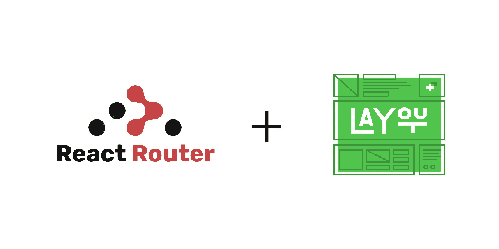

## 用数组在一个简单的 React 应用程序中制作路由器

大家好，我是阿里·希尔扎德，前端开发者。

对于我的一个简单项目，我决定提高我的代码的可读性，让下一个为我的代码工作的人开心！:)

当我在谷歌上搜索如何绘制路线时，我完全被弄糊涂了，失去了我的主要目标，即提高可读性。我找到的所有教程都与 react-router 的官方文档非常相似。

react-router 的一个简单示例:

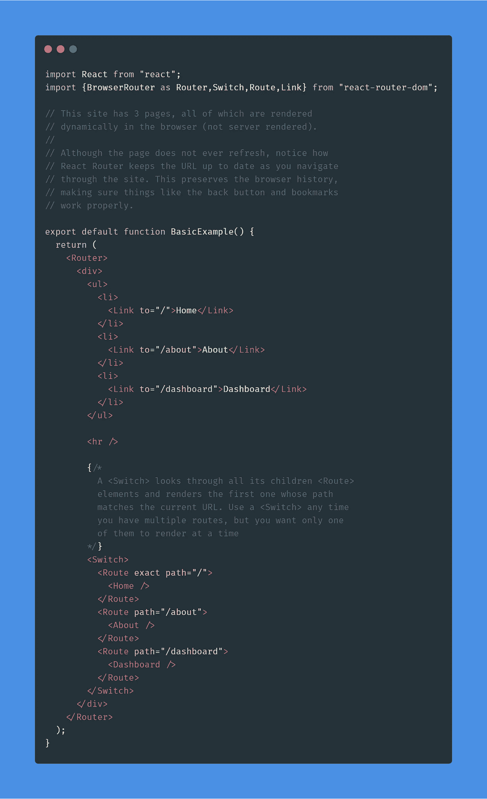

Skip *<Home/> ,<About/>,<Dashboard/>* Component For Now

上面的代码非常清晰，可读性很好。

但是如果我想使用带有组件的布局呢？

据我所知，我们使用布局有两种选择:
1。分别制作被版图包裹的各个组件
2。用布局组件
包装所有你想使用的路线(我更喜欢第一种方式，我不太喜欢第二种方式)

**选项一大概是这样的:**

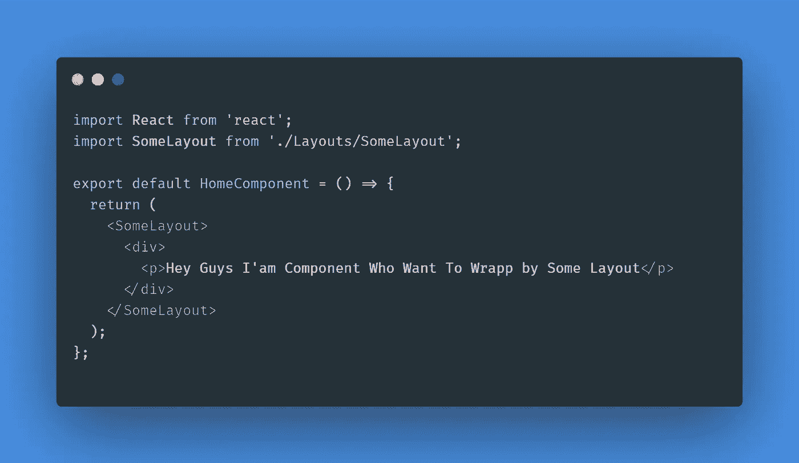

We Must do this for All Component that Wants to Use Layout

然后像这样使用它们:

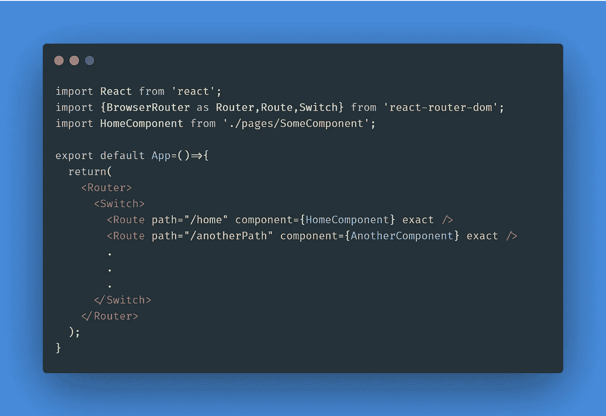

Skip <AnotherComponent/>, I Just Want To Show You How to Wrap And Use Them

**第二个是这样的:**

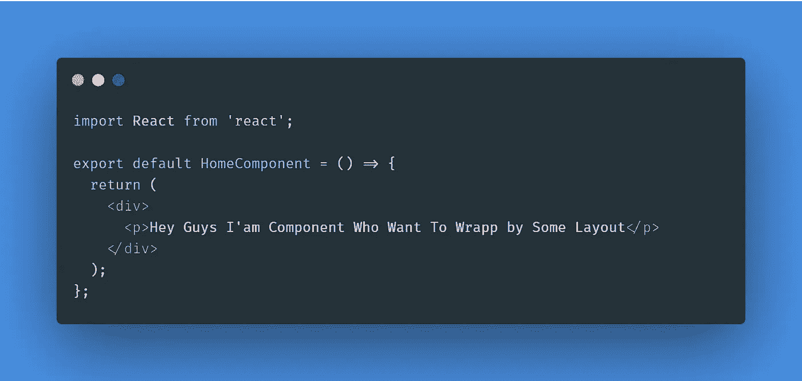

像这样使用它们:

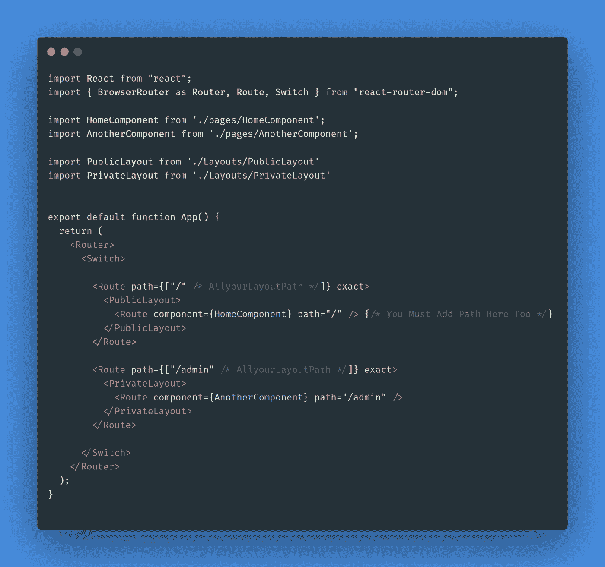

Description of Private Route Later

在这两种方式中*、< SomeLayout >* 是这样的:

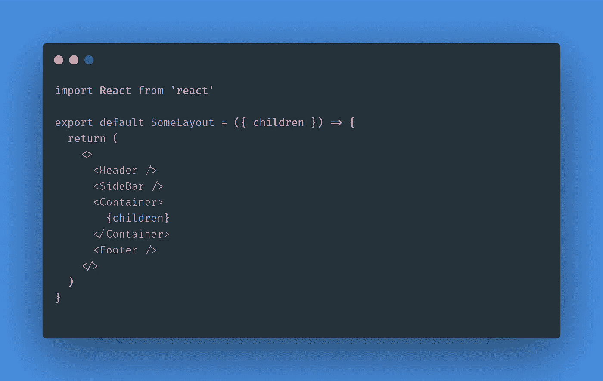

Imagine We Created the Header, Sidebar and Footer earlier

如您所见，该组件通过使用交换机和路由器组合了所有子组件并显示其中一个，但它没有良好的可读性。在我的项目中，每次我需要路由时，我应该使用这个意大利面条代码吗？
(你可以在[这个链接](https://stackoverflow.com/questions/42862028/react-router-v4-with-multiple-layouts)上看到一些解决方案)

和队友聊过之后，他们建议我把所有路线放在一个数组里，用地图功能做路线(更容易阅读和开发)。

因此，在上面的两个例子中，我们不使用 *App.js* ，而是使用这个方法:

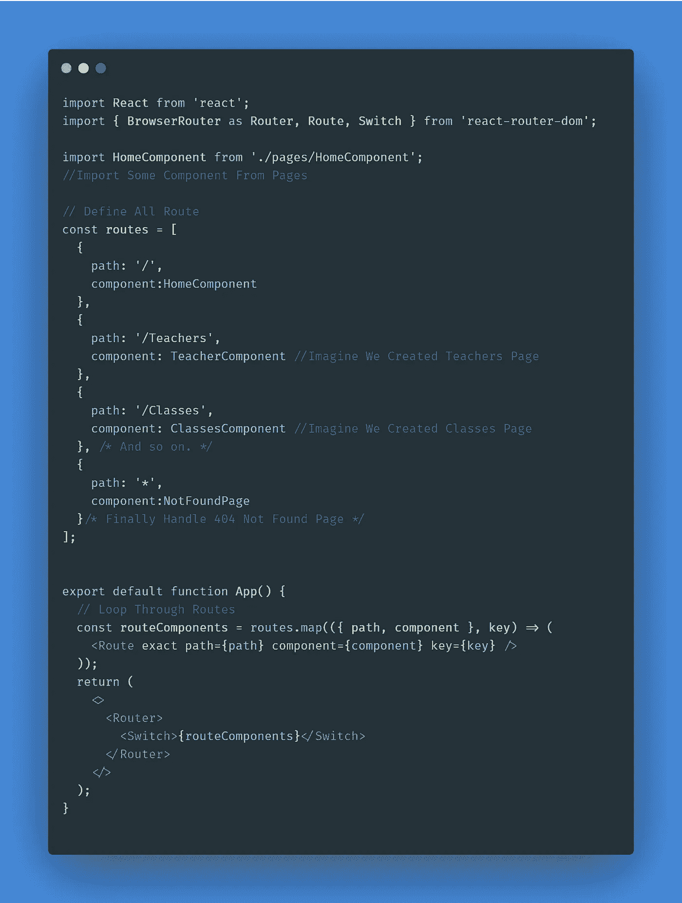

Imagine We Have Teacher, Classes Component And Imported

上图:

1。创建一个数组(routes)的对象，该对象具有一些与 Route 组件相关的属性。
②
。遍历 routes 数组，并将它们放入< routeComponent/ >(将 *routes* 数组中的所有元素转换为 react-router-dom 中的 routeComponent，并将其移动到<*Route component/>*)。

3。最后使用在第二步中生成的 routeComponent(完整示例[这里是](https://codesandbox.io/s/react-router-with-map-no44i)，引用是[这里是](https://alligator.io/react/react-router-map-to-routes/))。

看起来不错但还是需要用布局单独包裹所有组件。:(

我认为如果我们对所有的路线使用一个对象会更好，这个对象包括所有的路线和它们的属性，像*路径*、*精确*、*布局*、*组件*

想象一下，如果我们能够将这个物体转换成一个真实的路由系统:

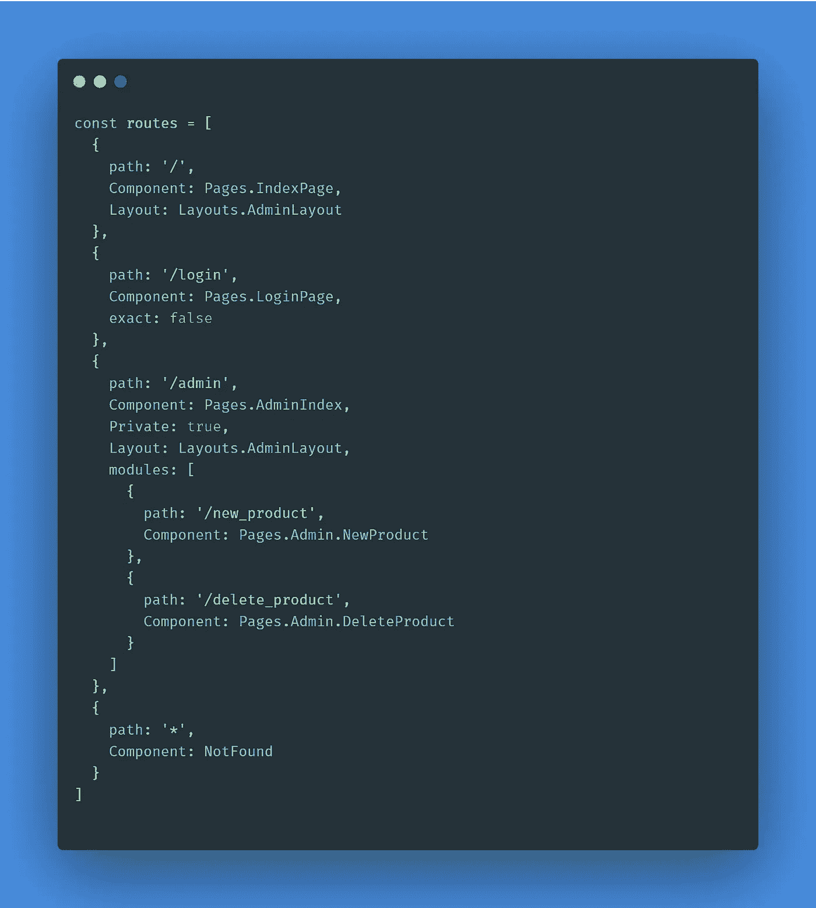

exact Property is True By Default, Private Is props for Protect Route from Unauthorised User and Redirect Them To Login Page

我认为在一个简单的 react 项目中定义路由是最好的方法，但是如何做到这一点呢？

我们所知道的是，我们必须使用一个 map 来遍历数组，并返回一些具有某种属性的组件…

我们知道父布局必须在子路由中使用(这样，我们通过模块属性中的一个级别来定义子路由)。

例如，Admin.newProduct 组件从其父组件继承 adminLayout。

另外，新产品的路径是这样的:

```
http://www.site.com/admin/new_product
```

所以我们需要将父路径和子路径连接起来。

我们只知道我们必须创建一些函数组件来返回路线数组

然后以这种方式使用这个组件:

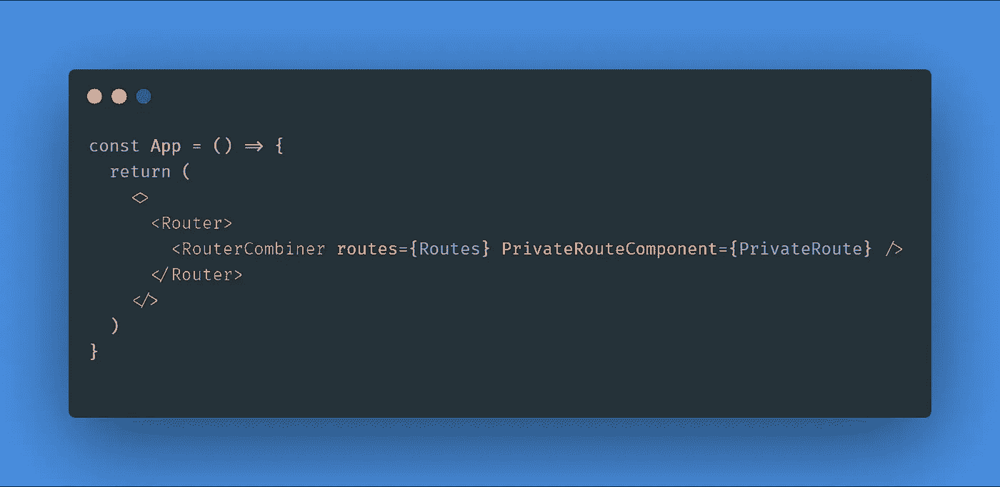

因此，我们必须创建一个功能组件，并将其命名为 *RouteCombiner* ，并接收道具 *:*

```
import React from 'react'
import {} from 'react-router-dom' //Import Something Later from RRDexport default function RouteCombiner(props) {
  return 
  <>
    //Do Something With Props
  </>
}
```

*RouteCombiner* 组件接收 *PrivateRoute* 组件(如果不了解私有路由，请阅读[此](https://medium.com/@thanhbinh.tran93/private-route-public-route-and-restricted-route-with-react-router-d50b27c15f5e)页面)和 routes 对象作为道具。

*中的**route combiner***:

我们必须析构一些属性(如果你不知道什么是析构，请阅读[这个](https://www.freecodecamp.org/news/how-to-use-destructuring-in-javascript-to-write-cleaner-more-powerful-code-9d1b38794050/)，我们需要 *PrivateRoute 一个*和 *routes* 对象。然后，我们必须创建另一个包含所有生成的路由组件的对象，并最终返回由 switch 包装的组件(使用此组件时，可以在 *app.js* 中使用 Switch，而不是在这里)。

1.  通过路线进行循环
2.  使 *ComponentWithLayout* 组件 *t* 包含被布局包装的*组件*(如果布局不存在，我们可以使用默认值)
3.  检查路由是否有私有属性，如果有私有属性，返回我们作为道具发送的 *PrivateRoute* 组件。如果私有属性不存在，返回从 RRD 导入的路由组件(react-router-dom)。
4.  在这两种方式中，如果*模块*属性存在，则进行另一个循环并遍历模块数组。

1:

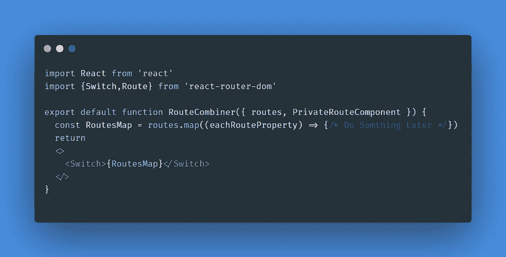

2:

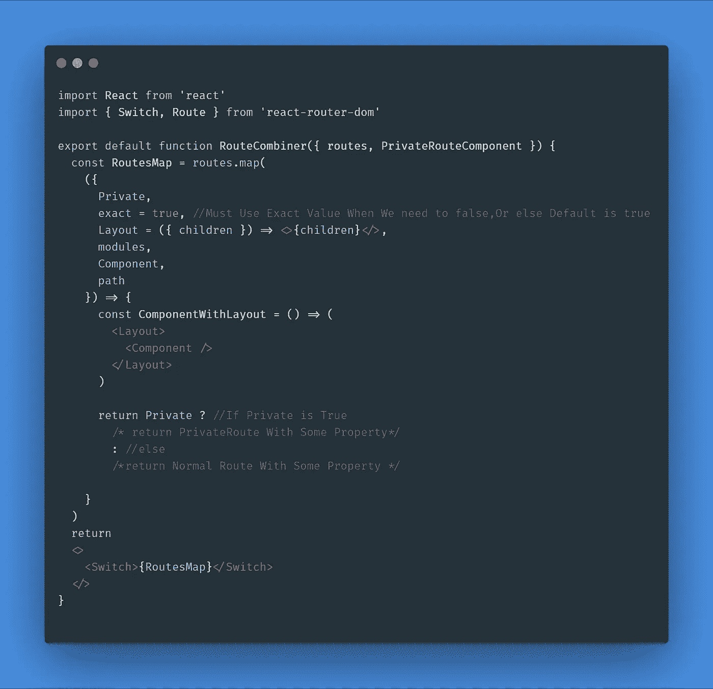

3:

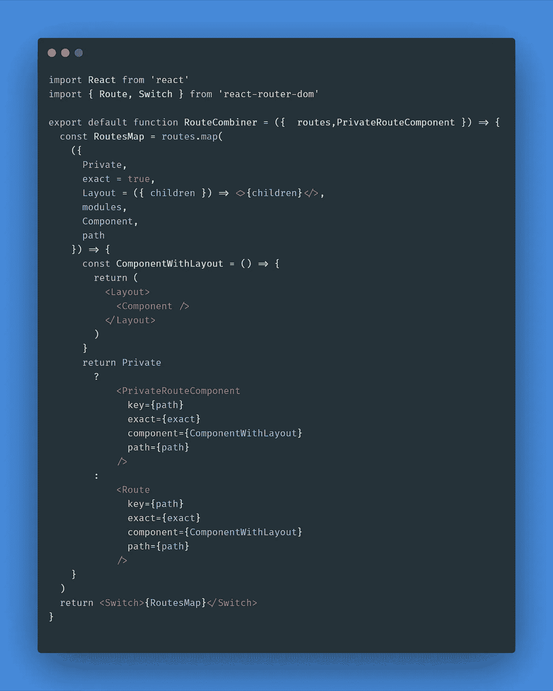

仅此而已。现在，我们可以轻松地对一个对象使用布局和路径，但是我们忘记了一些东西。模块呢(模块代表所有子路由)？

如果要返回儿童路线， *RoutesMap 有些变化。* 我们只返回一个路由(或私有路由)组件。如果我们需要返回孩子，我们必须返回一个包含主路由及其孩子的数组。

对于第四步:

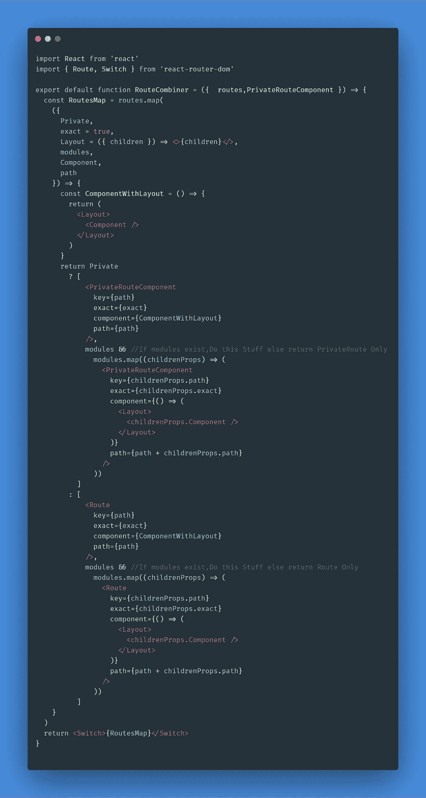

结束了。:)

这听起来可能很难，但是想象一下你是一个必须使用这个代码作为路由系统的人。

最后，这段代码只适用于不需要 SSR(服务器端渲染)的简单项目。因为 *After.js* 和 *Next.js* 都有自己的路由方案……也许还有一些性能问题。

(完整示例在[我的沙盒](https://codesandbox.io/s/route-combiner-suq4u)上)

请随意问我这篇文章的任何部分，如果有人能解决可能的问题并使代码变得更好，我会很高兴。

编码快乐！😜

*更多内容看* [***说白了就是 io***](https://plainenglish.io/) *。报名参加我们的* [***免费周报***](http://newsletter.plainenglish.io/) *。关注我们关于*[***Twitter***](https://twitter.com/inPlainEngHQ)*和*[***LinkedIn***](https://www.linkedin.com/company/inplainenglish/)*。加入我们的* [***社区***](https://discord.gg/GtDtUAvyhW) *。*