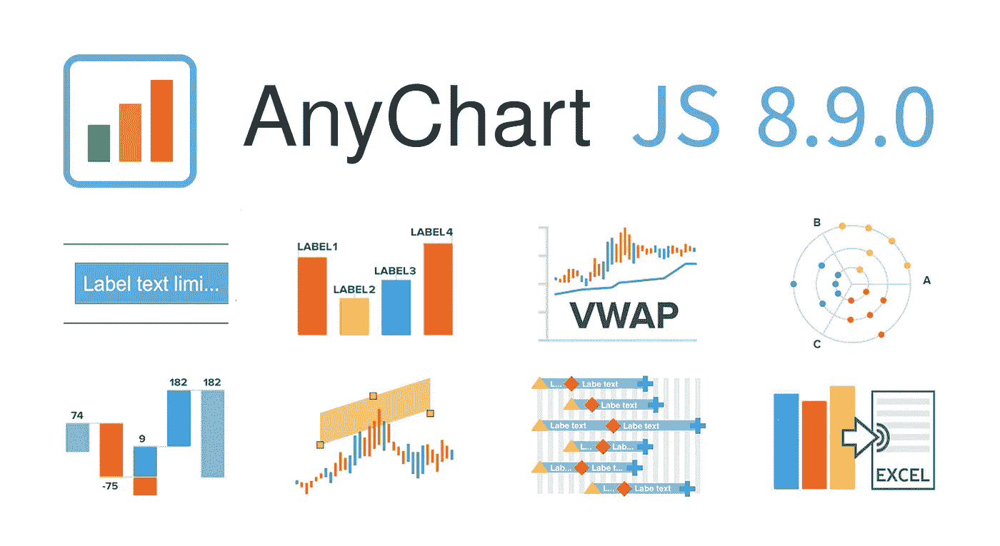
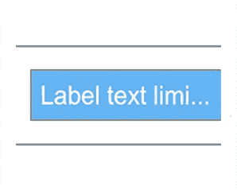
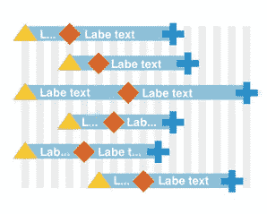
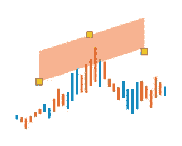
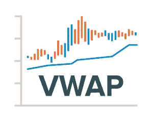
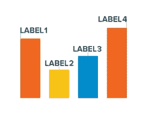
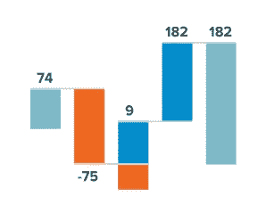
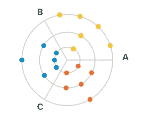

# AnyChart 8.9.0 中的新 JavaScript 图表特性

> 原文：<https://javascript.plainenglish.io/new-javascript-chart-features-in-anychart-8-9-0-aea700a3e688?source=collection_archive---------10----------------------->

[AnyChart](https://www.anychart.com) 8.9.0 出来了！最新的重大更新为我们屡获殊荣的 JavaScript 图表库产品家族——any chart、AnyStock、AnyGantt 和 any map——带来了令人兴奋的新特性。享受改进的功能，在更短的时间内为您的网站和应用程序构建更加引人注目的数据可视化！

# 新的 JS 图表功能

## **标签文字长度**

现在您可以[限制](https://api.anychart.com/v8/anychart.core.ui.LabelsFactory#maxLength)图表标签中显示的字符数。这个新选项让您可以更轻松地控制图表的显示。

## **客户端 CSV/XLSX 导出**

从 8.9.0 版本开始，CSV 和 XLSX 可以直接在客户端导出！因此，您不再需要导出服务器的帮助来完成这项工作。

## **甘特图标签重叠**

对于甘特图，我们已经添加了在[标签重叠时截断](https://api.anychart.com/v8/anychart.core.ui.Timeline#cropLabels)标签的选项。享受让您的项目和资源可视化看起来特别整洁的快捷方式。

## 有限趋势通道注释

另一个有用的绘图工具现在可以在股票图表中使用:遇见有限趋势通道！[在我们的图库中的 OHLC 图表顶部查看一下](https://www.anychart.com/products/anystock/gallery/Stock_Drawing_Annotations/Annotated_OHLC_Chart.php)，不要错过我们的通用[绘图工具和注释演示](https://www.anychart.com/products/anystock/drawing_tools/)，看看目前还有哪些有用的工具可供您使用。

## 数量加权平均价格指标

为了继续扩展技术分析能力，我们增加了一个新的指标——成交量加权平均价格。VWAP 确实如它的名字所暗示的那样。它通过确定价值与总交易量的比率来衡量一定时间范围内的平均价格。我们很快会将 VWAP 指标添加到我们的技术指标演示中。同时，你可以在这里找到它的演示[。](https://www.anychart.com/products/anystock/gallery/Stock_Technical_Indicators/Volume_Weight_Average_Price_(VWAP).php)

## **改进了首个和最后一个标签的位置**

为了进一步增强您的数据可视化效果，我们还确保了所有常规图表中的第一个和最后一个标签现在总能找到它们在图表上的最佳位置。因此，图表显示变得更加一致和吸引人。

## 瀑布堆叠标签(多系列)

在多系列瀑布图中，现在[创建](https://api.anychart.com/v8/anychart.charts.Waterfall#stackLabels)一个额外的标签来显示堆栈的总和就像从来没有一样容易。[下面是它的工作方式](https://www.anychart.com/products/anychart/gallery/Waterfall_Charts/Income_Statement_by_Region.php) —来看看吧，马上就可以自由使用这个新功能。

## 极点的自动放置

如果你[告诉他们](https://api.anychart.com/v8/anychart.charts.Polar#spreadValues)，极坐标图现在可以自动沿着类别分布数据点。特别是，这可以让你毫不费力地创建一个所谓的[靶心图](https://www.anychart.com/products/anychart/gallery/Polar_Charts/Marker_Polar_Chart_with_Spreading_Points.php)！

# 更多增强功能

除了这些新的 JavaScript 图表特性，我们还做了一些重要的改进和错误修复。为了确保没有遗漏任何内容，请查看您正在使用的库的版本历史中的完整发行说明:

*   [AnyChart 版本历史](https://www.anychart.com/products/anychart/history/)
*   [AnyStock 版本历史](https://www.anychart.com/products/anystock/history/)
*   [任意甘特图版本历史](https://www.anychart.com/products/anygantt/history/)
*   [AnyMap 版本历史](https://www.anychart.com/products/anymap/history/)

# 分享反馈

你觉得 AnyChart 8.9.0 版本怎么样？我们还可以做些什么来进一步改善您使用我们的解决方案可视化数据的方式？

请不要闷在心里！我们期待您的反馈，并愿意根据您的具体需求调整我们的路线图。联系我们令人敬畏的[支持团队](https://www.anychart.com/support/)，告诉他们一切。

享受新的 AnyChart JS 图表！

*原载于 2020 年 9 月 29 日*[*【https://www.anychart.com】*](https://www.anychart.com/blog/2020/09/29/new-javascript-chart-features/)*。*