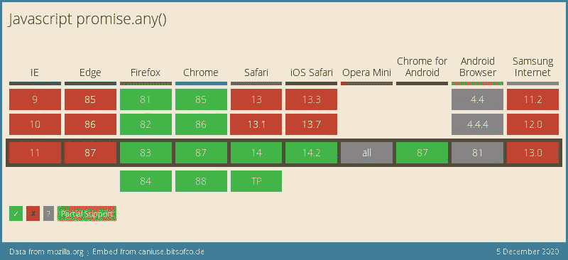
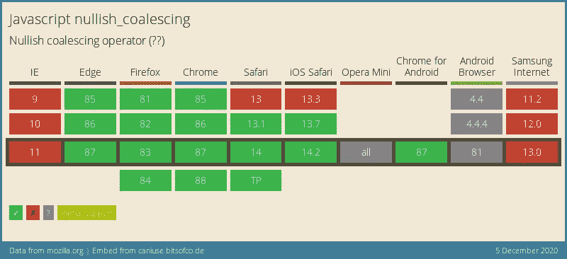
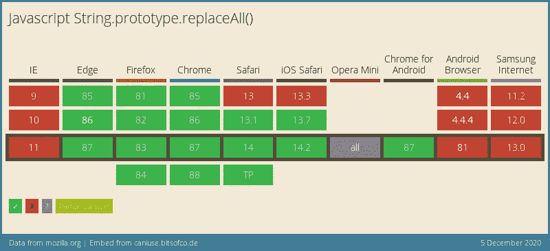

# 新的 JavaScript (ES2021)特性将使您的生活更加轻松

> 原文：<https://javascript.plainenglish.io/new-javascript-features-that-will-make-your-life-easier-502f77551e9a?source=collection_archive---------4----------------------->

有许多新的 JavaScript 特性开始在主流浏览器和 **Node.js** 上获得广泛支持，但是没有被大多数开发者广泛使用。

下面，我概述了最新的 JS 特性，它们将使你的生活变得简单 10 倍，以及对每个特性的支持，这样你就可以知道你是否可以开始使用它们。

# 🔗可选链接

如果您使用过 Swift，您可能对可选链接很熟悉。目前，在 JavaScript 中，如果你想得到一个可能未定义的对象中元素的子元素，你必须检查它是否未定义。如果你想运行未定义的函数，也是一样:

任何使用过 JavaScript 一段时间的人都知道，这可能会很快失控。当您试图检查每一级的类型时，具有 5 个级别的对象和 JSON 会突然占用大量空间。

## 输入:链接

可选链接使事情*方式*更容易。可选链接通过？。，这意味着你不必检查每一层是否是未定义的。如果它是未定义的，那么不会抛出错误，返回将是' undefined '。突然，我们的代码变成了这样:

## 我能用它吗？

**Node.js 支持:** Node 14.0.0

# 🤞承诺。任何

由于 JavaScript 已经越来越多地进入了它的异步本质，我们不得不处理更多的承诺。虽然 **promise.all()** 允许我们检查所有承诺何时完成，但有时您可能希望在第一个承诺完成时就启动，与 **promise.race()** 不同，它将返回第一个承诺，无论它是失败还是成功，而 promise.any 函数只返回已解决的承诺。

为什么用 **promise.any()** ？主要的用例是下载文件。如果您从 internet 下载文件，您可能希望列出多个服务器，然后使用 promise.any()来确保用户首先获得下载最快的版本。你可以做同样的事情来优化图片下载。

## 我能用它吗？

**Node.js 支持:** Node 15.0.0

# ❓Nullish 煤矿

Nullish 合并是一个更加严密的双线||运算符版本。当你设置变量时，如果某个东西是' [**falsy**](https://developer.mozilla.org/en-US/docs/Glossary/Falsy) '你可以用||建议一个替代版本。这可能会导致一些意想不到的行为—无效合并或？？仅当第一个值为 **null** 或 **undefined** 时，才会使用替代值。

你为什么要用这个？想象你有一个混合的对象，有些字段是未定义的，有些是空的，有些设置为假的，等等。您希望只针对未定义的和空的字段——然后 nullish 合并可以帮助您这样做。

## 我可以用它吗？

**Node.js 支持:** Node 14.0.0

# 🔁replaceAll()

**这是我最喜欢的版本**获得了足够的支持来证明它在实际项目中的使用。以前，**如果你想替换一个字符串的所有实例，你必须知道正则表达式**。我确信我不是唯一一个每次想创建一个新的 Regex 字符串都必须使用谷歌的人。

在 JavaScript 中，您可以使用 replace()来替换字符串中某个内容的第一个实例，或者如果您使用了 Regex，则替换所有实例，但是**现在您可以使用 replaceAll()来替换所有实例，而不必知道 Regex** 。完全改变了游戏规则！

## 我可以用它吗？

**Node.js 支持:** Node 15.0.0

# 结论

在过去的几年里，JavaScript 发生了很大的变化，如果说有什么变化的话，那就是速度似乎在加快。这些功能今天都可以在 Node.js 中使用——根据您的项目，也可以在前端浏览器项目中使用。不仅如此，在未来的几年里，新的实验特性将会改变它，希望能让我们的生活简单一点。