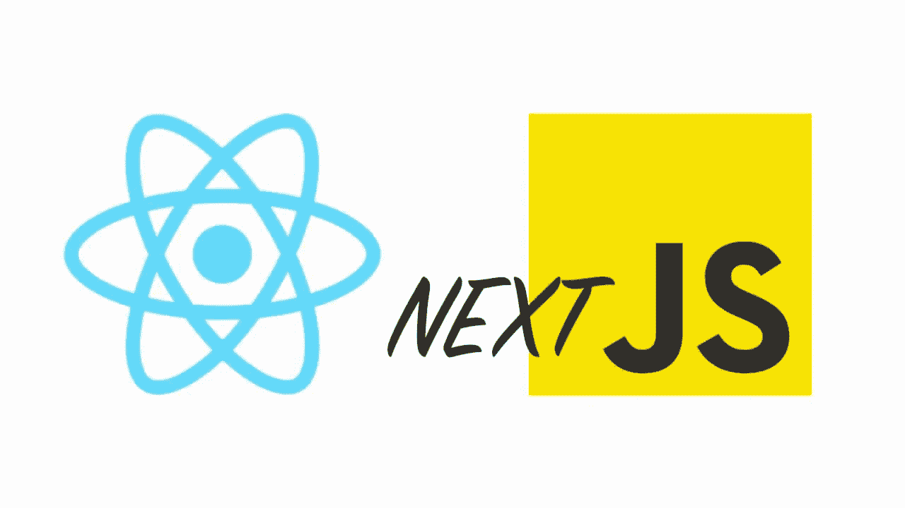
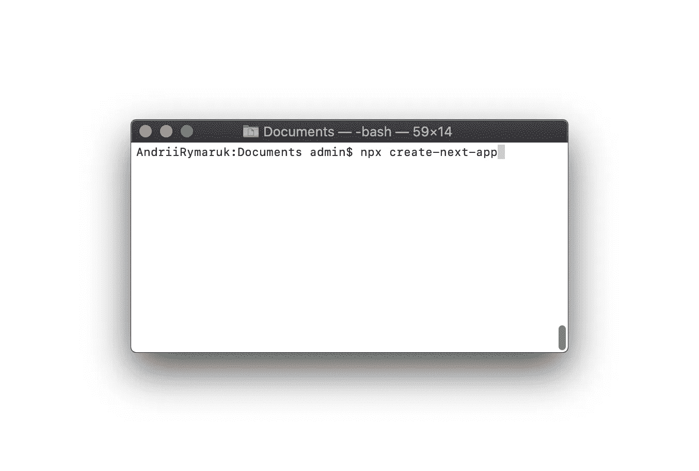
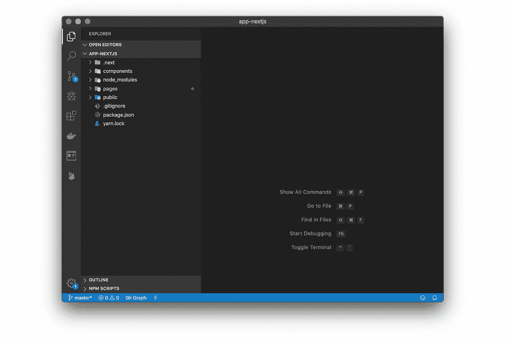
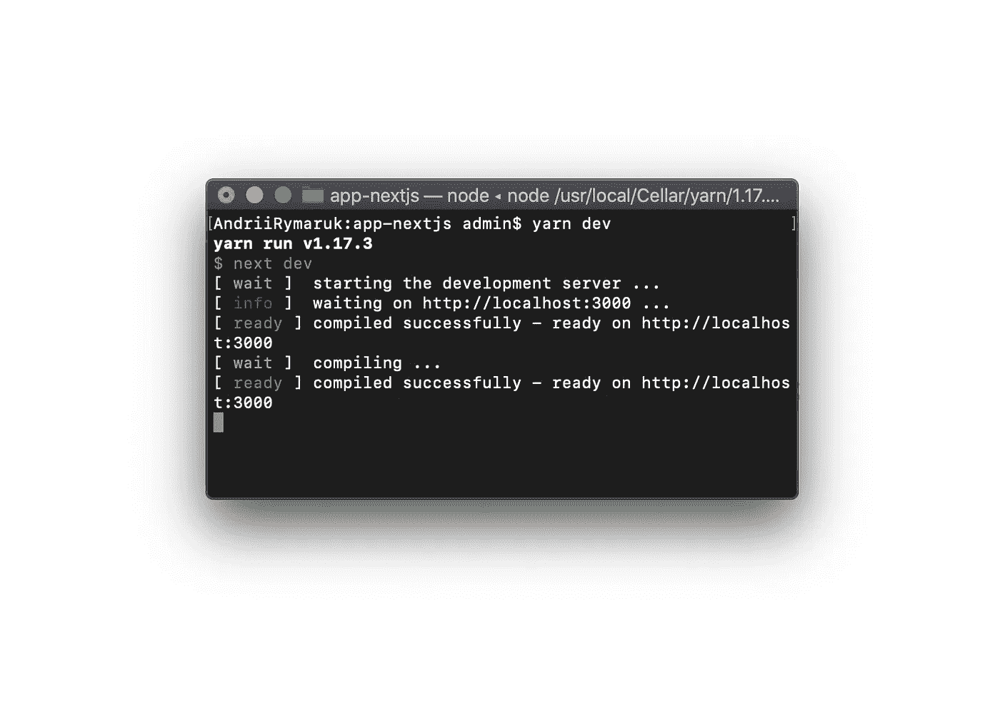
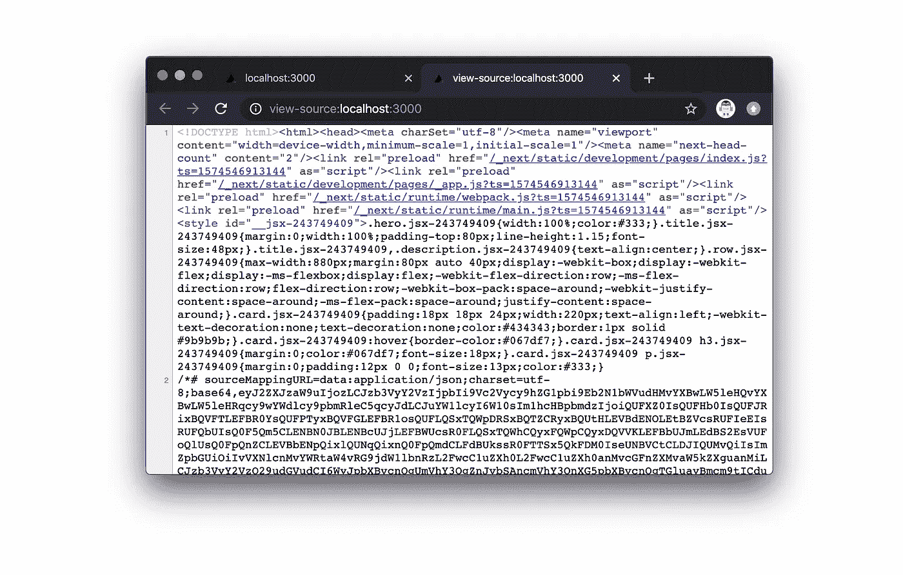
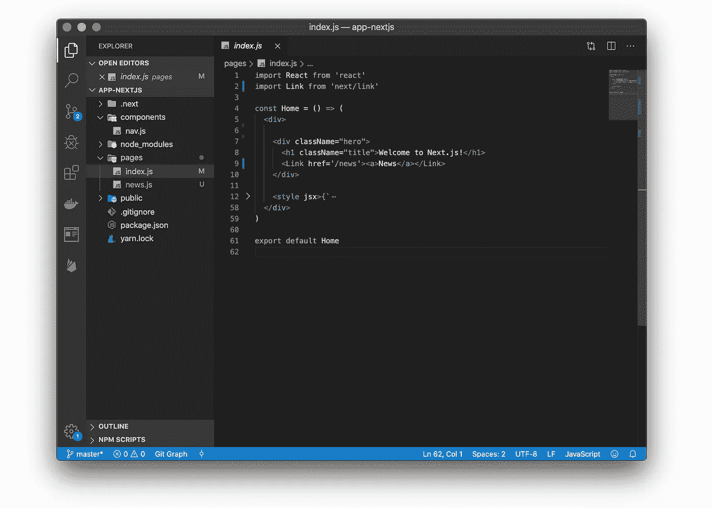
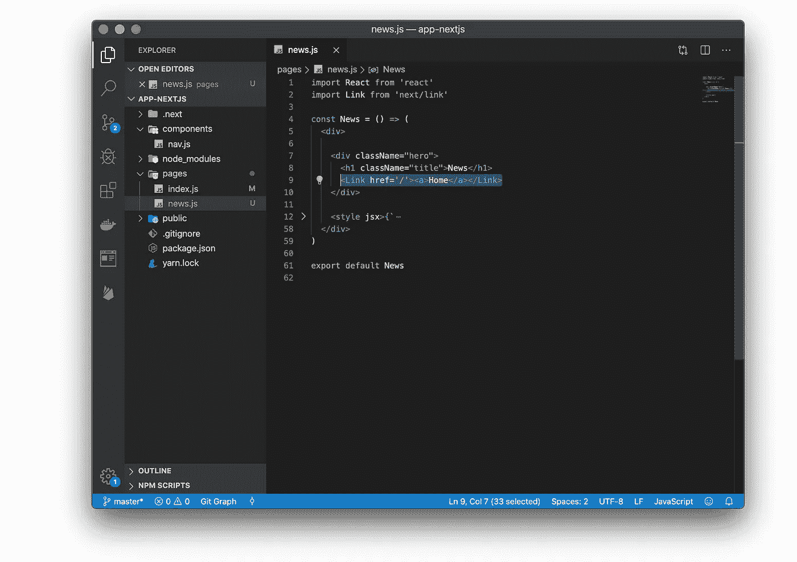
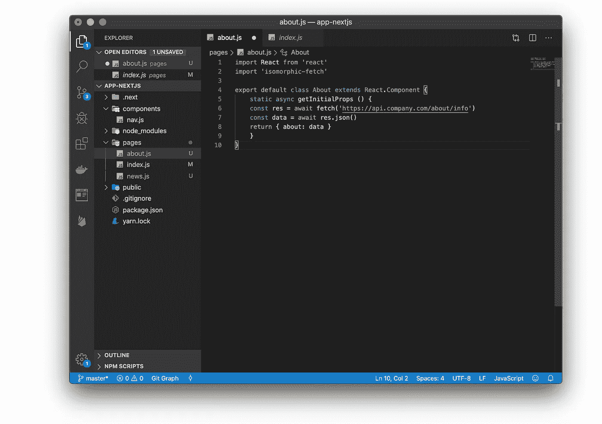
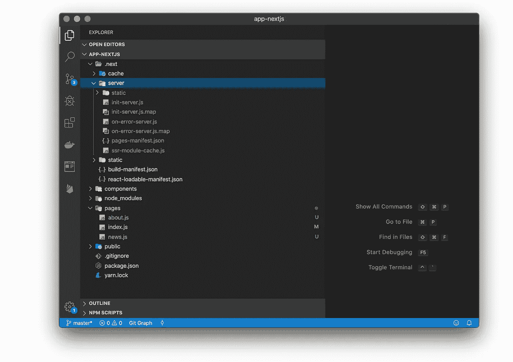

# 👉你需要为你的下一个网络应用尝试 NextJS

> 原文：<https://javascript.plainenglish.io/next-javascript-app-just-try-it-8e74bf35e4a7?source=collection_archive---------1----------------------->



NextJS 是由 [Zeit](https://zeit.co/) 为创建 Web 应用程序而构建的一个令人敬畏的框架。它有许多很棒的特性和优点，可以让 NextJS 成为您构建下一个 web 应用程序的首选。

# NextJS 的主要特点。看那个👇

*   **服务器端渲染**

在将 HTML 发送到客户端之前，可以在服务器端呈现 React 组件。

*   **自动路由(创建动态页面)**

任何 URL 都映射到文件系统，映射到放在`pages`文件夹中的文件，并且您不需要任何配置(当然，您有定制选项)。

*   **单文件组件**

使用由同一个团队构建的完全集成的`styled-jsx`，添加组件范围内的样式很简单。

*   **生态系统兼容性**

Next.js 与 JavaScript、Node 和 React 生态系统的其余部分配合得很好。

*   **自动代码拆分**

页面只呈现他们需要的库和 JavaScript，仅此而已。Next.js 在几个不同的资源中自动分解应用程序，而不是生成一个包含所有应用程序代码的 JavaScript 文件。

Next.js 通过分析导入的资源来做到这一点。

*   **预取**

用于链接不同页面的`Link`组件支持一个`prefetch`道具，由**在后台自动预取页面资源**(包括代码拆分导致的代码缺失)**。**

*   **静态出口**

静态导出:使用`next export`，你可以从你的应用程序中导出一个完全静态的站点。

*   **支持打字稿**

Next.js 是用 TypeScript 编写的，因此具有出色的 **TypeScript** 支持:)

*   **AMP 页面**

是啊！Next.js 支持混合页面和仅支持[和](https://amp.dev/)页面(确保您使用的是 Next.js 8.1 或更新版本)

# NextJS vs React

NextJS 是 React 框架。React 是一个用于构建用户界面的库。NextJS 使用 React，这是一个服务器渲染 React 应用程序的框架。

NextJS 所做的是在服务器上渲染 React 应用(SSR)。

**两个真的没法比，因为 NextJS 的 wraps 有反应，基本都是一起工作的。**

它提供了一个通用的结构，允许您轻松地构建一个前端 React 应用程序，并透明地为您处理服务器端呈现。

# 如何安装 Next.js？

我们现在可以选择两条路线:使用`create-next-app`或经典方法，包括[手动安装和设置 NextJS 应用](https://nextjs.org/docs#quick-start)。

如果你熟悉`[create-react-app](https://flaviocopes.com/react-create-react-app/)` , `create-next-app`也是一样的——只不过它创建的是 Next 应用，而不是 React 应用。

```
**npx create-next-app**
```



NextJS CLI

命令询问 app 名称，然后**为你新建一个文件夹**，然后下载**它需要的所有包** (react，react-dom，next)，照常安装 package.json。



您可以通过运行`npm run dev`立即运行示例应用程序



**这是启动 Next.js 应用程序的推荐方式，因为它为您提供了可以使用的结构和示例代码。**

不仅仅是默认示例应用程序。

此外，您可以使用`--example`选项使用存储在[https://github.com/zeit/next.js/tree/canary/examples](https://github.com/zeit/next.js/tree/canary/examples)的任何示例

# **SSR 真的起作用了**

如果我们使用 Next.js 创建一个站点，站点页面就会呈现在服务器上，服务器将 HTML 传递给浏览器。

让我们确认一下。

只需查看应用程序的源代码。使用 **Chrome** 你可以**右击页面上的任意位置**，按**查看页面源代码**。



我们不需要设置任何东西，服务器端渲染已经为我们工作了。除非需要，否则不配置。自动热代码重载，错误报告，源代码映射，为旧浏览器翻译。

# 只有 JavaScript。一切都是函数

Next.js 中的每个路由都是一个 ES6 模块，它导出一个从`React.Component`扩展而来的函数或类。

与类似的模型相比，这种方法的优势在于您的整个系统保持了高度的可组合性和可测试性。

> 例如，组件可以直接呈现，或者由另一个顶级组件导入和呈现。

我们还决定采用 CSS-in-JS。



# 自动服务器渲染和代码分割

两项任务是最理想的:

*   服务器端渲染
*   将你的应用分成更小的包

使用 Next.js，`pages/`中的每个组件都会自动获得服务器渲染，并且它们的脚本会被内联。

当一个组件通过`<Link prefetch />`或[路由器](https://github.com/zeit/next.js/blob/master/readme.md#routing)动态加载时，我们获取一个基于 JSON 的页面表示，其中同样包含它的脚本。

这意味着某个页面可能有一个广泛的导入列表。



# 数据获取取决于开发人员

静态 JSX 的服务器渲染是一项重要的成就，但是现实世界的应用程序需要处理来自不同 API 调用和网络请求的动态数据。

Next.js 对 React 的组件契约做了一个非常重要的扩展:`getInitialProps`。

获取一些数据的页面如下所示



正如你所看到的，这个契约非常简单，而且没有终结:`getInitialProps`必须返回一个`Promise`，它解析为一个“JavaScript”对象，然后这个对象填充组件的`props`。

> 这使得 Next.js 可以很好地与 REST APIs、GraphQL 甚至全局状态管理库 Redux 配合使用。

# 简单部署

部署一个 Next.js 应用程序所要做的就是运行`next build`，然后运行`next start`。



> 在我看来，它在灵活性和智能默认之间取得了很好的平衡，但它肯定不是所有问题的解决方案。

# 推荐

[](https://zeit.co/blog/next) [## Next.js

### 我们非常自豪能够开源 Next.js，这是一个用于服务器渲染的通用 JavaScript webapps 的小型框架，构建于…

zeit.co](https://zeit.co/blog/next) [](https://flaviocopes.com/react-create-react-app/) [## 创建-反应-应用简介

### create-react-app 是启动 react 应用程序最简单的方法

flaviocopes.com](https://flaviocopes.com/react-create-react-app/) [](https://www.freecodecamp.org/news/the-next-js-handbook/) [## Next.js 手册

### 我写这篇教程是为了帮助你快速学习 Next.js，熟悉它的工作原理。它非常适合你，如果你…

www.freecodecamp.org](https://www.freecodecamp.org/news/the-next-js-handbook/) [](https://blog.logrocket.com/next-js-vs-create-react-app/) [## Next.js vs. Create React App:谁的 App 性能更好？- LogRocket 博客

### 我们将 Next.js 与 Create React 应用程序放在一起，以解决 SSR 是否比 CSR 更高效的问题…

blog.logrocket.com](https://blog.logrocket.com/next-js-vs-create-react-app/)