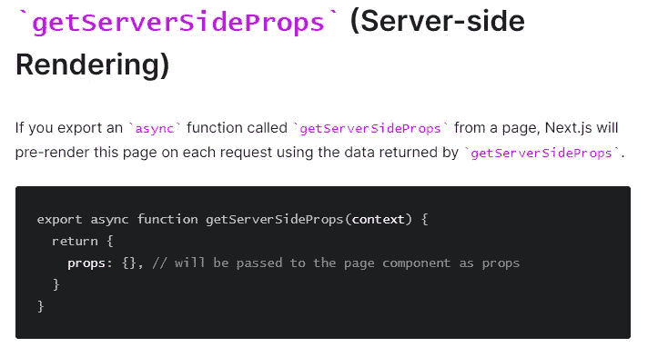

# Next.js Firebase 身份验证—包括 SSR

> 原文：<https://javascript.plainenglish.io/next-js-firebase-authentication-including-ssr-1045b097ee18?source=collection_archive---------3----------------------->

最近，我一直在玩 Next.js。在我看来，这是一个很好的库，可以让基于 React 的应用程序运行起来。
我刚刚还在纠结我的应用程序的认证问题。我喜欢使用 Firebase 身份验证服务，所以我想在 Next.js 应用程序中实现它。

*我认为 Next JS 的一个很好的特性是服务器端渲染。这允许我对我的后端或数据库执行所有需要的调用，并基于这些调用检索的数据呈现静态网页。这有助于搜索引擎优化等显而易见的事情，也有助于将网页分享到社交媒体。当你在脸书上分享一个网页时，它会抓取你的页面并检索一些预览数据以嵌入到社交网络中。当您的一些数据基于客户端调用呈现时，脸书很有可能在抓取您的应用程序时遇到问题。*

*其次，我喜欢我的终端用户不能在我的 API 调用中四处查看的事实。Firebase 是一个很好的平台，可以为您的应用程序提供身份验证。通过 Firebase 在客户端检查用户认证状态非常容易。有时，我想在服务器端呈现页面时检查身份验证状态。我一直在努力工作。*

在这篇文章中，我将一步一步地展示我是如何完成我的解决方案的。一如既往，如果你在我的解决方案中看到任何问题，或者你对它有一些有趣的补充，请随时在下面发表评论！

## 标准的例子

Next.js 在他们的 Github 上有很多不错的例子。具体来说，有一个包括 Firebase 身份验证的示例:

 [## vercel/next.js

### 该示例包括 Firebase 身份验证和无服务器 API 路由。使用 Yarn 或 npx 执行 create-next-app 以…

github.com](https://github.com/vercel/next.js/tree/canary/examples/with-firebase-authentication) 

这是如何使用 Firebase 身份验证的一个很好的例子，但是我总是在这里遗漏了一部分。在本例中，他们只展示了如何在客户端使用身份验证。这非常适合您的使用案例。

但是当我查看 Next.js 的功能时，我对服务器端的功能非常感兴趣。

尤其是“getServerSideProps”方法。

js 为我们提供了一个类似 PHP 的功能，我们可以在客户端呈现页面之前处理服务器端的逻辑。这意味着您可以在用户看到页面之前处理一些 API 请求或后端逻辑。你后端逻辑的结果可以通过‘道具’传递，可以在前端使用。这有很多好处。

这里的问题是，我希望能够检索用户的身份验证状态。这是上面的 Firebase 示例没有涉及到的内容。我想和你分享我的解决方案。

## 解决方案

简而言之，我该怎么办？

*   使用会话 cookie 管理 Firebase 身份验证
*   设置一个身份验证 API 端点，它将从服务器端提供一个 cookie
*   在 getServerSideProps 方法中使用 Cookie。

 [## 管理会话 Cookies | Firebase

### Firebase Auth 为依赖会话 cookie 的传统网站提供服务器端会话 cookie 管理…

firebase.google.com](https://firebase.google.com/docs/auth/admin/manage-cookies) 

## Firebase 设置

所以先建立一个 Firebase 项目。获取服务帐户并启用电子邮件身份验证。我不会详细解释这个步骤。

我的另一个故事详细解释了这一点:

 [## react Native—Spotify 的完整认证流程

### React Native 中的身份验证可能是一场噩梦。让我们尝试构建一个 React 原生应用程序，并使用 Spotify…

medium.com](https://medium.com/javascript-in-plain-english/react-native-full-authentication-flow-with-spotify-bc0a5b895696) 

## 登录—客户端

在我的例子中，我使用电子邮件认证。这意味着您需要一个允许用户输入电子邮件和密码的表单。您可以在本文末尾的资源库中找到我的示例代码。

我们将放大 utils/auth.js 文件:

首先，我们将把 Firebase 身份验证的持久性设置为 None。这是因为我们将使用通过 API 调用设置的 cookie 自己处理这个问题。

在“登录方法”中，我们使用 Firebase 提供的方法来处理用户凭证的验证。“signInWithEmailAndPassword”确实如其名。

成功登录后，我们执行 Next.js API 提供的 POST 调用。在这个调用中，我们提供了从 Firebase 收到的 IDToken。我们的 API 端点将检查这个令牌的有效性，如果令牌有效，将返回一个包含 Cookie 的响应。

## 登录— API

在我们的 pages/api/auth.js 文件中，我们将处理传入的 POST 请求并检查 Firebase IDToken 的有效性。

如果令牌有效，我们将生成一个会话 Cookie，该 Cookie 将通过标题“Set-Cookie”返回。这将为接收调用响应的客户端设置一个 cookie。

请注意“secure”和“httpOnly”参数，这将有助于保护 cookie。因此，不能通过 JavaScript 访问 cookie，这样可以保护用户免受恶意第三方的攻击。

注意，secure 参数在 Localhost 中不起作用。这就是我把它放在环境变量后面的原因。我的生产环境总是将这个参数设置为 true，但是在本地测试时，我需要将这个参数设置为 false。

此外，我的一个大错误是试图让这个工作，这花了我很多时间，让路径参数为空。这样做时，路径将被设置为“/api”，因为这是设置 cookie 的路径。因此，我无法在 getServerSideProps 方法中检索 cookie。将它改为“/”解决了这个问题。

## 使用身份验证状态服务器端

**pages/user.js:**

我创建了一个简单的演示页面来展示我们如何使用 Cookie 来验证身份验证。

此时，我们将知道页面呈现之前的身份验证状态。这意味着我们可以在将 HTML 返回给客户端之前检索一些特定于用户的数据。

**utils/verifyCookie.js**

该函数将在 Firebase SDK 的帮助下验证会话 Cookie:

## 完整代码示例— GitHub 存储库

可以在 GitHub 上找到完整的代码示例:
[https://GitHub . com/Thomas wolfs/nextjs-firebase-auth-SSR-example](https://github.com/ThomasSwolfs/nextjs-firebase-auth-ssr-example)

我希望我能帮助别人解决这个问题。如果你喜欢我的内容，请随时关注或鼓掌！

干杯

— **托马斯**