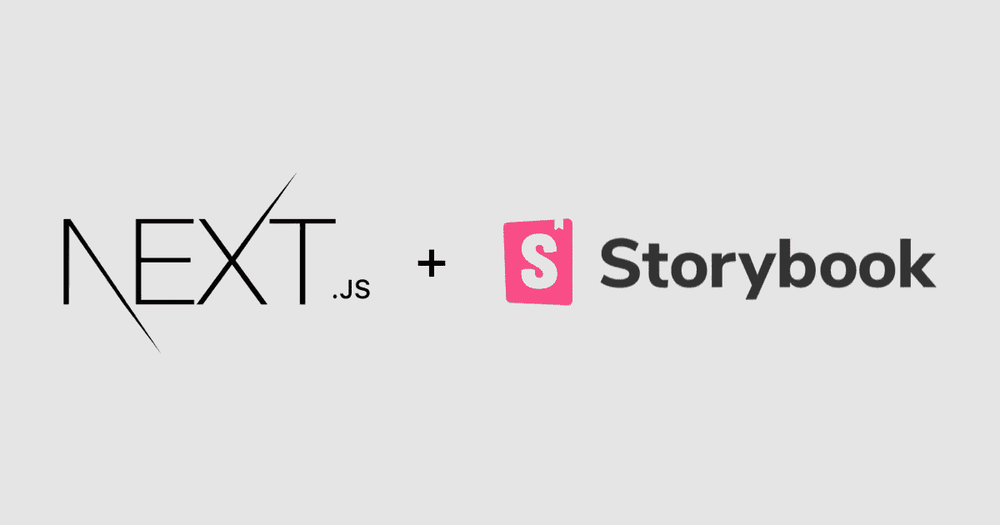

# Next.js + Storybook 入门

> 原文：<https://javascript.plainenglish.io/next-js-storybook-3f8e5a8dab3d?source=collection_archive---------0----------------------->



最近，我开始寻求让 Next.js (v10)与 Storybook 一起工作。起初这似乎很简单，但事实证明这是一项艰巨的任务。一旦我让它工作了，我决定写下这篇文章，希望能帮助下一个想知道这条路的可怜的傻瓜。

# 何必呢？

好问题。应该是你的第一个问题。故事书可能并不总是对你的项目有意义。在一个没有很多组件的小网站或应用上工作？也许不值得你浪费时间。用全组件系统搭建大型网站？那好吧，我想这是值得的。故事书有几个好处:

1.  为您的组件生成文档，这有助于您的开发团队之间的知识共享
2.  允许更容易地测试边缘场景——如果这个组件没有图像，应用了替换主题并且缺少标题，会发生什么？
3.  可以与内容管理者和设计者共享，这样他们就可以试验他们可用的组件库。

# 辅导的

请注意，在本教程中，我假设您已经启动并运行了一个现有的 Next.js 项目。如果没有，请从遍历 Next.js 文档开始。

## 在您的项目中安装故事书

```
npx sb init 
```

## 安装您最终需要的依赖项

```
yarn add @storybook/preset-scss babel-loader css-loader file-loader sass-loader style-loader chromatic -D
```

## 编辑。storybook/main.js

您的 main.js 文件可能看起来有点不同，但会非常接近。我的是为我的项目定制的:SCSS 模块，SVGR，我选择将我的故事包含在组件目录中。

## 编辑/。故事书/preview.js

在这个文件中，您只需要确保您正在导入需要所有组件都可以访问的全局样式。此外，这一点很重要，我为 next/image 添加了一个覆盖。这是 Storybook 处理新的下一个图像组件所必需的。它基本上只是在我们所有的故事中用一个有反应的图像代替了那个组件。效果很好！

## 创造一些故事

最后，为您的一个组件创建一个`stories`文件。如果您还记得，我的 main.js 正在寻找扩展名为`stories.js`并且位于我的`components`目录中的故事。这对你来说可能有点不同，但你已经明白了。下面是一个非常简单的例子，它创建了两个实例—打开和关闭:

## 部署您的故事书

这里有几个选项:

1.  运行`yarn build-storybook`并将故事书静态目录上传到任何服务器
2.  将你的故事书部署到 Chromatic——这是一个故事书服务，提供了大量很酷的功能，包括一个叫做 UI Review 的东西，它可以对你的组件进行截图，并提醒用户发生变化。半音阶很酷，但是对它的解释还需要一个帖子。

# 结束语

我希望这个快速教程对你有所帮助。我知道，如果我在走下一条. js + Storybook 之路之前就有了它，我会节省很多工作。一旦你学会了所有这些，我想你会爱上故事书的。祝你好运！