# 带有 Sequelize Web 应用程序的 Next.js，全栈 Web 开发

> 原文：<https://javascript.plainenglish.io/next-js-with-sequelize-web-application-a-full-stack-web-development-a0051074e998?source=collection_archive---------1----------------------->

## 对于开发人员来说，Next.js 作为一个全栈 web 应用程序已经变得更加先进和前沿。Vercel 背后的社区和人们在 Next.js future 上做了很好的工作。

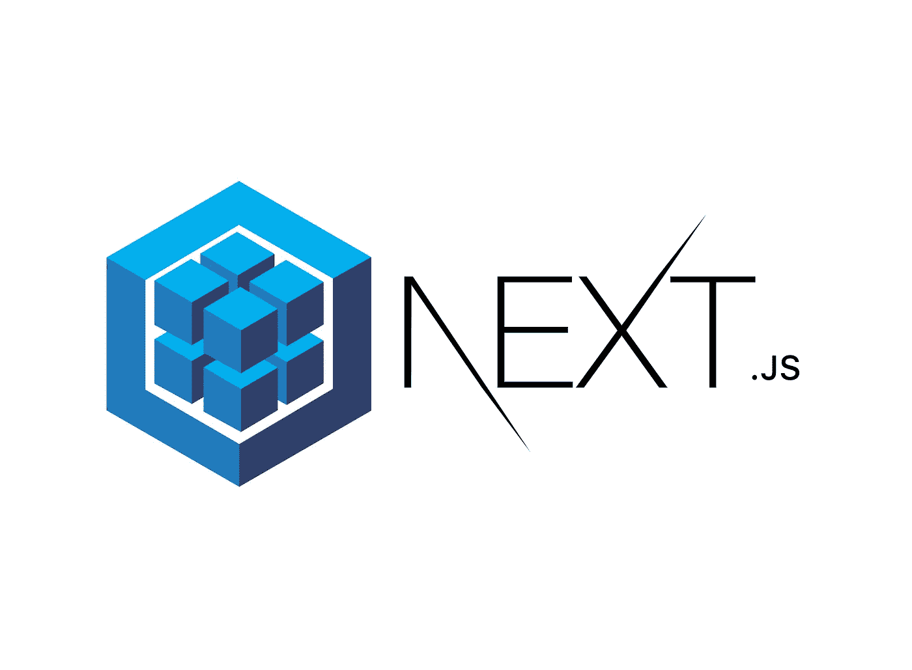

Sequelize and Next.JS screenshot logos

来自 Next.js 社区的帮助和支持对它如何发展成为现在最流行的 React 框架之一产生了巨大的影响。在这个[链接](https://github.com/vercel/next.js/tree/canary/examples)中，有很多来自 Next.js 和社区的好例子值得一看。

Node.js 生态中有 [Sequelize](https://sequelize.org/) 、 [TypeORM](https://typeorm.io/#/\) 、[object](https://vincit.github.io/objection.js/)等几个 ORM 引擎。我以前和 Sequelize 合作过，我想和你分享我是如何把它和 Next.js 结合起来的。

***请求*** 和 ***响应*** 可以在你的项目中的 API 页面中使用，不需要额外添加任何自定义服务器像 ***Express.js.*** 这是来自 Next.js API 路由支持的[解释](https://nextjs.org/docs/api-routes/introduction)。

```
/** ./pages/api/hello.js **/
export default (req, res) => {
   res.statusCode = 200;
   res.json({ name: "John Doe" });
};
```

到目前为止，这是最新 Next.js 版本中我最喜欢的特性之一。这个特性可以用作全栈开发，可以有效替代 express 等 Next.js 应用中的定制服务器。它可以用来连接外部 API 或后端系统，以访问像 MongoDB / NoSQL 或 MySQL / SQL 这样的数据库。

# **Next.js 与 Sequelize web 应用**

要求是***Sequelize-CLI***， ***数据库驱动*** ，***JWT(***[***jsonwebtoken***](https://www.npmjs.com/package/jsonwebtoken)***，*** 当然还有 ***Next.js*** 与**库反应。对于本项目，这是完整的`package.json`设置:**

package.json for Next.js and Sequelize

***设置注意:*** *本应用使用****SQLite****中的* ***本地*** *开发和****PostGres****中的* ***生产*** *为 RDBMS。如果您想在本地和生产中都使用 MySQL，这取决于您。您可以跳过安装 SQLite 部件，查看数据库结构的表模式文件。*

# Next.js 设置

或者直接输入你的项目名称`nextjs-sequelize`或任何名称。如果没有安装`npm i create-next-app`。

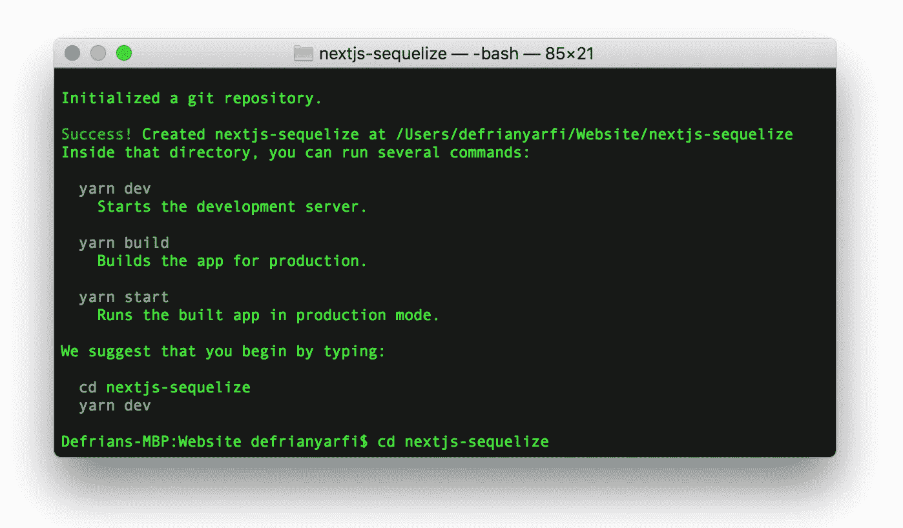

create-next-app nextjs-sequelize

为项目添加其他库: *bcryptjs* ， *js-cookie* ， *jsonwebtoken* ， *sqlite3，* *mysql2* ， *next-connect* ， *nprogress* ， *pg* ， *pg-hstore* ， *postcss-preset-env*

```
yarn add bcryptjs js-cookie jsonwebtoken sqlite3 mysql2 next-connect nprogress pg pg-hstore postcss-preset-env sequelize
```

或者

```
npm i bcryptjs js-cookie jsonwebtoken sqlite3 mysql2 next-connect nprogress pg pg-hstore postcss-preset-env sequelize
```

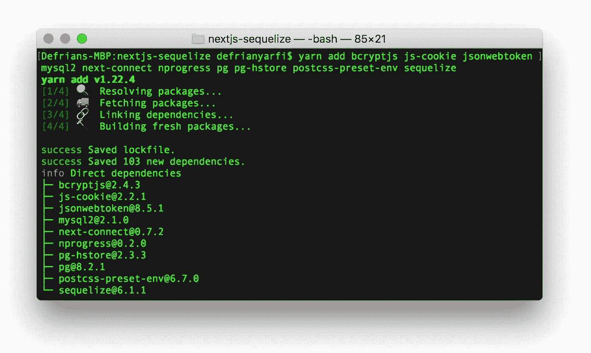

add libraries to the project

## 创造。环境文件变量

.env.local file for local development

# 顺序设置

***设置注意:*** *该应用程序使用* `*sequelize@^5.21.11*` *，这与 sequelize 和 sequelize-cli 的* `*^6.2.**` *版本有很大不同。*

## 使用 Sequelize-cli 命令

用`npm i -g sequelize-cli`或`yarn global add sequelize-cli`安装 CLI

如果我们使用`sequelize-cli`命令，首先我们将被要求执行`sequelize init`，这将在我们的根目录中生成一些文件。生成的文件将用于使序列模块与项目一起运行。

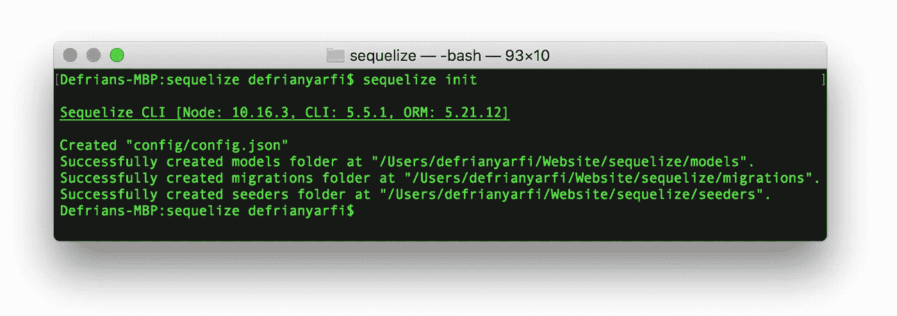

Sequelize init generated files

这些文件和目录是通过 Sequelize-cli 命令生成的。如果你想移动和组织到一个不同的目录，使用`.sequelizerc`，就像我在这个项目中使用的。

## **使用。sequelizerc 文件**

Sequelize 有一个项目设置文件，你可以用它来组织你的项目目录。这意味着你可以在一个特定的目录中放置和设置你的序列文件，就像你希望它在一个名为*的文件中那样。序列发生器*。下面是一个例子，Sequelize 文件和目录将在项目根目录下的一个名为`/db`的目录中生成。只需键入`sequelize init`就可以从`.sequelizerc`文件生成一个序列化项目。

```
const path = require('path');
module.exports = {
   'config': path.resolve('db/config', 'config.js'),
   'models-path': path.resolve('db', 'models'),
   'seeders-path': path.resolve('db', 'seeders'),
   'migrations-path': path.resolve('db', 'migrations')
};
```

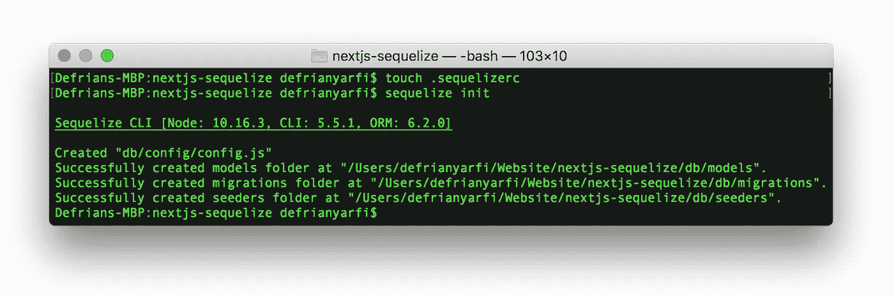

Initialing Sequelize in our Next.js project root

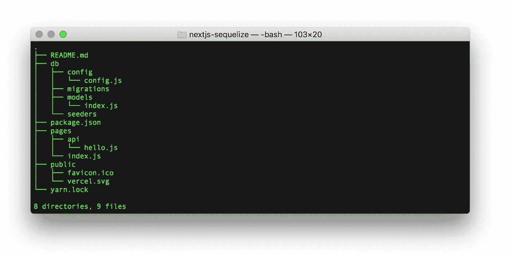

Generated Sequelize files and directory in /db/ directory inside Next.js project root

在编辑器中打开`config.js`,添加一个导出默认值到类似这样的文件中，替换配置，并从`.env.local`中放入您的环境变量:

Sequelize config.js

Sequelize config.js with Node .env variables

## **为** Sequelize、 **Sqlite3 和 Mysql2 模块**设置安装

Sequelize-cli 将用于生成迁移和模型设置。有关这些功能的更多信息，请参见此[链接](https://sequelize.org/v5/manual/migrations.html#the-cli)。

**安装*sequelize-CLI***

`npm i -g sequelize-cli`或`yarn global add sequelize-cli`

**安装*序列*并键入*序列初始化*和**

`npm i sequelize`或`yarn add sequelize`和`sequelize init`

**安装 *sqlite3* 驱动**

`npm i sqlite3`或`yarn add sqlite3`

**安装 *mysql2* 驱动**

`npm i mysql2`或`yarn add mysql2`

**在/db/nextjs-sequelize.db 中创建一个 SQLite3 数据库，并继续进行迁移设置。**

**-用户模型**

```
sequelize model:create --name users --attributes firstName:string,lastName:string,username:string,password:string,email:string,phoneNumber:string,gender:string,status:boolean
```

**-用户模型种子**

```
sequelize seed:generate --name users
```

**-岗位型号**

```
sequelize model:create --name posts --attributes userId:integer,title:string,slug:string,content:text,status:boolean
```

**-张贴模型种子**

```
sequelize seed:generate --name posts
```

**-工作模式**

```
sequelize model:create --name jobs --attributes userId:integer,title:string,slug:string,content:text,emailTo:string,reportManager:string,dateLimit:date,status:boolean
```

**-乔布斯模型种子**

```
sequelize seed:generate --name jobs
```

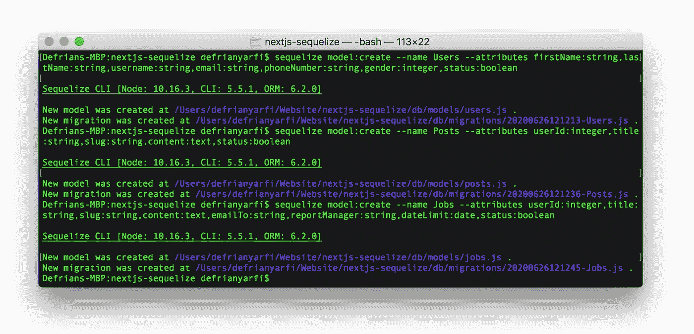

Sequelize creating Users, Posts and Jobs Models

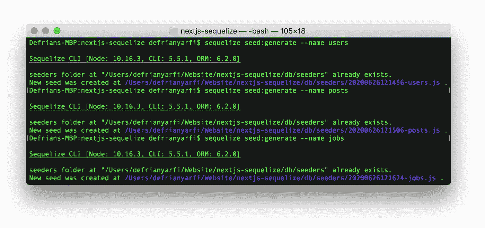

Sequelize creating Users, Posts and Jobs Seeds


Sequelize migrations, seeds files and directories in Next.js root project

**打开 seeders 文件并修改以添加数组数据项。**

- ./seeders/xxxxxxxxxxx-users.js

./seeders/xxxxxxxxxxx-users.js

。/seeders/xxxxxxxxxxx-posts.js

./seeders/xxxxxxxxxxx-posts.js

。/seeders/xxxxxxxxxxx-jobs.js

./seeders/xxxxxxxxxxx-jobs.js

**Sequelize 数据库迁移和种子命令**

`sequelize db:migrate`执行数据库迁移。

`sequelize db:seed:all`执行所有表格 seeders。

**Sequelize 撤销数据库迁移和种子命令**

`sequelize db:migrate:undo:all`撤消数据库迁移。

`sequelize db:seed:undo:all`撤销种子。

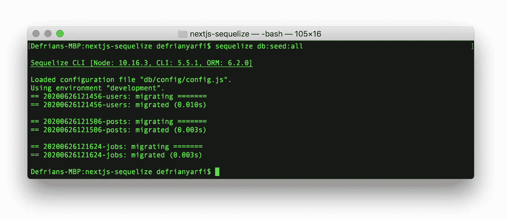

Sequelize Seeders

**-添加关联** *(编辑关联迁移文件后执行)

```
sequelize migration:generate --name add-post-associate
```

./migrations/xxxxxxxxxxx-add-posts-associate.js

```
sequelize migration:generate --name add-jobs-associate
```

./migrations/xxxxxxxxxxx-add-jobs-associate.js

`sequelize db:migrate`执行数据库关联迁移。

**打开。/models/index.js，它是先前从 sequelize init 生成的，并修改了代码。**

./models/index.js

**创建. env.development.local 并放入您的数据库凭证**

```
DB_HOST=**myhost_local**
DB_USER=**myuser_local**
DB_PASS=**mypassword_local**
DB_NAME=**mydatabase_local** JWT_KEY="**secretOrKeyJWTRandom**"
```

**启动 Next.js dev 服务器，打开**[**http://localhost:3000/**](http://localhost:3000/)

`yarn dev`启动 next . js dev 服务器，注意应用程序启动时加载的. env.development.local。

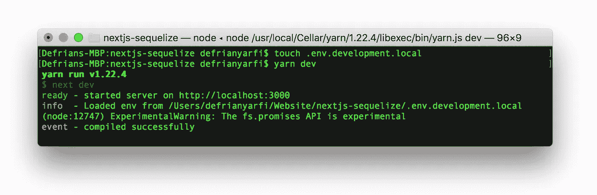

yarn dev

**在韦尔塞尔部署**

安装 Vercel Cli `npm i -g vercel`或`yarn add global vercel`，查看此[链接](https://vercel.com/docs/cli#getting-started)获取可用命令。这将使您能够[即时云部署](https://vercel.com/now)和[本地开发](https://vercel.com/blog/now-dev)。按照说明进行操作，并按 enter 键选择您的设置。只需键入`vercel --prod`即可在根终端中部署或更新更改。

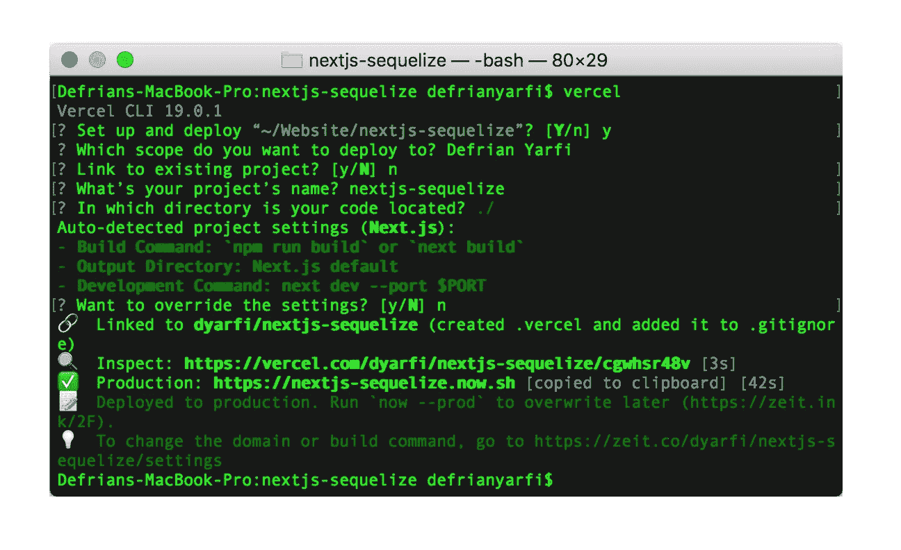

Deploy project to Vercel

**生产环境设置**

检查根目录中的默认值`.env.local.example`，并将变量匹配到 vercel 项目设置中。下面是一个`.env`的例子。

```
DB_HOST="db/nextjs-sequelize.db"
DB_USER=null
DB_PASS=null
DB_NAME="nextjs-sequelize"
JWT_KEY="secretOrKeyJWTRandom"
```

在*中添加您的数据库凭证。env* 指向生产服务器中的数据库。如果您使用 Vercel 托管，请在项目设置页面的生产选项卡中添加您的 env 变量。这些将被自动加密，并可用于生产。我们应用程序的环境。下面是设置。我们在 Vercel 上的远程数据库凭证的 env 产品:


.env production in vercel hosting

**演示:**

 [## Next.js with Sequelize |主页

### 带有序列的 Next.js |样板文件 next . js 和序列

nextjs-sequelize.now.sh](https://nextjs-sequelize.now.sh/) 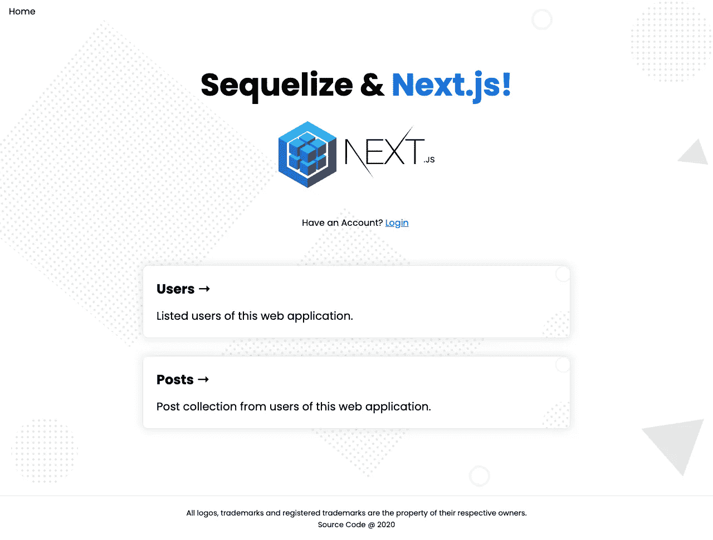

[https://nextjs-sequelize.now.sh/](https://nextjs-sequelize.now.sh/)

**参见:**

[](https://code-road.medium.com/next-js-and-reactstrap-admin-dashboard-project-e32ff3205eb2) [## Next.js 和 Reactstrap 管理仪表板项目

### React、SSR(服务器端渲染)和静态导出是 Next 的众多优势之一。JS 框架特性…

code-road.medium.com](https://code-road.medium.com/next-js-and-reactstrap-admin-dashboard-project-e32ff3205eb2) [](https://medium.com/geekculture/11-handy-nuxt-modules-for-your-nuxt-js-21c686485e08) [## 为您的 Nuxt.js 提供 11 个方便的 Nuxt 模块

### js 是一个非常强大的 VueJS 框架，得到了社区的大力支持。

medium.com](https://medium.com/geekculture/11-handy-nuxt-modules-for-your-nuxt-js-21c686485e08) [](https://betterprogramming.pub/how-to-change-node-js-version-between-projects-using-nvm-3ad2416bda7e) [## 如何使用 NVM 在项目之间更改 Node.js 版本

### 在您的机器上管理具有不同版本的节点的多个项目

better 编程. pub](https://betterprogramming.pub/how-to-change-node-js-version-between-projects-using-nvm-3ad2416bda7e) 

***注:****[***上的源代码 GitHub***](https://github.com/dyarfi/nextjs-sequelize) *是一个完整版，有用户、帖子、工作模型，在开发/本地服务器上使用 SQLite 数据库。使用密码登录演示中的任何电子邮件帐户。*[*demo*](https://nextjs-sequelize.now.sh/)*上的一个，由于 Vercel 上无服务器功能的限制，使用了*[*elephantsql.com*](http://elephantsql.com)*上的 Postgres 数据库，是一个删减版。如果您想使用分支*[***origin/server less***](https://github.com/dyarfi/nextjs-sequelize/tree/serverless)*并部署在 Vercel hosting 上，请使用它。**

## *需要改进的地方:*

*   *使 Sequelize 中的字段[别名混淆，而不是暴露数据库字段名的真实名称。](https://stackoverflow.com/questions/56571134/sequelize-map-fields-to-field-alias-in-model-definition)*
*   *考虑使用 [UUID](https://sequelize.org/v5/manual/data-types.html) 作为可以由 Sequelize 处理的主键。*
*   *考虑制作一个单独的[表示容器](https://medium.com/@dan_abramov/smart-and-dumb-components-7ca2f9a7c7d0)来处理视图组件中涉及的所有 Next.js 页面逻辑。*
*   *建立一个像 [*Redux*](http://react-redux.js.org/) 这样的 React 状态管理，并把它和 [*Redux-Saga*](https://redux-saga.js.org/) 结合起来，这样你就可以把那个奇特的加载器放到应用程序中了。*
*   *使用 Next.js [*绝对导入和别名*](https://nextjs.org/blog/next-9-4#absolute-imports-and-aliases) 导入组件。*
*   *对 API 页面如`/pages/api/v1/**/**.js`进行版本控制，以跟踪变更和特性。*
*   *利用 [*next-seo*](https://github.com/garmeeh/next-seo) 来改善你在 SERP 中的 seo 页面。*
*   *为生产中的 Web 应用程序设置一个 [*反向代理服务器*](https://www.google.com/search?q=Reverse+Proxy+Server&oq=Reverse+Proxy+Server&aqs=chrome..69i57j69i60.108j0j7&sourceid=chrome&ie=UTF-8) ，比如 Nginx 或 Apache。*
*   *使用 [PM2](https://pm2.keymetrics.io/) /生产经理进行生产和集群系统。*

**参考文献:
1。顺序:*[*https://sequelize.org/*](https://sequelize.org/) *2。next . js:*[【https://nextjs.org/docs/】](https://nextjs.org/docs/) *3。jwt:*[*https://jwt.io/*](https://jwt.io/)*

# *TL；速度三角形定位法(dead reckoning)*

*[**Next.js**](https://nextjs.org/)**:**从一开始，next . js 特性就自带 API 页面，除了所有新的丰富特性之外，还可以作为本地 API 访问你的数据。 ***服务器端渲染*** 是 Next.js 最好的特性之一*

*[**Sequelize**](https://sequelize.org/)**:**用于 Node.js 生态系统或 Express.js 框架应用中的多 SQL 方言 ORM(对象关系映射)。它可以用来连接到 RDBMS 数据库。ORM 中常见的查询方式有:`hasMany`、`belongsTo`、`hasOne`和`belongsToMany`。*

## *进一步阅读*

*[](/i-built-a-serverless-live-chat-app-with-next-js-fauna-and-wundergraph-for-graphql-live-queries-b671d9646f6) [## 我用 Next.js、Fauna 和 WunderGraph 为 GraphQL 实时查询构建了一个无服务器的实时聊天应用程序

### 这是使用无服务器技术创建可扩展的实时聊天应用程序的一步一步的指南，并有来自…

javascript.plainenglish.io](/i-built-a-serverless-live-chat-app-with-next-js-fauna-and-wundergraph-for-graphql-live-queries-b671d9646f6)  [## 如何使用最小特权原则自动化 AWS IAM 最佳实践

### 云是一项神奇的技术，可用于构建可扩展的应用程序，轻松提供对弹性计算的访问…

简明英语. io](https://plainenglish.io/blog/how-to-automate-aws-iam-best-practices-using-the-principle-of-least-privilege) [](https://plainenglish.io/blog/which-database-should-you-use-for-your-next-js-app) [## Next.js 应用程序应该使用什么数据库？

### 如果你在 2022 年要开发一个全栈应用，选择流行的 Next.js 会让你有 95%的机会…

简明英语. io](https://plainenglish.io/blog/which-database-should-you-use-for-your-next-js-app) [](https://plainenglish.io/blog/how-to-build-a-graphql-ecommerce-app-from-scratch) [## 如何从头开始构建一个 GraphQL 电子商务应用程序

### 这就是你要建造的东西！埃森哲的一项调查(19 个国家的 20，000 多名消费者)发现，47%的人…

简明英语. io](https://plainenglish.io/blog/how-to-build-a-graphql-ecommerce-app-from-scratch) [](https://blog.bitsrc.io/next-js-13-what-do-the-new-bleeding-edge-features-actually-do-d3e5fd418563) [## Next.js 13:新的前沿特性实际上是做什么的？

### 你听说过 Next.js 13 是一个游戏改变者，但是为什么呢？让我们看看什么是新的，什么是改变的，以及他们…

blog.bitsrc.io](https://blog.bitsrc.io/next-js-13-what-do-the-new-bleeding-edge-features-actually-do-d3e5fd418563) 

*更内容于* [***普通英语***](https://plainenglish.io/) *。报名参加我们的* [***免费周报***](http://newsletter.plainenglish.io/) *。在*[***Twitter***](https://twitter.com/inPlainEngHQ)[***LinkedIn***](https://www.linkedin.com/company/inplainenglish/)*[***YouTube***](https://www.youtube.com/channel/UCtipWUghju290NWcn8jhyAw)*以及*[**T42 不和**](https://discord.gg/GtDtUAvyhW) *上跟随我们。对增长黑客感兴趣？查看* [***电路***](https://circuit.ooo/) *。***