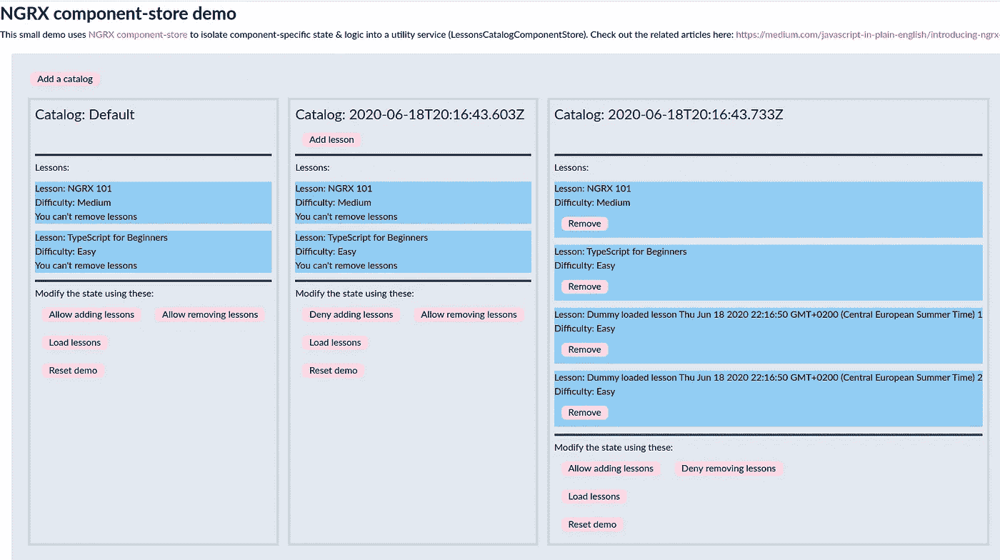

# NGRX 组件-商店深入探讨

> 原文：<https://javascript.plainenglish.io/ngrx-component-store-deep-dive-947c0a5be6dc?source=collection_archive---------0----------------------->

## 第 2 部分:让我们深入了解 NGRX 的新[组件库](https://ngrx.io/guide/component-store)!


Picture courtesy of [Jeremy Bishop](https://unsplash.com/@jeremybishop)

在第一部分[中，我已经解释了 NGRX 的组件存储模块是什么。如果你还没有读，那么我建议你现在就去看看:](https://medium.com/javascript-in-plain-english/introducing-ngrx-component-store-part-1-67019dba0cb0)[https://medium . com/JavaScript-in-plain-English/introducing-ngrx-component-store-part-1-67019 DBA 0 CB 0](https://medium.com/javascript-in-plain-english/introducing-ngrx-component-store-part-1-67019dba0cb0)

在第二部分中，我将首先解释组件存储的 API，然后我们将一起通过一些例子来发现如何使用它。最后，我将向您展示我是如何构建简单的[演示](https://ngrx-component-store-demo.netlify.app/)的。

注意:因为还没有最终版本，所以对本文的代码样本要有所保留。API 可能不会改变太多(如果有的话)，但可能会有细微的差别。

# 装置

安装组件存储非常容易，因为您可以简单地将它添加到 RxJS 旁边的项目中；它不依赖于 NGRX 的任何其他模块。

此时，组件存储库处于测试阶段；您可以使用以下方法将其添加到您的项目中:

```
npm install @ngrx/component-store
```

一旦添加，只需安装，你就可以走了。

一旦最终版本发布，只需更新您的依赖关系:)

# 组件存储的关键概念

以下几点直接摘自(草案)[正式文件](https://ngrx.io/guide/component-store):

*   本地状态可以被延迟初始化
*   本地状态通常与特定组件的生命周期相关联，并在该组件被销毁时被清除。
*   ComponentStore 的用户可以通过`setState`或`updater`来更新状态，要么强制更新，要么通过提供一个可观察对象来更新。
*   ComponentStore 的用户可以通过`[select](https://ngrx.io/api/store/select)`或顶级`[state](https://ngrx.io/api/store-devtools/StoreDevtools#state)$`读取状态。选择器的性能非常好。
*   ComponentStore 的用户可以用`[effect](https://ngrx.io/api/effects/EffectNotification#effect)`开始副作用，同步和异步都可以，并强制或被动地输入数据。

从这个列表中，我们已经可以认出几个熟悉的术语:`select`、`effect`、`setState`。好，我们已经感觉到在已知的领域；-)

尽管这还不十分清楚。让我们更详细地看看 API，了解一下它的本质。

# ComponentStore 类

首先，component-store 提供了一个我们可以扩展的`ComponentStore<T>`基类。扩展这个基类允许我们创建一个特定的组件存储类型，它将保存一个具有特定形状`T`的状态树。

假设我们希望在组件存储中存储以下信息:

这里没有什么花哨的；我们有一堆接口，其中有一个特别定义了我们状态的形状(我更喜欢这样命名，以使它的目的更清楚)。

基于此，组件存储实现的最简单的表达式如下所示:

如您所见，我们简单地创建了一个可注入的 Angular 服务，它扩展了 NGRX 组件存储的`ComponentStore<T>`类。此外，我们已经为我们的`WhateverState`接口设置了泛型类型，以定义我们的商店数据的形状。最后，注意我们已经通过调用`super`为我们的商店定义了一个默认/初始状态。

此时，我们的组件存储服务(CSS！:p)已经可以用了，但是目前为止还不是很有趣。

我现在想让你明白的是，这个服务可以在多个地方被注入，并且可以被实例化多次(我们将进一步了解如何实现。这一点非常重要，因为这是全球 NGRX 商店的一大优势。

全局 NGRX 存储被创建一次，并且被许多模块/组件共享(即使它们依赖于状态树的不同部分/与状态树的不同部分交互)。

与全局 NGRX 存储相反，基于组件存储的服务可以多次存在，彼此独立。正如我在上一篇文章中所解释的，这个想法是复杂组件的不同实例可以各自拥有自己的状态，由一个专用的组件存储服务实例保存。

# ComponentStore 类的基本 API

如前一节所述，我们的空的基于组件存储的服务类(相当拗口)现在没什么用。在其当前状态下(双关语)，它可以保持我们的初始/默认状态，并将其公开为可观察状态，但仅此而已。

不过，如果你实例化它，你会看到有一些方法可用。

下面是由`ComponentStore`基类提供的主要元素:

*   `state$`:作为 [RxJS](https://rxjs-dev.firebaseapp.com/) 可观察对象公开的类实例所拥有的当前状态
*   `setState`:可用于更新/替换当前实例的**状态**的函数。正如我们将在后面看到的，这个函数有两个主要的变体
*   `select`:可以用来定义选择器的函数。创建的选择器可以选择/提取/合成/转换当前实例持有的状态树的部分
*   `effect`:可用于定义**副作用**的功能；和 NGRX 的想法差不多。效果可以(例如)用于触发异步操作(例如，调用后端服务)、触发状态更新等
*   `updater`:可用于定义状态更新函数的函数；可以根据提供的参数更新状态的函数。更新器函数确实是**还原器**。需要注意的是，状态更新函数必须返回状态的新版本，而不是同一实例的变异版本

我们将在接下来的章节中探讨每一个问题。

**警告**:在接下来的部分中，我将解释由`ComponentStore`公开的基本方法，但是这些将脱离它们的上下文来显示，所以请等到后面涵盖演示的部分来更好地理解这些是如何组合在一起的；否则你可能只能看到一部分。

## 订阅状态/状态更新

从消费者的角度来看(例如，组件依赖于`WhateverComponentStore`服务的一个实例)，我们可以做的第一件事是订阅当前状态以获得它，并在它改变时得到通知。

组件库的每个实例都有自己的状态。如果您创建了另一个实例，那么状态将不会被共享；相反，另一个实例将拥有自己的。

如果您想继续，那么继续手动创建服务的一个实例:

创建实例后，我们已经可以订阅当前状态，如下所示:

当执行这段代码时，我们确实得到了当前的状态:

```
'Current state: ', Object{foo: 'default foo', bar: 'default bar', isWorkingFromHome: false, someData: [], users: Object{}}
```

如上图所示，组件存储服务实例持有的状态是*可观察的*。这本身就很酷，但是只有当所述状态可以被更新时才变得有趣..当然可以。

## 选择州的部分地区

就像 NGRX Store 一样，我们可以定义并订阅*选择器*，以便检索状态树的特定部分。

同样，与 NGRX 存储选择器一样，组件存储选择器可以提取状态的子集，但是它们也可以根据消费的需要组成/转换数据。这意味着你可以在组件存储选择器中反规格化数据，就像你在 NGRX 存储选择器中做的那样。

下面的例子展示了如何选择我们的状态树的`foo`属性:

如您所见，我们只需将一个*投影*函数传递给`select`方法。使用当前状态对象调用投影函数，并返回它想要的任何内容。

上面，请注意`fooSelector`是一个可观察值，因此我们可以很容易地订阅它以获得当前值，并在值发生变化时得到通知:

注意，TypeScript 类型推断在这里起了很大的作用；一切都打对了。

当然，选择器的有趣之处还在于它们可以组合在一起，因此您可以定义一个选择器来提取状态树的一部分，然后定义另一个选择器来重用第一个选择器并执行额外的操作。

NGRX 组件存储选择器目前*没有被记忆*，但是在内部使用`distinctUntilChanged`和`shareReplay`，这意味着我们可以多次订阅一个选择器，并且所有这些订阅将获得相同的值(不需要触发单独的执行)。

## 初始化/设置状态

正如我们前面看到的，默认/初始状态是在我们的`ComponentStore`类的构造函数中定义的。事实上，该类可以接受初始状态作为构造函数参数；这是一个设计选择。实际上，我认为设置一个缺省值并避免通过构造函数传递初始状态更有意义，但这取决于你。

那么我们如何更新状态呢？

第一种方法是使用`setState`功能。这里有一个例子:

这里，我们简单地将新状态作为参数传递给了`setState`函数。或者，您可以如下传递一个*更新器*函数:

使用这种样式，您可以访问当前状态，因此可以更容易地更新特定部件。请注意，您必须返回一个新对象，当然不能改变现有的对象；否则，你会违反合同，状态也不会像你希望的那样更新。不变性超级重要，就像 NGRX Store 和宇宙中任何好的东西一样，真的。

你当然可以随心所欲地多次调用`setState`。

## 更新状态

调用`setState`很好，但是能够定义负责更新状态特定部分的函数也很有趣。这正是`updater`的意义所在。

创建更新程序就像这样简单:

`ComponentStore`的`updater`函数接受一个函数作为参数。调用该函数时，它将接收两个参数:

*   当前状态
*   一些更新的值(在它上面是一个字符串，但它可以是你喜欢的任何东西)

基于这些输入，updater 函数的作用是返回状态的新版本。

同样，更新不能改变现有状态，而是返回一个新状态。我推荐你看一看 [Immer](https://immerjs.github.io/) 在实现这样的减速器时使用它。

状态更新功能可以轻松调用，如下所示:

当我们这样做时，服务实例持有的状态得到更新。很好。

此外，[正如 Alex](https://twitter.com/AlexOkrushko/status/1273809090188398598) 所强调的，请注意更新程序可以将可观察值作为参数(不仅仅是命令性数据)，并且可以取消订阅。这意味着您可以将流链接在一起，使您的代码更具反应性；-)

## 处理副作用

效果是最有趣的地方。通过实现效果，您可以定义复杂的场景，只要调用效果就可以执行这些场景。

例如，一个效果可以根据它接收到的值，决定调用一个远程 API，调用更新程序来修改状态，等等。天空是无限的。

这是一个非常基本的效果例子:

这个玩具示例只是将它接收到的值记录到控制台，但是显示了它的症结所在。当用一个值调用`myEffect`效应时，该值作为可观察值的下一个值被传递给效应函数，然后效应函数可以通过管道将它传递给它想要的任何东西(正如你所知道的，一旦你手中有了一个流，宇宙就是你的了)。

顺便说一下，我们没有被强迫传递一个值给一个效果；我们也可以简单地称之为没有价值观；在这种情况下，呼叫将作为简单的信号。

当用组件存储实现业务逻辑时，效果当然会起很大的作用。我会给你看一个更具体的例子。

与更新程序一样，effects 也可以将可观察值作为参数，而不仅仅是我在上面的例子中展示的命令性数据！

# 什么去哪里？

到目前为止，您已经看到了如何定义一个基本的`ComponentStore`类，如何在没有 Angular 的情况下实例化它，以及它公开了什么方法。

我们看到了每个内置方法是如何独立工作的，但是现在这仍然有点抽象。在这一点上，你可能想知道*到底把那些选择器、更新器和特效放在哪里..*

它们当然不属于你的组件，因为你想让它们更简单，尽管我们看到它们可以在任何地方*被创建/传递/使用。*

正如我将在下一节中展示的，选择器、更新器和效果实际上应该在从`ComponentStore`扩展的类中定义。这样，该类将维护一个特定的状态树，并将封装所有操纵该状态的代码。当然，选择器/效果/更新器将被绑定到类的一个特定实例，并将与一个特定的状态树交互。

现在让我们来看一下演示，这样您就可以更具体地感受如何实际使用组件存储了！

# 演示

既然我们已经发现了组件存储的公共 API，我们可以看一个更具体的例子来把事情放在上下文中。

如果你想看看我接下来要描述的代码，你可以看看下面的 [Git 库](https://github.com/dsebastien/ngrx-component-store-demo):[https://github.com/dsebastien/ngrx-component-store-demo](https://github.com/dsebastien/ngrx-component-store-demo)

你也可以看看[现场演示来玩玩](https://ngrx-component-store-demo.netlify.app/)。

这个演示不是很高级，但是它展示了我们如何利用组件存储将状态和逻辑提取到扩展`ComponentStore`的定制服务类中。此外，演示还展示了服务是如何配置的。

最后，演示清楚地表明，使用基于组件存储的服务的组件的每个实例都有自己独立的状态，并且与其他实例完全隔离。

请记住，这个演示只不过是一个虚拟的例子，在整体计划中不一定有意义。所以让我们假装这一切都有意义；-)

## 领域模型

演示有一个微小的领域模型:

对此我并没有太过担心。演示允许操作“课程”。

## 成分

演示的想法是，根据当前状态，用户可以或不可以添加/删除课程和/或教师。

演示中有两个主要的角度分量。第一个，“课程”是一个哑组件，可以显示特定的课程。

第二个是“课程目录”，这是一个智能/表示组件，应该足够复杂以保证组件存储的使用。该组件知道并使用通过组件存储实现的服务。

## 决赛成绩

在我们开始查看代码之前，让我们看看演示是什么样子的:



您在上面看到的是三个彼此相邻的课程目录组件实例。顶部的“添加目录”按钮添加了一个课程目录组件的实例。

这些组件实例中的每一个都有自己的组件存储实例，具有单独的状态。正如您在上面的截图中看到的，每个目录的状态都是独立发展的。例如，“默认”目录没有“添加课程”或每个课程下面的“删除”按钮，等等。

注意，所有这些组件都使用了 [OnPush 变化检测策略](https://angular.io/api/core/ChangeDetectionStrategy)。

按钮允许操纵状态。

同样，你可以在 Netlify 上找到[的现场演示，也可以在 Github 上找到源代码](https://ngrx-component-store-demo.netlify.app/)

好奇？好吧，我们开始吧！

## 课程目录状态

以下是课程目录组件的状态:

这里没有什么花哨的；只有几个数据点和几个标志来允许/拒绝一些操作。

## 应用程序组件

app 组件只是保存一组目录元素；单击“Add”目录元素，向集合中添加一个。

每次创建新目录时，app 组件都创建/呈现附加的课程目录组件:

## 课程组件

课程组件非常简单，是一个漂亮的哑组件:

## 课程目录组件存储

啊，现在是最终查看组件存储实现的时候了:

现在你可以看到我们把选择器，更新器和效果放在哪里了。所有这些都在组件存储服务中进行了很好的重新组合。

让我们回顾一下每种类型的一个元素，尽管我们在本文前面已经讨论过了。

**选择器**:

这个选择器只是返回状态的`canAddLessons`属性。很简单。

**更新器**:

当被调用时，这个名为`addLesson`的更新器接收当前状态以及要更新的教训对象。鉴于它是如何实现的，它也可以被称为 addOrUpdate，但这并不太重要。如您所见，updater 函数创建并返回了一个全新的状态对象(同样，这很重要)。在生产应用程序中，我建议使用 Immer 的 produce 函数来实现它。

**效果**:

这个`loadLessons`效果并不惊天动地，但是它应该给你一个效果如何工作的概念。当 effect 被调用时，它们期望接收一些输入(实际上是随着时间的推移的多个输入)，并且可观察到的输入以神奇和神秘的方式传输。

在这种情况下，我们可以想象这种效应触发了数据的异步加载，然后调用一个更新器来更新状态树。

如果你喜欢 RxJS，那就随便扇我耳光，我知道我活该，但这只是个例。如果你的 RxJS-fu 不是很棒，一定要了解使用 switchMap 进行此类操作的风险；-)

顺便说一下，如果你看一下 Github 上的代码[，你会发现我把效果做得更有趣了](https://github.com/dsebastien/ngrx-component-store-demo/blob/master/src/app/lessons-catalog/lessons-catalog-component-store.service.ts#L121)，增加了一个`loading`状态；当效果开始时，将其设置为`true`，当效果结束时，将其设置回`false`。

最后一件事:对于现实世界的应用，**不要忘记处理你的效果中的错误**。就像 NGRX 存储效果一样，如果出现错误并且没有得到处理，component-store 将让可观察到的流消失！

## 课程目录组件

最后但同样重要的是，让我们看看课程目录组件。这是我们应该感受到使用我们的组件存储服务的影响的地方。

这里有几件事要提一下。

首先，注意组件在其 providers 数组中定义了`LessonsCatalogComponentStore`。这就是我们如何将服务的生命周期与这个组件的生命周期联系起来的(当这个组件被销毁时，相关的服务实例也会被销毁！).它当然允许我们在每个组件实例中注入一个单独的服务实例。注意，它还使同一服务实例对应用程序的这个子树中的任何组件可用

其次，注意我们在`ngOnInit`方法中设置了一个初始状态。我们可以想象，这个初始状态是由这个表示组件在从路由器或从其他地方(例如，服务、全局 NGRX 存储等)提取信息之后导出的。

最后，请注意，这个组件中没有多少内容。几乎是空的！这真的很酷。没有太多状态，没有太多逻辑。不需要；那现在大部分在我们的组件商店里！

最后，让我们看看模板:

如您所见，我直接使用模板中的目录组件存储。我本可以在控制器上添加处理程序方法或定义字段来公开选择器(例如，将模板与组件存储区隔离开)，但这感觉像是添加了不必要的间接内容。

现在提供设计指导还为时过早(仍在学习中)，所以不要认为这是“正确的”方法…

不要为烟斗流汗；我只是想尝试一下 ngrx 组件，这是下一篇文章的主题:p。

组件和子组件的状态由组件库保存，我们可以使用前面看到的选择器轻松地订阅特定的状态部分。

此外，像添加/删除东西这样的操作直接向组件库请求，组件库有更新程序和效果来处理一切。

就是这样！

# 少了什么？

希望很快会有第一个最终版本。我没有问 Alex 它什么时候发布，但是我想象在不太遥远的将来…-)

我看到在 component-store 周围也有一些开放的门票:

*   一个补充[原理图](https://github.com/ngrx/platform/issues/2570)
*   一加 [ng 加支持](https://github.com/ngrx/platform/issues/2569)

# 参考

本文的代码示例都可以在 Github 上找到:[https://github.com/dsebastien/ngrx-component-store-demo](https://github.com/dsebastien/ngrx-component-store-demo)

[现场演示在 Netlify](https://ngrx-component-store-demo.netlify.app/):[https://ngrx-component-store-demo.netlify.app/](https://ngrx-component-store-demo.netlify.app/)上线

*   官方文件:[https://ngrx.io/guide/component-store](https://ngrx.io/guide/component-store)
*   设计文件:[https://okrushko.dev/component-store-dd](https://okrushko.dev/component-store-dd)
*   刘彦生活流覆盖组件-商店:[https://www.youtube.com/watch?v=EeNMGhLnBGg](https://www.youtube.com/watch?v=EeNMGhLnBGg)&[https://www.youtube.com/watch?v=-hp72aA0wBw](https://www.youtube.com/watch?v=-hp72aA0wBw)
*   ComponentStore 类的来源:[https://github . com/ngrx/platform/blob/master/modules/component-store/src/component-store . ts](https://github.com/ngrx/platform/blob/master/modules/component-store/src/component-store.ts)

# 结论

在本文中，我解释了 [NGRX 组件库](https://ngrx.io/guide/component-store)的概念和 API。我还向您展示了一个简单的演示，展示了它的易用性。

希望您现在对 NGRX 组件存储是什么以及它是如何工作的有一个清晰的概念。

我确信 NGRX 的这个新模块带来了有趣的想法，对于将状态/逻辑隔离在复杂组件之外，使它们更容易处理，这些想法肯定是有价值的。

正如我在上一篇文章中解释的那样，组件存储也为使用全局 NGRX 存储没有意义的情况提供了一个答案。

最后，它将允许我们使复杂的有状态组件可重用，甚至跨应用程序共享。也许这为更容易地将复杂组件集成到 Storybook 中铺平了道路？相当酷！

感谢 Kevin Elko 提出这个想法/原始设计，感谢 Alex Okrushko 将它带入 NGRX！

今天到此为止！

# 喜欢这篇文章吗？

如果你想了解关于软件/Web 开发、TypeScript、Angular、React、Vue、Kotlin、Java、Docker/Kubernetes 和其他很酷的主题的大量其他很酷的东西，那么不要犹豫[拿一本我的书](https://www.amazon.com/Learn-TypeScript-Building-Applications-understanding-ebook/dp/B081FB89BL)并订阅[我的简讯](https://mailchi.mp/fb661753d54a/developassion-newsletter)！