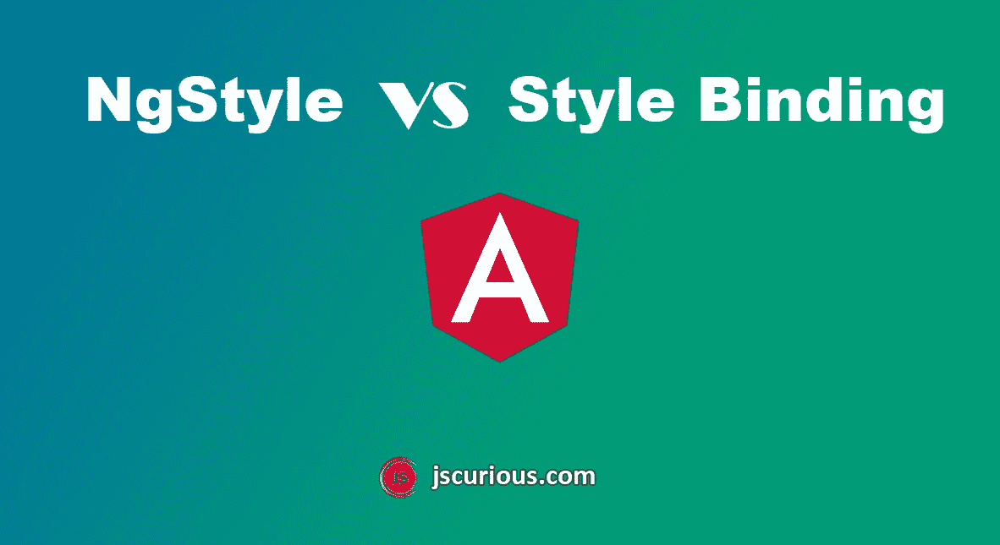

# NgStyle 与 Angular 中的样式装订

> 原文：<https://javascript.plainenglish.io/ngstyle-vs-style-binding-in-angular-2b4c5bd11ceb?source=collection_archive---------7----------------------->



# 样式绑定

要从任何元素动态添加一个样式，我们可以使用样式绑定。语法是:

```
[style.style_property] = "expression"
```

表达式的值通常是一个字符串。

```
<div [style.color]="hasError ? 'red' : 'black'">
...
</div><div [style.background-color]="'yellow'">
...
</div>
```

使用样式绑定，我们只能设置一个样式，但是要设置多个样式，我们可以使用`ngStyle`指令。

# ngStyle 指令

指令接受一个对象，其中键是 CSS 属性名，值是各自的表达式。

```
<div [ngStyle]="{width:'10px', height: '20px'}">
...
</div><div [ngStyle]="{color: isPassed?'green':'red', 
     backgroundColor: getColor()}">
...
</div>
```

我们也可以在组件中定义样式对象，并在模板中使用它。我们将使用动态验证来设置 CSS 属性值。

**组件(。ts 文件)**

```
styles = {
  'color': this.hasError ? 'red' : 'black',
  'border-left': this.hasError ? '3px solid red' : '',
  'background-color': this.isActive ? 'green' : 'white',
  'width': this.boxWidth + 'px',
  'height': this.boxHeight + 'px',
  'font-size': this.textFont + 'px'
}
```

**HTML**

```
<div [ngStyle]="styles">
...
</div>
```

现在，您可以使用适合您的绑定动态地向 HTML 元素添加或移除样式了。

***感谢您的宝贵时间*** ☺️
更多网络开发博客，请访问[jscurious.com](http://jscurious.com/)