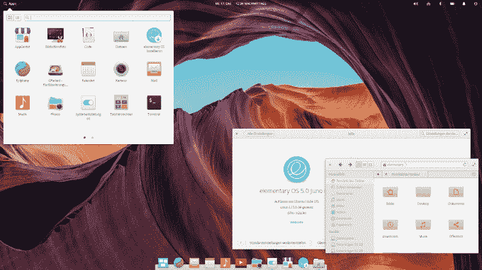
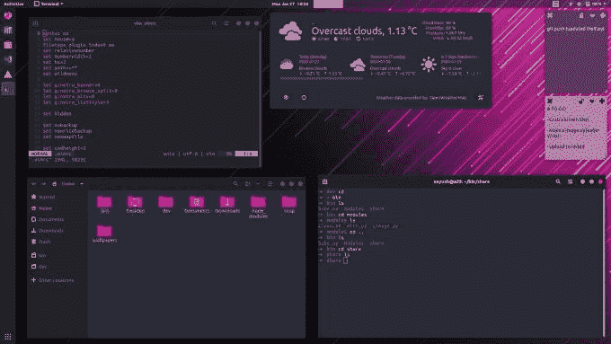

# 不，你不需要 Windows 或 Mac 来开发 JavaScript

> 原文：<https://javascript.plainenglish.io/no-you-do-not-need-windows-or-mac-to-develop-with-javascript-460e1ac9e494?source=collection_archive---------6----------------------->

Image by OpenClipart-Vectors from Pixabay

桌面操作系统市场被三大玩家瓜分:垄断巨头微软的 Windows，昂贵的苹果的 macOS 和无数的 Linux 发行版，既有社区运营的，也有商业支持的。在这篇文章中，如果你是一个活跃的 Windows 用户，我会给你很好的理由，打破一些神话，试图说服你尝试 Linux。

建议读者自行判断:本文包含我的主观观点，无论如何，你都不应该把它当作最终的真理。在我从 Windows 切换到 Linux 的过程中，有一些原因对我有效，它们可能对你有效，也可能无效，这很好。

# 环境一致性

当你用 JavaScript 开发时，无论是后端还是前端，你的代码在大多数情况下都要经过 Linux 环境。如果是后端，Linux 服务器将运行它。如果是前端，浏览器将运行它，但是 CI/CD 管道、测试和构建也将发生在 Linux 容器上。当您在您的开发机器上使用 Linux 时，您可以 100%确定您的代码在您的计算机之外会以同样的方式运行，并且您不必担心平台的不一致性。

# 内心的宁静

Image by [MasterTux](https://pixabay.com/users/MasterTux-470906/?utm_source=link-attribution&utm_medium=referral&utm_campaign=image&utm_content=3348307) from [Pixabay](https://pixabay.com/?utm_source=link-attribution&utm_medium=referral&utm_campaign=image&utm_content=3348307)

Linux 内核以及大多数主要发行版都是 100%开源的。它有一个庞大的社区，以及企业的参与，不断关注和可能出现的问题，特别是安全问题。当然，系统的安全性取决于它的用户，但是，在其他条件相同的情况下，就漏洞数量和易受攻击性而言，Linux 比 Windows 更安全。尽管如此，没有系统会给你 100%的保护，重要的是要记住**最安全的计算机是关闭的计算机**。

所以，Linux 会保护你的文件免受黑客攻击，但这还不是全部。它还可以保护你的文件免受广告商、政府和任何其他利益方的侵害。Windows 充斥着遥测技术和间谍软件，这是 Linux 所不能容忍的。既然是开源的，欢迎大家来[自己找](https://github.com/torvalds/linux)。

# 表演

Image by [Arek Socha](https://pixabay.com/users/qimono-1962238/?utm_source=link-attribution&utm_medium=referral&utm_campaign=image&utm_content=1249610) from [Pixabay](https://pixabay.com/?utm_source=link-attribution&utm_medium=referral&utm_campaign=image&utm_content=1249610)

不管你有 16 核 AMD Threadripper 还是 Intel Core m3，Linux 都会更快。而且，由于它可以配置到最后一位，所以您可以专门为特定任务(比如说，机器学习或音乐制作)设置它，并享受更多显著的优势。此外，它的系统要求也低得离谱，你可以在任何硬件上运行它。

# 用户化

我在最后一段提到了定制，但它值得有自己的一节。Linux 可以是你想要的任何东西，开发机、[、游戏机](http://www.lakka.tv/)、咖啡机、[、智能电视](http://linuxgizmos.com/linux-continues-advance-in-smart-tv-market/)、[智能手机](https://www.howtogeek.com/189036/android-is-based-on-linux-but-what-does-that-mean/)以及许多其他东西。您可以微调系统的每个组件，完全控制运行什么、何时运行以及做什么。

Linux 中的用户可以控制一切:你的桌面环境，在用户友好的 GNOME、健壮的 KDE、轻量级的 XFCE 或许多其他环境中进行选择。您可以更改您的[命令提示符](https://en.wikipedia.org/wiki/Comparison_of_command_shells)、[引导程序](https://www.slant.co/topics/4820/~linux-bootloaders)、[显示服务器](https://www.secjuice.com/wayland-vs-xorg/)、[安全和防火墙提供商](https://security.stackexchange.com/questions/29378/comparison-between-apparmor-and-selinux)、[软件源](https://fusion809.github.io/comparison-of-package-managers/)、[文件系统](https://opensource.com/article/18/4/ext4-filesystem)以及想到的任何其他内容。

# 但是它没有任何软件…

不再是了。随着跨平台开发的兴起，现在是开发 Linux 的最佳时机。JS 开发人员使用的许多流行应用程序，包括 VS Code、Slack、Trello、GitKraken、JetBrains 套件、Skype、Discord 和许多其他应用程序在 Linux 上运行得非常好。如果你对游戏感兴趣，Steam 支持 Linux 已经有一段时间了，移植到它上面的游戏数量每天都在增加。

如果你一定要使用 Windows 应用程序，你仍然可以使用 Windows API 桥来运行它们。

# 但是它很丑…

我要把这个放在这里:

# 但是对新手来说太不友好了…

虽然过去是这样，但最近几年情况有所好转。如果你是初学者，那就去试试 [Ubuntu](https://ubuntu.com/) 或[初级操作系统](https://elementary.io/)，你会被它们的直观和易用所震惊。如果你想要企业级的稳定性，openSUSE 可能是一个不错的选择。对于那些了解原力之道的人来说，Arch Linux 和 Gentoo 分别适合你。

# 但我绝对需要%特定任务%的窗口…

仅仅因为你使用 Linux，并不意味着你必须完全放弃 Windows。您可以在电脑上安装这两个系统，并在启动时进行选择。这是一个非常受欢迎的特性，所有主要发行版都支持开箱即用，无需额外设置。如果你喜欢一种不那么麻烦的方式，你可以使用 [VirtualBox](https://www.virtualbox.org/) 在虚拟机中试用 Linux。

# 好吧，你说服了我，我该怎么开始？

Linux 安装说明超出了本文的范围，但是这里有一些有用的链接:

*   [https://medium . com/@ dancurrotto/getting-started-with-Linux-162 E0 f 70 e 20 c](https://medium.com/@dancurrotto/getting-started-with-linux-162e0f70e20c)
*   [https://medium . com/better-programming/Linux-survival-guide-for-初学者-c18bfd982036](https://medium.com/better-programming/linux-survival-guide-for-beginners-c18bfd982036)
*   [https://helpdesgeek . com/Linux-tips/an-introduction-to-Linux-for-初学者/](https://helpdeskgeek.com/linux-tips/an-introduction-to-linux-for-beginners/)
*   [https://itsfoss.com/best-linux-beginners/](https://itsfoss.com/best-linux-beginners/)

