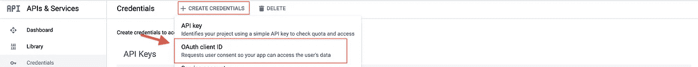
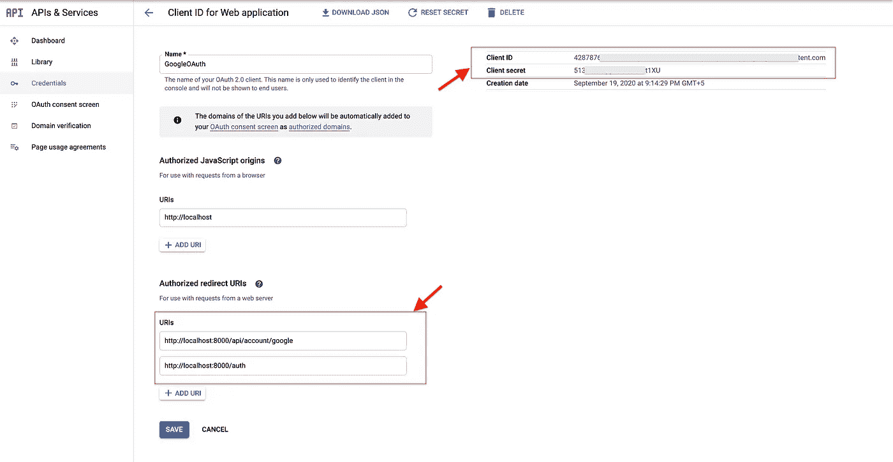

# 节点和 Passport JS — Google OAuth20 认证

> 原文：<https://javascript.plainenglish.io/node-and-passport-js-google-oauth20-authentication-8bcd6b3d67ca?source=collection_archive---------0----------------------->


Cover Image

作为一名用户，我们经常会使用谷歌账户登录网络应用。这个过程会很简单。但现实中，很多工作都是在那一次点击的背后完成的。这篇博客将向你解释如何用 Node 和 Express JS 实现 Google 认证。为了实现这一点，我们将使用一个名为 Passport JS 的第三方库。Passport JS 是 Node 和 Express JS 的认证中间件。Passport JS 可以与任何 Express JS 应用程序一起使用。Passport JS 提供 500 +策略。

[](http://www.passportjs.org/) [## Passport.js

### Passport 是 Node.js 的认证中间件。极其灵活和模块化，Passport 可以不引人注目地…

www.passportjs.org](http://www.passportjs.org/) 

## 目录

1.  [初始化 Node.js 项目](#c475)
2.  [创建 OAuth 客户端 ID](#e3c8)
3.  [配置 Google OAuth](#9093)
4.  [保护路由并添加注销视图](#fb32)

## **1。初始化 node . js 项目**

首先，让我们创建一个 Express 应用程序。以下命令创建一个新文件夹并初始化 Node.js。

```
mkdir passport_sta
cd passport_sta/
npm init -y
touch index.js
```

初始化后，安装所有需要的软件包。在这里，我正在安装下列软件包。

express——web 服务器和 API 的轻量级框架。

cookie 会话—存储会话。

passport——用于节点和 Express JS 的认证中间件

passport google oauth20 — Passport 身份验证策略，帮助您使用 google 帐户登录。

```
npm install express cookie-session passport passport-google-oauth20 --save
```

上面的命令安装所有的包。安装后，将下面的代码复制到您的`index.js`文件中。

`index.js`

```
const express = require('express')
const app = express()app.get('/',(req,res)=>{
  res.send('Hello world')
})app.listen(8000,()=>{
  console.log('Serve is up and running at the port 8000')
})
```

现在使用`node index.js`启动服务器。然后导航到 [http://localhost:8000/](http://localhost:8000/) 。您应该会看到 Hello world 显示在浏览器中。

## 2.**创建 OAuth 客户端 ID**

在使用 passport 的谷歌认证策略之前，您应该已经在谷歌注册了您的应用程序或网络应用程序。为此，请遵循以下步骤。

a.登录谷歌云平台。

b.创建新项目。

[](https://console.developers.google.com/) [## 谷歌云平台

### Google 云平台让您可以在同一基础设施上构建、部署和扩展应用程序、网站和服务…

console.developers.google.com](https://console.developers.google.com/) 

c.在仪表板中，单击 enable APIS and Services，然后在项目中搜索并启用 Google plus API 和 contact API。

d.在“凭据”页面上，单击创建凭据，然后单击 OAuth 客户端 ID。



Create an OAuth Client ID

e.现在，将会显示一个 ClientID 表单。为您的 OAuth ID 命名，并添加重定向的 URL。



Get OAuth Credentials

f.现在单击 create 按钮，它会向您显示客户端 ID 和客户端密码。记下客户端 ID 和密码。

## 3.**配置 Google OAuth**

现在让我们开始将 Google 认证与我们的项目集成。为此，我创建了一个名为`passport.js`的新文件，它保存了我们从 Google Cloud Dashboard 创建的凭证。

`passport.js`

```
const passport = require('passport');
const GoogleStrategy = require('passport-google-oauth20').Strategy;passport.serializeUser(function(user, done) {
  done(null, user);
});passport.deserializeUser(function(user, done) {
  done(null, user);
});**passport.use(new GoogleStrategy({
    clientID: "4287*****************************ent.com",** **clientSecret: "513z***********t1XU",** **callbackURL: "http://localhost:8000/api/account/google"** **},
  function(accessToken, refreshToken, profile, done) {
    return done(null, profile);
  }
));**
```

将下面的代码复制并粘贴到你的`index.js`文件中。

路由`/auth`将客户端重定向到 Google 登录页面。

如果 Google 认证成功，路由`/api/account/google`将作为一个回调 URL 被调用。

如果在 Google 认证过程中出现任何错误，将调用路线`/ath/error`。

`index.js`

```
const express = require('express')
const app = express()
const passport = require('passport');
**require('./passport');** const cookieSession = require('cookie-session')app.use(cookieSession({
  name: 'google-auth-session',
  keys: ['key1', 'key2']
}))
app.use(passport.initialize());
app.use(passport.session());//Routes
**app.get('/auth', passport.authenticate('google', { scope: ['profile', 'email'] }));****app.get('/auth/error', (req, res) => res.send('Unknown Error'))****app.get('/api/account/google', passport.authenticate('google', { failureRedirect: '/auth/error' }),
  function(req, res) {
    res.redirect('/');
  }
);****app.get('/', (req, res) => res.send(`Welcome ${req.user.displayName}!`))**app.listen(8000,()=>{
  console.log('Serve is up and running at the port 8000')
})
```

现在导航到[http://localhost:8000/auth](http://localhost:8000/auth)。您将被重定向到谷歌的登录页面。登录您的 Google 帐户后，您将被重定向回我们的网页，您将看到您的 Google 用户名显示在我们的网页上。

## 4.**保护路由并添加注销视图**

当您在未登录的情况下打开路线`[http://localhost:8000/](http://localhost:8000/auth)`时，您会看到一个错误`displayName`未找到。为了消除这个错误，我创建了一个中间件来检查用户是否登录。我正在名为`Middleware`的新文件夹中创建中间件。

`Middleware/auth.js`

```
const isLoggedIn = (req, res, next) => {if (req.user) {
  next();
} else {
    res.status(401).send('Not Logged In');
  }
}module.exports = isLoggedIn
```

完成后，将中间件传递给路由`/`。现在自动导航到 URL `[http://localhost:8000/](http://localhost:8000/auth).`，您将被重定向到`/auth`路线。

现在让我们创建一个注销函数。只要调用函数`req.logout()`你就可以从谷歌账户注销。

`index.js`

```
const isLoggedIn = require('./Middleware/auth')**app.get('/', isLoggedIn,(req, res) => res.send(`Welcome ${req.user.displayName}!`))****app.get('/logout', (req, res) => {
  req.session = null;
  req.logout();
  res.redirect('/');
})**
```

只需导航到[http://localhost:8000/logout](http://localhost:8000/logout)。您将被注销。

在我的下一篇博客中，我将使用 Passport JS 实现脸书认证。保持联系。

如有任何疑问，请随时联系我。电子邮件:sjlouji10@gmail.com。领英:[https://www.linkedin.com/in/sjlouji/](https://www.linkedin.com/in/sjlouji/)

我的 GitHub 上的完整代码:

[](https://github.com/sjlouji/Passport-Strategies---Medium/tree/master/passport_sta) [## sjlouji/Passport-策略-中等

### 在 GitHub 上创建一个帐户，为 sjlouji/Passport-Strategies-Medium 开发做出贡献。

github.com](https://github.com/sjlouji/Passport-Strategies---Medium/tree/master/passport_sta) 

编码快乐！