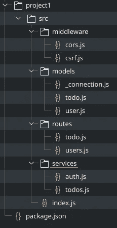

# 节点应用程序目录结构

> 原文：<https://javascript.plainenglish.io/node-application-directory-structure-dfe1ae97891d?source=collection_archive---------4----------------------->


Photo by [Kelly Sikkema](https://unsplash.com/@kellysikkema?utm_source=medium&utm_medium=referral) on [Unsplash](https://unsplash.com?utm_source=medium&utm_medium=referral)

创建最初几个基于节点的应用程序时，面临的挑战之一是确定将代码所在的文件放在哪里。这是一个挑战，因为很少有“这样做”的说法。取而代之的是一些建议和指导方针，或者教程以某种特定的方式去做而不解释为什么。

Node 的特点是它实际上更喜欢软件的[设计模式](https://en.wikipedia.org/wiki/Software_design_pattern)和[设计原则](https://en.wikipedia.org/wiki/Category:Programming_principles)。将这些模式和原则应用到我们自己的应用程序中也是一个好主意。我发现，当我偏离了已被证实的原则(在这些原则适用的地方)，我的代码往往会很快变得“丑陋”(更复杂、更难操作、更难维护，等等)。)

你选择使用的模块也可能建议一种组织文件的方法。例如，使用 [**Express**](https://expressjs.com/) 创建一个重要的应用程序几乎总是以“routes”文件夹结束。使用 [**Knex。JS**](http://knexjs.org/) 经常会产生一个“模型”和“迁移”文件夹。这些模块能够与通用设计模式和谐地工作，正是因为它们被广泛地使用和改进。

当我们开始时，我们需要的唯一“真正的”文件夹是一个项目目录。这是我们放置`package.json`文件和应用程序的任何其他文件的地方。我们经常看到用如下命令创建的基本结构:

```
mkdir myProject
cd myProject
npm init -y
```

惯例在这里也起了作用。大多数节点项目在`project.json`文件旁边会有一个`src`目录。很多库和工具都希望这样，但是 Node 本身并没有说这是绝对必需的。惯例可能是一件好事——它带来了共同的理解，使思想交流更加容易。在某些情况下，它可以让“魔法”发生，但只有以特定的方式。但是约定有时会与应用程序需求甚至其他需要的模块发生冲突。

*“标准的好处是你有太多的选择”——安德鲁·塔宁鲍姆*

对于 Node，我们经常使用模块。一个模块*根据需要需要*其他模块。所需的模块要么是已安装的模块— `require('express')`要么是我们系统中的一个路径，当第一个字符是点`require('../models/widget.js')`时被识别。所需模块的路径是相对于当前模块的。在需要的地方，可以使用内置路径模块来确保使用正确的路径(以及跨平台的路径)。

```
const path = require('path')
const WidgetModel = require(path.resolve(__dirname, '../models/widget.js'))
```

因为我们指定了模块的路径，所以我们选择的目录结构几乎是我们想要的。为了避免混乱，我们应用设计原则和一些常识来建议一个合理的目录结构。

例如，当我创建一个需要数据访问模型的基于 Express 的 API 时，我可能会得到这样的结构:



Possible directory structure. (this is probably incomplete)

在这里我有一个**路由**和**中间件**文件夹，用来存储一些 Express 的特定模块。然后我有一个 **models** 目录来存储我的数据访问文件。最后，我有**服务**目录来存储我的业务逻辑。短语“服务”可以有其他的名称——“逻辑”、“商业智能”等等。但“服务”似乎是一个很好的收藏短语，并被业界广泛采用。

这里的关键是使目录结构与应用程序的需求相匹配。你最了解这些需求，所以你可能会选择一些有意义的东西。尽可能应用设计原则也有助于定义所需的结构。最后，定义公共应用程序层也有助于确定需要什么文件夹。


在你建立了一些应用程序之后，你需要的目录结构将会出现，这只是你没有真正考虑过的事情之一。当您使用其他项目或框架时，您会注意到一些有意义的约定或建议，您会尽可能地采用它们。(例如，我的数据访问模型受到了 [Laravel](https://laravel.com/) 模型系统的影响。但那是不同的话题。)

这是一个高层次的讨论，但这里希望它能帮助你一些。如果我能澄清/纠正什么，请随时给我留言。

## 简单英语的 JavaScript

喜欢这篇文章吗？如果有，通过 [**订阅解码，我们的 YouTube 频道**](https://www.youtube.com/channel/UCtipWUghju290NWcn8jhyAw) **获取更多类似内容！**