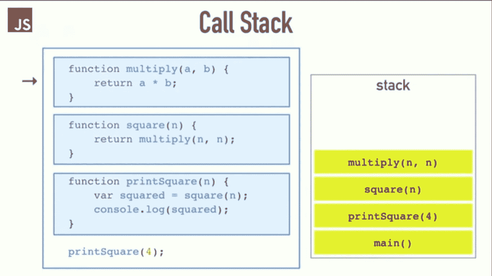

# JavaScript:调用堆栈解释

> 原文：<https://javascript.plainenglish.io/node-call-stack-explained-fd9df1c49d2e?source=collection_archive---------0----------------------->


Credits: [JS Conference](https://2014.jsconf.eu/)

大约一年前，正如我的投资组合所说，我是一名高级 JavaScript 开发人员。但是在孤独的时候，当我问自己 JavaScript 是如何工作的或者什么是 JavaScript。我不完全确定。我听说 V8 是一个术语，Chrome 的运行时并不知道它是什么意思，当我问其他开发者朋友时，他们用单线程、回调等词给出了定义。当我问谷歌同样的问题时，它说，“ ***JavaScript 是单线程非阻塞异步并发语言*** [😞](https://emojipedia.org/disappointed-face/)”。什么？这些大词把我弄糊涂了，所以我又搜索了一些，然后它说" ***JavaScript 有一个调用栈，一个事件循环，一个回调队列，和一些其他的 API 东西*** 😞".读完这些东西后，我把“ **Senior** ”从我的个人资料中删除，成为一名 JavaScript 开发者😞。经过一年的学习和研究，我想我现在明白了这一点，我想与你分享。由于我们狭隘的思想无法在一篇文章中涵盖所有内容，我们将分部分讨论这一点。在这一部分，我将解释“调用堆栈”关键字。

# 什么是调用栈？

调用堆栈是一种后进先出(LIFO)数据结构，包含执行将恢复的地址，通常还包含每个调用的局部变量和参数。让我们通过一个简单的例子来理解调用栈。


Credits: [JS Conference](https://2014.jsconf.eu/)

当我们进入一个函数时，我们把一些东西放到栈中，如果我们从一个函数返回，我们弹出栈顶，这是栈所能做的。让我们一行一行地运行这段代码，检查它到底是如何工作的。

**第一步**

如果你运行这个文件，有一个主函数，就像文件本身一样，所以，我们把它推到堆栈上。然后我们有一些函数定义，它们不会马上执行，最后，我们有打印方块，对，所以打印方块是一个函数调用，所以我们把" *printSquare* "推到堆栈上。


Credits: [JS Conference](https://2014.jsconf.eu/)

**第二步**

将“ *printSquare* ”放入堆栈后，它调用了“ *square* 函数，所以我们将正方形放入堆栈。


Credits: [JS Conference](https://2014.jsconf.eu/)

**第三步**

再次“*平方*”函数调用“*乘*”，所以我们把那个也放入堆栈。我们没有从堆栈中弹出任何东西，因为到目前为止没有返回任何东西，一个函数调用另一个函数作为返回语句，堆栈被填满。



Credits: [JS Conference](https://2014.jsconf.eu/)

**第四步**

在所有这些函数调用之后，现在我们得到一个返回语句。

```
return a * b;
```

所以我们弹出堆栈，从堆栈中移除“*乘*”。


Credits: [JS Conference](https://2014.jsconf.eu/)

**第五步**

现在我们从" *square* "函数中得到 return 语句的结果。所以我们也把它从堆栈中删除。


Credits: [JS Conference](https://2014.jsconf.eu/)

**第六步**

现在，在成功执行了" *square* "函数之后，我们有一个要执行的语句。

```
console.log(squared);
```

它打印分配给变量“*平方*”的“*平方*”函数的结果。现在我们的筹码是这样的。


Credits: [JS Conference](https://2014.jsconf.eu/)

**第 7 步**

在执行完这个" *console.log* 之后，它也会从堆栈中弹出，只剩下"*print square(4)*"&"*main()*"函数:(。


Credits: [JS Conference](https://2014.jsconf.eu/)

**第 7 步**

现在终于在完成程序的所有仪式和步骤后" *printSquare(4)* "将从堆栈中弹出，然后是" *main()* "函数。现在我们的堆栈又是空的和孤独的。


Credits: [JS Conference](https://2014.jsconf.eu/)

# 什么是堆栈跟踪？

你曾经试图理解浏览器控制台中显示的错误日志吗？有时我们仅仅通过阅读第一行就忽略了，但是如果我们仔细观察，它们非常有助于判断错误来自哪里以及错误的后果是什么。让我们看看这个例子。


Credits: [JS Conference](https://2014.jsconf.eu/)

这里 baz()在调用一个函数 bar()，bar()在调用一个函数 foo() &我们亲爱的 foo()抛出错误。现在，如果我们查看浏览器的日志，它会给我们一个很好的错误跟踪，以及它是如何产生的。这就是我们所说的“**栈迹**”。

**什么是堆栈溢出？**

不，我们不是在谈论著名的 stackoverflow.com 网站，而是一个通常用于 v8 引擎和 JavaScript 的术语。了解堆栈溢出发生的时间和原因。请看下一张图片。


Credits: [JS Conference](https://2014.jsconf.eu/)

这里我们调用 foo()函数，它再次调用 foo()函数。让我们看看我们的堆栈会发生什么情况。


Credits: [JS Conference](https://2014.jsconf.eu/)

一段时间后，我们的 Chrome 显示“我们不希望你调用同一个函数 16K 次，所以我们对你很失望，这就是为什么我给出一个错误”。


Credits: [JS Conference](https://2014.jsconf.eu/)

所以这就是如何调用 stack works。在接下来的文章中，我们将讨论事件循环、回调队列、V8 引擎的工作以及 NodeJS 如何在 V8 引擎上工作。

**更新** 下面是该系列的另外两篇文章，可以更好地理解 JavaScript。

[](https://medium.com/javascript-in-plain-english/js-single-thread-non-blocking-explained-d5de012a33cf) [## JavaScript 中的单线程和非阻塞是什么意思？

### 一次性理解 JavaScript 可能会很困难，也很忙乱。我读了很多教程，但没有得到…

medium.com](https://medium.com/javascript-in-plain-english/js-single-thread-non-blocking-explained-d5de012a33cf) [](https://medium.com/javascript-in-plain-english/javascript-event-loop-explained-dd9520a58544) [## JavaScript 事件循环解释

### 通过实例对事件循环进行简单解释，以便更好地理解。

medium.com](https://medium.com/javascript-in-plain-english/javascript-event-loop-explained-dd9520a58544) 

**感谢阅读||写学习。**

