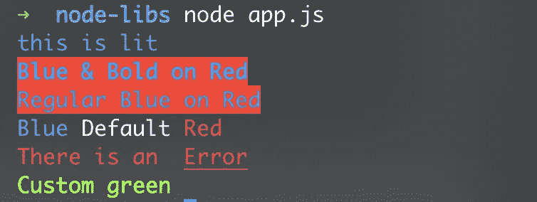
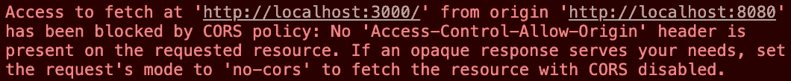

# Node.js: 4 个最流行和最有用的库

> 原文：<https://javascript.plainenglish.io/node-js-4-of-the-most-popular-and-useful-libraries-cbf9fa758432?source=collection_archive---------1----------------------->

## 让我们看看 Node.js 下载量最大的 4 个包，分别是 Chalk、Chokirdar、CORS 和 mkdirp


根据下载量，我查看了 NPM 最受欢迎的 Node.js 软件包。我找到了一些我觉得非常方便的。他们在这里，玩得开心:)

# 1.粉笔——使终端输出的着色和样式化变得简单

在输出出现的错误时，系统数据或者函数的输出— **console.log** 对于每一个开发者来说都有着不可或缺的价值。

唯一的问题是它会很快变得混乱，因为默认情况下终端输出是单调的。

粉笔改变了这一点，你保留了概览。

只要像往常一样用 **npm 安装粉笔**安装它，你就可以开始了。

这是一个代码示例，下面是它在我的终端中的真实样子。

```
const chalk = require(‘chalk’)*// simply blue font* console.log(chalk.blue(‘this is is blue text’))*// blue & bold font, red background (bg = background)* console.log(chalk.blue.bgRed.bold(‘Blue & Bold on Red’))*// blue font, red background* console.log(chalk.blue.bgRed(‘Regular Blue on Red Background’))*// combining multiple font colors* console.log(chalk.blue(‘Blue’) + ‘ Default’ + chalk.red(‘Red’))*// Underlining text* console.log(chalk.red(‘There is an ‘, chalk.underline(‘Error’)))*// Using RGB-colors* console.log(chalk.rgb(127, 255, 0).bold(‘Custom green’))
```

它认为这段代码没什么好解释的。如果有，就留言评论:)

**上面代码的输出:**



# 2.乔基达尔

每个使用过**文件系统** (fs)的人可能都知道 **fs.watchFile / fs.watch** 函数。
顾名思义，它用于检测文件系统中的变化，例如文件的创建、删除或修改。在一些 Node.js 应用程序中，这是必要的，例如处理用户文件的 CMS。但是有一个问题:内置模块 **fs** 中的 **fs.watch / fs.watchFile** 函数并不能很好地工作。
Z. E.g. fs.watch 简单的把大部分事件叫做“**rename**”&也不是 100%确定能检测到某些编辑的所有改动。
(两个标准功能的其他弱点可以直接在 Chokidar 的 NPM 页面上找到)

一个补救方法是 Chokidar，这是 NPM 的官方网站

Chokidar 的工作是以 **fs.watch** 和 **fs.watchFile** 为基础，但它自己还是会做一些研究。因此，Chokidar 甚至用于 Visual Studio 代码和 Node.js 的 PM2 中。这足以让我们看一看。

让我们开始监视当前文件夹中的所有结果。：

```
 const chokidar = require(‘chokidar’)chokidar.watch(‘.’).on(‘all’, (event, path) => {
  console.log(event, path)
})
```

**事件**输出是哪种变化，**路径**，发生的位置。

因为 chokidar 也很擅长目录，这里有几个例子:

*   我们创建一个新目录“newFolder”。我们的代码将打印如下内容:

```
addDir newFolder
```

*   在这个新的目录中，我们创建了一个文件“FileInFolder.txt”:

```
add newFolder/FileInFolder.txt
```

*   在新目录中，我们创建另一个新目录“folderInFolder”:

```
addDir newFolder/folderInFolder
```

*   让我们更改单个文件中的一些内容，并保存更改:

```
change newFolder/FileInFolder.txt
```

*   因为我们现在在包装目录“newFolder”中有一个不同的目录和一个文件，所以让我们删除它:

```
unlink newFolder/FileInFolder.txt
unlinkDir newFolder/folderInFolder
unlinkDir newFolder
```

正如您所看到的，chokidar 完美地注册了我们在文件系统上完成的所有操作——正如我们所期望的那样。

# 3.CORS —支持跨原产地申请

那么什么是 CORS 呢？CORS 主张跨产地资源共享。
这意味着我们允许我们的客户，通常是用户使用我们网站的网络浏览器，提出**跨来源请求。**
但这样的要求是什么？
跨源请求是从服务器 A 上的网站到可能位于另一个域中的第二个服务器 B 的直接内部访问。

让我们用一个例子来实践这一点:我们让我们的 Express 服务器运行在端口 **8080** 上，它提供一个向我们的 API 发送请求的网页，API 是一个运行在端口 3000 上的 Express 服务器。

这是我们的主服务器，为网站服务:

**这是我们的 API 服务器，对每个 API 调用都返回一个响应:**

因此，如果我们在 localhost:8080 打开我们的网站，它在后台向我们在 localhost:3000 的 API 发送请求，我们会在控制台中得到一条错误消息。无法执行该请求，因为它是一个 COR，默认情况下被阻止:



但是有一个简单的 CORS 中间件解决方案，我们可以在 NPM 找到。

在我们的 API 服务器中，我们只需集成中间件并对其进行设置，一切都应该按预期运行:

```
const cors = require(‘cors’)let user = { name: ‘Max’, age: 21 }app.use(cors())  // just use it as middleware app.get(‘/’, (req, res) => {
  res.json(user)
})
```

如果您现在再次运行 API 服务器并重新加载页面，这次请求应该会通过。

# 4.mkdirp——与 mkdir -p 一样，但用于 Node.js

稍微偏离一下终端命令。如果我们想创建一个新的文件夹，我们可以简单地通过**mkdir****<directory-name>**来完成。

但是，如果我们想一次创建两个或更多的文件夹，它们也是一个在另一个下面，该怎么办呢？
不幸的是，这与**mkdir enclosing_directory/inner _ directoy**不兼容，所以我们会有目录“enclosing _ directory”，并且在这个目录中有“inner_directory”。我们需要首先创建顶级目录，然后我们可以在其中创建另一个目录。

当然，这对于多重嵌套来说尤其令人讨厌。但是当然有补救的办法。使用 mkdir -p，我们可以同时创建任意多的目录，按照我们想要的结构。所有尚不存在的目录都是自动创建的。

在 Node.js 中，现在有两种主要的方法来使用这个命令以这种方式创建目录
或者我们直接通过 Node.js 执行一个终端命令，正如你在这里可以找到的:

[](https://medium.com/javascript-in-plain-english/3-pretty-cool-built-in-node-js-modules-c2c3283276e6) [## 3 个非常酷的内置 Node.js 模块

### 让我们使用 Node.js 读取用户输入，执行终端命令并运行一个 JS 虚拟机！

medium.com](https://medium.com/javascript-in-plain-english/3-pretty-cool-built-in-node-js-modules-c2c3283276e6) 

或者我们可以使用专门为此目的而创建的库。在我们的例子中，可能是更优雅的解决方案:NPM 上的 mkdirp

```
const mkdirp = require(‘mkdirp’)mkdirp(‘./assets/pictures’).then((made) => {
  *if* (made == undefined) {
    console.log(‘already exists’)
  } *else* {
    console.log(`made directories, starting with ${made}`)
  }
})
```

整个事情相对简单:在这个例子中，我们在与节点应用程序相同的目录中创建了两个新文件夹。
在“资产”目录里面的“图片”目录。
如果**造**是**未定义**，则它们已经存在。

## **用简单英语写的 JavaScript 笔记**

我们已经推出了三种新的出版物！请关注我们的新出版物，表达对它们的爱:[](https://medium.com/ai-in-plain-english)**[**UX**](https://medium.com/ux-in-plain-english)[**Python**](https://medium.com/python-in-plain-english)**——谢谢，继续学习！****

****我们也一直有兴趣帮助推广高质量的内容。如果您有一篇文章想要提交给我们的任何出版物，请发送电子邮件至[**submissions @ plain English . io**](mailto:submissions@plainenglish.io)**，并附上您的 Medium 用户名，我们会将您添加为作者。另外，请让我们知道您想加入哪个/哪些出版物。******