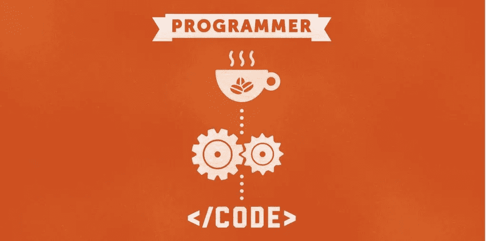
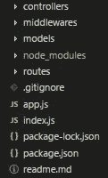
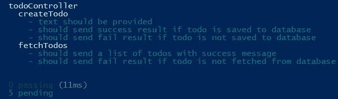
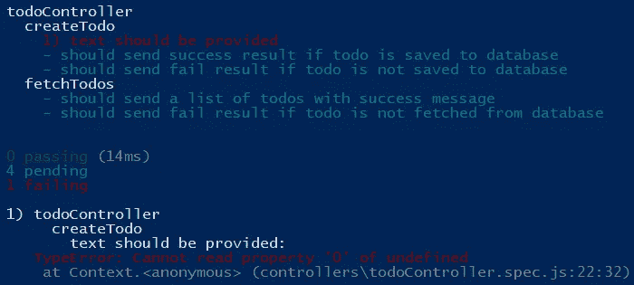
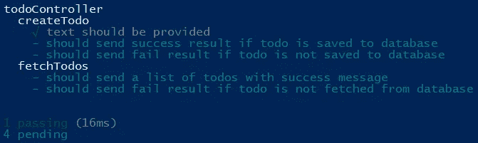

# 测试驱动开发— Node.js API

> 原文：<https://javascript.plainenglish.io/node-js-api-test-driven-development-a8955435581e?source=collection_archive---------1----------------------->

> “测试驱动开发(TDD)是在编程过程中管理恐惧的一种方式”——Kent Beck



# 介绍

TDD 代表测试驱动开发，是构建软件应用程序的一种方式。这种方法增加了流程的复杂性。开发人员必须编写额外的代码——测试用例。TDD 确保这段代码在发布前完成了要求的任务。它确保代码可以随着业务需求的变化而容易地改变。这个过程包括三个主要步骤:编写失败的测试、编写满足测试的代码和重构。

## 开始前

*   应用程序代码应该满足一定的标准，然后才能进行测试。
*   该应用程序使用 MVC 架构。
*   本教程只关注测试控制器[业务逻辑]。

## 设置环境

```
mkdir todo-api
npm init -y
```

## 安装依赖项

依赖关系:

```
npm i -S express body-parser mysql2 sequelize morgannpm i -D chai mocha nodemon sinon
```

# 文件结构

典型 Node.js MVC 应用程序的文件结构如下所示:



Node.js API File Structure

*控制器的测试文件驻留在 controllers 文件夹中，前缀为* ***.spec.js*** *。这只是一个* ***个人喜好*** *。*

## 测试命令

测试命令在 **package.json** 文件中，如下所示:

```
“test”: “mocha controllers/*.spec.js”
```

# 写作失败测试

TDD 的第一步是编写失败的测试。需求被收集起来，并为它们编写测试用例。在编写测试用例之前，需求应该是清晰的。

## 需求文件

Todo 是简单的文本，通知一项工作要做。待办事项应用程序允许用户**创建待办事项**并**列出所有待办事项**。

根据要求，应该有两个 API—**创建待办事项**和**列表待办事项**。

## 测试案例

以下是测试案例列表:

现在，如果运行命令 **npm test** ，mocha 会显示以下信息。有五个测试没有通过或失败。



*   进口**柴、兴农**和**至控制器**。
*   每次测试后，根据[文件](https://sinonjs.org/releases/v7.2.3/general-setup/)恢复 **sinon** 。
*   每次测试前，使用**假**或**假**宣布**请求**、**结果**和**下一个**。它们需要作为参数发送给控制器。

还没有做任何事情。因此，第一种情况下的第一个测试如下所示:“应提供**文本**”。该测试检查请求体中是否没有提供文本，它应该产生一个错误并将控制传递给下一个**中间件**(更多细节请参见 [app.js](https://github.com/bewarusman/tdd-nodejs-api/blob/master/app.js) 中处理错误的代码)。

传递给测试的回调函数是 **async** ，因为在 **createTodo** 内部有调用承诺(异步代码)。现在，让我们运行测试，看看结果:



First failing test

# 编写满足测试的代码

**todo** 控制器内的函数 **createTodo** 应该满足测试。控制器函数检查是否没有提供文本，它将控制传递给下一个中间件，并传递一个错误。

现在测试通过了:



# 重构

有很多关于重构的讨论和演讲。在这一步中，开发人员重构代码。结对编程也可以使用。

# 重复

对每个测试用例重复这些步骤。

# 结论

测试驱动开发使程序员的生活变得更容易，但是需要付出额外的努力。

感谢您的评论和反馈。

存储库可以在这里被克隆[。](https://github.com/bewarusman/tdd-nodejs-api)