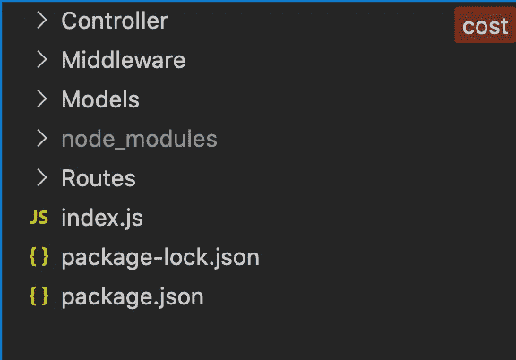
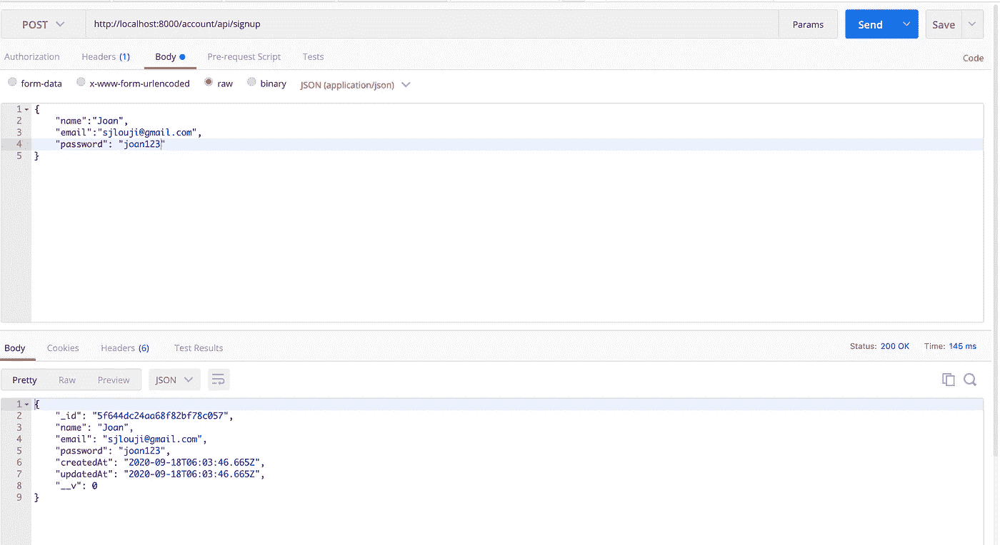
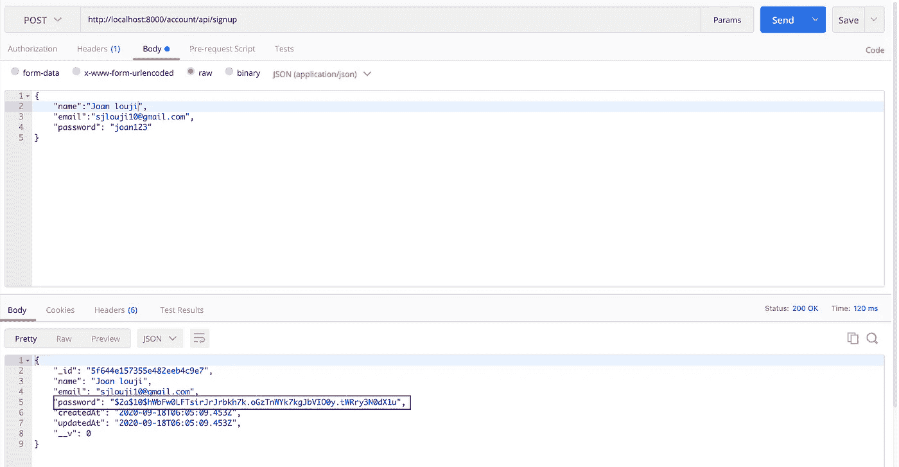
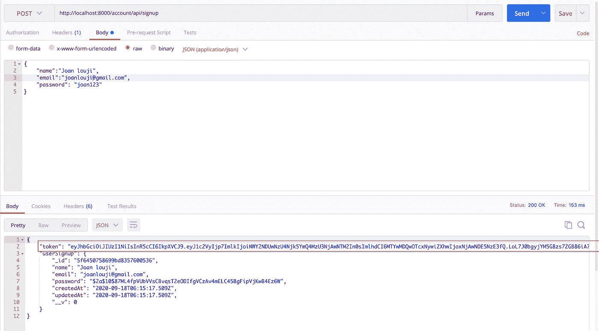
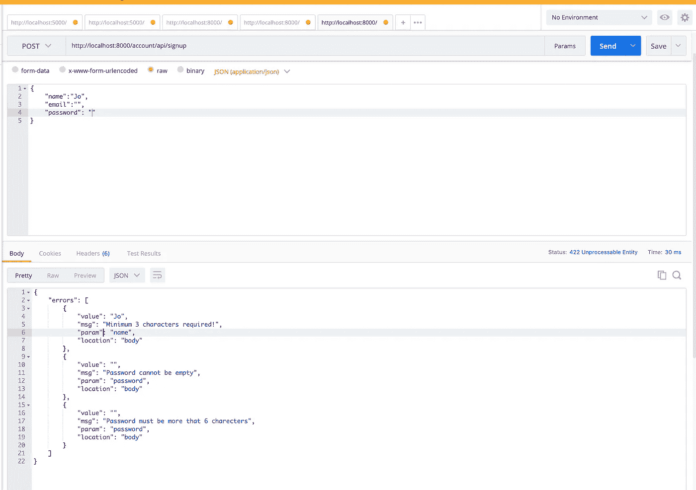

# 如何用 JWT 处理 Node.js 中的用户注册

> 原文：<https://javascript.plainenglish.io/node-js-api-user-registration-with-jwt-b6b74fe599e9?source=collection_archive---------1----------------------->


Cover Image

JWT 是在双方之间安全传输数据的开放标准。它与身份验证系统一起使用，以发出经过身份验证的请求。它包括`header`、`payload`和`signature`。JWT 是一种无状态认证机制，即它在客户端维护会话，而不是将其存储在服务器中。

JWT 的工作流程非常简单。JWT 是用一个秘密密钥创建的，这个秘密密钥将被秘密保存在你的应用程序中。当您的应用程序从任何客户端接收到 JWT 密钥时，您的应用程序会用私钥验证该密钥。从客户端修改公钥将导致身份验证失败。JWT 由用点分隔的三个不同部分组成。最初的部分是标题。第二部分是有效载荷，第三部分是签名。JWT 令牌的语法是

```
HEADER + '.' + PAYLOAD + '.' + SIGNATURE
```

[](https://jwt.io/) [## JWT。超正析象管(Image Orthicon)

### JSON Web Token (JWT)是一种简洁的、URL 安全的方式，用于表示要在双方之间传输的声明。的…

jwt.io](https://jwt.io/) 

## **使用 JWT 的优势**

1.  JWT 确保了饼干和会话。
2.  他们帮助我们使用第三方认证服务。甚至帮助创建自己的认证服务，如谷歌，脸书。(单点登录)
3.  验证 JWT 令牌很容易。
4.  提供无状态身份验证。

## **目录**

1.  [创建节点 JS 项目](#20ff)
2.  [用户注册](#22f5)
3.  [哈希密码](#0cf6)
4.  [注册后生成 JWT 令牌](#3c0a)
5.  [模式验证](#12fa)

## **1。创建一个 Node.js 项目**

让我们从创建一个新的 Node js 项目开始。创建一个名为 nodeJWT 的新文件夹，并用命令`npm init -y`初始化它。

初始化后，安装本演示所需的所有软件包。

```
mkdir nodeJWT
cd nodeJWT
npm init -ynpm install nodemon express express-validator body-parser bcryptjs jsonwebtoken mongoosetouch index.js
```

现在让我们使用 Express 创建我们的服务器。创建`index.js`文件后，添加这段代码。

`index.js`

```
const express = require('express')
const bodyparser = require('body-parser');
const mongoose = require('mongoose')
var app = express()//**Routes**
app.use(bodyparser.json())
app.get('/', function(req,res){
  res.send('Hello world')
})**//MongoDb connection** mongoose.connect('mongodb://localhost/test', {useNewUrlParser: true});
mongoose.connection.once('open',function(){
  console.log('Database connected Successfully');
}).on('error',function(err){
  console.log('Error', err);
})//**Server** 
app.listen('8000',function(req,res){
  console.log('Serve is up and running at the port 8000')
})
```

在上面的代码中，我们做了三件事。首先，我们创建了一个运行在端口 8000 上的服务器。接下来，我们使用 mongoose 实例将 node js 项目与 MongoDb 连接起来。最后，我们创建了一条简单的路线。

在输入`nodemon index.js`时，你应该看到浏览器上显示 hello world。

现在我在根目录下创建四个名为`Controller, Middleware, Models, Routes`的文件夹。确保您的项目结构如下所示。



Project Structure

在 Models 文件夹中创建一个名为`user.mode.js`的新文件。下面的代码使用 mongoose 实例创建了一个用户模式。用户模式由三个实体组成(名称、电子邮件和密码)。

`Models/user.model.js`

```
const mongoose = require('mongoose')const userSchema = new mongoose.Schema(**{
  name: {
    type: String,
    required: true,
    max: 200,
  },** **email: {
    type: String,
    required: true,
    unique: true,
  },** **password: {
    type: String,
    required: true,
    min: 5
  },
},{timestamps: true}**
)module.exports = mongoose.model('User',userSchema)
```

## 2.**用户注册**

现在让我们开始创建注册 API。为此，我在 Routes 文件夹中创建了一个名为`auth.route.js`的新文件，其中保存了所有用于认证的路由。

`Routes/auth.route.js`

```
const router = require('express').Router()
const signup = require('../Controller/auth.controller')**router.post('/signup',signup.signup)**module.exports = router
```

创建一个名为`signup`的新函数，接收来自客户端的请求和响应。现在用所有需要的参数创建一个用户对象。创建后，只需使用关键字`save`将用户文档插入数据库。

`Controller/auth.controller.js`

```
const User = require('../Models/user.model')**async function signup(req,res,next) {
  const user =  new User({
    name: req.body.name,
    email: req.body.email,
    password: req.body.password
  })
  try{
    const userSignup = await user.save()
    res.send(userSignup)
  }catch(err){
    res.send(400).send(err) 
  }
}**module.exports = {
  signup,
}
```

最后，在`index.js`文件中包含授权路径。

`index.js`

```
const router = require('./Routes/auth.route')//**Router**
app.use('/account/api',router)
```

使用所需的参数向[http://localhost:8000/account/API/sign up](http://localhost:8000/account/api/signup)发出 post 请求。数据将被插入到 MongoDB 中。



User Registrations

## 3.**哈希密码**

散列密码是注册用户时要做的最重要的部分，因为如果密码没有散列，任何人都可以查看您的密码。哈希密码不会消耗很多时间。

为了在 Node js 中散列密码，我们使用了一个叫做 Bycrypt JS 的包，它是开源的，并且易于使用。

`Controller/auth.controller.js`

```
const User = require('../Models/user.model')
**const bycrypt = require('bcryptjs')**async function signup(req,res,next) { **const salt = await bycrypt.genSalt(10);
  hashpassword = await bycrypt.hash(req.body.password, salt)**const user =  new User({
    name: req.body.name,
    email: req.body.email,
    password: **hashpassword**
  })
  try{
    const userSignup = await user.save()
    res.send(userSignup)
  }catch(err){
    res.send(400).send(err) 
  }
}module.exports = {
  signup,
}
```

现在用所需的参数向[http://localhost:8000/account/API/sign up](http://localhost:8000/account/api/signup)发出 post 请求。这一次，您将看到密码字段已经被散列，普通用户永远无法读取。



Hashing Password

## 4.**注册后生成 JWT 令牌**

在这一节中，让我们看看如何生成 JWT 令牌。生成一个 JWT 令牌是如此简单。只需将有效载荷和一些参数传递给`jwt.sign`函数，就可以获得一个新的 JWT 令牌。

`Controller/aut.controller.js`

```
**const jwt = require("jsonwebtoken");**async function signup(req,res,next) { **const emailExist = await User.findOne({email: req.body.email})
  if(emailExist){
     res.status(400).json({"error":'Email already Exist'}) 
  }** const salt = await bycrypt.genSalt(10);
  hashpassword = await bycrypt.hash(req.body.password, salt)
  const user =  new User({
    name: req.body.name,
    email: req.body.email,
    password: hashpassword
  })
  try{
    const userSignup = await user.save()
 **const payload = {
      user: {
        id: userSignup.id
      }
    };
    jwt.sign(payload,"anystring",{expiresIn: 10000},function(err, token)
    {
      if(err){
        res.send(err)
      }
      res.status(200).json({
        token,
        userSignup
      })
    })**
  } 
  catch(err){
    res.status(400).json({'error':err})
  }
}
```

使用所需的参数向[http://localhost:8000/account/API/sign up](http://localhost:8000/account/api/signup)发出 post 请求。这一次，您可以看到一个名为 token 的新字段正在生成。这个令牌帮助我们向服务器发出经过身份验证的请求。



Generating JWT token

## 5.**模式验证**

验证是任何 API 的重要组成部分，因为它让用户知道发送的请求中是否有错误。

为了验证请求，这里我们使用了`express-validators`。在文件夹中间件中创建一个名为`validation.js`的新文件，并将下面的代码添加到其中。

`Middleware/validation.js`

```
const {check, validationResult} = require('express-validator');exports.validateUser = [
 **check('name')
    .trim()
    .escape()
    .not()
    .isEmpty()
    .withMessage('User name can not be empty!')
    .bail()
    .isLength({min: 3})
    .withMessage('Minimum 3 characters required!')
    .bail(),** **check('email')
    .trim()
    .normalizeEmail()
    .not()
    .isEmpty()
    .withMessage('Invalid email address!')
    .bail(),** **check('password')
    .not()
    .isEmpty()
    .withMessage('Password cannot be empty')
    .isLength({min: 6})
    .withMessage('Password must be more that 6 charecters'),** (req, res, next) => {
    const errors = validationResult(req);
    if (!errors.isEmpty())
      return res.status(422).json({errors: errors.array()});
    next();
  },
];
```

将上述中间件导入到路由器文件中，调用`signup`路由中的中间件。

`Route/auth.route.js`

```
const {validateUser} = require('../Middleware/validation');router.post('/signup',**validateUser**,signup.signup)
```

这将自动验证我们的请求并返回错误。



Validation

请访问我之前的博客，在那里我解释了如何用 Node JS 执行 CRUD。

在下一篇博客中，我们将讨论 JWT 令牌的登录功能。保持联系。

如有任何疑问，请随时联系我。电子邮件:sjlouji10@gmail.com。领英:[https://www.linkedin.com/in/sjlouji/](https://www.linkedin.com/in/sjlouji/)

我的 GitHub 上的完整代码:

[](https://github.com/sjlouji/Node-js-JWT-auth---Medium) [## sjlouji/Node-js-JWT-授权-介质

### 在 GitHub 上创建一个帐户，为 sjlouji/Node-js-JWT-auth-Medium 开发做贡献。

github.com](https://github.com/sjlouji/Node-js-JWT-auth---Medium) 

编码快乐！