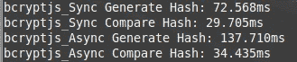
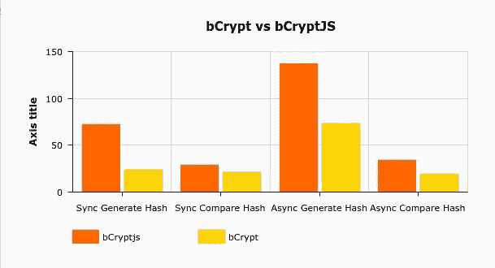

# Bcrypt 与 BcryptJS 的 Node.js 基准测试

> 原文：<https://javascript.plainenglish.io/node-js-bcrypt-vs-bcryptjs-benchmark-69a9e8254cc2?source=collection_archive---------1----------------------->


Photo by [Marc Sendra Martorell](https://unsplash.com/@marcsm?utm_source=medium&utm_medium=referral) on [Unsplash](https://unsplash.com?utm_source=medium&utm_medium=referral)

# 1.介绍

[**Bcrypt**](https://en.wikipedia.org/wiki/Bcrypt) 是最流行、最安全的单向密码散列函数之一。

对于 **Node.js** 应用程序，我们有两个选项 **bcrypt** 和 **bcryptjs。**

> **bcrypt** 用 **C++** 编写，在 [**npm**](https://www.npmjs.com/package/bcrypt) 每周下载超过 40 万次，在 [**github**](http://github.com/kelektiv/node.bcrypt.js) **有 5.1k 颗星。**
> 
> **bcryptJS** 用 **Javascript** 编写，在 [**npm**](https://www.npmjs.com/package/bcryptjs) 每周下载量超过 56 万，在 [**github**](https://www.npmjs.com/package/bcryptjs) **有 2.3k 颗星。**

我们将尝试在以下位置对这两个库进行基准测试:

*   同步生成哈希密码
*   异步比较哈希密码
*   同步生成哈希密码
*   异步比较哈希密码

> 所有测试均在 [**数字海洋**](https://www.digitalocean.com) 标准液滴下进行:
> 
> **1vCPU** 和 **1GB 内存**

# 2.生成和比较哈希密码

生成和比较密码的推荐方法是使用异步函数，但是在这个基准测试中，我们将同时测试异步和同步方法。

```
mkdir bcryptBench
cd bcryptBench
npm init -y
npm i bcrypt bcryptjs
```

我们将测试 bcrypt lib，创建一个新文件 index.js 并粘贴以下代码

```
const bcrypt = require('bcrypt');const saltRounds = 8;const myPlaintextPassword = 'Mystr0ngP@SSW0RD';var hashAsync;var hashSync;console.time('bcrypt_Async Generate Hash');bcrypt.hash(myPlaintextPassword, saltRounds).then(function (hash) {hashAsync = hash;console.timeEnd('bcrypt_Async Generate Hash');console.time('bcrypt_Async Compare Hash');bcrypt.compare(myPlaintextPassword, hashAsync).then(function (result) {console.timeEnd('bcrypt_Async Compare Hash');});});console.time('bcrypt_Sync Generate Hash');hashSync = bcrypt.hashSync(myPlaintextPassword, saltRounds);console.timeEnd('bcrypt_Sync Generate Hash')console.time('bcrypt_Sync Compare Hash');bcrypt.compareSync(myPlaintextPassword, hashSync);console.timeEnd('bcrypt_Sync Compare Hash');
```

运行代码

```
node index.js
```


Example output for bcrypt

我们将测试 bcryptjs 库，创建一个新文件 index2.js 并粘贴以下代码

```
var bcryptjs = require('bcryptjs');const saltRounds = 8;const myPlaintextPassword = 'Mystr0ngP@SSW0RD';var hashAsync;var hashSync;console.time('bcryptjs_Async Generate Hash');bcryptjs.hash(myPlaintextPassword, saltRounds).then(function (hash) {hashAsync = hash;console.timeEnd('bcryptjs_Async Generate Hash')console.time('bcryptjs_Async Compare Hash');bcryptjs.compare(myPlaintextPassword, hashAsync).then(function (result) {console.timeEnd('bcryptjs_Async Compare Hash');});});console.time('bcryptjs_Sync Generate Hash');hashSync = bcryptjs.hashSync(myPlaintextPassword, saltRounds);console.timeEnd('bcryptjs_Sync Generate Hash')console.time('bcryptjs_Sync Compare Hash');bcryptjs.compareSync(myPlaintextPassword, hashSync);console.timeEnd('bcryptjs_Sync Compare Hash');
```

运行代码

```
node index2.js
```



Example output for bcryptjs

# 3.数字

上面测试结果的条形图。时间越短，性能越好



bcrypt vs bcryptjs bar chart

# 异步函数

> **Bcrypt** 生成哈希密码比 **bcryptjs** 快 **1.8 倍**比**快**1.8 倍。

# 同步功能

> **Bcrypt** 生成哈希密码比 **bcryptjs** 快 **3.1 倍** **倍**比**快**1.3 倍。

# 3.结论

Bcrypt 比 bcryptjs 快得多，尽管用户在 npm 上更喜欢 bcryptjs。这两个库都很优秀，很容易实现它们的目的。

# 参考

*   [bcrypt](https://www.npmjs.com/package/bcrypt)
*   [bcryptjs](https://www.npmjs.com/package/bcryptjs)
*   [数字海洋](https://www.digitalocean.com)
*   [amcharts](http://www.amcharts.com)

# 感谢你阅读我的故事

请随时评论我的任何想法，变化等。

[](https://medium.com/swlh/master-ejs-template-engine-with-node-js-and-expressjs-979cc22b69be) [## 具有 Node.js 和 Expressjs 的主 EJS 模板引擎

### EJS 是 node.js 和 expressjs 最受欢迎的模板视图引擎之一，在 GitHub 上有 4.2k 星级，超过 550 万…

medium.com](https://medium.com/swlh/master-ejs-template-engine-with-node-js-and-expressjs-979cc22b69be) [](https://medium.com/@pkoulianos/how-to-schedule-cron-jobs-and-set-health-checks-in-node-js-93cf88d2c247) [## 如何在 Node.js 中调度 Cron 作业和设置健康检查

### 使用 node.js 中的 Cron 作业自动化您的任务

medium.com](https://medium.com/@pkoulianos/how-to-schedule-cron-jobs-and-set-health-checks-in-node-js-93cf88d2c247)