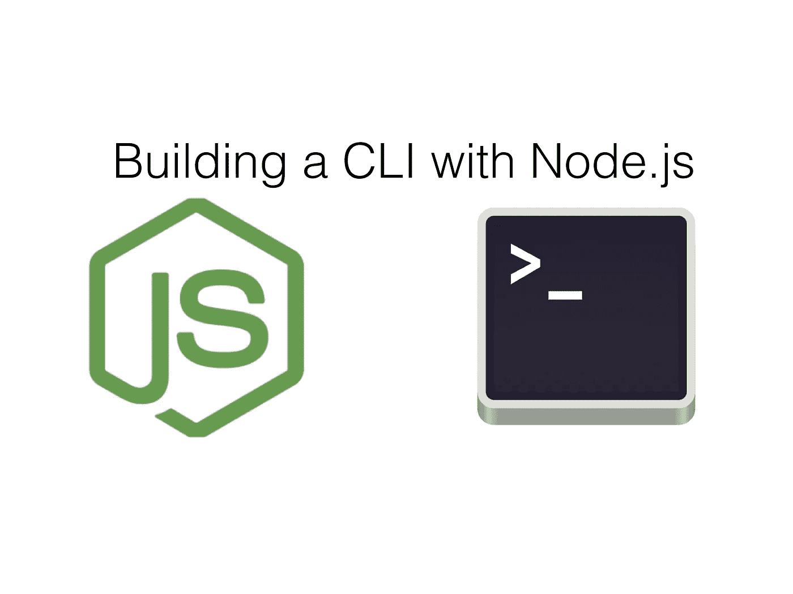
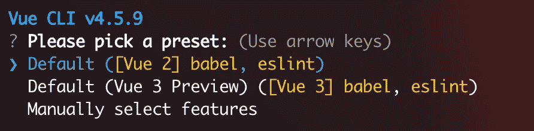
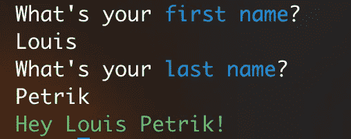
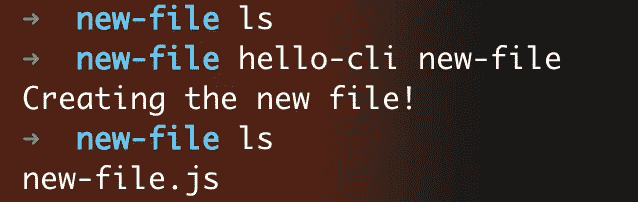

# 使用 Node.js 构建 CLI

> 原文：<https://javascript.plainenglish.io/node-js-cli-cef1e080b8a9?source=collection_archive---------3----------------------->

## 您自己的命令行界面只需 5 分钟



Source: the author

我们都知道**CLI**，所谓的命令行界面。

它们是我们可以在终端中调用的小程序。几乎我们用 npm install -g 安装的所有东西都是 CLI。

但是您知道吗，有了 Node.js，我们可以非常轻松地编写 CLI 程序。例如，我们不需要太多，因为有了它，我们可以实现流程自动化。

在本教程中，我将向您展示如何实现在所有系统上运行的 Node.js CLI。我们的目标是最终我们只需要在终端的某个地方用命令调用我们的 CLI。

我们走吧！

首先，为项目创建一个目录。我把这个项目文件夹叫做 *hello-cl* i。

进入您刚刚创建的目录。然后照常做，初始化一个 Node.js 项目的时候:`npm init -y`。我们还不需要安装任何东西。

创建一个 index.js，在那里我们存储了 Node.js CLI 的所有代码。
在文件中，我们现在只写这一行:`console.log("Our CLI-tool!")`。

现在，当我们在文件夹中执行 index.js 时，我们会在控制台上看到输出。为了能够在任何地方只用一个命令执行我们的代码，我们必须改变两件事。

在我们的 index.js 中，我们需要在顶部添加一行。
我们的 index.js 现在看起来像这样:

```
*#!/usr/bin/env node*console.log(‘Our CLI-tool!’)
```

这条线通常被称为 shebang。尽管它是来自 UNIX 世界的一个表达式，但是我们的节点命令行界面也可以在 Windows 上工作。

在我们项目的 package.json 中，我们必须添加一些内容:

```
"bin": "./index.js",
```

完成的 package.json 应该是这样的，例如:

**重要提示:**项目的名称(在 package.json 中表示为‘name ’)决定了全局 shell 命令的名称。

现在我们已经定制了 package.json 和 index.js。我们只需运行`npm link`就可以做到这一点。

一旦在目录中运行这个命令，就可以使用`hello-cli`从任何地方执行 index.js。

# 获取用户输入

到目前为止，我们的 Node.js 命令行工具可以输出任何内容。但是现有的大多数真正实用的 CLI 可以做得更多。

一件非常重要的事情是读入用户输入。同样，对于这一点，我们可以使用我们通常在 Node.js 中使用的解决方案。

多亏了 Node.js 中默认可用的 [**readline**](https://medium.com/javascript-in-plain-english/3-pretty-cool-built-in-node-js-modules-c2c3283276e6#92d6) 模块，我们可以在终端中请求用户输入并对其做出反应。

只有当第一个问题被回答后，才会问第二个问题。嵌套 readline-functions 不是最优雅的解决方案。但是对于我们的目的来说，这是可以的。

index.js 现在看起来像这样:

执行时，我们的 CLI 如下所示:


Source: the author

一旦保存了 index.js 的更改，就可以在终端的某个地方再次键入`hello-cli` 。

您不需要再次运行`npm link`,因为它作为参考工作。因此，如果我们运行了 link 命令，那么每次运行 CLI 时，它都会运行我们目录中的代码。

我们对代码库所做的任何更改都会立即生效。

# 让我们把它变得丰富多彩

到目前为止，我们已经可以在自己的 CLI 中读取用户输入。这很好，但还可以更花哨一点。
特别是对于更复杂的 CLI，将我们打印到终端的内容着色会非常方便。以下是 Vue.js CLI 的一个示例:



Source: the author

为此，我们可以使用粉笔。我已经在这里更详细地展示了它[。](https://medium.com/javascript-in-plain-english/node-js-4-of-the-most-popular-and-useful-libraries-cbf9fa758432#b070)

首先，我们需要安装粉笔:`npm install chalk`

使用粉笔非常简单。
不同风格有不同的功能。我想用库来标记“*名*”和“*姓*”这两个字。我们可以让成品完全绿色。代码如下:

我们想要改变颜色的文本，我们只需要传递给适当的粉笔函数。这是执行后的程序的样子:



Source: the author

现在看起来好多了，对吧？

# 使用文件系统和命令行参数

我们可以使用的另一个非常强大的特性是**文件系统**。许多用于 React 或 Vue 等框架的 CLI 也使用文件系统来创建新文件和目录。

这就是我们想要的——现在我们重新构建 index.js，以便它为我们创建一个新文件。如果我们在控制台中键入`hello-cli`，并在后面写另一个字符串，一个**。应该会创建 js** 文件，这个文件就是以这个字符串命名的。

例如:`hello-world new-project`创建一个名为 *new-project.js* 的文件。

我们可以用`process.argv`访问所谓的命令行参数。让我们看看它由什么组成—为此，我只在 index.js 中编写了以下代码:

```
*#!/usr/bin/env node*console.log(process.argv)
```

如果我们现在运行`hello-cli`，我们会看到以下输出:

```
[
 ‘/usr/local/Cellar/node/14.14.0/bin/node’,
 ‘/usr/local/bin/hello-cli’
]
```

当我们运行`hello-cli new-project`时，我们看到:

```
[
 ‘/usr/local/Cellar/node/14.14.0/bin/node’,
 ‘/usr/local/bin/hello-cli’,
 ‘new-project’
]
```

无论我们在`hello-cli`后键入什么，它都将在数组中获得索引 2。

**重要:** Node.js 用空格区分各个参数。因此，如果我们键入`hello-cli new-project another`，“ *new-project* ”在数组中仍然有索引 2，但是还会有索引 3 的第四个条目。索引 3 后面的值将是“*另一个*”。

让我们开始实践吧。用`process.argv[2]`我们读出用户想要的文件名。如果这个条目也存在于数组中，我们可以用`fs.writeFile`创建一个新的空文件。文件的扩展名为*。js* 。

这就是我们整个工作所需要的:



Source: the author

如你所见，我在一个空文件夹中。我一运行 CLI，它就会创建一个新文件。可以就这么简单。
CLI 可在 Windows、Mac 和 Linux 上运行。

**感谢阅读&一切顺利！**
*——路易*