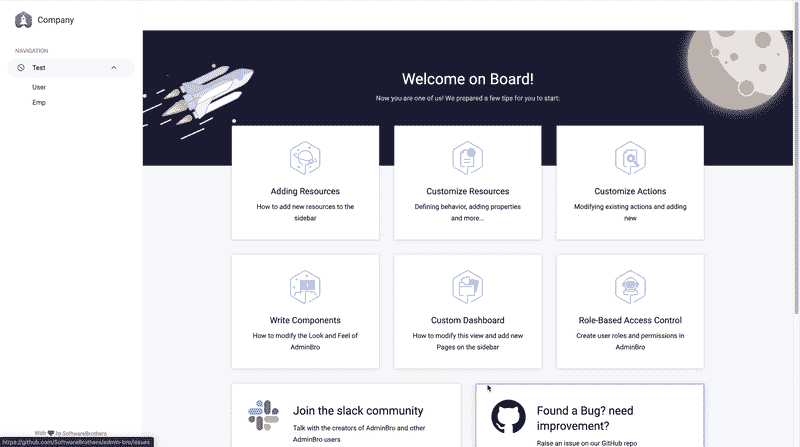

# 用 Node.js 和 Admin Bro 创建一个管理面板

> 原文：<https://javascript.plainenglish.io/node-js-creating-admin-pannel-with-admin-bro-41725198a81c?source=collection_archive---------7----------------------->


Cover Image

在这篇博客中，我将展示如何创建一个管理面板，根据我们的模型自动执行 CRUD 操作。

为此，我使用了 Admin Bro，这是一个基于模型生成 UI 的自动 UI 生成器。

1.  [创建节点 JS 项目](#8d4e)
2.  [创建模型](#8684)
3.  [创建管理面板](#51f1)

## **1。创建 Node.js 项目**

用命令`npm init`创建一个新目录并初始化节点。

```
mkdir expresstemplate
cd expresstemplate/
npm init -y
npm i nodemon
```

Express JS 是 node JS 的开源 web 框架。以下命令将 express 安装到我们的项目中。

```
npm install express --save
```

[](https://expressjs.com/en/starter/installing.html) [## 安装

### 假设您已经安装了 Node.js，创建一个目录来保存您的应用程序，并使它成为您的工作…

expressjs.com](https://expressjs.com/en/starter/installing.html) 

`package.json`

```
"scripts": {
  **"start": "nodemon index.js",**
  "test": "echo \"Error: no test specified\" && exit 1"
},
```

`index.js`

```
const express = require('express')
var app = express()
app.get('/', function(req,res){
  res.send('Hello world')
})
app.listen(8000,function(){
  console.log('Listening to PORT 8000')
})
```

## 2.**创建模型**

现在安装`mongoose`，它是 MongoDB 和 Node.js 的对象数据建模库，它管理数据之间的关系并提供模式验证。该命令安装 mongoose。

```
npm i mongoose
```

安装 mongose 后，将 MongoDB 连接到 Node.js，只需将 MongoDB 连接字符串传递给 mongose 即可实现连接。

`index.js`

```
var express = require('express');
var app = express();
const mongoose = require('mongoose');//Routes
app.get('/', function (req, res) {
    res.send('Hello World!');
});
**//Database
mongoose.connect('mongodb://localhost/test', {useNewUrlParser: true});****mongoose.connection.once('open',function(){
    console.log('Database connected Successfully');
}).on('error',function(err){
    console.log('Error', err);
})**app.listen(8000, function () {
    console.log('Listening to Port 8000');
});
```

在成功地将 node 与 MongoDB 连接起来之后，创建一个名为`Models`的文件夹，所有的模式都将保存在这个文件夹中。在`Models`文件夹中，创建一个名为`emp.js`的文件。在这个文件中，创建一个名为`empSchema`的模式，并声明所有需要的字段。最后，导出模式。

`Models/emp.js`

```
const mongoose = require('mongoose');**const empSchema = new mongoose.Schema({
  empName: {
    type: String,
    required: true,
  },  empEmail: {
    type: String,
    required: true,
  },
})**module.exports = mongoose.model('Emp',empSchema)
```

## 3.**创建管理面板**

现在，让我们开始创建我们的管理面板。为此，我们需要在项目中安装 Admin bro。

[](https://adminbro.com/tutorial-installation-instructions.html) [## Node.js 应用程序的自动生成的管理面板

### 喜欢看而不是读？看看这个视频教程，它向你展示了如何创建一个管理面板…

adminbro.com](https://adminbro.com/tutorial-installation-instructions.html) 

```
npm install admin-bro @admin-bro/express
npm install express-formidable
npm install @admin-bro/mongoose
```

以上命令安装 Admin bro 和其他使 Admin bro 工作所需的依赖项。

安装后，将下面的代码复制到 index.js 文件中。

`index.js`

```
var express = require('express');
const Emp = require('./Models/emp')
const AdminBro = require('admin-bro')
const AdminBroMongoose = require('@admin-bro/mongoose')
const AdminBroExpress = require('@admin-bro/express')var app = express();
const mongoose = require('mongoose');//Routes
app.get('/', function (req, res) {
    res.send('Hello World!');
});//Database
mongoose.connect('mongodb://localhost/test', {useNewUrlParser: true});
mongoose.connection.once('open',function(){
    console.log('Database connected Successfully');
}).on('error',function(err){
    console.log('Error', err);
})**//Admin Bro
AdminBro.registerAdapter(AdminBroMongoose)
const User = mongoose.model('User', { name: String, email: String, surname: String })
const AdminBroOptions = {
  resources: [User, Emp],
}
const adminBro = new AdminBro(AdminBroOptions)
const router = AdminBroExpress.buildRouter(adminBro)
app.use(adminBro.options.rootPath, router)**app.listen(8000, function () {
    console.log('Listening to Port 8000');
});
```

完成后，导航到[http://localhost:8000/admin](http://localhost:8000/admin)。在那里你会看到类似下图的东西。



Admin Bro Demonstration

另外，看看我之前的博客，我在里面解释了关于 node js 的模板引擎。

如有任何疑问，请随时联系我。邮箱:sjlouji10@gmail.com 领英:[https://www.linkedin.com/in/sjlouji/](https://www.linkedin.com/in/sjlouji/)

我的 GitHub 上的完整代码:

[](https://github.com/sjlouji/Node-JS-Basics---Medium) [## sjlouji/Node-JS-basic-Medium

### 快速路由节点。在 GitHub 上创建一个帐户，为 sjlouji/Node-JS-Basics - Medium 开发做贡献。

github.com](https://github.com/sjlouji/Node-JS-Basics---Medium) 

编码快乐！