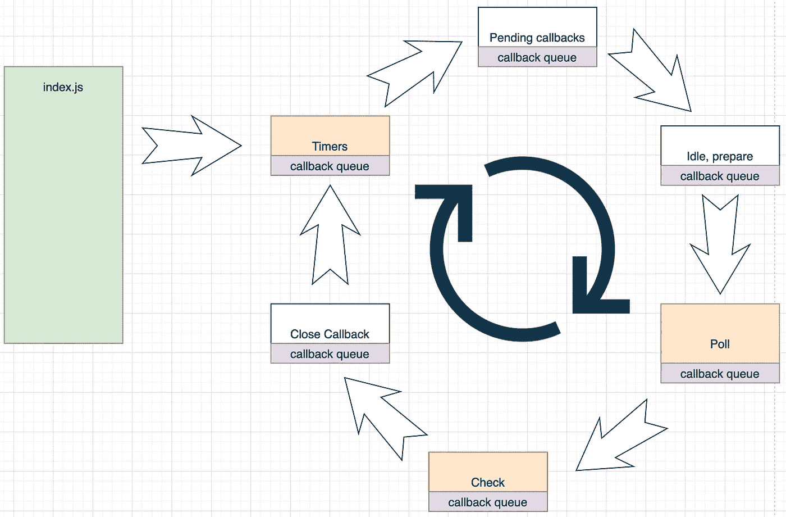
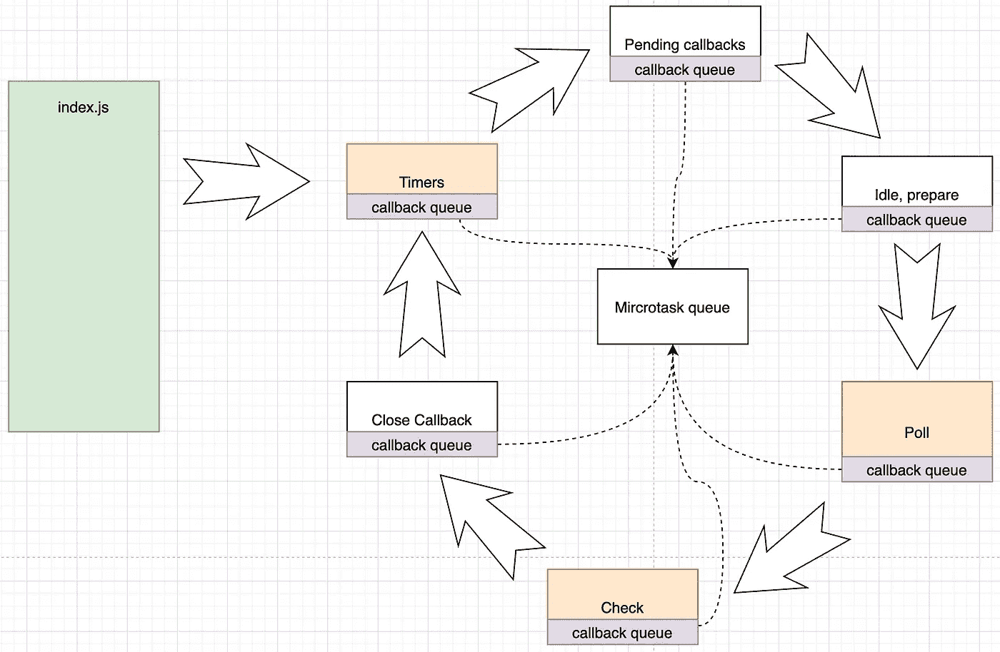

# 解释了 Node.js 事件循环的 6 个阶段

> 原文：<https://javascript.plainenglish.io/node-js-event-loop-explained-d27647ec8d53?source=collection_archive---------0----------------------->

## 不同的阶段和每个阶段处理的任务

让我们先来看一段代码:

```
setImmediate(()=> console.log('setImmediate'));fs.readFile('/etc/passwd',(err, data)=>{
  console.log('reading file');
}); console.log('start');process.nextTick(()=> console.log('nextTick'));setTimeout(()=>console.log('setTimeout 1'), 0);setTimeout(()=>console.log('setTimeout 2'), 3);let counter = 0;
const timeout = setInterval(() => {
    console.log('setInterval');
    if (counter >= 3) {
        console.log('exiting setInterval');
        clearInterval(timeout);
    }
    counter++;
}, 0);new Promise((resolve, reject)=> {
  console.log('start promise 1');
  resolve('Promise 1');
}).then(data=> {
  console.log(data);
})console.log('end');
```

这个程序的输出会是什么？

为了回答这个问题，我们需要了解两件事:

*   事件循环中的不同阶段。
*   每个阶段将处理的任务。

# 6 个阶段

当 Node.js 在主线程中执行完 index.js 时，Node.js 事件循环开始执行在主线程运行时注册的回调。



# 回调队列

每个阶段都有一个回调队列，存储该阶段要执行的回调。和浏览器提供的[任务队列](https://developer.mozilla.org/en-US/docs/Web/API/HTML_DOM_API/Microtask_guide)很像。

# 定时器

这是事件循环的第一阶段。它在每次迭代(也称为 Tick)中查找过期的计时器，并执行由`setTimout`和`setInterval`创建的计时器回调。

例如:

```
setTimeout(() => console.log('Timeout 1'), 0);setTimeout(() => console.log('Timeout 2'), 10);
```

`Timeout 1`将在第一次迭代中打印，因为第一个计时器在 0 毫秒后到期。但是，`Timeout 2`将在另一次迭代中打印(不一定在第二次迭代中)，因为第二个定时器在 10ms 后到期。

# 待定回调

它处理推迟到下一次迭代的 I/O 回调，例如处理 TCP 套接字连接错误。

# 空闲，准备

它只在内部使用。

# 投票

轮询阶段计算每次迭代中处理 I/O 回调的阻塞时间。在这个阶段，调用`epoll_wait()`系统调用(在 Linux 中)。

# 支票

这个阶段处理`setImmediate()`安排的回调，一旦轮询阶段空闲，回调就会被执行。

# 关闭回拨

如果套接字或句柄突然关闭，这个阶段将处理回调，并且将发出“close”事件。

# 微任务队列

微任务队列存储由以下各项创建的微任务(回调):

*   `process.nextTick()`
*   `then()`和`catch()`处理已解决和拒绝的承诺

微任务在主线程和事件循环的每个阶段之后执行。由`process.nextTick()`创建的微任务在由`then()`和`catch()`创建的微任务之前执行。

例如:

```
Promise.reject(() => {}).catch(() => {
  console.log('rejected promise');
});
setTimeout(() => console.log('Timeout 1'), 0);
process.nextTick(() => console.log('nextTick'));
setTimeout(() => console.log('Timeout 2'), 10);
```

输出是:

```
nextTick // the callback created by process.nextTick() executed before catch()
rejected promise
Timeout 1
Timeout 2
```

Node.js 事件循环工作流最终如下所示:



让我们再来看看这个例子。

```
setImmediate(() => console.log('setImmediate'));fs.readFile('/etc/passwd', (err, data) => {
  console.log('reading file');
});console.log('start');process.nextTick(() => console.log('nextTick'));setTimeout(() => console.log('setTimeout 1'), 0);setTimeout(() => console.log('setTimeout 2'), 3);let counter = 0;
const timeout = setInterval(() => {
  console.log('setInterval');
  if (counter >= 3) {
    console.log('exiting setInterval');
    clearInterval(timeout);
  }
  counter++;
}, 0);new Promise((resolve, reject) => {
  console.log('start promise 1');
  resolve('Promise 1');
}).then((data) => {
  console.log(data);
});console.log('end');
```

首先同步执行主线程中的 JavaScript 代码:

```
console.log('start');
console.log('start promise 1');
console.log('end');
```

然后由主线程中的`process.nextTick()`、`then()`和`catch()`注册的微任务队列中的回调:

```
console.log('nextTick');
console.log(data); // Promise 1
```

一旦主线程清除了微任务队列，执行就进入事件循环的计时器阶段，并执行计时器过期的回调:

```
console.log('setTimeout 1');
console.log('setInterval');
```

*第二个回调可能不会在第一次迭代中执行，因为它在 3 毫秒后到期，所以它的执行将被推迟到下一次迭代。*

*在定时器阶段，有一个* `*setInterval()*` *调度的回调，以 0ms 为间隔重复触发(4 次直到定时器取消)。但是，每次回调都是在单独的迭代中执行的。*

接下来，应该执行轮询阶段的回调。但是在`/etc/passwd`上完成文件读取操作需要一些时间。因此，轮询阶段将会空闲一段时间，事件循环将会进入检查阶段，因为有一个由`setImmediate()`安排的定时器。

在检查阶段，将执行由`setImmediate()`安排的回调:

```
console.log('setImmediate');
```

至此，事件循环的第一次迭代已经完成。

因此，事件循环继续第二次迭代，并再次进入计时器阶段，以执行其回调队列中的剩余回调:

```
console.log('setTimeout 2');
console.log('setInterval');
```

然后它进入轮询阶段，由于`setImmediate`不再调度定时器，它等待文件读取操作的回调并执行回调:

```
console.log('reading file');
```

并且事件循环重复迭代，直到无事可做，于是 Node.js 过程结束。

该示例的最终输出:

```
start
start promise 1
end
nextTick
Promise 1
setTimeout 1
setInterval
setImmediate
setTimeout 2
setInterval
reading file
setInterval
setInterval
exiting setInterval
```


[Subscribe to Decoded, our official YouTube channel!](https://www.youtube.com/channel/UCtipWUghju290NWcn8jhyAw)