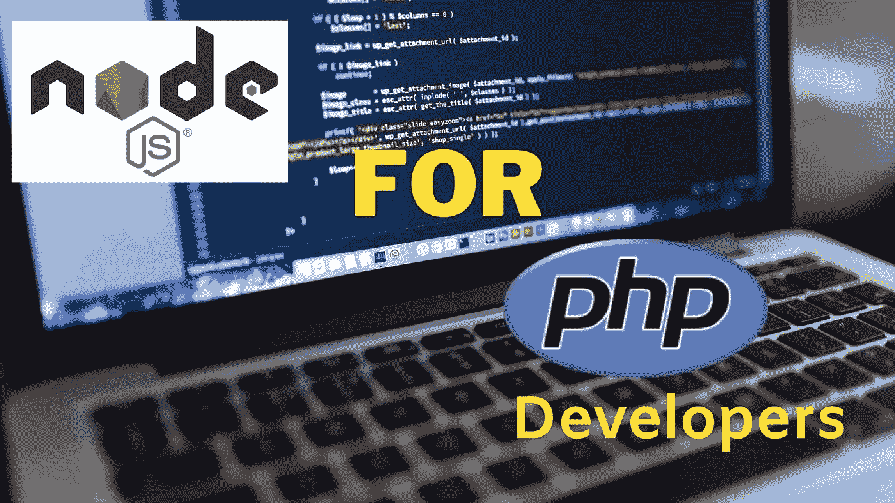
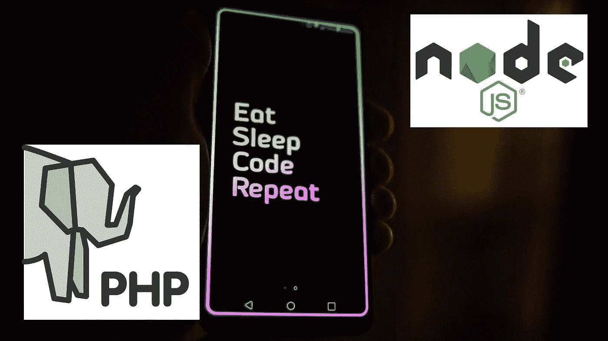
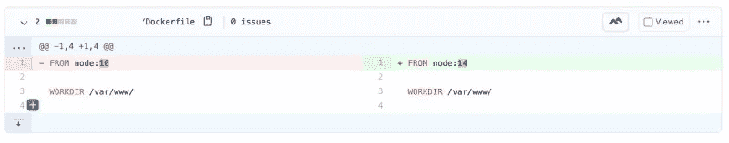

# 面向 PHP 开发人员的 Node.js:包含代码示例的 5 个必须了解的实用方面

> 原文：<https://javascript.plainenglish.io/node-js-for-php-developers-4084aa3ed723?source=collection_archive---------1----------------------->

虽然 Node.js 的受欢迎程度正在上升，但是 PHP 的吸引力却在下降,( T2)。在这种背景下，这篇文章将详细阐述 PHP 开发人员使用 Node.js 的 5 个必须知道的实用方面。这些将是通常没有人谈论或写的事情，是时候开始了。

# 面向 PHP 开发人员的 Node.js(不是 Node.js vs PHP)

这篇文章列出了作为 PHP 开发人员必须知道并学会有效使用 Node.js 的一些事情。相反，这个帖子不是 Node.js vs PHP 写上去的抨击 PHP 的地方。

> 两种语言我都用过。我早在 2016 年就开始写很多 Node.js 应用了。

当我开始的时候，我遇到了一些困难，因为在那之前我已经在工作中使用了 7 年多的 PHP。在 2012 年底发布了一本书，为 PHP 开发人员讲述了 [Node.js。](https://www.oreilly.com/library/view/nodejs-for-php/9781449333775/)

这篇博客文章不会谈论 PHP 或 Node.js 是什么，你可以在其他[文章](https://www.freecodecamp.org/news/what-exactly-is-node-js-ae36e97449f5/)中读到它。关于[非阻塞 I/O](https://blog.cloudboost.io/why-is-node-called-a-non-blocking-i-o-model-eb639063bc14) 或[事件循环](https://blog.logrocket.com/a-complete-guide-to-the-node-js-event-loop/)，我也不再赘述。尽管如此，在讨论编写好的 Node.js 代码的实际问题时，还是会涉及到其中的一些内容。

# 面向 PHP 开发人员的 Node.js 实用版

PHP 自 1995 年以来一直存在，据报道，W3tech 监测的网站中有 [79.1 %](https://w3techs.com/technologies/history_overview/programming_language/ms/q) 仍在使用 PHP(我真的不能说它是整个互联网)。所以你很有可能使用过 PHP 或者部署过用 PHP 编写的东西。例如随着[趋势的增长](https://w3techs.com/technologies/details/cm-wordpress):

> 据我们所知，63.7%的网站使用 WordPress 的内容管理系统。这是 W3Tech 监测的所有网站的 39.0%。

另一方面，Node.js 是 2009 年发布的。像 Linked In 和 PayPal 这样的主要科技公司从 2011 年到 2013 年开始采用它，因为各种原因，比如[微服务](https://geshan.com.np/blog/2020/11/nodejs-microservices/)。根据 2020 年[的栈溢出开发者调查](https://insights.stackoverflow.com/survey/2020#technology-other-frameworks-libraries-and-tools):

> Node.js 连续第二年位居榜首，因为有一半的受访者使用它。

Node.js 在过去 [5 年](https://trends.google.com/trends/explore?date=2015-11-12%202020-11-13&q=%2Fm%2F0bbxf89)越来越受欢迎已经不是什么秘密了。

因此，作为一名 PHP 开发人员，这也是成为一名优秀的 Node.js 软件工程师必须知道的 5 件实用的事情。对于 PHP 开发人员来说，Node.js 在某种意义上是相似的，但在其他一些方面也有所不同，如下所述:

# 1.Node.js 代码执行是异步和非顺序的

这是一种欺骗许多 PHP 开发人员的行为。在 PHP 中，代码按顺序运行，首先是第 1 行，然后是第 2 行，依此类推。在 JavaScript 中，尤其是在 Node.js 中，情况可能并非如此。你可以很好地利用承诺和回电来隐藏事情。JavaScript 是基于事件的，你的代码响应事件。

下面是一个修改后的代码示例，其中的解释来自我的开源货币 API 回购协议:

Async code in Node.js an example

如果你仔细看，第三行那个看起来很无辜的`db.query`已经被推到了背景中。因此它将如下执行:

1.  获取费率
2.  在后台运行插入查询
3.  当插入运行时，函数已经返回了速率
4.  如果插入查询中有问题，它会记录在 catch 中

在 PHP 中，没有现成的方法可以做这样的事情。这是第一件难倒 PHP 开发者的事情。这使得 PHP 开发人员更难理解 Node.js。这种异步代码执行行为还使得在 Node.js 中出现错误时更难找到正确的堆栈跟踪。

老实说，2020 年你可以轻松使用 [async-await](https://developer.mozilla.org/en-US/docs/Learn/JavaScript/Asynchronous/Async_await) 。尽管这是承诺的语法糖，但它确实使异步编程容易得多。

当我在 2016 年左右开始进入 Node 4/6 时代时，有回调和[承诺](https://nodejs.dev/learn/understanding-javascript-promises/)，这完全是一场不同的球赛。尽管如此，还是要注意什么时候不要使用 async-await(如上所述),而只使用承诺，然后捕捉。不过，在这个过程中不要纠结于[承诺地狱](https://medium.com/@pyrolistical/how-to-get-out-of-promise-hell-8c20e0ab0513)。承诺地狱就像是[回调地狱](http://callbackhell.com/)的下一个迭代。

> *Pro 提示:要了解哪些 ES6 特性可以与哪个版本的 Node.js 配合使用，请查看*[*node . green*](https://node.green/)*。*

另一个专业建议:

> *偶数 Node.js 版本有***，奇数则没有。因此，在生产中使用节点 14 或 16，而不是 13 或 15。**

*深入一点非顺序执行，承诺和它所拥有的力量在这里扮演着重要的角色。一般来说，Node.js 和 JavaScript 的并发处理能力很强。*

## *Node.js 承诺可能性*

*承诺是异步的，你可以同时运行它们。有很多方法可以做到。你可以和 3 个承诺赛跑，从最快的一个得到结果。你甚至可以做`promise.all`如果一个承诺被拒绝，它会停止整个操作。请阅读这篇[大对比](https://sung.codes/blog/2019/05/18/promise-race-vs-promise-any-and-promise-all-vs-promise-allsettled/)中关于`Promise.race`、`promise.all`和`promise.any`的更多内容。*

*考虑到这一点，您可以尝试其他 NPM 库来[限制](https://github.com/sindresorhus/p-limit)承诺并发，甚至[通过承诺并发来过滤](https://github.com/sindresorhus/p-filter)。你可以用[react PPH](https://reactphp.org/)做一些。但是原生 PHP 里没有，甚至 [PHP 8](https://stitcher.io/blog/new-in-php-8) 里也没有。对于 PHP 开发人员来说，这是 Node.js 中的新事物。*

*让我们继续下一点，进程不需要像 PHP 一样死在 Node.js 中。*

# *2.与 PHP 不同，Node.js 进程是长期运行的*

*PHP 注定要消亡并不是说它将来不会被使用。从某种意义上说，所有 PHP 进程都必须死亡。PHP 并不是真正为长期运行的任务/过程而设计的。*

*在 PHP 中，当一个新的 HTTP 请求进来时，进程开始，在发送回响应后，进程被终止。这就是 PHP 的一般工作方式。这就产生了对 FPM T4 和其他服务器的需求。你可以说 PHP 在 20 多年前就被设计成无服务器的。我让你决定。*

*另一方面，Node.js 是一个长期运行的进程。这使您能够在请求之间共享信息，因为同一个服务器/进程正在处理多个请求。对于一个长时间运行的进程，你可以很容易地利用像内存上的内存化、数据库的连接池等等。它提供了其他可能性，比如计算该进程上并发请求的数量。*

## *记忆示例*

*如果你不知道[记忆](https://lispcast.com/what-is-memoization/)。*

> **记忆化是缓存另一个函数的高阶函数。它能把一些慢功能变成快功能。它会在第一次调用函数后将结果保存到缓存中，因此如果您使用相同的参数再次调用该函数，它会在缓存中找到它。**

*它可以在 Node.js 中使用，但不能在 PHP 中使用。PHP 中可能有一些变通方法，比如将函数返回值保存在 Redis 中。*

*下面是一个在高速公路上使用 [p-memoize](https://github.com/sindresorhus/p-memoize) 进行记忆的代码示例:*

*Memoize on the route level with Node.js, it saves the round trip to the DB so it is much faster.*

*这样做的明显优势是减少了数据存储区的负载。在 1 分钟内，它将对相同的参数作出相同的响应。函数`products.getMultiple`的输出在内存中缓存一分钟。这使得响应非常快。*

## *MySQL 的连接池示例*

*另一件不可能的事情是连接池，因为 PHP 中有一个垂死的进程。根据[维基百科](https://en.wikipedia.org/wiki/Connection_pool):*

> **在软件工程中，连接池是数据库连接的缓存，以便在将来需要数据库请求时可以重用这些连接。连接池用于增强在数据库上执行命令的性能。**

*因此，在一个池中将有 5 个连接，如果您想对数据库运行 5 个查询，可以同时进行。这节省了连接数据库和运行查询的时间。这在 Node.js 中很容易做到，但在 PHP 中却不容易做到。*

> **注意可用连接的数量，并保持连接池的最佳大小。**

*例如，如果您正在使用 Kubernetes，并且您的应用程序有 5 个 pods，连接池大小为 2。这意味着即使没有正在执行的查询，您的数据库也将始终有 10 个打开的连接。*

*MySQL 数据库与 [MySQL](https://github.com/mysqljs/mysql#pooling-connections) npm 模块的连接池示例时间:*

*Connection Pool example in Node.js with MySQL connection pooling.*

*上面的代码将使用连接池中的 5 个 MySQL 连接并行运行相同的查询 5 次。我希望我能在开箱即用的 PHP 中完成这项工作。*

*以我的经验来看， [Node.js 与 MySQL](https://geshan.com.np/blog/2020/11/nodejs-mysql-tutorial/) 配合得非常好。如果您想用 Mongo DB 尝试连接池，这里有一个 [Mongo](https://www.compose.com/articles/connection-pooling-with-mongodb/) 的例子。*

> *作为一名开发人员，对于一个长时间运行的过程，你需要更加小心内存泄漏并做好日常工作。*

*这就是 Node.js for PHP 开发人员需要改变代码执行方式的地方。另一方面，对于 PHP 开发人员来说，这是 Node.js 的一大优势。*

# *3.Node.js 中的调试比 PHP 容易*

*对于任何编程语言来说，逐行代码调试都是开发人员体验的重要部分。为了调试 PHP 代码，您可以使用类似于 [X-Debug](https://xdebug.org/) 的附加组件和一些 IDE 设置。*

*退一步说，X-Debug 的设置很有挑战性。你必须[安装](https://xdebug.org/docs/install)它，启用扩展。之后，用类似[PHP form](https://www.jetbrains.com/help/phpstorm/configuring-xdebug.html)的 IDE 对其进行适当配置。*

> **基本上，简单是让 X-debug 工作的最后一件事。除非用 Docker 容器很好地配置了它，并且 IDE 设置也很容易加载。**

*另一方面，根据我的经验，与 PHP 和 X-debug 相比，运行 node [本机调试器](https://nodejs.org/api/debugger.html)甚至 [ndb](https://geshan.com.np/blog/2019/01/getting-started-with-debugging-nodejs-applications-with-ndb/) 要容易得多。有了 VS 代码的使用，[调试 Node.js 应用](https://itnext.io/the-absolute-easiest-way-to-debug-node-js-with-vscode-2e02ef5b1bad)是如此的容易，连穴居人都能做到。*

> **打开首选项>设置，在搜索框中输入“节点调试”。在 Extensions 选项卡下，应该有一个名为“Node debug”的扩展。从这里，单击第一个框:调试>节点:自动连接，并将下拉框设置为“开”。你现在差不多可以走了。是的，真的很简单。**

*然后用`index.js`和终端类型`node --inspect index.js`在 VS 代码上设置一些断点。*

*嘣！您的逐步 Node.js 调试器在 VS 代码编辑器上运行良好，无需太多努力。与 PHP 的一个很好的区别是，不需要安装一个不同的扩展，启用它，并配置它来调试程序。不需要安装额外的扩展是 Node.js 给 PHP 开发人员带来的好处。*

*下一点也是关于更好的开发者体验，同时升级该语言的多个主要版本。*

# *4.Node.js 的主要版本升级在 PHP 上是无缝的*

*甚至在 Node.js 中跳转多个主要版本都是无缝体验。根据项目的规模和复杂程度，从 PHP 5.6 升级到 PHP 7.0 需要一周到一个月的时间。*

*以我个人的经验来说，我过去曾经将 Node.js 微服务从 0.12 版本升级到 4 版本。最近，我将一个应用程序从 Node.js 10 升级到了 14。我的 Node.js 主要版本的所有升级都很容易。*

**

*Example Pull request of Node 10 to 14 upgrade with Docker. It was super smooth.*

*一些小的 package.json 修改是我遇到的唯一的小问题。部署后，很少出现与代码兼容性相关的问题。作为一个额外的奖励，升级主要版本的性能通常会更好。*

*另一方面，升级 PHP 并不容易。应用程序从 PHP 5.4 到 5.6 的小版本升级并不麻烦。但是，对于一个相对较大的应用程序来说，从 PHP 5.6 升级到 7.2 是一件痛苦的事情。花了很长时间，需要多次 composer.json 修改。测试它也是一项艰巨的任务。PHP 主要版本升级的好的一面当然是性能的提升。*

> *这里需要注意的是，我使用的 PHP 应用程序比 Node.js 应用程序要老。你的经历肯定会和我的不同。*

# *5.与 PHP 相比，编写 Node.js 应用程序更容易*

*Docker 的受欢迎程度在过去的五年里稳步上升。自从发布以来,[改变了我们软件工程师的工作方式。你也应该使用](https://geshan.com.np/blog/2018/11/4-ways-docker-changed-the-way-software-engineers-work-in-past-half-decade/) [Docker 进行本地开发](https://geshan.com.np/blog/2018/10/why-use-docker-3-reasons-from-a-development-perspective/)。*

*考虑到这一点，根据组件的布局和应用程序的复杂性，编写 PHP 应用程序的 Dockerizing 可能是一项困难的任务。相反，对 Node.js 应用程序进行 dockerizing 的工作要少一些，过程也很容易。*

*下面是一个使用 Apache 的 PHP Laravel 应用程序的 [Dockerfile](https://github.com/geshan/laravel6-on-google-cloud-run/blob/master/Dockerfile) 示例。*

*Example PHP docker file for Laravel with Apache and multi-stage build*

*Laravel 的这个 Docker 映像的好处是 PHP 与 apache 捆绑在同一个映像中。与将 PHP 和 Apache 分成两个 docker 映像相比，这是否是一个更好的方法值得商榷。*

*另外，请注意上面 docker 图像中的[多级 docker 构建](https://geshan.com.np/blog/2019/11/how-to-use-docker-multi-stage-build/)。Composer 安装在不同的映像中完成，输出被复制到主映像中。如果我们在不同的 docker 图像中使用 PHP-FPM 和 Nginx，情况会更复杂。需要管理两个不同的 docker 映像。*

*现在该看看 Node.js [Dockerfile](https://github.com/geshan/currency-api/blob/master/Dockerfile) 了。*

*Example Node.js docker file with a multi-stage build*

*由于 Node.js 有一个内置的 web 服务器，docker 文件要干净得多。*

> **当您安装 node 时，npm 与它捆绑在一起。这消除了在 docker 构建的不同阶段安装软件包的需要。**

*在上面的 docker 文件中，多级 docker 构建用于分离生产和开发 docker 映像。对于 PHP 开发人员来说，在 Node.js 中捆绑包管理器(npm)和将 web 服务器作为语言/运行时的一部分是不同的。如果您对一步一步编写 Node.js 应用程序更感兴趣，请遵循本[教程](https://geshan.com.np/blog/2020/11/nodejs-with-docker/)。*

*这里的主要区别是 Node.js 是一种内置 web 服务器的运行时/语言。这通常会更容易，因为不需要在等式中混合 Apache 或 Nginx。*

# *结论*

*当 PHP 开发人员使用 Node.js 时，要想充分利用 Node.js 的强大功能，确实需要稍微改变一下思路。Node.js 不是银弹。它有缺点，需要适应不同的代码执行方式。*

> *当然，对于 PHP 开发人员来说，使用 Node.js 有一些好处，比如异步编程和并发性。其他优势源于 Node.js 流程的长期运行。*

*我希望这篇文章能帮助你从 Node.js 中获得更多，即使你是一个有经验的 PHP 开发人员。*

**最初发表于*[T5【https://geshan.com.np】](https://geshan.com.np/blog/2020/11/nodejs-for-php-developers/)*。**