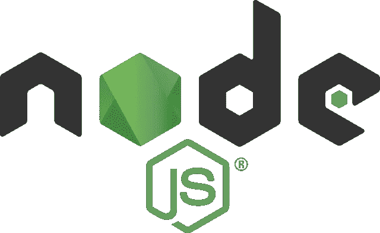
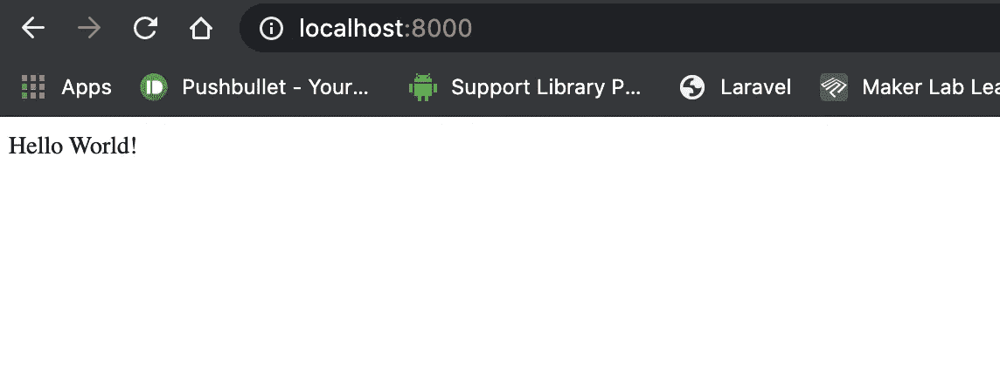

# 用 Node.js 和 Express 的 Hello World

> 原文：<https://javascript.plainenglish.io/node-js-hello-world-with-node-js-and-express-61dd390c0b14?source=collection_archive---------4----------------------->



Cover Image

## **node . js 是什么？**

Node.js 是一个开源的、跨平台的 JavaScript 运行时环境，它在 web 浏览器之外执行 JavaScript 代码。Node JS 使我们能够编写服务器端的 Javascript 代码。我们知道 javascript 只在浏览器上运行。不过，它也能在服务器上工作，因为它是建立在 Chrome 的 V8 JavaScript 引擎上的。使用 Node JS，我们可以构建不同类型的应用程序，如 web 服务器、命令行应用程序、Rest APIs 等等。Node JS 在构建 web 服务器方面很流行。Node JS 为我们提供了异步和跨平台的运行时环境。Node JS 遵循非阻塞执行，这使它成为构建服务器和应用程序的最快工具。

## **目录**

1.  [安装节点](#46bc)
2.  [创建节点项目](#21f4)
3.  [配置快递](#395a)

## **1。安装节点**

要创建节点项目，您应该在本地计算机上安装一个节点。为此，只需朝着[https://nodejs.org/en/](https://nodejs.org/en/)的方向安装节点。

[](https://nodejs.org/en/) [## 节点. js

### Node.js 是基于 Chrome 的 V8 JavaScript 引擎构建的 JavaScript 运行时。

nodejs.org](https://nodejs.org/en/) 

## 2.**创建节点项目**

用命令`npm init`创建一个新目录并初始化节点。Npm 是所有 javascript 包所在的包管理器。我们通过 npm 下载所有的 javascript 包。

```
mkdir helloworld
cd helloworld/
npm init -y
```

这里我用命令`npm init`添加了一个额外的标签`-y`。通常，当我们输入`npm init`时，它会问一些特定的问题。为了跳过这些，我只是将这个-y 标记添加到命令中。

执行该命令后，在项目根目录下生成一个`package.json`文件。它保存了与项目相关的所有元数据。

在这个文件中，我们可以看到一种叫做脚本的东西。这是我们为项目添加自己的命令的地方。我正在创建一个新的脚本命令，当我键入`npm start`时它会启动我的服务器。脚本告诉 node，每当我执行命令`npm start`时，它应该运行命令`node index.js`。

`package.json`

```
"scripts": {
   **"start": "node index.js",**
   "test": "echo \"Error: no test specified\" && exit 1"
},
```

## 3.**配置快递**

现在让我们创建我们的服务器。这里我们使用`Express.js`创建我们的服务器。Express JS 是 node JS 的开源 web 框架。它是为构建 web 应用和 API 而设计的。以下命令将 express 安装到我们的项目中。

```
npm install express --save
```

[](https://expressjs.com/) [## Express — Node.js web 应用程序框架

### Express 是一个最小且灵活的 Node.js web 应用程序框架，它为 web 和…

expressjs.com](https://expressjs.com/) 

我们使用 express 创建一个将在端口 8000 上运行的新服务器。同样为了演示，我创建了一个返回 hello world 的路由。

`index.js`

```
var express = require('express');
**var app = express();**app.get('/', function (req, res) {
  res.send('Hello World!');
});app.listen(8000, function () {
  console.log('Listening to Port 8000');
});
```

现在用命令`npm start`启动服务器。打开浏览器，导航到 [http://localhost:8000/](http://localhost:8000/) 。您应该会看到 Hello world 显示在主页上。

```
npm start
```



OutPut for the above example

如有任何疑问，请随时联系我。电子邮件:sjlouji10@gmail.com。领英:【https://www.linkedin.com/in/sjlouji/ 

github:[https://github.com/sjlouji](https://github.com/sjlouji/Connecting-React-with-Redux)/

编码快乐！