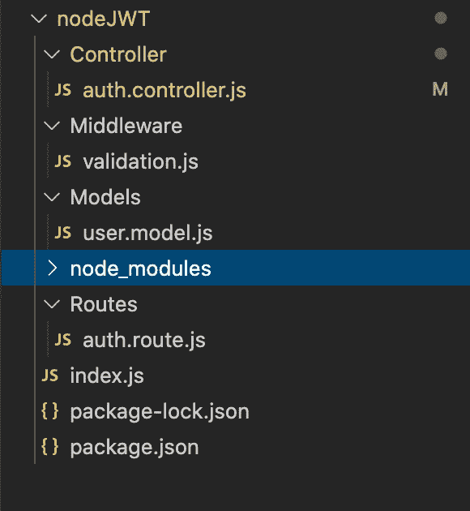
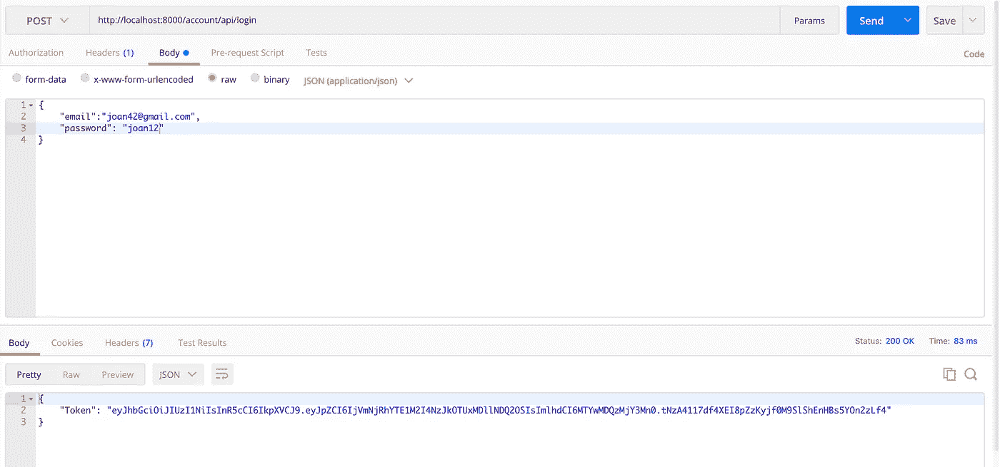
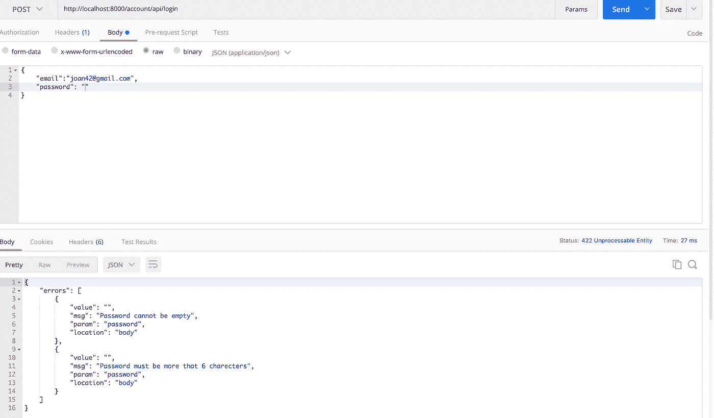
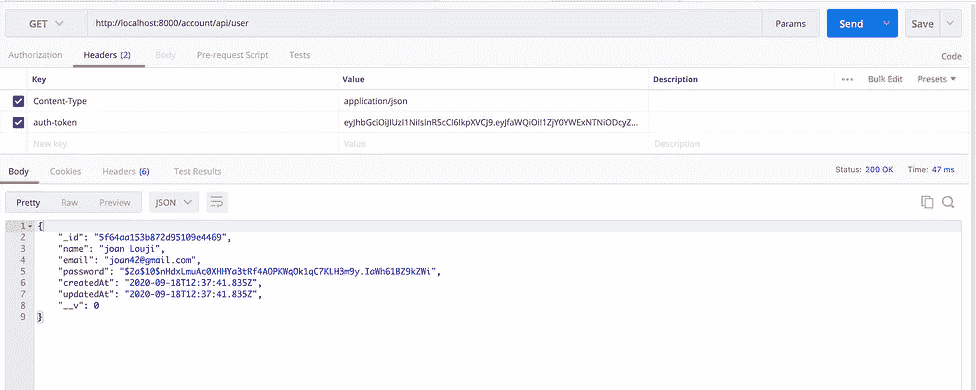
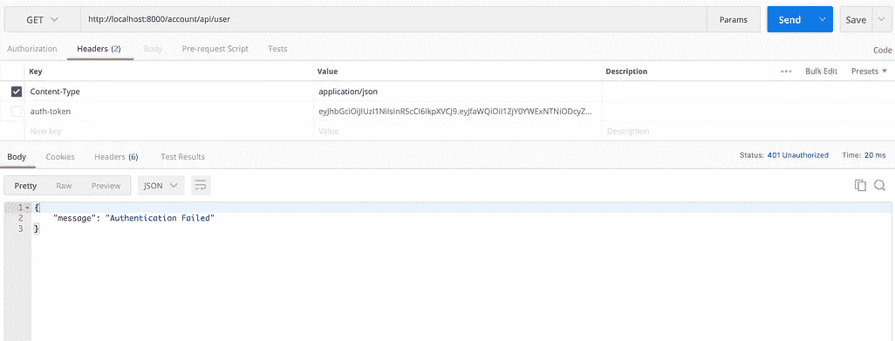

# 用 JWT 处理 Node.js 中的用户登录和认证请求

> 原文：<https://javascript.plainenglish.io/node-js-jwt-user-login-and-making-an-authenticated-request-9acf9e3d7559?source=collection_archive---------0----------------------->


Cover Image

大家好。这个博客将是我之前博客的延续。查看我以前的博客来理解这个演示的流程。

[](https://medium.com/@sjlouji10/node-js-api-user-registration-with-jwt-b6b74fe599e9) [## 节点 JS —向 JWT 注册 API 用户

### JWT 是在双方之间安全传输数据的开放标准。它与认证系统一起使用，以…

medium.com](https://medium.com/@sjlouji10/node-js-api-user-registration-with-jwt-b6b74fe599e9) 

在这篇博客中，我将解释如何用节点 js 和 JWT 创建一个登录 API 视图。所以让我们开始吧。

## **目录**

1.  [初始设置](#6da0)
2.  [用户登录并生成 JWT 令牌](#ec33)
3.  [验证模式](#c887)
4.  [发出认证请求](#81f9)

## **1。初始设置**

在这一部分，我只是总结了我们在之前的博客中所做的事情。

最初，我们创建了一个服务器，并用 mongoose 实例将它连接到 MongoDB 数据库。然后我们创建了四个名为`Models, Middleware, Controller, Routes.`的文件夹

`index.js`

```
const express = require('express')
const bodyparser = require('body-parser');
const mongoose = require('mongoose')
const router = require('./Routes/auth.route')
var app = express()//Routes
app.use(bodyparser.json())
app.get('/', function(req,res){
res.send('Hello world')
})
app.use('/account/api',router)//MongoDb connection
mongoose.connect('mongodb://localhost/test', {useNewUrlParser: true});
mongoose.connection.once('open',function(){
  console.log('Database connected Successfully');
}).on('error',function(err){
  console.log('Error', err);
})//Server
app.listen('8000',function(req,res){
  console.log('Serve is up and running at the port 8000')
})
```

创建服务器后，我们创建了一个名为`auth.route`的路由文件来处理所有的认证请求。

`Routes/auth.route.js`

```
const router = require('express').Router()
const signup = require('../Controller/auth.controller')
const {validateUser} = require('../Middleware/validation');router.post('/signup',validateUser,signup.signup)module.exports = router
```

然后，我们创建了一个带有属性 name、email、password 的用户模式。

`Models/user.model.js`

```
const mongoose = require('mongoose')const userSchema = new mongoose.Schema({
  name: {
    type: String,
    required: true,
    max: 200,
  }, email: {
    type: String,
    required: true,
    unique: true,
  }, password: {
    type: String,
    required: true,
    min: 5
  },
 },{timestamps: true}
)module.exports = mongoose.model('User',userSchema)
```

在创建模型文件之后，我们创建了一个 auth 控制器，并编写了注册逻辑。

`Controller/auth.controller.js`

```
const User = require('../Models/user.model')
const bycrypt = require('bcryptjs')
const jwt = require("jsonwebtoken");async function signup(req,res,next) { const salt = await bycrypt.genSalt(10);
  hashpassword = await bycrypt.hash(req.body.password, salt) const emailExist = await User.findOne({email: req.body.email}) if(emailExist){
    res.status(400).json({"error":'Email already Exist'})
  } const user =  new User({
    name: req.body.name,
    email: req.body.email,
    password: hashpassword
  })
  try{
    const userSignup = await user.save()
    const payload = {
      user: {
        id: userSignup.id
      }
    };
    jwt.sign(payload,"anystring",{expiresIn: 10000},function(err, token){
      if(err){
        res.send(err)
      }
      res.status(200).json({
        token,
        userSignup
      })
    })
  }
  catch(err){
    res.status(400).json({'error':err}) 
  }
}module.exports = {
  signup,
  login,
}
```

最后，我们创建了一个验证中间件来验证我们的注册请求。

`Middleware/validation.js`

```
const {check, validationResult} = require('express-validator');exports.validateUser = [
  check('name')
    .trim()
    .escape()
    .not()
    .isEmpty()
    .withMessage('User name can not be empty!')
    .bail()
    .isLength({min: 3})
    .withMessage('Minimum 3 characters required!')
    .bail(),  check('email')
    .trim()
    .normalizeEmail()
    .not()
    .isEmpty()
    .withMessage('Invalid email address!')
    .bail(),  check('password')
    .not()
    .isEmpty()
    .withMessage('Password cannot be empty')
    .isLength({min: 6})
    .withMessage('Password must be more that 6 charecters'),  
(req, res, next) => {
    const errors = validationResult(req);
    if (!errors.isEmpty())
      return res.status(422).json({errors: errors.array()});
    next();
  },
];
```

我们的项目文件看起来如下。



Project Structure

## 2.**用户登录**

现在让我们开始创建登录功能。首先，我在`auth.controller`文件中创建了一个名为 login 的异步函数。在函数内部，我只是检查用户提供的电子邮件是否存在。如果是这样，我将用户给出的密码与数据库中存储的密码进行比较。最后，我将生成一个 JWT 令牌，并将其发送给用户，就像我们在注册部分所做的那样。

`Controller/auth.controller.js`

```
//Login Controller
async function login(req,res,next){
  const emailExist = await User.findOne({email: req.body.email})
  if(!emailExist){
    res.status(400).json({error:"Email not Found"})
  } const checkpassword = await bycrypt.compare(req.body.password,   emailExist.password)
  if(!checkpassword){
    res.status(400).json({error:"Password mismatch"})
  }
 **const token = jwt.sign({id: emailExist.id},'anystring')
  res.header('auth-token',token).json({'Token':token})**
}module.exports = {
  signup,
 **login,** }
```

执行完所有这些操作后，只需调用 auth 路由器中的登录控制器。

`Routes/auth.route.js`

```
const login = require('../Controller/auth.controller')**router.post('/login',login.login)**
```

现在导航到[http://localhost:8000/account/API/log in](http://localhost:8000/account/api/login)，使用用户凭证发出 post 请求。您将收到一个令牌，您可以用它向服务器发出经过身份验证的请求。



User Login

## 3.**验证模式**

现在让我们创建一个验证函数来验证我们的请求。为此，我使用了`express-validator`。

`Middleware/loginvalidation.js`

```
const {check, validationResult} = require('express-validator');exports.loginValidation = [
  check('email')
    .trim()
    .normalizeEmail()
    .not()
    .isEmpty()
    .withMessage('Invalid email address!')
    .bail(), check('password')
    .not()
    .isEmpty()
    .withMessage('Password cannot be empty')
    .isLength({min: 6})
    .withMessage('Password must be more that 6 charecters'),(req, res, next) => {
  const errors = validationResult(req);
  if (!errors.isEmpty())
    return res.status(422).json({errors: errors.array()});
  next();
  },
];
```

`Routes/auth.route.js`

```
router.post('/login',**loginValidation**,login.login)
```

现在用一些错误的完整数据向登录路由发出 post 请求。验证中间件将验证您的函数，如果发现错误，将返回错误。



Login Validation

## 4.**发出认证请求**

到目前为止，我们已经用 JWT 创建了一个登录和注册 API。现在，让我们以一种只有登录用户才能访问的方式来保护我们的路由。

为此，我在`Middleware`文件夹中创建了一个名为`auth.js`的中间件。该函数只是从客户端接收 auth 令牌，并验证 auth 令牌是否有效。如果有效，它将允许用户访问该路线。如果是现在，则返回令牌无效。

`Middleware/auth.js`

```
const jwt = require("jsonwebtoken");module.exports = function(req, res, next) {
  const token = req.header("auth-token");
  if (!token) return res.status(401).json({ message: "Authentication Failed" });
 **try {
      const val = jwt.verify(token, "anystring");
      req.user = val;
      next();
    } catch (e) {
      console.error(e);
      res.status(500).send({ message: "Token Invalid" });
    }**
};
```

将身份验证中间件集成到我们的路由中非常简单。只是将中间件作为一个参数传递给路由器。

`Routes/auth.route.js`

```
const auth = require('../Middleware/auth')router.get('/user',**auth**, getCurrentUser.getCurrentUser)
```

下面我正在创建一个返回用户详细信息的控制器。如果提供的令牌是有效的，此功能将起作用，即控制器将只对登录的用户可用。

`Controller/auth.controller.js`

```
async function getCurrentUser(req,res){
 **try {
    const user = await User.findById(req.user._id);
    res.json(user);
  } catch (e) {
    res.send({ message: "Error in Fetching user" });
  }**
}module.exports = {
  signup,
  login,
  getCurrentUser,
}
```

导航到[http://localhost:8000/account/API/user](http://localhost:8000/account/api/user)并发出一个不带令牌的 GET 请求。这个请求将以一个错误结束。对 JWT 令牌进行同样的操作，这将返回您的用户详细信息。



Authenticated request

请访问我以前的博客，在那里我解释了如何用 Node js 和 JWT 创建用户注册。

如有任何疑问，请随时联系我。电子邮件:sjlouji10@gmail.com。领英:[https://www.linkedin.com/in/sjlouji/](https://www.linkedin.com/in/sjlouji/)

我的 GitHub 上的完整代码:

[](https://github.com/sjlouji/Node-js-JWT-auth---Medium) [## sjlouji/Node-js-JWT-授权-介质

### 节点和快递 JS - JWT 认证。通过在…上创建帐户，为 sjlouji/Node-js-JWT-auth-Medium 开发做出贡献

github.com](https://github.com/sjlouji/Node-js-JWT-auth---Medium) 

编码快乐！