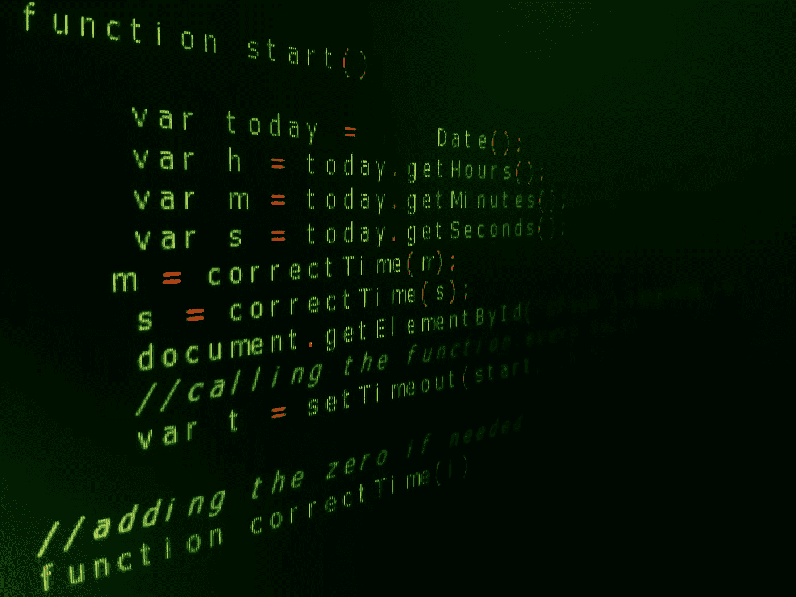

# Node:是语言还是框架？

> 原文：<https://javascript.plainenglish.io/node-js-language-or-framework-938e0936681?source=collection_archive---------1----------------------->

Credits: [Pexels.com](https://www.pexels.com/photo/person-holding-node-text-1261427/)

即使拥有多年的 JavaScript 经验，许多开发人员仍然对基本的 NodeJS 问题感到困惑。**什么是 NodeJS？是框架还是语言？**你也是来了解 NodeJS 的这个基本认识的。所以让我们挖掘一些知识，看看 NodeJS 中到底有什么。

在 NodeJS 中，“ **JS** 代表 JavaScript，这意味着 NodeJS 以某种方式直接连接到 JavaScript。如果它来自 JavaScript，那么它应该是 JavaScript 的框架，因为这是我们在其他语言及其框架中看到的规则，对吗？但是如果事情真的那么简单，我就不会写这方面的文章，你也不会花宝贵的时间去研究它。因此，在理解 JavaScript & NodeJS 的基础知识之前，让我们先来看看理解它所需的基础知识。语言&框架有什么区别？

Credits: [Pexels.com](https://www.pexels.com/photo/person-holding-node-text-1261427/)

# 语言 vs 框架

在学院刚开始的时候，编码相当简单，我们有库(stdio.h，如果你在学院用过 C)，变量，for 循环，if 条件，函数等。但是随着我们开始了解和学习更多，我们被引入了新的关键词**“框架”**。

这个框架是什么？我们不是已经有太多需要理解和学习的东西了吗，引入这个新术语是为了制造混乱？我们先通过一个例子来理解这个。

大家都知道[印地语](https://en.wikipedia.org/wiki/Hindi) & [梵文](https://en.wikipedia.org/wiki/Devanagari)对吗？所以我们知道 Devanagiri 是一种"**"到*写印地语(印度语)&的一些其他语言。Devanagiri 定义了印地语的一套规则和书写方式。而在印地语中，我们有预定义的关键字(由अ आ इ ई उ ऊ印地语字母表公司制作)用于交流。*

*同样的事情也适用于语言和框架。语言只是做类似“Devanagiri”的事情的最小规则集。而框架是为特定编程语言编写的有用工具的集合，正如我们在上面的例子“印地语”中讨论的那样。因此 **JavaScript** 是一种语言，而 **Angular** 是一个框架，JavaScript 提供了一组最小的编码规则和系统工具来编译它，而 Angular 提供了一组有用的工具来简化和组织编码。*

> *软件框架(无论是前端还是后端)包括标准化的预写代码，这使得某些功能的开发变得更加容易和快速。您的编码自由度更小，因为您必须按照框架体系结构的指示进行编码。:-*

****

**Credits: [Pexels.com](https://www.pexels.com/photo/person-holding-node-text-1261427/)**

**有两种类型的语言，编程语言和脚本语言。编程语言需要编译器来编译代码，而脚本语言需要解释器在运行时执行代码而不需要编译。所以基本上我们需要一个编译器或者解释器来执行一个程序。**

**JavaScript 最初被创造出来是为了**“让网页活起来”**。所以 JavaScript 最初只在浏览器上与用户交互。但是随着技术进步的步伐，我们有了两个新的术语 **NodeJS & AngularJS** 。AngularJS 是 JavaScript 的一个框架，根据上面提到的例子和框架的定义。但 NodeJS 不是。Node.js 单独包含了那个需要执行代码的解释器。它从 chrome v8 引擎获得这种能力，chrome V8 引擎用于运行 JavaScript。此外，它还扩展了处理文件和网络 I/O 的能力，更倾向于异步模式。简而言之，我们可以在 NodeJS 中做很多 JavaScript 做不到的事情，比如网络 I/O、文件处理等等。出于安全原因，JavaScript 最初不包括在浏览器中使用的文件 I/O。而且，它不需要做网络任务，因为浏览器会做。JavaScript 是用浏览器的 DOM 构建的。**

> ****简单来说，**
> 引擎是用于在一个平台上运行一种语言的编译器和解释器的集合，作为 chrome 上 v8 引擎运行的 JavaScript。**

**因此，node.js 最初的想法是能够非常快速地建立 web 服务或 TCP 服务器。您可以，现在仍然可以，只是复制一个代码片段，放入 js 文件，然后用 node 运行它，您就有了一个服务器。咿呀！**

> **最后，
> **Node.js (Node)不是一个框架，也不是一种语言，而是一个运行时开源开发平台，用于在服务器端执行 JavaScript 代码。****

**我希望这篇文章能帮助您澄清 NodeJS 是一个框架的神话。如果你想深入了解 JavaScript、NodeJS、AngularJS & ReactJS 之间的区别，可以查看我的[文章](https://medium.com/javascript-in-plain-english/noobies-exploration-to-javascript-part-1-introduction-to-js-diff-b-w-93c8cc062fa8)。
**快乐阅读||写作 2 学习****