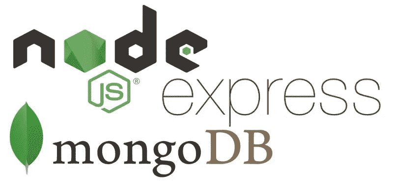
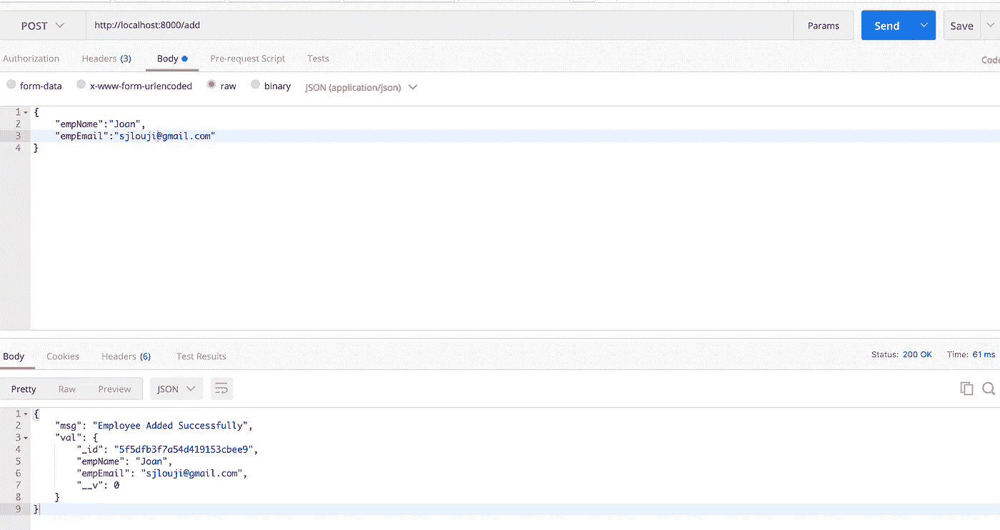
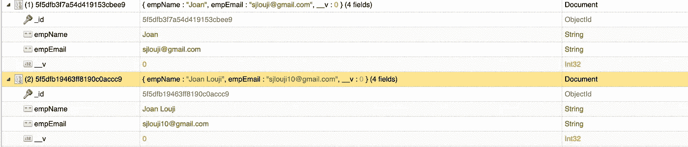

# 在 Node.js 中创建 MongoDB 数据库模型

> 原文：<https://javascript.plainenglish.io/node-js-models-and-database-3836f0c7f2da?source=collection_archive---------6----------------------->



Cover Image

MongoDB 是一个开源的、跨平台的文档存储 NoSQL 数据库，它帮助我们以类似于 JSON 的文档的形式存储和检索数据。NoSQL 是我们关系数据库的替代品。当我们处理大量数据时，NoSQL 数据库非常有用。MongoDB 是 NoSQL 的数据库之一。

像其他 NoSQL 数据库一样，MongoDB 也需要预定义的模式。MongoDB 可以存储任何类型的数据，并且可以灵活地在文档中创建任意数量的字段。他们使用嵌入式文档。这减少了对数据库连接的需求，从而降低了成本。

## **目录**

1.  [创建节点 Js 项目](#d943)
2.  [连接到 MongoDB 数据库](#865e)
3.  [创建模型](#7cdf)

## **1。创建 Node.js 项目**

用命令`npm init`创建一个新目录并初始化节点。

```
mkdir helloworld
cd helloworld/
npm init -y
```

为了运行 node js 服务器，每当我修改代码时，我们都需要在终端中键入`node index.js`。我觉得很难。所以我开始用 nodemon。这是一个简单的工具，当代码发生变化时，它会自动重启服务器。下面的命令将 nodemon 安装到我们的项目中。

```
npm install -g nodemon
```

设置 nodemon 非常简单。把`node`换成`nodemon`就行了。现在，当你在终端输入`nodemon index.js`时，服务器将会运行，当你修改代码时，它会自动重启服务器。

现在，为了让我的服务器输入`npm start,`，我在启动脚本部分添加了`nodemon index.js`。

`package.json`

```
"scripts": {
   **"start": "nodemon index.js",**
   "test": "echo \"Error: no test specified\" && exit 1"
},
```

现在让我们创建我们的服务器。在这里，我们使用`Express.js`创建我们的服务器。Express JS 是 node JS 的开源 web 框架。以下命令将 express 安装到我们的项目中。

```
npm install express --save
```

[](https://expressjs.com/) [## Express - Node.js web 应用程序框架

### Express 是一个最小且灵活的 Node.js web 应用程序框架，它为 web 和…

expressjs.com](https://expressjs.com/) 

安装后，只需创建一个名为`index.js`的新文件，这将是我们的服务器文件。

`index.js`

```
**var express = require('express');
var app = express();**app.get('/', function (req, res) {
  res.send('Hello World!');
});**app.listen(8000, function () {
  console.log('Listening to Port 8000');
});**
```

现在启动服务器，您应该看到浏览器中显示 hello world。

```
npm start
```

## 2.**连接到 MongoDB 数据库**

要将 MongoDB 连接到 Node JS 项目，您应该在我们的本地机器上安装 MongoDB。从 MongoDB 官网安装。

[](https://docs.mongodb.com/manual/installation/) [## 安装 MongoDB - MongoDB 手册

### MongoDB Atlas 是一个托管在云中的 MongoDB 服务选项，不需要安装开销和…

docs.mongodb.com](https://docs.mongodb.com/manual/installation/) 

另外，安装 MongoDB 的任何一个 GUI 工具。我正在使用其中一个叫做 [NoSqlBooster](https://nosqlbooster.com/) 的。

安装好 MongoDB 后，安装`mongoose`，这是 MongoDB 和 Node js 的对象数据建模库。它管理数据之间的关系，并提供模式验证。该命令安装 mongoose。

```
npm i mongoose
```

现在让我们在 mongoose 的帮助下将 MongoDB 连接到 Nodejs。只需将 MongoDB 连接字符串传递给 mongoose 就可以实现连接。

`index.js`

```
var express = require('express');
var app = express();
const mongoose = require('mongoose');//Routes
app.get('/', function (req, res) {
    res.send('Hello World!');
});**//Database
mongoose.connect('mongodb://localhost/test', {useNewUrlParser: true});****mongoose.connection.once('open',function(){
    console.log('Database connected Successfully');
}).on('error',function(err){
    console.log('Error', err);
})**app.listen(8000, function () {
    console.log('Listening to Port 8000');
});
```

现在，如果 MongoDB 服务器工作正常，服务器将向您发送一条成功的消息。如果不是，它将抛出错误。

## 3.**创建模型**

在成功地将 node 与 MongoDB 连接起来之后，创建一个名为`Models`的文件夹，所有的模式都将保存在这个文件夹中。在`Models`文件夹中，创建一个名为`emp.js`的文件。在这个文件中，创建一个名为`empSchema`的模式，并声明所有需要的字段。最后，导出模式。

`Models/emp.js`

```
const mongoose = require('mongoose');**const empSchema = new mongoose.Schema({
  empName: {
    type: String,
    required: true,
  },** **empEmail: {
    type: String,
    required: true,
  },
})**module.exports = mongoose.model('Emp',empSchema)
```

为了演示，我们从客户端发送 JSON 格式的数据。为此，我们需要一个名为 **Body-Parser 的快速中间件。**用下面的命令安装。

```
npm install body-parser
```

在我们的服务器文件中，我创建了一个将雇员数据插入数据库的路径`/add`。

在路线内部，只需创建一个对象`emp`。然后输入`emp.save()`，将我们的数据插入数据库。

`index.js`

```
var express = require('express');
var app = express();
const mongoose = require('mongoose');
**const bodyParser  = require('body-parser');**//Routes
**app.use(bodyParser.json());
app.use(bodyParser.urlencoded({ extended: false }));** app.get('/', function (req, res) {
    res.send('Hello World!');
});app.post('/add', function(req,res) {
 **const emp = new Emp({
    empName: req.body.empName,
    empEmail: req.body.empEmail,
  });**
 **emp.save()**.then(val => {
    res.json({ msg: "Employee Added Successfully", val: val })
  })
})//Database
mongoose.connect('mongodb://localhost/test', {useNewUrlParser: true});mongoose.connection.once('open',function(){
    console.log('Database connected Successfully');
}).on('error',function(err){
    console.log('Error', err);
})app.listen(8000, function () {
    console.log('Listening to Port 8000');
});
```

用`empName`和`empEmail`向[http://localhost:8000/add](http://localhost:8000/add)发出 post 请求。如果请求有效，mongoose 会将值插入 empSchema。如果没有，mongoose 会向我们抛出错误。



Post request to Emp Model

这是我的 MongoDB 数据库在插入值后的样子。



The schema looks like this in NoSQL booster

[一定要看看我之前的博客，在那里我解释了关于 Nodejs 路由的问题。](https://medium.com/@sjlouji10/node-js-router-and-routes-a4a3cfced5c4)

如有任何疑问，请随时联系我。电子邮件:sjlouji10@gmail.com。领英:[https://www.linkedin.com/in/sjlouji/](https://www.linkedin.com/in/sjlouji/)

我的 GitHub 上的完整代码:

[](https://github.com/sjlouji/Node-JS-Basics---Medium) [## sjlouji/Node-JS-basic-Medium

### 快速路由节点。在 GitHub 上创建一个帐户，为 sjlouji/Node-JS-Basics - Medium 开发做贡献。

github.com](https://github.com/sjlouji/Node-JS-Basics---Medium) 

编码快乐！