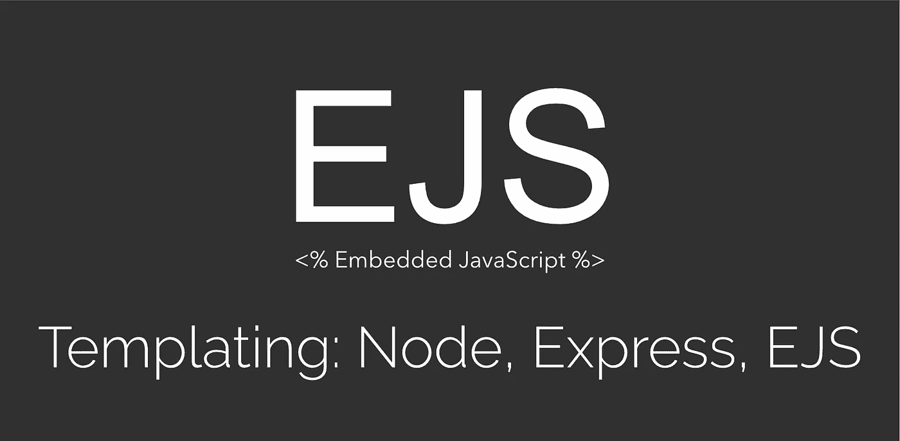
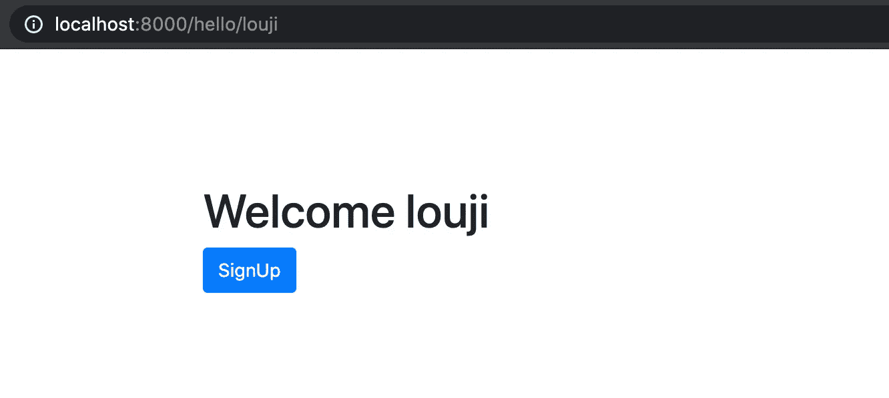
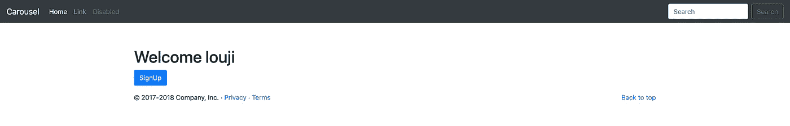

# 用 EJS 在 Node.js 中编写模板(嵌入式 JavaScript)

> 原文：<https://javascript.plainenglish.io/node-js-template-engine-bb87c9357e3d?source=collection_archive---------2----------------------->



Cover Image

模板引擎是表示层，它实际上以 HTML 格式呈现我们的数据。默认情况下，express 为我们提供了发送 HTML 文件的功能。使用该功能，我们可以只发送静态页面。如果我们需要在 HTML 文件中注入任何数据，我们需要一个模板引擎。此外，模板引擎将我们的代码分成多个组件，如页眉、页脚、正文等等。因此我们可以在任何布局中重用任何组件。这使得我们的应用程序更具可伸缩性，并帮助我们用最少的代码创建一个 HTML 模板。

对于 NodeJS，有很多模板引擎，比如`Pug`、`Haml.js`、`EJS`、`React`、`hbs`、`Squirrelly`等等。在这篇博客中，我将解释 EJS，它是最常用的模板引擎之一。

## **什么是 EJS？**

EJS 是与 Node JS 一起使用的模板引擎之一，通过普通 Javascript 生成 HTML 标记。EJS 代表**嵌入式 JavaScript 模板。**客户端和服务器端都可以使用。

## 目录

1.  [创建节点 JS 项目](#0641)
2.  [渲染一个 HTML 文件](#a7ab)
3.  [渲染 EJS 模板](#3ff1)
4.  [包括模板](#634b)

## **1。创建 Node.js 项目**

用命令`npm init`创建一个新目录并初始化节点。

```
mkdir expresstemplate
cd expresstemplate/
npm init -y
npm i nodemon
```

Express JS 是 node JS 的开源 web 框架。以下命令将 express 安装到我们的项目中。

```
npm install express --save
```

[](https://expressjs.com/en/starter/installing.html) [## 安装

### 假设您已经安装了 Node.js，创建一个目录来保存您的应用程序，并使它成为您的工作…

expressjs.com](https://expressjs.com/en/starter/installing.html) 

`package.json`

```
"scripts": {
  **"start": "nodemon index.js",**
  "test": "echo \"Error: no test specified\" && exit 1"
},
```

`index.js`

```
const express = require('express')
var app = express()app.get('/', function(req,res){
  res.send('Hello world')
})app.listen(8000,function(){
  console.log('Listening to PORT 8000')
})
```

## 2.**渲染一个 HTML 文件**

首先，让我们呈现一个静态的 HTML 模板。我正在项目的根目录下创建一个简单的名为`index.html`的引导 HTML 页面。

`index.html`

```
<!doctype html>
<html lang="en">
  <head>
    <meta charset="utf-8">
    <meta name="viewport" content="width=device-width, initial-scale=1, shrink-to-fit=no">
 **<link rel="stylesheet" href="https://stackpath.bootstrapcdn.com/bootstrap/4.5.2/css/bootstrap.min.css" integrity="sha384-JcKb8q3iqJ61gNV9KGb8thSsNjpSL0n8PARn9HuZOnIxN0hoP+VmmDGMN5t9UJ0Z" crossorigin="anonymous">**
    <title>Template Enginer Node JS</title>
  </head>
  <body>
 **<div class='container' style="margin-top: 100px">
      <div class="hero-unit">
        <h1>Bootstrap</h1>
          <p>
            <a class="btn btn-primary btn-large">
              SignIn
            </a>
          </p>
      </div>
    </div>** <script src="https://code.jquery.com/jquery-3.5.1.slim.min.js" integrity="sha384-DfXdz2htPH0lsSSs5nCTpuj/zy4C+OGpamoFVy38MVBnE+IbbVYUew+OrCXaRkfj" crossorigin="anonymous"></script> <script src="https://cdn.jsdelivr.net/npm/popper.js@1.16.1/dist/umd/popper.min.js" integrity="sha384-9/reFTGAW83EW2RDu2S0VKaIzap3H66lZH81PoYlFhbGU+6BZp6G7niu735Sk7lN" crossorigin="anonymous"></script> <script src="https://stackpath.bootstrapcdn.com/bootstrap/4.5.2/js/bootstrap.min.js" integrity="sha384-B4gt1jrGC7Jh4AgTPSdUtOBvfO8shuf57BaghqFfPlYxofvL8/KUEfYiJOMMV+rV" crossorigin="anonymous"></script> </body>
</html>
```

现在，创建一个路由`/hello`，它将我们的`index.html`文件作为响应发送给客户端。

`index.js`

```
const express = require('express')
var app = express()app.get('/', function(req,res){
  res.send('Hello world')
})
**app.get('/hello', function(req,res){
  res.sendFile(__dirname + '/index.html')
})**app.listen(8000,function(){
  console.log('Listening to PORT 8000')
})
```

完成后，在浏览器中访问 [http://localhost:8000/](http://localhost:8000/) 。您应该会看到这样的页面。


Sending Response as a File

当我们处理一个静态文件时，我们可以使用它。在动态布局的情况下，这并不合适，因为我们不能向 HTML 页面注入任何值。这就是我们转向 EJS 或其他模板引擎的原因。

## 3.**渲染 EJS 模板**

 [## EJS

### e 代表有效的。EJS 是一种简单的模板语言，让你用普通的 JavaScript 生成 HTML 标记…

ejs.co](https://ejs.co/#install) 

如前所述，EJS 是服务器端和客户端最常用的模板引擎之一。

## 基本语法

a.**条件的无缓冲代码** `<% code %>` —该语法用于处理条件。语法通常用于有条件地呈现值或模板。

```
**<% if (user) { %>
**   //ToDo: Perform something if user exist
**<% } else { %>
**   //ToDo: Perform something if user does not exist
**<% } %>**
```

b.**默认情况下转义 HTML**`<%= code %>`—该语法用于呈现值。

```
<h2>**<%= user.name %>**</h2>
```

c.**未转义缓冲** `<%- code %>` —当我们想要包含一个外部模板时，使用这个语法。

```
**<%- include('../views/profile')-%>**
```

EJS 的安装和设置太简单了。使用下面的命令为您的项目安装 EJS。

```
npm install ejs
```

安装完成后，在根目录下创建一个名为`views`的文件夹。创建之后，在服务器文件中添加下面一行。对我来说，它是`index.js`文件。下面一行告诉 express 我的模板保存在`views`文件夹下。

`index.js`

```
**app.set('views', path.join(__dirname, 'views'));
app.set('view engine', 'ejs')**
```

为了演示，我创建了一个简单的 HTML 页面，扩展名为`ejs`。

`views/hello.ejs`

```
<!doctype html>
<html lang="en">
  <head>
    <meta charset="utf-8">
    <meta name="viewport" content="width=device-width, initial-scale=1, shrink-to-fit=no">
    <link rel="stylesheet" href="https://stackpath.bootstrapcdn.com/bootstrap/4.5.2/css/bootstrap.min.css" integrity="sha384-JcKb8q3iqJ61gNV9KGb8thSsNjpSL0n8PARn9HuZOnIxN0hoP+VmmDGMN5t9UJ0Z" crossorigin="anonymous">
    <title>Template Enginer Node JS</title>
  </head>
  <body>
    <div class='container' style="margin-top: 100px">
      <div class="hero-unit">
       ** <h1>Welcome <%= param %></h1>**
          <p>
            <a class="btn btn-primary btn-large">
              SignUp
            </a>
          </p>
      </div>
    </div><script src="https://code.jquery.com/jquery-3.5.1.slim.min.js" integrity="sha384-DfXdz2htPH0lsSSs5nCTpuj/zy4C+OGpamoFVy38MVBnE+IbbVYUew+OrCXaRkfj" crossorigin="anonymous"></script><script src="https://cdn.jsdelivr.net/npm/popper.js@1.16.1/dist/umd/popper.min.js" integrity="sha384-9/reFTGAW83EW2RDu2S0VKaIzap3H66lZH81PoYlFhbGU+6BZp6G7niu735Sk7lN" crossorigin="anonymous"></script><script src="https://stackpath.bootstrapcdn.com/bootstrap/4.5.2/js/bootstrap.min.js" integrity="sha384-B4gt1jrGC7Jh4AgTPSdUtOBvfO8shuf57BaghqFfPlYxofvL8/KUEfYiJOMMV+rV" crossorigin="anonymous"></script></body>
</html>
```

在服务器文件中，我添加了一个新的路径，呈现了我的`hello.ejs`文件。有了这个文件，我将发送一些参数。该参数将以`param`的名称接收。因此，通过用 EJS 语法包装`param`，它返回给我从路由发送的参数。

`index.js`

```
const express = require('express')
var app = express()app.get('/', function(req,res){
  res.send('Hello world')
})app.get('/hello', function(req,res){
  res.sendFile(__dirname + '/index.html')
})**app.get('/hello/:name',function(req,res){
  res.render('hello',{param: req.params.name})
})**app.listen(8000,function(){
  console.log('Listening to PORT 8000')
})
```

当我导航到 http://localhost:8000/hello/娄机时，它返回我欢迎娄机。如果您导航到[http://localhost:8000/hello/m](http://localhost:8000/hello/louji)edium，它将返回欢迎介质。



Dynamically rendering params

## 4.**包括模板**

除了将值注入模板，EJS 还帮助我们重用 HTML 组件。

下面，我有两个文件名为`header.ejs`和`footer.ejs`。我在`views`文件夹中创建两个模板。

`views/header.ejs`

```
<html lang="en">
  <body>
    <header>
      <nav class="navbar navbar-expand-md navbar-dark fixed-top bg-dark">
        <a class="navbar-brand" href="#">Carousel</a>
        <button class="navbar-toggler" type="button" data-toggle="collapse" data-target="#navbarCollapse" aria-controls="navbarCollapse" aria-expanded="false" aria-label="Toggle navigation">
          <span class="navbar-toggler-icon"></span>
        </button>
        <div class="collapse navbar-collapse" id="navbarCollapse">
          <ul class="navbar-nav mr-auto">
            <li class="nav-item active">
              <a class="nav-link" href="#">Home <span class="sr-only">(current)</span></a>
            </li>
            <li class="nav-item">
              <a class="nav-link" href="#">Link</a>
            </li>
            <li class="nav-item">
              <a class="nav-link disabled" href="#">Disabled</a>
            </li>
          </ul>
          <form class="form-inline mt-2 mt-md-0">
            <input class="form-control mr-sm-2" type="text" placeholder="Search" aria-label="Search">
            <button class="btn btn-outline-success my-2 my-sm-0" type="submit">Search</button>
          </form>
        </div>
      </nav>
    </header>
  </body>
</html>
```

`views/footer.ejs`

```
<html lang="en">
  <body>
    <footer class="container">
      <p class="float-right"><a href="#">Back to top</a></p>
      <p>&copy; 2017-2018 Company, Inc. &middot; <a href="#">Privacy</a> &middot; <a href="#">Terms</a></p>
    </footer>
  </body>
</html>
```

在我的`hello.ejs`文件中，我使用了一个叫做`include,` 的东西，它包括了`hello.ejs`文件中的`header.ejs`和`footer.ejs`。同样，我们可以在任何布局中重用相同的页眉和页脚。

`views/hello.ejs`

```
<!doctype html>
<html lang="en">
  <head>
    <meta charset="utf-8">
    <meta name="viewport" content="width=device-width, initial-scale=1, shrink-to-fit=no">
    <link rel="stylesheet" href="https://stackpath.bootstrapcdn.com/bootstrap/4.5.2/css/bootstrap.min.css" integrity="sha384-JcKb8q3iqJ61gNV9KGb8thSsNjpSL0n8PARn9HuZOnIxN0hoP+VmmDGMN5t9UJ0Z" crossorigin="anonymous">
    <title>Template works</title>
  </head>
  <body>
    **<%- include('../views/header.ejs')-%>**
    <div class='container' style="margin-top: 100px">
      <div class="hero-unit">
        <h1>Welcome <%= param %></h1>
        <p>
          <a class="btn btn-primary btn-large">
            SignUp
          </a>
        </p>
      </div>
    </div>
    **<%- include('../views/footer.ejs')-%>** <script src="https://code.jquery.com/jquery-3.5.1.slim.min.js" integrity="sha384-DfXdz2htPH0lsSSs5nCTpuj/zy4C+OGpamoFVy38MVBnE+IbbVYUew+OrCXaRkfj" crossorigin="anonymous"></script> <script src="https://cdn.jsdelivr.net/npm/popper.js@1.16.1/dist/umd/popper.min.js" integrity="sha384-9/reFTGAW83EW2RDu2S0VKaIzap3H66lZH81PoYlFhbGU+6BZp6G7niu735Sk7lN" crossorigin="anonymous"></script> <script src="https://stackpath.bootstrapcdn.com/bootstrap/4.5.2/js/bootstrap.min.js" integrity="sha384-B4gt1jrGC7Jh4AgTPSdUtOBvfO8shuf57BaghqFfPlYxofvL8/KUEfYiJOMMV+rV" crossorigin="anonymous"></script>
  </body>
</html>
```



Including Template

[请查看我之前的博客，我在那里解释了模型和数据库](https://medium.com/@sjlouji10/node-js-models-and-database-3836f0c7f2da)

如有任何疑问，请随时联系我。电子邮件:sjlouji10@gmail.com。领英:[https://www.linkedin.com/in/sjlouji/](https://www.linkedin.com/in/sjlouji/)

我的 GitHub 上的完整代码:

[](https://github.com/sjlouji/NodeJS-Template-Engine---Medium) [## sjlouji/NodeJS-Template-Engine-Medium

### 在 GitHub 上创建一个账号，为 sjlouji/NodeJS-Template-Engine-Medium 开发做贡献。

github.com](https://github.com/sjlouji/NodeJS-Template-Engine---Medium) 

编码快乐！