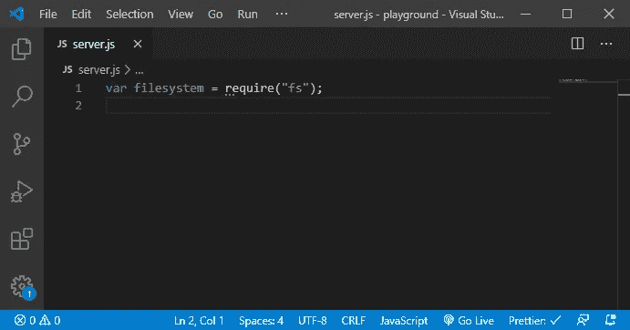
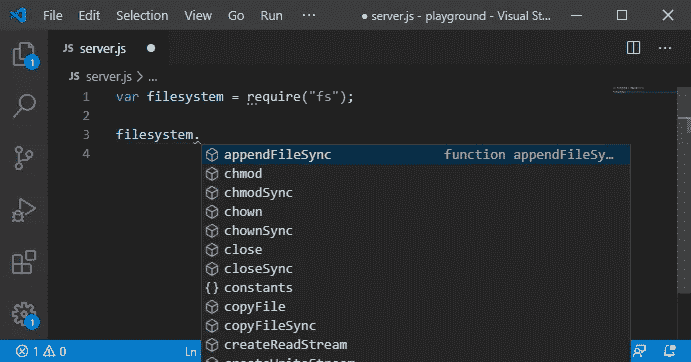
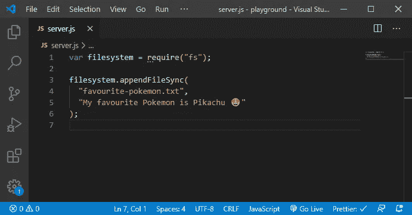
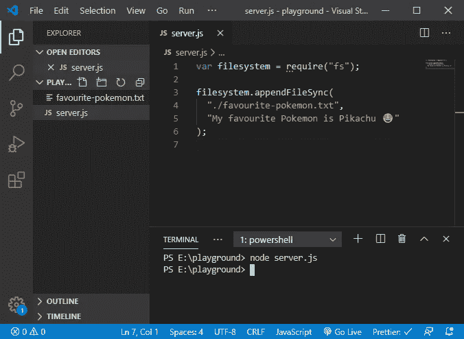
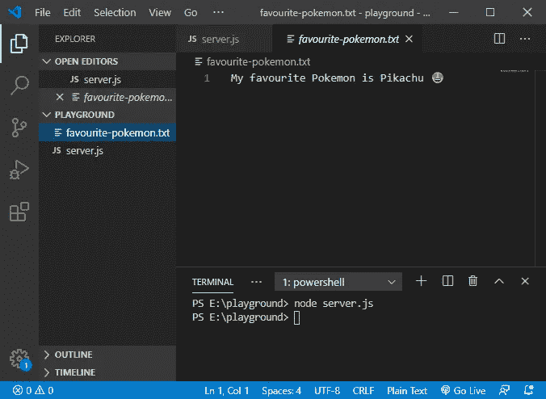

# Node.js:了解文件系统模块

> 原文：<https://javascript.plainenglish.io/node-js-understanding-file-system-module-5c609eca9d7a?source=collection_archive---------9----------------------->


Photo by [Kolar.io](https://unsplash.com/@jankolar?utm_source=medium&utm_medium=referral) on [Unsplash](https://unsplash.com?utm_source=medium&utm_medium=referral)

Node 的文件系统模块`fs`允许我们在操作系统中玩文件。

那么，它能帮我做什么呢？系统上任何类型的 CRUD 操作(创建、读取、更新和删除)。创建日志文件，在设定的时间间隔后从 api 保存及时的天气数据，等等。

完成(CRUD 的)创建部分的草稿后。我发现这个帖子会很长。我最初的方法是解释所有的 4 个 CRUD 操作，但是我详细解释了每一个代码语法，以尽可能有意义地解释它。

这一定会帮助你理解和建立 Node.js 的基础。

所以现在，我需要把 **Node.js:理解文件系统模块**分解成 4 个部分。这是第一部分——创建。我一写完就会在这里更新链接。

我们开始吧。😎

> ***⚠️*** ***重要:*** 此时我假设你已经安装了 Node.js，我希望你能按照它来编码，这将有助于你更好地理解。可以去 [Node.js 官网](https://nodejs.org/en/download/)安装。
> 
> **💡提示:** 对于本教程，我将使用 Visual Studio 代码编辑器，并推荐。

# 步骤 1:加载文件系统模块

为了使用文件系统模块，我们首先需要将它导入到我们的文件中。我们通过在新的`server.js`文件中添加以下代码来做到这一点。

```
var filesystem = require("fs");
```



👊让我们来分解这段代码:

1.  `fs`是我们的文件系统模块，在你安装 node 的时候已经预打包好了。
2.  我们使用`require()`函数来加载我们的`server.js`文件中的模块。*注意:* `*require()*` *是 node.js 的一部分不是 JavaScript。*
3.  我们创建一个`filesystem`变量(你可以给它取任何名字，也可以是口袋妖怪),并将**引用**分配给我们加载的`fs`模块。这样我们就可以在代码中使用它。

> ***⚡学习:*** `filesystem`引用了`fs`模块，但没有将完整的`fs`模块放入其中(或复制)。[这种做法叫做引用传递](https://codeburst.io/explaining-value-vs-reference-in-javascript-647a975e12a0)，只有原始数据类型可以通过值传递。

现在，我们可以通过`filesystem`使用所有的文件系统模块工具。转到新行，键入`filesystem.`(带。)你会看到我们可以使用的所有可用方法。



# 步骤 2:创建我们的口袋妖怪文件

让我们执行创建的第一个 CRUD 操作。我们将创建一个文本文件，向其中添加一些信息并保存它。实际上，除了写代码，我们什么也不做，一切都将由我们的服务器自动完成😉。

将下面几行代码添加到下一行，就在我们加载`fs`模块的地方。别忘了点击**保存(Ctrl + S)** 。

```
filesystem.appendFileSync("favourite-pokemon.txt","My favourite Pokemon is Pikachu 😍");
```



👊让我们来分解这段代码:

1.  `appendFileSync()`是文件系统模块中的方法之一，用于将**指定的内容追加到文件**中。如果我们没有档案呢？别担心它会被创造出来。
2.  `appendFileSync(**path**, **data, option**)`需要 3 个参数。
3.  在`**path**`中，我可以使用像这样的东西`./favourite-pokemon.txt`，它仍然可以工作。为什么？因为它在当前目录中寻找文件名`favourite-pokemon.txt`，或者我应该说你的`server.js`文件在哪里。如果没有找到，它将简单地创建一个。
4.  在`**data**`中，我们可以放置任何类型的字符串。只要确保把它放在`""`引号之下。
5.  `**option**`是可选的，因此我没有在第三个参数中放任何东西。基本上用于指定`encoding`、`mode`和`flag`。为了简单起见，我这里就不解释了，但是你可以随时[了解可选参数是如何工作的](https://stackoverflow.com/questions/27920892/in-fs-writefileoption-how-an-options-parameter-generally-work)。

我们的文件系统模块也有其他方法来创建文件。`appendFile()`、`open()`和`writeFile()`。

> *❓* ***问题:***`appendFileSync()`和`appendFile()`有什么区别？既然都是用来向文件追加数据，那么**同步**或者**异步**追加数据的方式有什么重要性呢？
> 
> 请在评论中告诉我，否则我会在下一篇文章中解释。敬请关注。

# 步骤 3:运行我们的服务器

我们有了我们需要的一切，我们加载了我们的文件系统模块`fs`并为它创建了一个引用变量`filesystem`，然后我们告诉我们的服务器创建文件`favourite-pokemon.txt`，并用`appendFileSync()`方法用我最喜欢的口袋妖怪名字填充它。

现在是 Node.js 执行命令的时候了。让我们启动我们的服务器。

点击`Ctrl` + ```(反勾键)打开 VS 代码中的终端。确保您在您的`server.js`文件所在的目录中。然后点击`Enter`执行以下命令。

```
node server.js
```



你会注意到在编辑器的左侧叫做**浏览器**，有一个新文件被创建`favourite-pokemon.txt` *(按*`*Ctrl*`*+*`*Shift*`*+*`*E*`*打开浏览器)*。点击该文件，你会看到我们的服务器已经成功地创建了我最喜欢的口袋妖怪的文件。万岁！🎉



因为我们没有告诉我们的服务器继续运行，节点将执行代码并终止它。

# 知道一些有趣且有帮助的事情吗？

请在这里告诉我，或者在 Twitter 上关注我。你的贡献将有助于使这篇文章更有价值，并帮助像你我这样的人。

## **简明英语团队的笔记**

你知道我们有四种出版物吗？给他们一个 follow 来表达爱意:[**JavaScript in Plain English**](https://medium.com/javascript-in-plain-english)[**AI in Plain English**](https://medium.com/ai-in-plain-english)[**UX in Plain English**](https://medium.com/ux-in-plain-english)[**Python in Plain English**](https://medium.com/python-in-plain-english)**—谢谢，继续学习！**

**此外，我们总是有兴趣帮助推广好的内容。如果您有一篇文章想要提交给我们的任何出版物，请发送电子邮件至[**submissions @ plain English . io**](mailto:submissions@plainenglish.io)**，附上您的媒体用户名和您感兴趣的内容，我们将会回复您！****