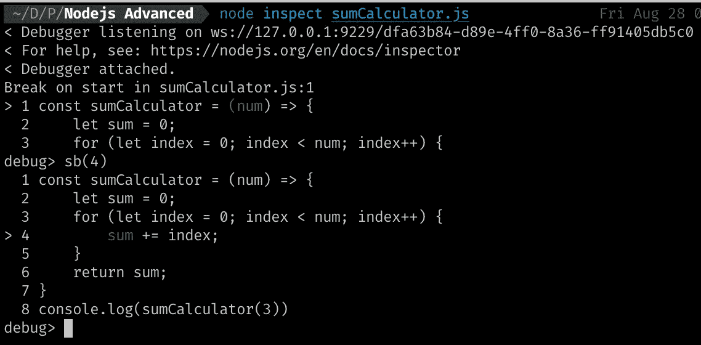

# 利用 Node.js 的内置调试器

> 原文：<https://javascript.plainenglish.io/nodejs-built-in-debugger-856a9a3c054b?source=collection_archive---------6----------------------->

## 不使用“调试器”调试 Node.js 中的文件


让我们想象一下，我有一个简单的 JavaScript 文件，我想计算整数的和，但是我有一个问题，我想**调试**这个文件(但是我不想使用`console.log`作为调试器！)

这是文件:


A simple function that we are going to debug.

为了使用调试模式，我们需要使用以下命令运行文件:

```
node **inspect** sumCalculator.js
```

此外，我们可以使用此命令，但已被否决:

```
node **debug** sumCalculator.js
```

当我们进入**调试模式**时，我们可以在控制台上看到这些行:


Nodejs debug mode

正如我们所看到的，调试器正在监听端口 **9229** 和一个唯一的 URL。在调试模式下学习了一些命令后，我们将使用这个 URL。

我们可以使用`help`命令来看看我们在这里能做什么:`help`


Nodejs debug commands

## 基本调试命令:

*   继续执行(continue): `c`或`cont`
*   下一行:`n`或`next`
*   进入功能:`s`或`step`
*   退出:`o`或`out`
*   设置断点:`sb`或`setBreakpoint`
*   清除断点:`sc`或`clearBreakpoint`

`repl`命令为我们提供了一条`repl`模式命令行，我们可以在调试模式下访问函数和变量。(或如 Node.js 文档定义:打开调试器的`repl`在调试脚本的上下文中进行评估)

## 让我们调试这个简单的文件

首先，我们需要一个断点。我认为第 4 行是我们设置断点的最佳位置。因此，为了在第 4 行设置断点，我们需要执行以下命令:`sb(4)`



Setting a breakpoint

我们可以使用`cont`命令，但是如果我们看不到变量，那又有什么意义呢？
调试模式下检查变量有两种方式:

1.`repl`进入`repl`模式，可以访问变量和函数并进行检查。

2.使用`watch`。

我们将使用第二种方式，因为当我们处于循环中时，这是一种更好的方式:

```
watch('index')
watch('sum')
```

注意*手表*功能期待*一串*。

当我启动调试器时，我可能会遇到这样的错误:`sum is not defined`这没问题，因为在到达断点之前，这些变量没有被定义。

如果我们使用`cont`，那么我们可以看到这些变量的值:


Watching values

所以我估计我函数的问题是我是从 0 开始的！

## 在浏览器中调试

我们希望使用 chrome 开发工具来调试任何脚本:

1.  进入调试模式:`node inspect yourFile.js`
2.  打开 chrome，在地址栏输入`chrome://inspect`。


chrome inspect tool

您可以看到，由于调试模式的端口，chrome 正在监视该文件，通过单击蓝色的 inspect 文本，我们可以在 chrome 中进入调试模式:


chrome inspect tool

现在，您可以通过图形方式访问所有调试选项。