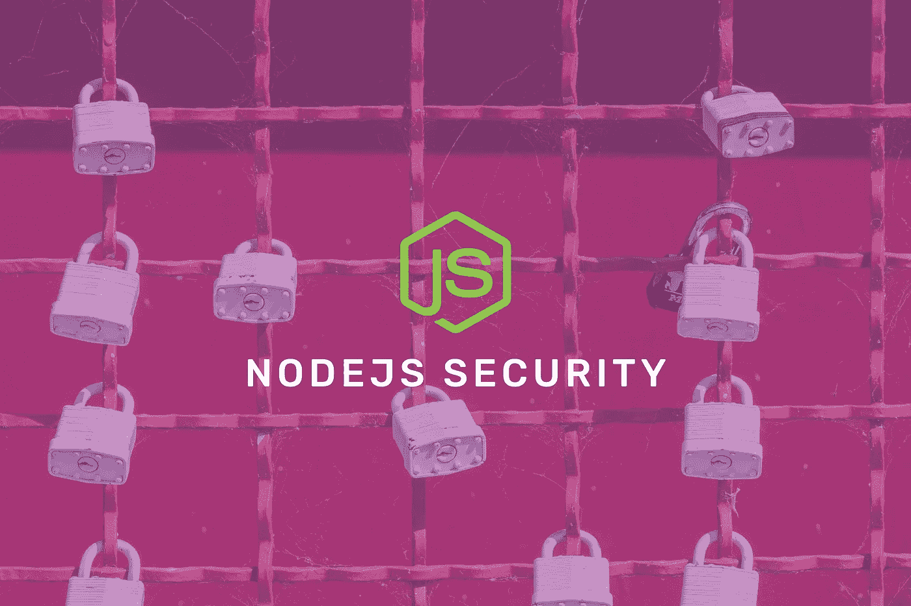

# NodeJS 安全最佳实践

> 原文：<https://javascript.plainenglish.io/nodejs-security-best-practices-542528f910?source=collection_archive---------2----------------------->

在本文中，我们将介绍一些保护节点应用程序的最佳实践。这些实践将指导您检查可能的漏洞问题，并在任何人发现它之前修复它。

[Unsplash](http://unsplash.com/)

考虑安全性很难。尽管如此，开发者需要准备好面对任何可能发生在你的应用上的伤害。在这里，我们将涵盖一些众所周知的问题，一般开发人员在开发应用程序时会忽略这些问题。

# 背景

当 Ryan Dahl 在 2009 年左右推出 Node 时，javascript 生态系统出现了巨大的繁荣。领英、沃尔玛、贝宝、易趣、优步等顶级公司开始采用它。积极的一点是，我们现在可以在应用程序的后端和前端使用一种语言。随着它的流行，Node 也出现了一些安全问题。

Npm 是世界上最大的开源软件包生态系统之一。拥有超过 50 万个包，每天增加 500 个新模块。我们每周下载这些包超过 30 亿次。在这种规模下，生态系统的安全是重中之重。开源社区中的包发现了一些安全风险。

> 您的攻击者只需要做一次正确的事情，而作为应用程序开发人员，您必须始终正确。
> -来源 NA

# 安全需求

2015 年，发布到 [npm](https://www.npmjs.com/) 的一个名为 rimrafall 的包(实际上之前有一个名为 rimraf 的包)被发现是恶意的，并从 npm 中移除。另一个包是 validator，听起来与 validator.js 相似，也被发现具有威胁性。还发现了类似名称 socket.io 和 uglifyjs 的另一个包 socketio。

带着这些问题，npm 在 2018 年开始关注安全，当时他们发布了 [npm audit](https://blog.npmjs.org/post/173719309445/npm-audit-identify-and-fix-insecure) ，这是一个新命令，可以对项目的依赖关系树进行即时安全审查，并生成 npm 审计安全报告。该报告包含依赖关系中安全漏洞的相关信息，并提供 npm 命令和进一步故障排除的建议。幸运的是，Node.js 安全项目和 Snyk 都有安全建议，两家公司都提供付费订阅计划，以便在 CI/CD 环境中运行它们的工具。

# 保护我们应用的方法

让我们着手研究如何使我们的应用程序更加安全。我们将讨论最常见的保持安全的方法。讨论的大部分内容暗示了所有的语言和框架，而不仅仅是 NodeJS。

## **不使用不推荐使用的包或版本**

考虑当前版本中的更新，该版本考虑了安全性和性能问题。但是社区中不太了解的旧版本和包是不要用的。

## 使用 linter 安全规则

我们需要利用安全相关的插件和类似的插件。类似地使用这些插件有助于我们在编写代码时尽早发现安全漏洞和问题。这也有助于保持代码实践的一致性。

## 使用严格模式

有了这个标志，我们可以限制 Javascript 变体。严格模式不仅仅是一个子集:它*有意地*具有不同于普通代码的语义。它通过改为抛出错误来帮助我们消除一些 Javascript 错误，一些使我们难以执行优化的错误，这种模式有时比非严格模式的相同代码运行得更快，并且它还禁止一些可能在 ECMAScript 的未来定义的语法。

## 分析静态代码

利用 JSHint、JSLint 或 ESLint，我们可以在代码的早期发现许多潜在的问题。

## 使用头盔模块

顾名思义，它代表着对任何事情的预防。头盔通过查看各种 HTTP 头帮助我们保护我们的应用程序，如:

*   [X-Frame-Options](https://helmetjs.github.io/docs/frameguard/) 缓解点击劫持攻击，
*   严格的传输安全措施让你的用户呆在 HTTPS，
*   [X-XSS-保护](https://helmetjs.github.io/docs/xss-filter/)阻止 XSS 的反射攻击，
*   [X-DNS-Prefetch-Control](https://helmetjs.github.io/docs/dns-prefetch-control/) 禁用浏览器的 DNS 预取。

该模块支持更多的标题，要了解所有细节，你可以去链接[这里](https://helmetjs.github.io/docs/)。DNS 预取极大地提高了您的网页的性能，因为它甚至在用户实际点击链接之前就解析了 DNS 名称，但是它被认为是一个信息泄漏漏洞。

[Unsplash](http://unsplash.com/)

## 安全使用 cookies

为了确保 cookie 不会打开您的应用程序进行利用，我们不应该使用默认的会话 cookie 名称，并适当地设置 cookie 安全选项。我们还可以使用中间件 cookie 会话模块，如[快速会话](https://www.npmjs.com/package/cookie-session)或 [cookie 会话](https://www.npmjs.com/package/cookie-session)我们还需要知道 cookie 数据对客户端也是可见的。

## 保护授权

我们可以系统地列举所有可能的候选解，并检查每个候选解是否满足问题的陈述。在 web 应用程序中，登录端点可能是最适合的。

为了保护我们的应用免受这种攻击，你必须实现某种[速率限制](https://www.npmjs.com/package/ratelimiter)。我们也可以使用限速器包，或者封装在一个中间件中，放在我们的路由之间。

## 使用包增加安全性

有许多软件包可以帮助我们在应用程序中添加安全层，其中一些是:

*   防止跨站点伪造请求的中间件(CSRF)。
*   使用开源 [sqlmap](http://sqlmap.org/) 工具检测应用程序中的 SQL 注入漏洞。
*   使用 [nmap](https://nmap.org/) 和[SSL ze](https://github.com/nabla-c0d3/sslyze)工具来测试您的 SSL 密码、密钥和重新协商的配置以及您的证书的有效性。
*   使用 [safe-regex](https://www.npmjs.com/package/safe-regex) 来确保你的正则表达式不容易受到[正则表达式拒绝服务](https://www.owasp.org/index.php/Regular_expression_Denial_of_Service_-_ReDoS)攻击。

## 验证用户输入

在构建安全的应用程序时，这是我们应该做的最重要的事情之一。不这样做可能会有各种各样的攻击，包括[命令注入](https://www.owasp.org/index.php/Command_Injection)、 [SQL 注入](https://www.owasp.org/index.php/SQL_Injection)或[存储的跨站脚本](https://www.veracode.com/security/sql-injection)。

我们可以验证用户输入，我们可以使用的流行库是 [joi](https://www.npmjs.com/package/joi) 。Joi 是 JavaScript 对象的对象模式描述语言和验证器。

## 处理错误

当面临编码错误时，我们可能会泄露底层基础设施的敏感细节，比如:x-Powered-By:Express

堆栈跟踪不被视为漏洞，但它们通常会揭示攻击者可能感兴趣的信息。作为产生错误的操作的结果提供调试信息被认为是一种不好的做法。

[Unsplash](http://unsplash.com/)

## 避免使用 eval 语句

`Eval` —也称为 evil statement —允许在运行时执行自定义 JS 代码。这不仅是一个性能问题，也是一个重要的安全问题，因为恶意 JavaScript 代码可能来自用户输入。另一个应该避免的语言特性是`new Function`构造函数。`setTimeout`和`setInterval`也不应该被传递动态 JavaScript 代码。

## 保护我们的正则表达式

有一种称为[正则表达式拒绝服务](https://www.owasp.org/index.php/Regular_expression_Denial_of_Service_-_ReDoS)攻击的攻击媒介，它暴露了这样一个事实，即大多数正则表达式实现可能会遇到特殊制作的输入的极端情况，导致它们工作极其缓慢。

结合 Node.js 本质上是单线程的这一事实，只需一个用户输入就可以关闭整个服务器。能够做到这一点的正则表达式通常被称为**邪恶的正则表达式**。这些表达包括:重复分组，重复组内:重复，或重叠交替

邪恶正则表达式的例子: *(a+)+，([a-zA-Z]+)*，(a|aa)+*

## 节点安全工具和项目

[npm 审计](https://docs.npmjs.com/cli/audit):对我们的包进行安全审计

[npm-shrinkwrap](https://docs.npmjs.com/cli/audit) :这个命令把`**package-lock.json**`重新变成一个可发布的`**npm-shrinkwrap.json**`或者简单的创建一个新的。该命令创建和更新的文件将优先于任何其他现有或未来的`**package-lock.json**`文件。

[要求安全](https://www.npmjs.com/package/requiresafe):检查脆弱性

[retire.js](https://retirejs.github.io/retire.js/) :这个包帮助我们检测出存在已知漏洞的模块版本的使用。用`npm install -g retire`简单安装。之后，用`retire`命令运行它会在你的`node_modules`目录中寻找漏洞。

[express-security](https://github.com/gergelyke/express-security.txt) :这个包是针对 express framework 的。如果我们想将它添加到您的应用程序中，以帮助研究人员向您报告安全漏洞。

sqlmap :这是一款开源渗透测试工具，可以自动检测和利用 SQL 注入漏洞，接管数据库服务器。

snyk :它类似于 Node Security 项目，但是它的目标是提供一个工具，不仅可以检测，还可以修复代码库中与安全相关的问题。

# 结论

虽然我们没有涵盖所有内容。我希望这篇研究文章能够帮助您更好地理解 Node.js 生态系统中的安全性是如何工作的，以及您可以采取哪些步骤来使您的 Node.js 应用程序更加安全。

如果你想联系我，这是我的推特账号

编码快乐！

## **用简单英语写的 JavaScript 笔记**

我们已经推出了三种新的出版物！请关注我们的新出版物，表达对它们的喜爱:[**AI in Plain English**](https://medium.com/ai-in-plain-english)，[**UX in Plain English**](https://medium.com/ux-in-plain-english)，[**Python in Plain English**](https://medium.com/python-in-plain-english)**——谢谢，继续学习！**

**我们也一直有兴趣帮助推广高质量的内容。如果您有一篇文章想要提交给我们的任何出版物，请发送电子邮件至[**submissions @ plain English . io**](mailto:submissions@plainenglish.io)**，并使用您的 Medium 用户名，我们会将您添加为作者。另外，请让我们知道您想加入哪个/哪些出版物。****

# ****参考读物****

**** [## Node.js 安全手册| Sqreen

### Sqreen 的使命是让工程师能够构建安全、可靠的 web 应用程序。我们已经将我们的安全知识…

www.sqreen.com](https://www.sqreen.com/resources/nodejs-security-handbook)  [## 介绍

### OWASP 备忘单系列的创建是为了提供关于特定领域的高价值信息的简明集合

cheatsheetseries.owasp.org](https://cheatsheetseries.owasp.org/)  [## NodeJS 安全头:101 |黑客正午

### 当我们谈论任何 web 应用程序的安全性时，它是一个多维度的事情，它将涉及许多…

hackernoon.com](https://hackernoon.com/nodejs-security-headers-101-mf9k24zn)  [## goldbergyoni/nodebestpractices

### 在 Twitter 上关注我们！@nodepractices 用不同的语言读:CN，BR，RU ( ES，FR，HE，KR，TR 进行中！)…

github.com](https://github.com/goldbergyoni/nodebestpractices)****