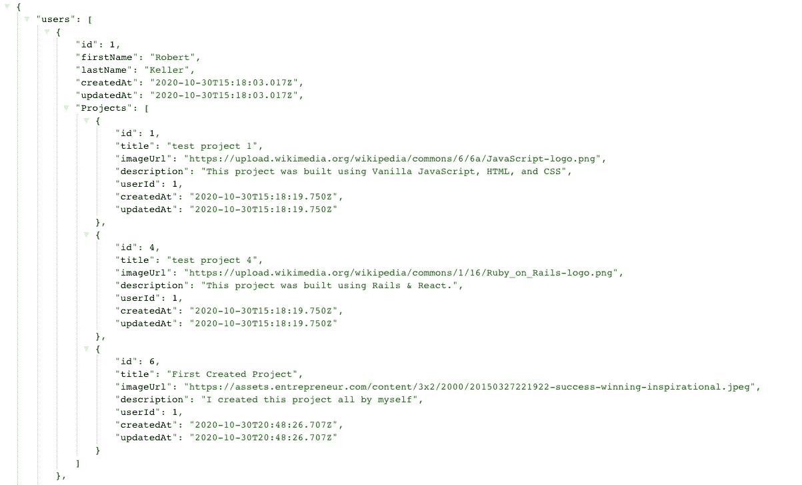

# 用 Node.js、Sequelize、PostgreSQL 连接关系数据库和后端

> 原文：<https://javascript.plainenglish.io/nodejs-sequelize-postgresql-wire-up-a-relational-db-and-backend-f7d3c4587ed0?source=collection_archive---------6----------------------->


Photo by [Lucian Alexe](https://unsplash.com/@lucian_alexe?utm_source=medium&utm_medium=referral) on [Unsplash](https://unsplash.com?utm_source=medium&utm_medium=referral)

一位熨斗学校的教师曾经告诉我，当学习一门新的语言、库或框架时，它有助于建立一个你以前已经建立的项目想法。这就去掉了“*我必须想出一个好主意才能开始编码”*这样你就可以专注于学习新技术的语法和架构。

这就是我在过去几周学习 [node.js](https://nodejs.org/en/) 的方法。

## 项目基础:

这是一个 DIY 分享网站，你可以上传带有图片的制作说明，并与其他用户分享。将会有一个带有推送通知的喜欢和标签系统(最终)。

## 我们今天要关注的是:

= >让一个 [PostgreSQL](https://www.postgresql.org/) 服务器连接到我们的 node.js 后端。
= >添加 Sequelize 作为 ORM 来建立两个模型之间的关系
= >创建我们模型的几个实例，并将它们存储在 DB 中
= >使用[失眠症](https://insomnia.rest/)通过调用后端调用我们的 DB 实例，这样我们就可以看到我们的成功了

创建顺序化应用程序:

我们将充分利用 Sequelize CLI 来帮助我们尽快完成 Sequelize 设置。我将留下一些链接来获取更多信息，包括命令的完整列表。

首先让我们启动一个节点应用程序并安装一些包。在您的项目目录中，运行以下命令:

```
npm init -y
npm install sequelize pg express
```

这会生成一个 package.json 文件，然后将 sequelize、express 和 postgreSQL 包添加到我们的应用程序中。

现在我们初始化一个 Sequelize 项目，并在我们最喜欢的编辑器中打开目录(这里是 VS 代码)

```
npx sequelize-cli init
```

要了解所有的 Sequelize CLI 命令，请看这里的

接下来，我们需要配置我们的 Sequelize 项目来使用 Postgres db。在`/config`目录中找到您的`config.json`文件，并修改代码，如下所示。

```
{
  "development": {
    "database": "<YOUR_PROJECT_NAME>_development",
    "dialect": "postgres"
  },
  "test": {
    "database": "<YOU_PROJECT_NAME>_test",
    "dialect": "postgres"
  },
  "production": {
    "use_env_variable": "DATABASE_URL",
    "dialect": "postgres",
    "dialectOptions": {
      "ssl": {
        "rejectUnauthorized": false
      }
    }
  }
}
```

env 变量将允许我们稍后轻松地部署到 Heroku。(另一篇博客中有更多相关内容)

现在我们可以使用 Sequelize CLI 来创建 Postgres DB。

```
npx sequelize-cli db:create
```

## 定义我们的模型并添加测试 api 的种子数据

我的应用程序有两个启动模型，用户和项目。每个项目将有一个用户，一个用户可以有许多项目。让我们首先创建用户，因为他们不需要另一个模型来创建实例。

```
npx sequelize-cli mode:generate --name User --attributes firstName:string,lastName:string
```

* *如果出现错误，请确保属性标志中没有空格。这将导致失败**

运行模型:生成自动创建我们的模型文件和我们的迁移文件，并带有我们指定的属性。如果您忘记了`/models/user.js`文件和`/migrations/<long number string>-create-user.js`文件中的内容，您可以手动编辑这些字段。你也可以删除上面提到的文件，并在修复后再次运行`model:generate`命令。

通过运行以下命令，迁移您的更改并在数据库中创建用户表

```
npx sequelize-cli db:migrate
```

现在让我们创建一个种子文件:

```
npx sequelize-cli seed:generate --name users
```

您将看到一个名为`/seeders`的新目录。在该文件中，以下列格式添加一些虚拟用户:

```
module.exports = {
   up: (queryInterface, Sequelize) => {
    return queryInterface.bulkInsert('Users', [{
      firstName: 'John',
      lastName: 'Doe',
      createdAt: new Date(),
      updatedAt: new Date()
    },
    { another user like above if you want}
    ], {});
},
   down: (queryInterface, Sequelize) => {
    return queryInterface.bulkDelete('Users', null, {});
  };
}
```

我们可以用和以前一样的方法制作我们的另一个模型`Projects`。

```
npx sequelize-cli model:generate --name Project --attributes title:string,description:text,userId:integer
```

现在我们可以把这两个模型联系起来

[这里的](https://sequelize.org/master/manual/assocs.html)是关于使用序列化 CLI 创建序列化关联的更多信息

首先，让我们将项目关联添加到 user.js 模型中。该关联被添加到`static associate(models)`方法中。

在`project.js`模型中，我们将添加同一关联的另一端，这样一个项目就可以属于一个用户

最后一步是将外键添加到项目迁移文件中。您应该在迁移中保存文件。我们需要处理文件名中带有`create-projects`的文件。

迁移新更改的项目文件，以在数据库上启动和运行项目表。

让我们用一些项目为我们的用户播种我们的数据库。

```
npx sequelize-cli seed:generate --name projects
```

您将在`/seeders`目录中找到新的种子文件。增加一些项目！

```
'use strict';*module*.*exports* = {up: async (*queryInterface*, *Sequelize*) => {await *queryInterface*.bulkInsert("Projects", [{title: "test project 1",description: "This project was built using Vanilla JavaScript, HTML, and CSS",userId: 1,createdAt: **new** *Date*(),updatedAt: **new** *Date*()},{title: "test project 2",description: "This project was built using React & a 3rd-party API.",userId: 3,createdAt: **new** *Date*(),updatedAt: **new** *Date*()},])/*** Add seed commands here.** Example:* await queryInterface.bulkInsert('People', [{*   name: 'John Doe',*   isBetaMember: false* }], {});*/},down: async (*queryInterface*, *Sequelize*) => {return *queryInterface*.bulkDelete('Projects', null, {})/*** Add commands to revert seed here.** Example:* await queryInterface.bulkDelete('People', null, {});*/}};
```

现在我们的关系已经设置好了，我们的模型也有了种子，我们可以运行种子文件来填充我们的 db。

```
npx sequelize-cli db:seed:all
```

我们可以通过一个`psql`查询来检查我们的数据是否快速命中数据库。

使用`psql <YOUR_PROJECT_NAME>_development`访问 thje psql 命令行

然后运行以下 SQL 查询

```
SELECT * FROM "Users" JOIN "Projects" ON "Users".id = "Projects"."userId";
```

您应该可以从数据库中获得一些数据。斯威特。

## 设置 Express

现在，我们的 Sequelize 部分已经启动并运行，让我们创建并表达 API，以便在我们从前端进行调用时提供我们的数据。

我们将再添加两个包(因为我们之前添加了 express)

```
npm i nodemon -D
npm i body-parser
```

[Nodemon](https://www.npmjs.com/package/nodemon) 将监听我们的 express 应用程序中的变化，并在发生变化时重新启动服务器，这样我们就不必担心是否是手动进行的。

[Body-parser](https://www.npmjs.com/package/body-parser) 将处理来自用户请求的信息。

让我们通过添加一个`routes`目录和`controllers`目录来为我们的逻辑的成功做准备。

在我们的根文件夹中添加一个`server.js`文件，这也是我们的 express 应用程序将要存放的地方。

为了简洁起见，我将通过用户路线和控制器来运行我们，但是对项目做同样的事情是非常相似的。

首先对`package.json`文件做一个小小的修改。我们将配置 nodemon 作为调用`npm start`时运行的默认脚本

```
....
  "scripts": {
    "test": "echo \"Error: no test specified\" && exit 1",
    "start": "nodemon server.js"
  },
....
```

让我们为我们的 Express 应用程序制作一个框架。在我们的 server.js 文件中，我们需要以下内容:

```
const express = require('express');
const routes = require('./routes');
const bodyParser = require('body-parser');
const usersRouter = require('./routes/users.routes')const PORT = process.env.PORT || 5000;const app = express();
app.use(bodyParser.json())
app.use('/api/users', usersRouter);app.listen(PORT, () => console.log(`Listening on port: ${PORT}`))
```

这是我们的基本 Express 服务器，它将监听端口 5000。我们将在`users.routes.js` 文件的`/routes` 目录中定义它们，而不是在这个文件中定义所有的路径。让我们现在制作文件，并添加我们的第一条路线。

在`/routes` 目录中创建一个名为`users.routes.js` 的文件，并添加以下内容，然后从 [http://localhost:5000](http://localhost:5000) 进行测试，以确保我们的节点应用程序能够工作。

```
const { Router } = require('express');
const controllers = require('../controllers');
const router = Router();router.get('/', (req, res) => res.send('This is root!'))module.exports = router
```

通过使用`npm start`启动快速服务器来测试路线

太好了。我们正在大步前进。花点时间喝杯水、咖啡等。你应得的。

回来了？让我们从数据库中传递一些数据。为此，我们需要一个用户控制器。在您的`/controllers` 目录中创建一个`users.controller.js`文件。

我们将创建一个`getAllUsers`函数，从数据库及其相关项目中获取所有用户。

在这个文件中，我们已经合并了来自我们的`/model`目录的用户和项目模型，并创建了一个`async`函数来获取数据并从数据库返回它。如果成功，我们返回带有 200 状态码的响应和 JSON 格式的数据。我们导出函数，这样我们就可以在我们的`users.routes.js`文件中访问它。让我们在那里添加它，并测试它。

在我们的`users.routes.js`文件中，让我们设置一个路径来处理这个函数，并导入我们的`users.controller.js`文件来访问它。将以下内容添加到我们的路线中。

```
const usersController = require('../controllers/users.controller')
//replace our cuurent route with the following
router.get('/', usersController.getAllUsers)
```

请记住，我们将 server.js 文件设置为在调用`/api/users`时使用这个路由器，因此在测试时，我们需要运行一个 get 请求到`[http://localhost:5000/api/users/](http://localhost:5000/api/users/)`

如果进展顺利，我们应该能够在服务器运行时在浏览器中测试这一点。我们得到的结果应该是这样的(我的用户和项目比我在本教程中得到的要多一些)。



our data from the db

您可以看到每个用户都有一个 Projects 键，其中包含所有项目及其 userId。

## 接下来呢？

在这里，您可以添加所有必要的路由和控制器动作，以便为您的项目和用户在 API 上执行所有 CRUD 动作

## 最终想法:

自从完成 bootcamp 后，我一直专注于 JavaScript，现在我可以说，与使用 Ruby on Rails 相比，使用 Express 和 Sequelize，我可以更快地在项目中安装和运行后端 API。我将继续这个项目，并将图像添加到数据库中，并将在博客中介绍如何进行设置。(希望比 Rails 活动存储更容易)

# 黑客快乐！

## 资源:

[](https://expressjs.com/) [## Express - Node.js web 应用程序框架

### Express 是一个最小且灵活的 Node.js web 应用程序框架，它为 web 和…

expressjs.com](https://expressjs.com/)  [## 序列

### Sequelize 是一个基于 promise 的 Node.js ORM，用于 Postgres、MySQL、MariaDB、SQLite 和 Microsoft SQL Server。它的特点是…

sequelize.org](https://sequelize.org/) [](https://www.postgresql.org/) [## 一种数据库系统

### 2020-09-24 - PostgreSQL 13 发布！PostgreSQL 全球开发小组今天宣布发布 PostgreSQL…

www.postgresql.org](https://www.postgresql.org/) 

## 与我联系

 [## 罗伯特·凯勒-志愿者-软件工程师-战斗流行病| LinkedIn

### 我喜欢做东西，通常用代码，有时用木头，总是有很高水平的细节。我曾经解决过…

www.linkedin.com](https://www.linkedin.com/in/robert-keller-dev/) [](https://github.com/MisterRK) [## MisterRK -概述

### 大家好，我是罗伯特，一名软件工程师，之前管理米其林星级餐厅。我过渡到了…

github.com](https://github.com/MisterRK)