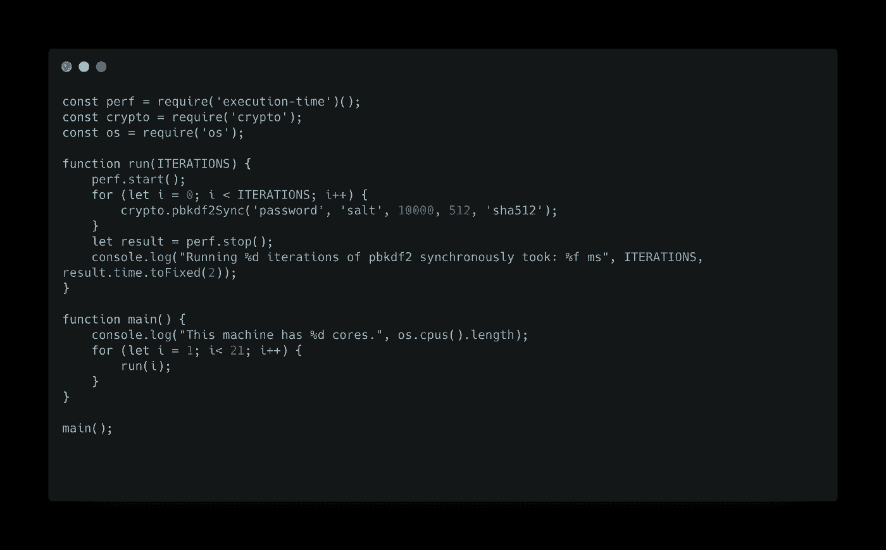
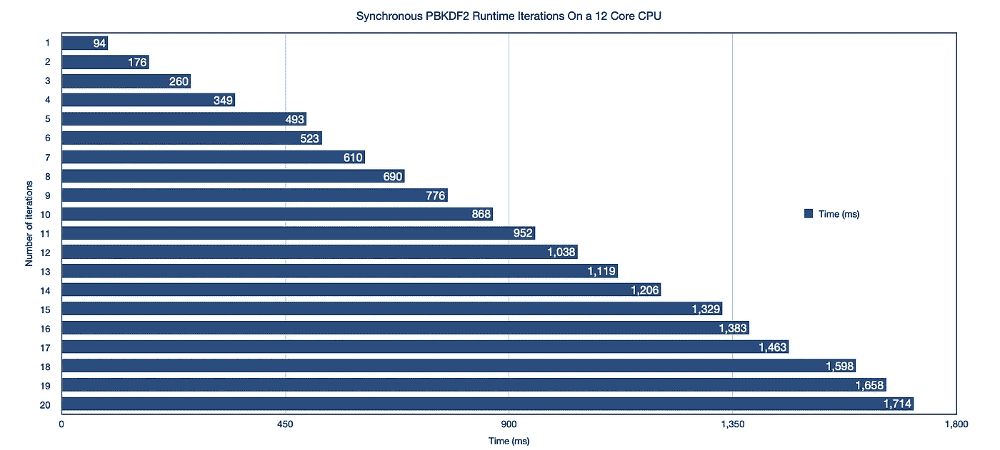
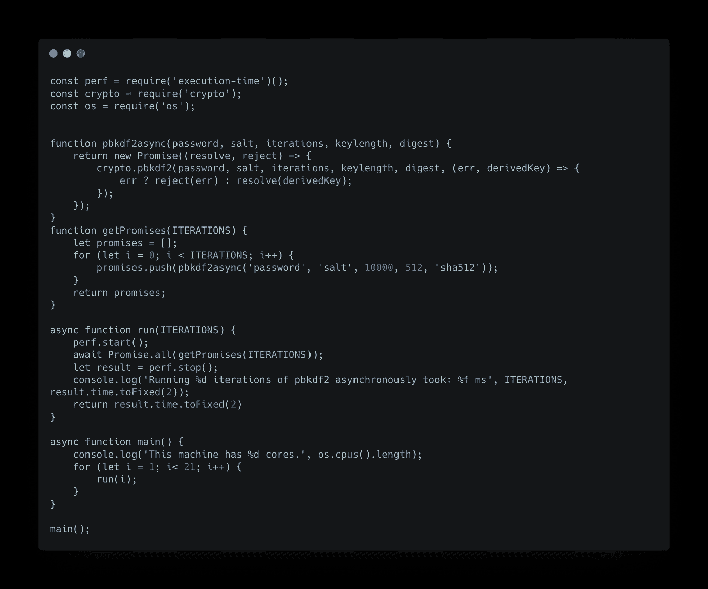
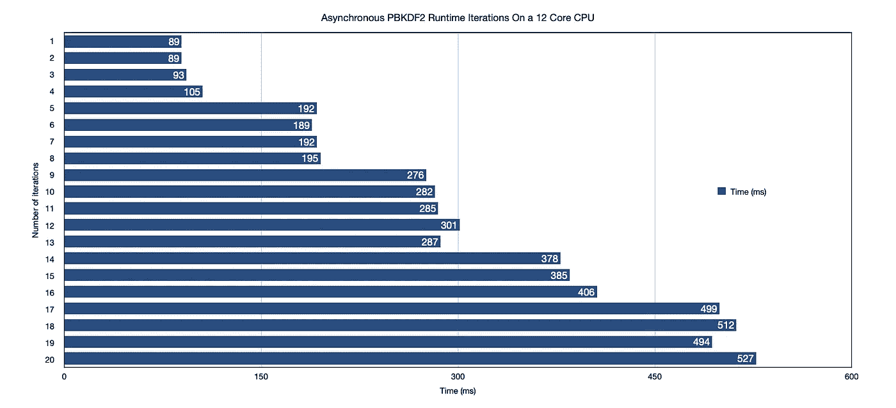

# Node.js 线程池性能限制

> 原文：<https://javascript.plainenglish.io/nodejs-thread-pool-performance-limitations-33e77811ff5b?source=collection_archive---------7----------------------->

点开任何一个在线 Node.js 教程，首先看到的就是“Node 是单线程”的说法。我决定写这篇文章来表明情况并非总是如此。我觉得这句话被一遍又一遍地用来简化和抽象引擎盖下发生的事情。

早在 2009 年，Ryan Dahl 就提出了在浏览器之外执行 JavaScript 的想法。因此，他采用了当时最快的 JavaScript 引擎 V8，并将其嵌入到一个他称之为 Node 的 C++程序中。在他最初的演示中，他展示了下面这段代码:

```
**var** result = db.**query**('SELECT * FROM table');// Do something with the result
```

他接着问道:

> "当这行代码运行时，你的 web 框架在做什么？"

在任何现代 web 应用程序中，我们都可以看到这样的代码一直在运行。CRUD 请求是几乎所有 API 的核心，大多数 CRUD 操作的背后是一个数据库或文件系统。等待 I/O 需要数亿个 CPU 时钟周期。所以问题是，当 CPU 无所事事时，我们如何利用它呢？

# Web 服务器架构

最初，Apache web 服务器通过为每个进程分配一个线程来处理每个 web 请求。强加在操作系统上的内存指纹过于昂贵，而且这种方法的可扩展性也不好。为了解决这个问题，Apache 引入了 MPM 工人模型，它开始用一个线程处理每个请求。这也不能很好地扩展，因为当在给定的 CPU 上负载平衡线程执行时，所有的上下文切换都必须发生。随着请求数量的增加，操作系统不得不花费大部分时间来决定 10，000 多个线程中的哪些应该在硬件上运行，而不是在每个线程中实际运行代码。

那么 Node 如何解决这个问题呢？它使用异步事件驱动架构。这个想法是在一个线程中运行一个事件循环。应用程序代码在主线程上执行，所有繁重的工作(对开发人员来说是抽象的)都由操作系统的内核完成，或者在内核不支持的情况下在线程池中完成。Node 中几乎所有的繁重工作都是由用 **C** 编写的 **Libuv** 库完成的。在这篇文章中，我不想深入 Libuv 的内部，而是想谈谈开发人员可能会因为线程池而遇到的性能限制。

# Node.js 线程池

为了避免性能问题，我们首先需要确定我们的瓶颈。第一步是弄清楚线程池中运行的是什么。 **Node 使用线程池来处理操作系统(内核)不支持的高开销任务。**

如今，Node 使用线程池来处理在以下模块中定义的操作:

*   **fs** :文件系统 I/O 操作
*   **dns** : DNS 操作
*   **zlib** :压缩操作
*   **crypto** :密码运算

现在我们知道了一些会导致瓶颈的模块，是时候找出瓶颈本身了。默认情况下，Libuv 的线程池大小限制为 4。这是在 UV_THREADPOOL_SIZE 变量中设置的。

为了展示这一点，我对加密库进行了一个小测试。考虑下面的程序，它使用基于密码的密钥派生函数(pbkdf2)。这个版本的程序在主线程上同步运行。



在这个程序中，我在主循环的每次迭代中调用 pbkdf2Sync 函数 *i* 次。下面是程序的运行时间:



正如所料，运行时间随着每次迭代而线性增长。平均来说，一次迭代需要大约 90 毫秒，因此 20 次迭代需要大约 1，800 毫秒。现在，让我们考虑同一程序的异步版本。



下面是异步版本的运行时间:



这次我们看到了一个完全不同的图表。请注意，这次，运行我们的函数四次所需的时间几乎与运行一次相同。这是通过并行运行不同的函数调用实现的。与同步程序相比，这是一个巨大的性能提升。然而，当我们运行该函数五次时，有趣的事情发生了。请注意，运行该函数五次花费的时间几乎是运行四次的两倍。为什么会出现这种行为？这是因为 Libuv 强加的线程池大小。事实是 Node 正在安排五次回调。最初，线程池处于空闲状态，因此，这五个回调中的四个可以被线程获得并并行执行。一旦这四个线程中的任何一个被释放，第五个回调就被它获得并执行。这证明了即使节点代码是异步的，它的性能有时也会受到 Libuv 中可用线程数量的限制。

# 结论

最后，开发人员需要格外小心如何在 Node.js 中编写 CPU 或 IO 密集型代码，因为尽管代码是异步的，但实际上运行时仅限于四个线程。通过如下方式运行程序，可以微调节点运行时并增加线程池大小:

```
SET UV_THREADPOOL_SIZE = 8 && node server.js
```

您可以在这里访问本文中使用的代码:

[https://github . com/omarchedid 95/nodejs _ thread pool _ performance](https://github.com/omarchedid95/nodejs_threadpool_performance)