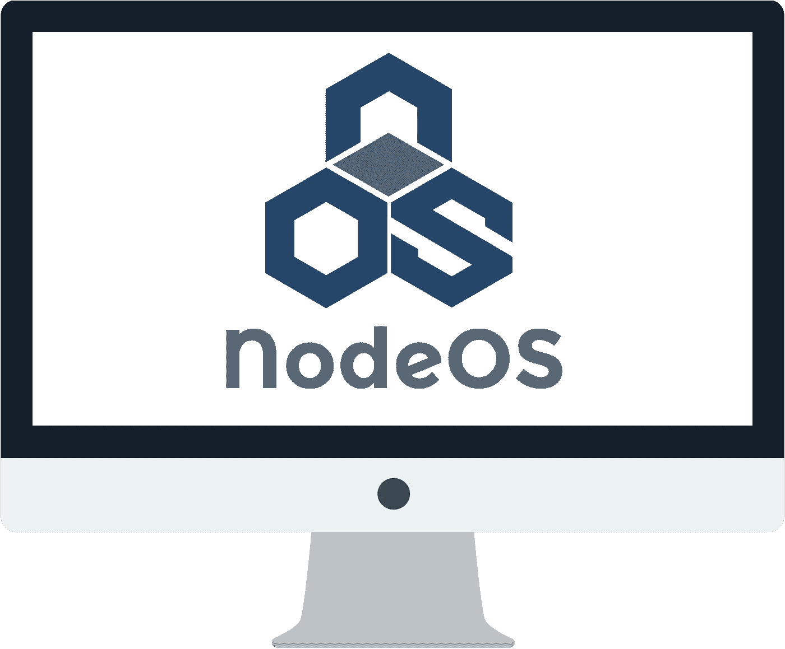

# NodeOS:JS 社区的耻辱

> 原文：<https://javascript.plainenglish.io/nodeos-disgrace-upon-the-js-community-e96a8a91d435?source=collection_archive---------0----------------------->

国家预防机制包的数量和种类一直是讽刺和嘲笑的话题。如果你不明白我在说什么，看看有 7600 万下载量的 [is-odd](https://www.npmjs.com/package/is-odd) npm 包，[is-positive](https://github.com/kevva/is-positive)/[is-negative](https://github.com/kevva/is-negative)包，字面上是一个[包来保佑你的代码](https://github.com/LunaGao/BlessYourCodeTag)和许多其他代码。虽然这看起来很有趣，但这造成了一个严重的问题，即[可能](https://hackernoon.com/whats-really-wrong-with-node-modules-and-why-this-is-your-fault-8ac9fa893823) [导致](https://www.theregister.co.uk/2016/03/23/npm_left_pad_chaos/) [负面后果](https://www.davidhaney.io/npm-left-pad-have-we-forgotten-how-to-program/)。但是这一次，社区更进一步，引入了 NodeOS，一个[“由 node.js 和 npm 支持的操作系统”](https://node-os.com/)。我将解释为什么这不是真的，以及它对 JS 社区意味着什么。

UPD:有人告诉我，NodeOS 项目已经被放弃，不再维护了。

# 由节点供电。JS 和 npm？

让我们从措辞开始。我不是想吹毛求疵，但这是故意欺骗人们，这是不允许的。NodeOS 不是由 NodeJS 和 npm“驱动”的。它由 Linux 驱动，只运行 NodeJS。就这样，说真的。NodeOS 所做的只是启动 NodeJS，而不是 bash/sh/zsh，否则，它就是您的常规 Linux 发行版。无论如何，NodeOS 都不是“完全用 Javascript 构建的操作系统”。这是对 Linux 的剽窃，它试图为从未做过的努力获得荣誉。你知道一个“完全用 JavaScript 构建的操作系统”有多少个 JavaScript 源文件吗？[一个](https://github.com/NodeOS/NodeOS/blob/master/lib/index.js)。有 161 行。

虽然构建一个 Linux 发行版并不简单，但是它是有很好的文档记录和标准化的。它不应该被视为一个突破，一个新的操作系统，甚至是一个新的库。创建新的 Linux 发行版的目的是解决其他发行版没有解决的一些问题。例如，Ubuntu 的设计是用户友好的，Alpine 很小，对于容器环境来说足够快，openSUSE 提供企业级支持。NodeOS 提供… JavaScript？

# 它解决什么问题？

由于 NodeOS 直接引导到 NodeJS CLI 并提供“NodeJS 作为用户空间”，您会认为它非常适合运行 JavaScript 应用程序。你知道，后端的那些。

不幸的是，事实并非如此。在 bash 上没有 NodeJS CLI 用例，在 apt-get 上没有 npm 用例，在操作系统上没有解释器用例。通过放弃一个常规的 Linux shell(这在任何其他 Linux 发行版中都没有做到。))，你正在放弃人们热爱 Linux 的一切。比方说，你推出了你的快递。运行 NodeOS 的 docker 容器中的 JS 后端崩溃。你附在集装箱上调查，然后呢？是的，NodeOS 团队重新实现了一些核心命令，比如 cd、ls、cat、[(这里是完整列表](https://node-os.com/docs/Commands.html))，但是为什么要重新发明自行车呢？这些的传统版本已经存在，它们已经被测试和使用了几十年，它们的完善程度超出了 NodeJS 最疯狂的梦想，NodeOS 在这里可能提供什么呢？

此外，大多数时候运行后端的容器也需要一些非 JavaScript 包。我说的不是数据库，它们应该运行在一个单独的容器上，但是 Git、nginx 或另一种语言等必需品经常被使用。你如何用 npm 安装它们？

# 也许是表演吧？

听起来很合理。作为 PID 1 运行 NodeJS 的 Linux 发行版，它在运行 JS 应用程序时可能会更快。这里只有两个问题:

1.  NodeOS 的网站上没有提到性能提升，也没有任何基准测试。对于像性能这样大的问题(尤其是在云计算时代)，这看起来很粗略。这对于测试版来说是合理的，但是 NodeOS 已经到了 1.0 版！
2.  诸如 bash(在大多数 Linux 发行版中用作命令提示符)、grep(一种搜索和过滤工具)、apt-get(一种包管理器)等程序都是用 C 语言编写的(1 ),并且是为比我们现在的计算机慢得多的计算机编写的(2)。我严重怀疑一些 JS 开发人员能写出性能更好的东西。

# 对开源社区的伤害

这个项目不仅毫无意义，而且还伤害了开源社区，尽管它本身就是开源的。这种矛盾的本质是，所有这些努力没有帮助 Linux 内核本身的维护者和解决对 JS 开发人员重要的特定挑战，而是被用来创建另一个没有人能够或愿意使用的 JS 包/Linux 发行版。因为这个原因，现在我们只剩下成千上万被抛弃的项目/库/操作系统:开发人员选择重新发明轮子，为他们的自我加油，而不是为了更大的利益一起工作。

# 那怎么会呢？

难倒我了。不仅在 GitHub 上有 6.1k 星，据说还获得了[第九届全国自由软件冠军](https://www.concursosoftwarelibre.org/1415)。这充分说明了 JS 和 FOSS 社区，作为其中的一员，我感到不安和羞愧。降低准入门槛是好的，但我们应该始终努力成为我们能做到的最好的开发者，而不是盗用他人的成就。这让我想起了一位[俄罗斯程序员](http://www.bolgenos.su/index_en.html)，他在源代码中将 Ubuntu 重命名为 BolgenOS，并在 2009 年推出了一款革命性的新操作系统。我们当时在笑，但现在已经不那么好笑了。