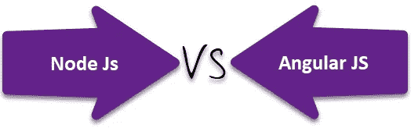
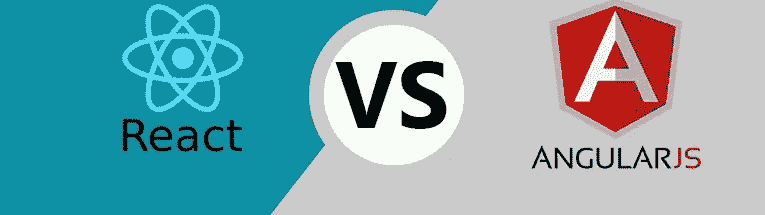

# JavaScript，Node，TypeScript，Angular 和 React 有什么区别？

> 原文：<https://javascript.plainenglish.io/noobies-exploration-to-javascript-part-1-introduction-to-js-diff-b-w-93c8cc062fa8?source=collection_archive---------1----------------------->

Credits: [Pixbay](https://pixabay.com/photos/javascript-programmer-code-4523100/)

当我作为一名 **JavaScript(JS)** 开发人员开始我的旅程时，脑海中出现了许多问题。**什么是 JS？它是如何运行的？它是如何工作的？我们在哪些领域使用 JS** &甚至几个月后我还不知道**节点 JS、Angular JS、React JS、TypeScript** 等之间的基本区别。如果你也面临同样的问题，却没有得到一个正确的解释，那也没必要担心。在即将到来的教程中挖掘 JS 的核心概念之前，我们将在文章中涵盖上述所有问题。

# **JavaScript 是什么？**

JavaScript 是一种非常强大的客户端 ***脚本语言*** (后面会讨论)。JavaScript 主要用于增强用户与网页(在浏览器中打开的页面)的交互。换句话说，在 JavaScript 的帮助下，你可以让你的网页更生动，更具互动性。

JavaScript 由 Brendan Eich 于 1995 年开发，出现在当时流行的浏览器 Netscape 中。这种语言最初被称为 LiveScript，后来被重新命名为 JavaScript。

简单来说，

> JavaScript 最初被创造出来是为了“让网页活起来”。

当人们说“JavaScript 是一种非常强大的客户端脚本语言*”时，你又会想，这到底是什么脚本语言？为什么我们称一些语言为“核心编程语言”&一些语言为“脚本语言”？别担心，让我解释给你听。*

**

*Credits: [Unplash](https://unsplash.com/photos/gy08FXeM2L4)*

# ***语言 vs 文字***

*因此，如果您是开发概况的新手，您会经常听到这些关键字。在某种程度上，所有的脚本语言都是编程语言，两者之间的理论差异在于脚本语言不需要编译设置，而是像 **PHP & JavaScript** 一样在运行时被解释。但是，语言需要一个完整的编译环境来首先编译代码，然后运行代码，就像我们在大专院校用 **Java & C** 做的那样。如果你明白了这一点，你可以进入下一个标题，但如果你仍然不明白，让我们看看这个例子。*

****例 1:*** 在“C”(语言)中，C 编译过程以源代码作为输入开始，将源代码转换成机器可读的代码。这个过程可以分为四个步骤:预处理、编译、汇编和链接。而在 PHP/JavaScript(脚本)中，解释器实时读取代码并执行，而不是先将代码制成机器可读的代码。*

> *解释器从程序(脚本)产生结果，而编译器产生用汇编语言编写的程序(语言)。:- [**知识库，印第安纳大学**](https://kb.iu.edu/d/agsz)*

# *语言 vs 框架*

*在学院刚开始的时候，编码相当简单，我们有库(stdio.h，如果你在学院用过 C)，变量，for 循环，if 条件，函数等。但是当我们开始开发更多的时候，我们引入了新的关键词**“框架”**。
这个框架是什么？难道我们已经有太多的东西需要理解和学习，而这个新术语的引入也是为了制造混乱吗？我们先通过一个例子来理解这个。*

*大家都知道[印地语](https://en.wikipedia.org/wiki/Hindi) & [梵文](https://en.wikipedia.org/wiki/Devanagari)对吗？所以我们知道 Devanagiri 是一个*里皮到*写印地语&其他一些语言的人。Devanagiri 定义了印地语的一套规则和书写方式。而在印地语中，我们有预定义的关键字(由अ आ इ ई उ ऊ印地语字母表公司制作)用于交流。*

*同样的事情也适用于语言和框架，语言只是做类似“Devanagiri”的事情的最小规则集。而框架是为特定编程语言编写的有用工具的集合，正如我们在上面的例子“印地语”中讨论的那样。因此 **JavaScript** 是一种语言，而 **Angular** 是一个框架，JavaScript 提供了一组最小的编码规则和系统工具来编译它，而 Angular 提供了一组有用的工具来简化和组织编码。*

> *软件框架(无论是前端还是后端)包括标准化的预写代码，这使得某些功能的开发更加容易和快速。您的编码自由度更小，因为您必须按照框架体系结构的指示进行编码。:-[**DZone.com**](https://dzone.com/articles/differences-between-react-and-angular)*

*我希望，现在你已经明白了框架、语言和脚本之间的区别。让我们回到你来这里的主题上来。JavaScript！*

**

*Credits: [Codemagic blog](https://www.google.com/url?sa=i&source=images&cd=&cad=rja&uact=8&ved=2ahUKEwjN4NHsyqPnAhUCbisKHXaBDMYQjB16BAgBEAM&url=https%3A%2F%2Fblog.codemagic.io%2Fdart-vs-javascript%2F&psig=AOvVaw2s6DDnZLMSrU7T7o3Ky3iy&ust=1580207752228309)*

# *【JavaScript 能做什么？*

*读 JavaScript 的目的是什么，JavaScript 的适用范围是什么，如果想从事这门语言的职业真的有帮助吗？我们去看看。
**基础知识***

*   *JavaScript 可以向页面添加新的 HTML，更改现有内容，修改样式。*
*   *JavaScript 对用户动作作出反应，在鼠标点击、指针移动、按键时运行。*
*   *通过网络向远程服务器发送请求，这称为 API。*
*   *获取和设置 cookies，向访问者提问，显示消息。*
*   *记住客户端的数据(将数据存储在浏览器的本地存储中)。*

*当你访问一些网站时，突然出现一个弹出窗口，要求你订阅该网站。JavaScript 在起作用。*

***前进***

*   *用于创建服务器 API 的 JavaScript。*
*   *用于与数据库交互的 JavaScript。*
*   *我们可以用 JavaScript 制作跨平台的移动应用(IOS/Android 都可以)。*
*   *用于制作桌面应用程序和游戏平台的 JavaScript。*

*这就好像 JavaScript 可以做任何事情，无论你想什么时候做什么，JavaScript 都有解决方案。*

# *JavaScript 是怎么运行的？*

*在 JavaScript 的早期，它只能在浏览器中执行，但随着语言的增强，现在我们也可以在浏览器、服务器、移动应用程序上运行 JavaScript，或者实际上在任何装有称为 **JavaScript 引擎**的特殊程序的设备上运行。在一个 [JavaScript 引擎](https://en.wikipedia.org/wiki/JavaScript_engine)的帮助下，我们可以在任何地方运行 JavaScript。*

***— — — — — — —为了获得额外的知识— — —** 浏览器有一个嵌入式引擎，有时称为“ **JavaScript 虚拟机**”。不同的引擎有不同的“代号”。比如:Chrome 和 Opera 中的
- **V8** 。火狐中的
- **蜘蛛猴**。
-**三叉戟**和**查克拉**针对不同版本的 IE。
-**ChakraCore**针对微软 Edge。
-**squirrel fish**狩猎。*

*现在你知道什么是 JavaScript 了吧？它的应用有哪些？它是如何运行的，语言/脚本/框架有什么区别？现在，当你在互联网上搜索“JavaScript”或与一些 JavaScript 开发人员交谈时，他会告诉你我是一名节点开发人员或 angular 开发人员或某种全栈开发人员。现在 JavaScript 很酷，但是每个人都在讨论的这些东西是什么呢？不用担心，我们会理解的。*

# *NodeJS、AngularJS、ReactJS 和 Typescript 之间的检查*

**

*Credits: [Guru99](https://www.google.com/url?sa=i&source=images&cd=&cad=rja&uact=8&ved=2ahUKEwiv4quQyqPnAhXIwTgGHavlBpEQjB16BAgBEAM&url=https%3A%2F%2Fwww.guru99.com%2Fnode-js-vs-angularjs.html&psig=AOvVaw1C5QqbkPqB0GSHwXr4E7bC&ust=1580207556583342)*

*所有这些关键词**(注:不是说语言)**都包含“JS”作为后缀，那是什么意思。是全部从 JavaScript 中提取出来的某种语言还是完全不同的像 Java(Language)&JavaScript(Script)。*

***NodeJS**&**AngularJS**是 JavaScript 的框架(上面已经解释过了)。有人说“NodeJS 就是 JavaScript 运行时”。现在它只是你的一个框架。我们将在接下来的教程中了解这一点。现在让我们看看这两个主要框架是如何有用的。我已经告诉过你 JavaScript 运行在服务器端(后端)和客户端(前端，在浏览器上)。因此，为了在服务器端(后端)实现 JavaScript，我们使用了 [**NodeJS**](https://www.tutorialspoint.com/nodejs/nodejs_introduction.htm) 框架，为了在客户端(前端)实现 JavaScript，我们使用了[**angular js**](https://www.tutorialspoint.com/angularjs/index.htm)**框架。***

> ***简单来说，Node JS 是后端开发框架，Angular 是前端开发框架。:- [**Quora**](https://www.quora.com/What-is-the-difference-between-Angular-js-and-Node-js)***

******

***Credits: [ValueCoders](https://www.google.com/url?sa=i&source=images&cd=&cad=rja&uact=8&ved=2ahUKEwjAoLW1yqPnAhXuxzgGHfGkDQMQjB16BAgBEAM&url=https%3A%2F%2Fwww.valuecoders.com%2Fblog%2Ftechnology-and-apps%2Fangularjs-vs-reactjs-suits-better%2F&psig=AOvVaw3_6lO8PIj5uogi_LP1Ipvq&ust=1580207661001026)***

***除了这两个框架[**ReactJS**](https://www.tutorialspoint.com/reactjs/index.htm)**就是一个简单的库。库是函数和功能的集合，你可以用它来实现你的功能需求。为了更好地理解这个库，回想一下您开始用 C 编写代码的时候，我们需要使用< stdio.h >进行输入/输出操作&math . h>进行数学运算。因此，与 Node & Angular 不同，React 不是 JavaScript 的框架，而是一个简单的库，我们可以随时将它包含在现有代码中([单击此处](https://reactjs.org/docs/add-react-to-a-website.html))，并使用它预定义的函数和其他好处来使我们的编码更快更简单。我们也可以让这个项目从头开始。库&框架的基本区别是…*****

> *****我们的代码调用库，而框架调用你的代码。*****

*****框架很好(Node/Angular)，库也很好(React)但是什么是 TypeScript 呢？TypeScript 可以解释为 JavaScript 的超集。这意味着每个 JavaScript 代码都是有效的类型脚本代码，但是类型脚本附带了一些 JavaScript 没有的附加特性:
- **强类型变量:**我们可以用强类型特性定义变量的类型，就像在 Java 或 C++中定义变量一样。强类型意味着一旦变量类型被声明，它就不能被改变或操作。
- **面向对象编程:**我们能够用 Typescript 编写面向对象的代码，而在 JavaScript 中你不能(直到 ES5)。*****

*****如果您仍然对类型脚本感到困惑，您可以通过 [Medium](https://medium.com/u/504c7870fdb6?source=post_page-----93c8cc062fa8--------------------------------) 访问这篇文章，或者我有一个简单的解决方案，忘记它😀！。如果你是 JavaScript 新手，现在不要担心 TypeScript，因为 JavaScript 本身有大量的知识，现在，你可以专注于 JavaScript、Node、Angular、React，然后你会明白 TypeScript 的要点和用法。*****

*****所以这都是关于 JavaScript，语言，脚本，框架和一个快乐的 JavaScript 家族，包括 Node，Angular & React。我将在接下来的部分中写一个完整的 JavaScript 教程，关注我的帐户以获得通知。*****

*****发现这个帖子信息丰富？请点击👏下面的按钮！:)
**快乐阅读||写作 2 学习*******