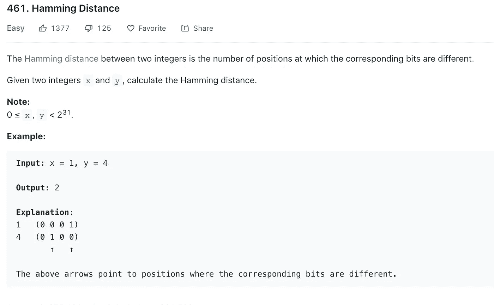
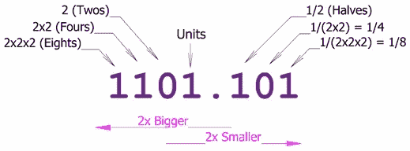
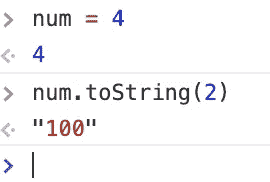
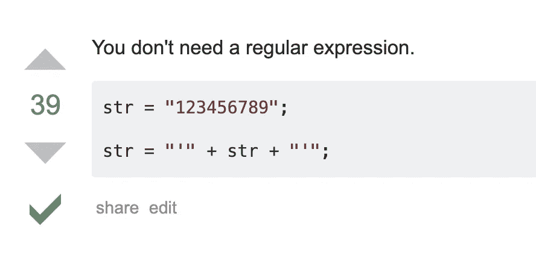
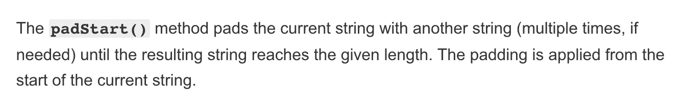
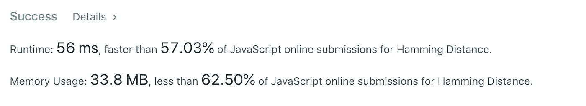

# Noob 的算法 101 入门

> 原文：<https://javascript.plainenglish.io/noobs-intro-to-algorithms-101-aee39c3add00?source=collection_archive---------1----------------------->

# 汉明距离挑战

*一个网络开发人员学习用 JavaScript 玩二进制数字*

昨晚，我参加了我的第一次 DC 编程女性算法会议。有 46 个人回复了，但幸运的是，对于我们 15 个人来说，还是有足够的空间的。我们的组织者介绍了来自 LeetCode 的挑战:找到任意两个变量之间的汉明距离。

现在，如果你像我一样，一直愉快地用 Ruby on Rails、JavaScript 和/或 React 编写代码，也许你以前没怎么玩过二进制数。当有人说“hamming”时，你会想到(不吃东西！)可爱的猪。


cute pig.



当我们的组织者开始调查我们想用什么语言编码时，她意识到我们中的许多人都是初学者，他们甚至需要一些额外的指导来解决这个问题，LeetCode 认为这个问题很容易。



如果你想比较两个整数的‘对应位’，你需要把那些整数转换成二进制形式(一位是一个单独的二进制数字)。然后她给我们上了一堂二进制数字的速成课，我在这里快速复述一下。

我们的十进制数字系统是以十为基数的。当你用 1 计数时，在数字 9 之后，你把 9 变成 0，并在 10 的那一栏加 1。二进制数就是这样，只是基数为 2。二进制计数是这样的:

```
zero  =>   0
one   =>   1 (add one to ones' place)
two   =>  10 (turn the ones digit to zero, add one to tens place)
three =>  11 (add one to ones' placefour  => 100 (turn ones digit to zero, carry one, turn tens to zero, carry one)five  => 101 (add one to ones place)
six   => 110 
```

[这是一本来自《数学很有趣》的入门书。](https://www.mathsisfun.com/binary-number-system.html)

*我们为什么要用二进制？因为计算机只能读取和操作 1 和 0。*

# 方法

然后我们的组织者给了我们更多有价值的信息。底线:不要一开始就试图写出优雅的单行解决方案。相反:

1.  把问题分解成更小的问题
2.  解决小问题(我会添加使用伪代码作为占位符来表示你还不知道的事情)
3.  修补、测试、重构。

然后我们就分组散了。大多数人都在用 Python 工作；我和一小群 JavaScript 程序员坐在一个角落里，幸运的是，他们知道自己在做什么！

我不知道如何编写所需的代码。但是，我很感激第一条建议。如果没有别的，我至少可以把这个问题分解成更小的问题。从…开始

# 问题 1:把变量变成二进制数。

谷歌很快告诉我们，有一个内置的 JavaScript 函数可以实现这一点。如果你想把“x”变成二进制，你写:`x.toString(2)`其中 2 是数字的期望基数。在控制台中尝试这些东西总是一个好主意，所以我在我的 Chrome 浏览器中打开了 devTools，并用一个小数字进行了尝试:



# 问题 2:比较二进制字符串的每个数字

接下来，我们写下几个相邻的二进制数，并困惑于如何比较第一个数字和第一个数字，第二个数字和第二个数字，等等。这又提出了另一个问题:如果我们的一个变量是一个很大的数字(一个很长的二进制字符串)，而另一个变量却很短，那该怎么办？我们如何一个数字一个数字地比较呢？

例如，比较 4 和 0 怎么样？

```
1 0 0 
    1
```

在这种情况下，我们将在开头用零重写较短的数字:

```
1 0 0 
0 0 1
```

通过在开头而不是结尾添加零，我们没有改变二进制数的值。`001`的值仍然是 1，就像`1`一样。相反，如果我们在“1”的末尾加上零，就像这样:`100`，我们将把 1 的值改为 4。我们不想改变任何值，我们只想观察它们的二进制数字的差异！

现在，如果我们用这个小例子做一个直观的比较，我们可以看到每个字符串的第一个数字是不同的；后两个不是；第三两个是。所以总的差异数，或者说汉明距离，是 2。

# 把我们的第二个问题分解成更小的问题

为了比较两个二进制字符串的单个数字，我们必须通过加零使它们长度相同。

所以，让我们来重铸:

# (修订)问题 2:算出哪个字符串更长

我们必须弄清楚 x 和 y 哪个值更长。我们试着取两个值的长度，然后用一个值减去另一个值，看看结果是正还是负:

```
let longer
let shorterif (x.toString(2).length - y.toString(2).length > 0) {
  longer = x;
  shorter = y;} else {
  shorter = x; 
  longer = y ;
}
```

但是，有一个更好，更短的方法！

如果不知道一个组中哪个变量最大或者最小，可以使用 JavaScript 的 Math.max 和 Math.min 函数。所以我们这样做了:

```
let max = Math.max(x,y).toString(2);
let min = Math.min(x,y).toString(2);
```

# 问题 3:使字符串长度相同

*注意:我实际上最后解决了这个问题——我只是给自己写了一个便条:“找出如何在较短字符串的开头添加正确数量的零。”跳到问题 4。*

因此，如果`max.length — min.length`是我们必须添加的零的数量，我们怎么做呢？

堆栈溢出提供了这样的建议:



抓住你在 Stack Overflow 中找到的第一个、投票最多的解决方案不一定是件坏事，但这有点像在你去餐馆的路上抓住第一个停车位，即使那个停车位离餐馆很远。我的停车理念:不找就找不到完美的车位。而如果你觉得最完美的空间在餐厅前面，你不往那里看就永远找不到。


you’ll never find it if you don’t look for it.

代码也是如此。有许多不同的方法可以让事情运转起来，但有时也有内置的捷径；除非你去寻找，否则你是找不到的。

幸运的是，我坐在一个人的旁边，他的 Google fu 提供了一个完美的 JavaScript 工具:padStart()，通过在字符串的开头添加您选择的字符，它可以使字符串达到您想要的长度。

从文档中:



因为我们已经将“min”标识为较短的字符串，所以我们这样做:

```
min = min.padStart(max.length, 0);
```

在上面的代码片段中，我们想让我们的“min”字符串与“max”字符串长度相同，我们想通过添加字符 0 来实现这一点。

# 问题 4。比较每一对第一、第二、第三位数字等。

换句话说，迭代！

我们必须建立一个计数器，并将其设置为零。

```
let counter = 0
```

然后我们必须比较数字，每次有差异，我们必须增加计数器。

我们的循环必须为字符串中的每个数字运行一次。在下面的代码中，“I”代表数字在字符串中的索引或位置。(与数组一样，任何字符串的第一个索引都是零，第二个索引是 1，依此类推。，最后一个索引是字符串的长度减 1，因为我们从零开始计数)。每次循环后，我们都将索引加 1。

```
let counter = 0;
for (let i = 0; i < max.length; i++){
    ...
    }
...
```

实际迭代:

```
if(max[i] !== min[i]) {
        counter++
    }
```

换句话说，如果“max”字符串中 I 的索引处的字符不等于它在 min 字符串中的对应字符，则在计数器中加 1。

最终功能:

```
const hammingDistance = function(x, y) {let max = Math.max(x,y).toString(2);
let min = Math.min(x,y).toString(2);min = min.padStart(max.length, 0);let counter = 0;
for (let i = 0; i < max.length; i++){
     if(max[i] !== min[i]) {
        counter++
    }
}   
     return counter;
}
```

成功了！事实上，这是相当有效的:



如果你想自己试试，[这里是 LeetCode 上的问题链接。](https://leetcode.com/problems/hamming-distance/)

# 像我这样的菜鸟请注意:

即使你是一个不怎么玩算法的菜鸟，在一点帮助下也不难做到。晚上快结束的时候，我问那个耐心给我讲解问题的女士，她有没有从事过数据科学的工作。

不——她是一名前端开发人员，就像我一样(除了她被雇佣而我在找工作的那部分……)。但是——从今年年初开始，她就参加了编写算法程序的女性聚会。所以…我想我很快就会回去了！