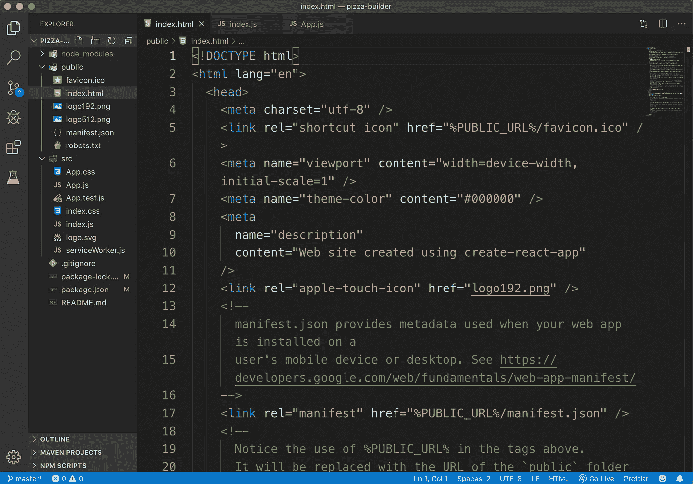
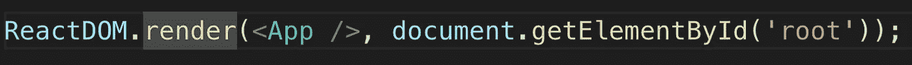
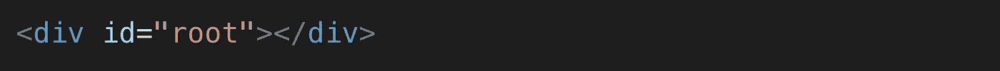
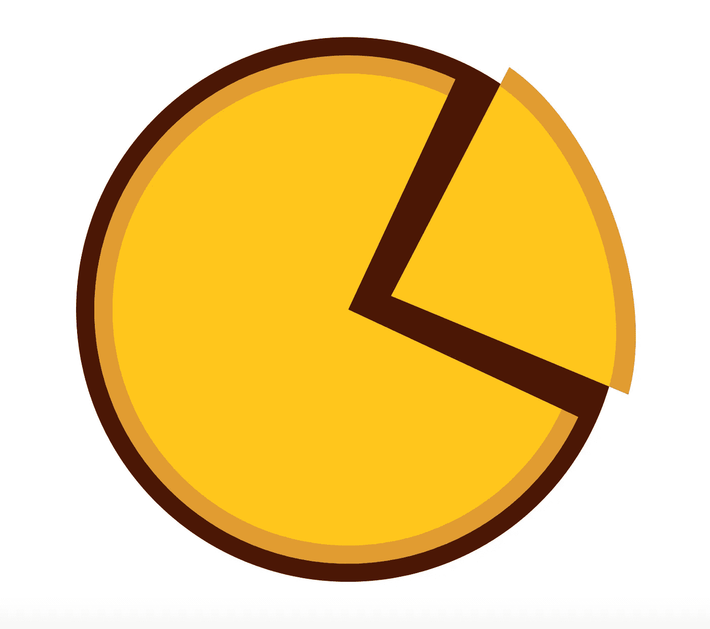
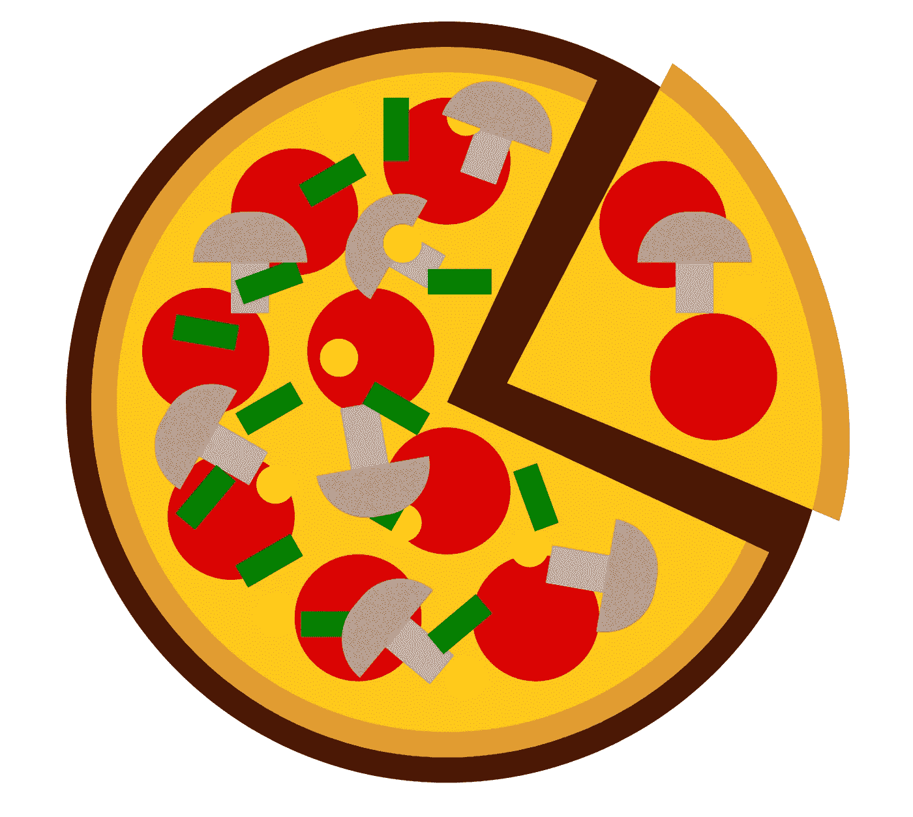

# 不是 Hello World 应用程序 React 入门

> 原文：<https://javascript.plainenglish.io/not-a-hello-world-application-getting-started-with-react-c02879d8bde3?source=collection_archive---------1----------------------->

## *通过构建一个真正的应用程序(Pizza Builder)开始使用 React，而不仅仅是一个 Hello World 示例*


Source: [https://codeburst.io/react-js-for-beginners-the-basics-87ef6e54dae7](https://codeburst.io/react-js-for-beginners-the-basics-87ef6e54dae7)

学习反应可能是压倒性的。有如此多的新概念需要你去熟悉，以至于一个**反应初学者**有时会迷失，而不是专注于重要的概念。此外，如果他们设法完成了一个教程构建*事实上的* Hello World 应用程序，他们仍然没有足够的信心去构建现实世界的应用程序。在这里，我们将通过仅使用基本组件构建一个 Pizza Builder 应用程序来学习 React。一旦您足够自信，就可以在 React 中探索更高级概念。

注意:我不打算在 React 中介绍样式，尽管我会在这个项目中使用它们，所以如果你理解它们有困难，你可以忽略它们。我将在以后的文章中介绍它们。它们只是为了好看，并不是本文 要关注的东西

完整应用程序的基本代码可以在下面找到:

[https://github.com/hjaiswal/pizza-builder-tutorial](https://github.com/hjaiswal/pizza-builder-tutorial)

完成本文后，您的应用程序应该如下所示:

Pizza Builder Project Video

*我构建 React 应用程序，但我不是专家，因此如果您发现错误，请随时在下面留下私人注释或评论！*

# **简介**

React 是一个用于构建用户界面的 javascript 库(不是框架)。它遵循**基于组件的架构**，这使得项目高度模块化，并使得编写可重用的代码成为可能。它本质上是声明性的，这意味着我们可以告诉 React 我们想要什么，React 及其 React DOM 库将构建实际的 UI。当您的状态/数据发生变化时，React 还将有效地处理应用程序中正确组件的更新和呈现。不再浪费时间，让我们从 React 开始吧。

# 入门指南

创建 React 应用程序最简单的方法是使用[**create-React-app**](https://reactjs.org/docs/create-a-new-react-app.html#create-react-app)。这个命令行实用程序将完成所有必要的样板配置，以便您可以专注于代码。您可以使用以下链接在您的系统上设置 create-react-app 实用程序[https://github.com/facebook/create-react-app](https://github.com/facebook/create-react-app)

完成设置后，创建您的项目

```
npx create-react-app pizza-builder
cd pizza-builder
npm start
```

您将被重定向到默认页面。让我们看看项目结构。我将使用 VS 代码编辑器。你可以使用任何你喜欢的编辑器。该项目将有一个`**public**`文件夹和一个`**src**`文件夹，如下所示:



React Project Structure

我们感兴趣的文件是公共文件夹中的`**index.html**`、src 文件夹中的`**index.js**`和`**App.js**`。在我们开始编辑之前，我想讨论一下 React 中的组件。

通俗地说，React 中的****组件是一个 javascript 文件，它返回一些类似 HTML 的代码，称为 JSX** ( *Javascript XML，我们称之为 JSX，是 React 使用的 Javascript 的语法扩展。JSX 基本上是用来在 JavaScript* 里面写 HTML 标签的。如果你看一下完成的项目(在开始发布的视频中)，你可以看到整个页面是由不同的组件组成的。该页面的不同组成部分是比萨饼底料、西红柿、蘑菇、玉米、按钮等。对于这些组件，在`**components**`文件夹中有一个 javascript 文件，它返回一些 HTML (JSX)**

**在我们的项目中，src 文件夹中的`**App.js**`就是这样一个组件(它也是绑定所有其他组件的父组件)。在`**index.js**`文件中，App 组件被导入并使用 ReactDOM，我们可以将`**<App/>**`组件挂载到 DOM，它将被附加到`**index.html**`中 id 为`**root**` 的父节点。这是一个单页应用程序，浏览器中加载的唯一 HTML 文件是 index.html**

********

# **建筑构件**

**在我们的项目中，我们将删除默认 App 组件返回的所有内容，并添加一个 Pizza 组件。**

```
import Pizza from "./components/pizza/Pizza";function App() {
    return <Pizza />;
}export default App;
```

**我们将在 src 文件夹中创建一个组件文件夹。在组件中，我们将创建一个`**pizza**`文件夹，并创建我们的第一个组件`**Pizza.js**`。**

```
import React, { Component } from "react";class Pizza extends Component {

     constructor(props) {
        super(props);
        this.state = {};
     }

    render() {
        return <div></div>;
     }
 }export default Pizza;
```

**React 中有两种类型的组件:**

**a)功能组件:返回类似 HTML 代码的 javascript 函数(JSX)。这些是无状态的(引入钩子后不成立)，但是从父组件接收一个不可变的`**props**`对象**

**b)类组件:类扩展反应。React 库中的组件类。他们必须有一个返回类似 HTML 代码的`**render()**`方法(JSX)。它们维护`**state**`并从父组件接收一个不可变的`**props**`对象，如上所示**

**我们将在 codepen(***credits:ShubhangiRaj***)上使用这个 [**披萨设计**](https://codepen.io/TA2M/pen/vqqvmX) 。我们将创建一个 Pizza.css 文件，并添加来自上述代码笔的所有设计。我们将在我们的 Pizza 组件中导入这个 CSS 文件**

```
import "./Pizza.css";
```

**我也将使用引导造型的目的。您可以创建自己的样式并包含在组件中。**

```
npm install bootstrap --save
```

**在`**Pizza.js**`中导入引导 CSS 文件**

```
import “bootstrap/dist/css/bootstrap.min.css”;
```

**我们将添加另一个组件文件夹`**base**`，并像这样创建一个`**Base.js**`功能组件**

```
import React from "react";function Base() {
   return (
       <div>
         <div className="pizza-base-1" />
         <div className="pizza-base-2" />
         <div className="slice-base-1" />
         <div className="slice-base-2" />
       </div>
    );
}export default Base;
```

*****在 React*** 中一个组件只能返回一个包装元素(div 或自定义标签)。React 中的`**className**`JSX 相当于 HTML 中的`**class**`。CSS 类“pizza-base-1”、“pizza-base-2”、“slice-base-1”和“slice-base-2”来自我们在 pizza 组件中导入的 Pizza.css 文件。由于 Base component 是 Pizza 的子组件，所以我们不需要在这里导入样式。**

**现在我们将导入 Pizza 组件中的基本组件，并将其添加到它的 render 方法中。**

```
import React, { Component } from "react";
import "./Pizza.css";
import "bootstrap/dist/css/bootstrap.min.css";
import Base from "../base/Base";class Pizza extends Component {
   constructor(props) {
      super(props);
      this.state = {};
     }render() {
    return (
        <div>
           <div className="container mt-5">
              <div className="d-flex justify-content-center"> 
                  <div className="plate">
                       <Base />
                  </div>
              </div>
           </div>
        </div>
      );
    }
}export default Pizza;
```

**class name“plate”来自 Pizza.css，而其他是 bootstrap 样式。在保存项目文件时，您将在浏览器中看到如下内容:**

****

**First React component rendered in browser**

**祝贺您，您已经成功创建了您的第一个 react 组件。接下来，我们将在组件文件夹中创建更多组件，如番茄、蘑菇、玉米和蔬菜。**

**src/components/tomato/tomato . js**

```
import React from "react";function Tomato() {
   return (
      <div>
        <div className="tomatoes">
          <div className="tomato-1" />
          <div className="tomato-2" />
          <div className="tomato-3" />
          <div className="tomato-4" />
          <div className="tomato-5" />
          <div className="tomato-6" />
          <div className="tomato-7" />
          <div className="tomato-8" />
        </div>
        <div className="tomatoes">
          <div className="tomato-9" />
          <div className="tomato-10" />
        </div>
      </div>
   );
}export default Tomato;
```

**src/components/mushroom/mushroom . js**

```
import React from "react";function Mushroom() {
   return (
     <div>
        <div className="mushrooms">
           <div className="cup-1" />
           <div className="stem-1" />
           <div className="cup-2" />
           <div className="stem-2" />
           <div className="cup-3" />
           <div className="stem-3" />
           <div className="cup-4" />
           <div className="stem-4" />
           <div className="cup-5" />
           <div className="stem-5" />
           <div className="cup-6" />
           <div className="stem-6" />
           <div className="cup-7" />
           <div className="stem-7" />
        </div> <div className="mushrooms">
           <div className="cup-8" />
           <div className="stem-8" />
        </div>
     </div>
    );
}export default Mushroom;
```

**src/components/玉米/玉米. js**

```
import React from "react";function Corn() {
   return (
     <div>
       <div className="corns">
          <div className="corn-1" />
          <div className="corn-2" />
          <div className="corn-3" />
          <div className="corn-4" />
          <div className="corn-5" />
          <div className="corn-6" />
          <div className="corn-7" />
          <div className="corn-8" />
          <div className="corn-9" />
          <div className="corn-10" />
          <div className="corn-11" />
       </div> <div className="corns">
          <div className="corn-11" />
       </div>
     </div>
   );
}export default Corn;
```

**src/components/veggie/veggie . js**

```
import React from "react";function Veggie() {
   return (
      <div>
         <div className="vegies">
             <div className="veg-1" />
             <div className="veg-2" />
             <div className="veg-3" />
             <div className="veg-4" />
             <div className="veg-5" />
             <div className="veg-6" />
             <div className="veg-7" />
             <div className="veg-8" />
             <div className="veg-9" />
             <div className="veg-10" />
             <div className="veg-11" />
             <div className="veg-12" />
             <div className="veg-13" />
         </div>
      </div>
   );
}export default Veggie;
```

**现在，将所有这些单独的组件添加到比萨组件中**

```
import React, { Component } from "react";import "./Pizza.css";
import "bootstrap/dist/css/bootstrap.min.css";
import Base from "../base/Base";
import Tomato from "../tomato/Tomato";
import Mushroom from "../mushroom/Mushroom";
import Corn from "../corn/Corn";
import Veggie from "../veggie/Veggie";class Pizza extends Component {
   constructor(props) {
      super(props);
      this.state = {};
    } render() {
      return (
        <div>
           <div className="container mt-5">
              <div className="d-flex justify-content-center">
                 <div className="plate">
                    <Base />
                    <Tomato />
                    <Mushroom />
                    <Corn />
                    <Veggie />
                 </div>
              </div>
           </div>
        </div>
     );
   }
}export default Pizza;
```

**保存项目后，您将能够渲染完整的比萨饼，如下所示:**

****

**Complete React Pizza in browser**

**你可能已经注意到在组件中我们导入了“React ”,但是从来没有在代码中使用过它**

```
import React from "react";
```

**在幕后，React 正在将 JSX 代码转换成 React 元素，并将其呈现给浏览器。我们可以返回 React 元素，而不是 JSX，但嵌套元素会变得复杂，HTML 之类的语法很容易理解。**

```
```With JSX```import React from 'react';
const Hello = () => {
   return (
      <div className='someClass' id='helloWorld'>
         <h1>Hello World</h1>
      </div>
    )
}export default Hello-------------------------------------------------------------------```Without JSX```import React from 'react';
const HelloWO = () => {
   return (
      React.createElement('div', {id: 'helloWorld', className:   'someClass'}, React.createElement('h1', null, 'Hello World'))
   )
}export default HelloWO
```

**正如我们所见，React 元素的读写更复杂，React 帮助我们自动将 JSX 转换为 React 元素。**

# **类组件中的状态**

**每个类组件都使用一个可以在类中访问的`**state**`对象来维护当前状态。每当一个类组件的状态改变时，React 就会为我们将组件重新呈现到 DOM 中。**

**在我们的项目中，我们将在披萨组件的**状态**对象中添加四个属性，以控制不同披萨组件(番茄、玉米、蘑菇、蔬菜)的呈现**

```
constructor(props) {
   super(props);
   this.state = {
      tomato: false,
      mushroom: false,
      veggie: false,
      corn: false
   };
}
```

**现在我们将使用短路操作符执行条件渲染。**

```
render() { 

   const tomato = this.state.tomato && <Tomato />;
   const mushroom = this.state.mushroom && <Mushroom />;
   const corn = this.state.corn && <Corn />;
   const veggie = this.state.veggie && <Veggie />; return (
      <div>
         <div className="container mt-5">
            <div className="d-flex justify-content-center">
                <div className="plate">
                    <Base />
                    {tomato}
                    {mushroom}
                    {corn}
                    {veggie}
                </div>
            </div>
         </div>
      </div>
    );
}
```

**首先，计算操作的左边，如果为真，那么它也计算右边，在浏览器中呈现 JSX 组件。如果运算的左侧被评估为 false，则右侧将永远不会被评估，并且组件将不会被呈现。Javascript 变量可以在 JSX 中用`**{}**`操作符计算。现在，将状态的任何属性从 false 更改为 true，您将看到这些组件呈现出来。例如:**

```
this.state = {
      tomato: true,
      mushroom: false,
      veggie: true,
      corn: false
   };
```

**在这种状态下，只能看到番茄和蔬菜被渲染。**

**现在，我们将添加按钮来控制 Pizza 组件的状态，并有条件地呈现它们。但是在此之前，我们需要在 pizza 组件中添加一个函数来处理点击事件。**

```
clickEventHandler = ingredient => {
     if (ingredient === "tomato") {
         this.setState({
              tomato: !this.state.tomato
           });
     } else if (ingredient === "mushroom") {
         this.setState({
              mushroom: !this.state.mushroom
           });
     } else if (ingredient === "corn") {
         this.setState({
              corn: !this.state.corn
           });
     } else {
         this.setState({
              veggie: !this.state.veggie
           });
     }
};
```

**该函数将配料作为参数，并翻转该配料的状态。这并不是说我们不应该直接分配/改变组件`**this.state.tomato = true**`的状态。这是因为它不会为 react 重新渲染组件创建触发器。每当我们想要改变组件的状态时，我们应该总是使用`**this.setState()**`。向状态赋值只应在构造函数中完成一次。现在我们可以在应用程序中添加按钮了。**

**src/components/button group/button group . js**

```
import React from "react";function ButtonGroup(**props**) {
   const buttonWidth = {
      width: "600px"
   };return (
   <div>
       <div className="d-flex justify-content-center mt-3 mb-3">
           <button className="btn btn-danger btn-block"
                   style={buttonWidth}
                   **onClick={() => {
                              props.eventHandler("tomato");
                              }
                            }**
             >Add/Remove Tomato
           </button>
       </div>

       <div className="d-flex justify-content-center mt-3 mb-3">
           <button className="btn btn-secondary btn-block"
                   style={buttonWidth}
                   **onClick={() => {
                              props.eventHandler("mushroom");
                              }
                            }**
             >Add/Remove Mushroom
           </button>
       </div> <div className="d-flex justify-content-center mt-3 mb-3">
           <button className="btn btn-warning btn-block"
                   style={buttonWidth}
                   **onClick={() => {
                              props.eventHandler("corn");
                              }
                            }**
             >Add/Remove Corn
           </button>
       </div> <div className="d-flex justify-content-center mt-3 mb-3">
           <button className="btn btn-success btn-block"
                   style={buttonWidth}
                   **onClick={() => {
                              props.eventHandler("veggie");
                              }
                            }**
             >Add/Remove Veggie
           </button>
       </div>
    </div>
);
}export default ButtonGroup;
```

**在 Pizza 中添加 ButtonGroup 组件:**

```
return (
      <div>
         <div className="container mt-5">
            <div className="d-flex justify-content-center">
                <div className="plate">
                    <Base />
                    {tomato}
                    {mushroom}
                    {corn}
                    {veggie}
                </div>
            </div>
            <ButtonGroup eventHandler={this.clickEventHandler} />
         </div>
      </div>);
```

**这里我们将参数(eventHandler : clickEventHandler 函数)从 Pizza 组件传递到 ButtonGroup 组件，Pizza 组件是 ButtonGroup 中`**props**`对象的一部分。在 ButtonGroup 组件中，有四个具有某种样式的按钮和一个用于处理点击事件的`**onClick**`处理程序。每当按钮被点击时，onClick 事件被触发，它将调用 pizza 组件的 clickEventHandler 函数，该组件作为 props 接收。注意，我们实际上并没有调用函数，而是将函数引用传递给了`**onClick**`事件。**

**应用程序还有一个改进的空间。正如我们在 ButtonGroup 组件中看到的，我们使用了四个样式和功能几乎相同的按钮。相反，我们可以创建一个按钮组件，并通过改变不同样式的道具来重用该组件。我将让读者去尝试。**

**恭喜你，你已经成功地在 React 上创建了一个真实世界的应用程序，其功能应该与开始时发布的视频类似。**

**非常感谢你阅读这篇文章。如果你有问题，欢迎在下面评论。**