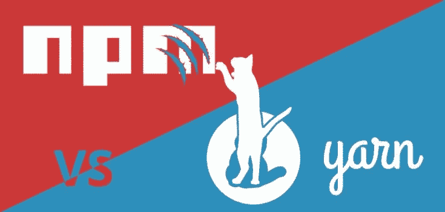
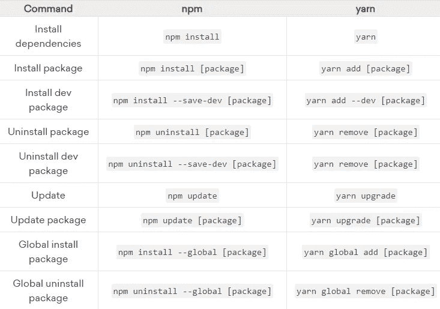

# npm 与 Yarn —选择正确的包装管理器

> 原文：<https://javascript.plainenglish.io/npm-vs-yarn-choosing-the-right-package-manager-a5f04256a93f?source=collection_archive---------0----------------------->

Image source: [https://www.ryadel.com/en/yarn-vs-npm-pnpm-2019/](https://www.ryadel.com/en/yarn-vs-npm-pnpm-2019/)

**npm** 和 **Yarn** 都是优秀的 Node.js 和 Javascript 包管理器。但是你有没有想过，在已经有 npm 的情况下，为什么还要开发 Yarn？它是由脸书建造的，用来解决他们在 npm 中面临的主要问题，例如软件包安装速度较慢，以及 npm 中的一些安全问题。在本文中，我将比较这两种包管理器，以便您可以决定哪一种更适合您的需要。

# 包的并行安装

安装软件包时，它会执行一组任务。在 npm 中，安装多个软件包时，它会等待一个软件包完全安装完毕，然后再移动到另一个软件包。即，任务是按包顺序执行的。Yarn 并行安装这些任务，从而提高**性能**和**速度**。

为了测试这一点，我使用 npm 和 Yarn 安装了`react`,我惊讶地看到了结果。时间是:

*   每分钟 3.572 秒
*   纱线— 1.44 秒

# 自动锁定文件生成

npm 和 Yarn 都在`package.json`文件中跟踪项目的依赖项及其版本号。每当您安装依赖项时，您可能会注意到依赖项的版本可能会在版本号前以`^`开头。这意味着每当我们在另一台机器上安装所有的包，或者手动运行命令来安装时，包管理器会寻找新发布的版本。如果有更新的版本，那么会自动安装，而不是程序包文件中提到的版本。如果你不想自动修改你的包，有两种方法可以避免这种情况，一种是生成一个锁文件，这样每次只安装一个特定的版本，另一种是删除包文件中的`^`。

当添加依赖项时，Yarn 会自动添加一个`yarn.lock`文件。在 npm 中，`npm shrinkwrap`命令也会生成一个锁文件。但是，不同之处在于 Yarn 总是创建和更新`yarn.lock`文件，而 npm 默认不创建锁文件。只有当`npm-shrinkwrap.json`存在时，它才会更新。npm v5.0 附带了一个名为 lock.json 文件的新包，并且真诚地抛弃了 npm-shrinkwrap 系统。这有效地增强了安装过程和性能，即使它还没有达到纱线的速度水平。

# 安全性

npm 会自动执行一段代码，这段代码允许其他包被包含进来，从而导致安全系统中的几个漏洞。另一方面，Yarn 安装那些只来自 yarn.lock 或 package.json 文件的文件。因此，它被认为比 npm 软件包更安全。

# 纱线 vs npm 命令

Image from [Digital ocean](https://www.digitalocean.com/community/tutorials/nodejs-npm-yarn-cheatsheet)

# **最终概述**

两者都有两套不同的好处和功能，以不同的方式帮助用户。与 npm 相比，Yarn 效率更高。但是，Yarn 也要对占用大量硬盘空间负责。Yarn 是一个较新的包，人们对 Yarn 超过 npm 持怀疑态度，因为它太老了，但是 Yarn 随着更好的稳定性和安全更新变得越来越受欢迎。还必须注意的是，npm 也试图赶上其他包管理器，因为开发人员正在为它工作。

感谢阅读！

[Subscribe to Decoded, our official YouTube channel!](https://www.youtube.com/channel/UCtipWUghju290NWcn8jhyAw)