# Auth0 简化了 Nuxt.js 认证(包括刷新令牌！)

> 原文：<https://javascript.plainenglish.io/nuxt-authentication-made-easy-with-auth0-9c20cc690462?source=collection_archive---------1----------------------->

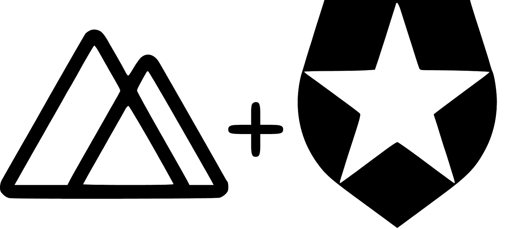

[Nuxt.](https://vivicrema.cremaonline.it/Domicilio/)js + Auth0

# 我为什么要这么做？

我最近决定探索一种现成的身份验证服务，因为我厌倦了一次又一次地重新实现身份验证

我发现 [Auth0 文档](https://auth0.com/docs/getting-started)非常容易理解，最重要的是，整个认证流程在 SPAs 中非常容易实现

表单验证 0 网站:

> 快速集成 web、移动和传统应用程序的身份验证和授权，以便您可以专注于核心业务。

专注于你的核心业务！

这是我们应该永远记住的事情。

# 入门指南

本教程解释了如何使用 [Auth0](https://auth0.com/) 和 PKCE 认证流为 [Nuxt.js](https://nuxtjs.org/) SPA 设置认证

我们将学习以下内容:

*   设置 Auth0 客户端
*   设置一个 [Nuxt.js](https://nuxtjs.org/) SPA
*   将我们 SPA 中的 Auth0 与 [auth0-spa-js](https://github.com/auth0/auth0-spa-js) 集成

# Auth0 客户端设置

首先，我们要定制 Auth0 登录框

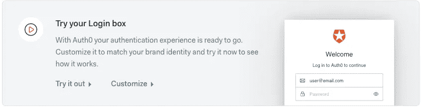

Click on customize button

然后，从 Auth0 的**应用程序**中，点击**创建应用程序**

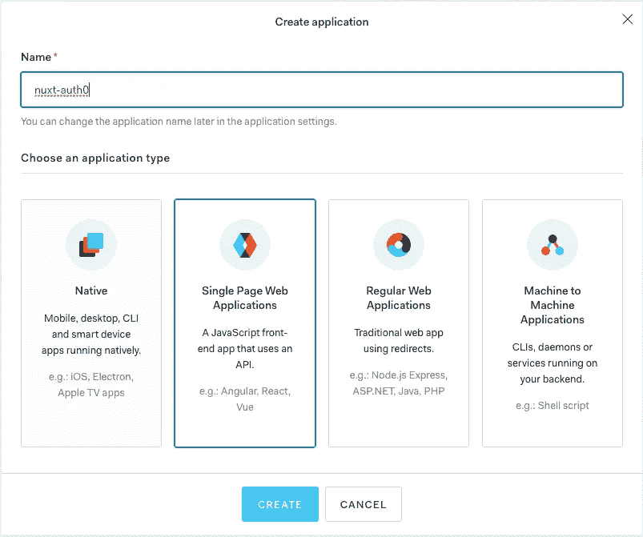

Give it a name and select Single Page Web Applications Type

在打开的配置页面上，选择**设置**选项卡

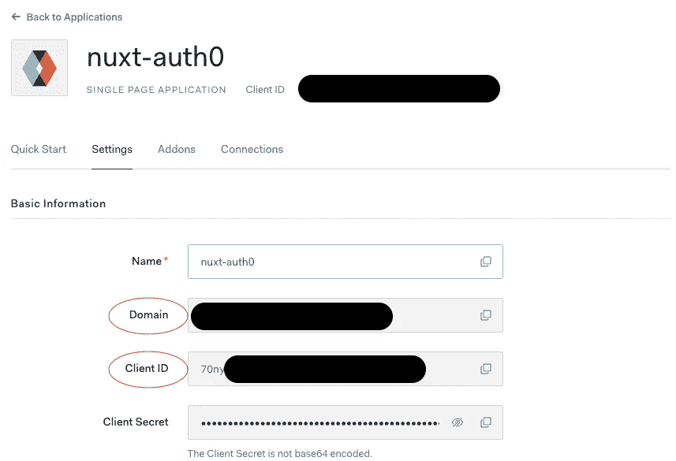

Copy Domain and Client ID values for later use

滚动页面，将[*http://localhost:3000*](http://localhost:3000)*添加到每个应用 URI(应用登录 URI 除外)*

*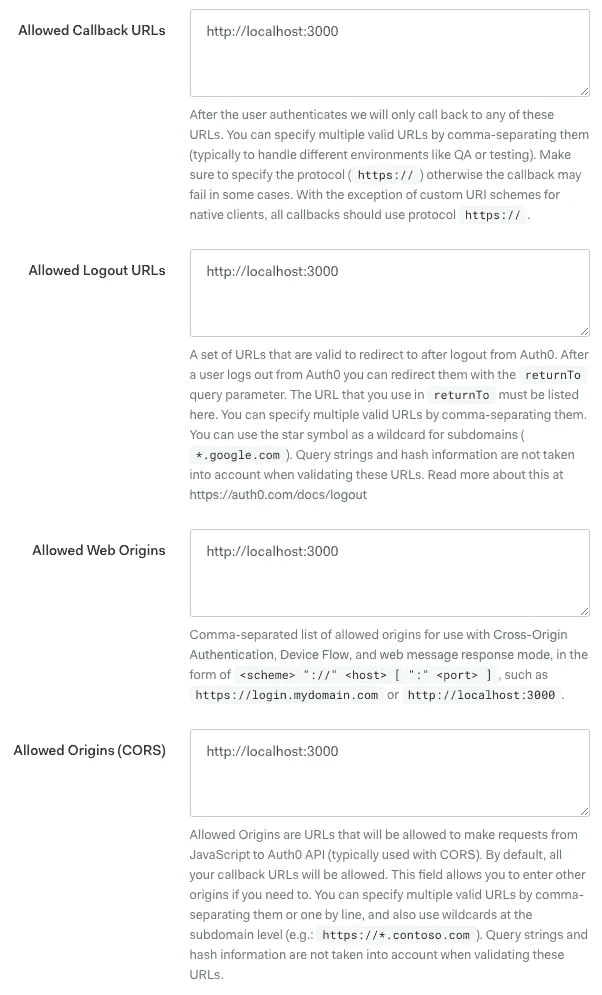*

## *刷新令牌*

*我们现在能够选择我们的应用程序需要哪种类型的刷新令牌。*

*系统会提示我们在两种刷新令牌行为之间进行选择:*

*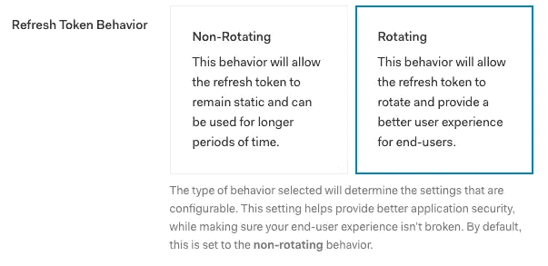*

*I suggest to select Rotating*

*刷新令牌循环会发出新的刷新令牌，并使前任令牌失效。我们可以很容易地说**轮换刷新令牌降低了泄露刷新令牌的风险**。*

*更多关于刷新令牌循环[的信息，请点击](https://auth0.com/docs/tokens/concepts/refresh-token-rotation)。*

*我们将被要求输入刷新令牌的生命周期和重用间隔*

*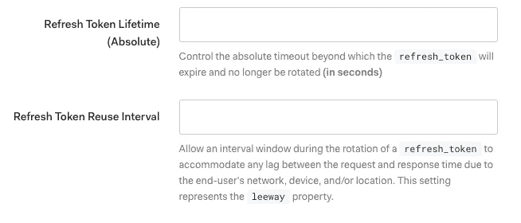*

*Look at [this](https://auth0.com/docs/tokens/guides/configure-refresh-token-rotation) page for help choosing this values*

*现在打开**高级设置，**选择**授权类型**选项卡并确保选择*授权码*和*刷新令牌*复选框*

*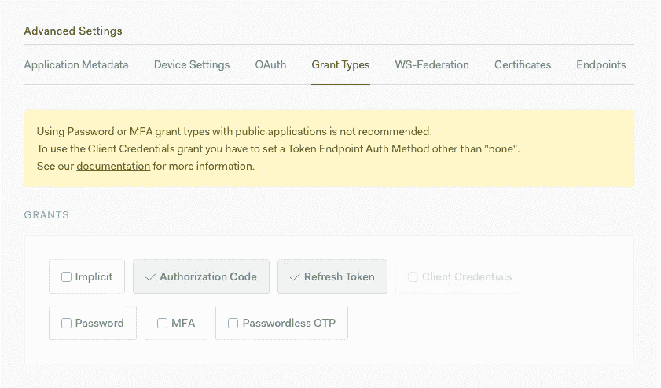*

*最后，点击**保存更改。***

# *Nuxt.js SPA 设置*

*从创建一个全新的 [Nuxt.js](https://nuxtjs.org/) 应用程序开始*

```
*create-nuxt-app nuxt-auth0*
```

*CLI 工具现在将询问几个问题。
重要提示:当要求渲染模式时，选择单页应用*

```
*? Choose rendering mode
  Universal (SSR)
❯ Single Page App*
```

*完成后，我们可以访问新创建的文件夹，并通过键入(基于我们之前选择的包管理器)来启动应用程序*

```
*yarn dev//ORnpm run dev*
```

*让我们看看在[运行的应用程序，http://localhost:3000](http://localhost:3000) 。*

*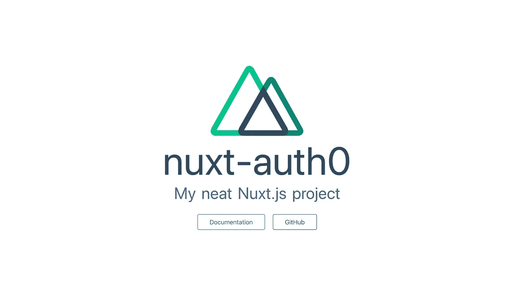*

*[http://localhost:3000](http://localhost:3000)*

*是时候保护我们的索引页面了，为此，我们安装了 [auth0-spa-js](https://github.com/auth0/auth0-spa-js)*

## *auth0-spa-js*

```
*yarn add @auth0/auth0-spa-js//ORnpm install @auth0/auth0-spa-js*
```

***注意**:安装 auth0-spa-js 库时，很有可能会在 Nuxt 控制台遇到错误:这个包需要安装`core-js@2`。*

```
*yarn add core-js@2//ORnpm install --save core-js@2*
```

*我知道`core-js@2`已经不存在了，但是我不知道哪个是问题(如果你找到了解决方案，写在下面的评论部分🙏)*

*现在，我们创建一个名为 **auth0.js** 的新插件。*

*Insert domain and client ids saved before*

*这样，我们可以在项目的每个文件中访问 *$auth0* 。*

*然后，我们将刚刚创建的插件添加到 **nuxt.config.js** 文件中*

*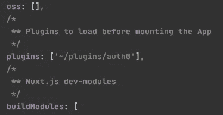*

*接下来，我们希望使用一个处理登录后回调的中间件来保护我们的索引页面，尝试刷新访问令牌，然后如果用户未通过身份验证，则重定向到 Auth0 登录框*

***注意**:该功能首先尝试处理登录重定向回调。如果请求的受该中间件保护的页面是登录后调用的第一个页面**而不是**，则`handleRedirectCallback`函数会抛出一个错误。
我们通过调用`getTokenSilently` 来检查用户是否通过认证:如果出现否定的响应(可能是我们根本没有通过认证，或者访问令牌已经过期，无法刷新)，用户会被重定向到显示 Auth0 登录框的 Auth0 `/authorize` url(带有`redirect`功能)。*

***注释 2** :如果我们有多个页面需要保护，我们可以获取我们试图访问的 URL(`target.fullPath`)并将其传递给`buildAuthorizeUrl`调用。该 URL 将在验证后返回到应用程序，并用于将我们重定向到登录前试图到达的位置。*

***注 3** :注意我们用`buildAuthorizeUrl`代替`loginWithRedirect`。这是避免 [Nuxt.js](https://nuxtjs.org/) 呈现请求页面的唯一方法，即使我们没有被认证。原因是`loginWithRedirect`呼叫`window.location.assign(url)`*

*最后，我们将中间件和注销按钮添加到页面中*

*这就是我们所需要的，现在是时候在 [http://localhost:3000](http://localhost:3000) 上查看所有的活动了*

***TL；此时，你可能会很容易地问我:*你为什么不使用伟大的* [*Nuxt.js Auth 模块*](https://auth.nuxtjs.org/) *？*
目前，Auth 模块只提供隐式授权流。
**PKCE 认证流程和隐式授权流程有什么区别？*****

> *带有隐式授权流的访问令牌在客户端公开，并且不返回刷新令牌，因为浏览器不能保持其私有性。*

*如果你想进一步了解，点击[这里](https://tools.ietf.org/id/draft-ietf-oauth-security-topics-12.html)。*

# *首次访问*

*当我们试图访问 http://localhost:3000 时，我们将被重定向到 Auth0 登录框*

*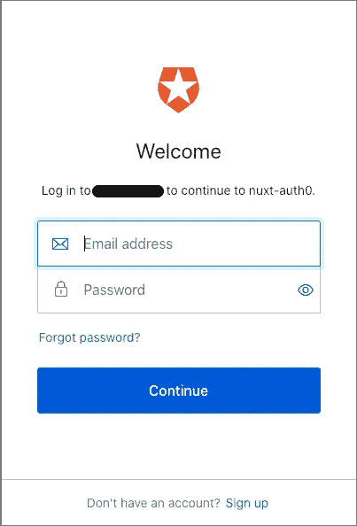*

*一旦创建了用户，nuxt-auth0 应用程序将请求访问我们的租户帐户*

*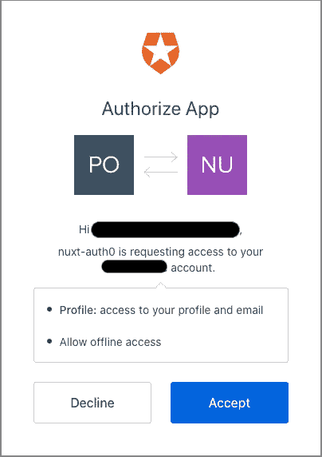*

*Allow offline access is requested because of refresh tokens.*

*单击“接受”后，我们将重定向到我们的索引页面。*

*差不多就是这样。*

*我希望这个教程对你有帮助！*

***资源***

*你可以在这个 [GitHub 库](https://github.com/abelland/nuxt-auth0)中找到最终代码*

***用简单英语写的 JavaScript 笔记***

*我们已经推出了三种新的出版物！请关注我们的新出版物:[**AI in Plain English**](https://medium.com/ai-in-plain-english)，[**UX in Plain English**](https://medium.com/ux-in-plain-english)，[**Python in Plain English**](https://medium.com/python-in-plain-english)**—谢谢，继续学习！***

***我们也一直有兴趣帮助推广高质量的内容。如果您有一篇文章想要提交给我们的任何出版物，请发送电子邮件至[**submissions @ plain English . io**](mailto:submissions@plainenglish.io)**，使用您的 Medium 用户名，我们会将您添加为作者。另外，请让我们知道您想加入哪个/哪些出版物。*****