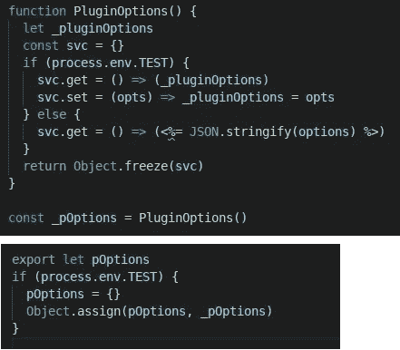
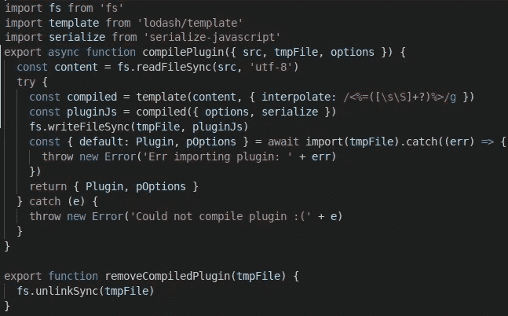
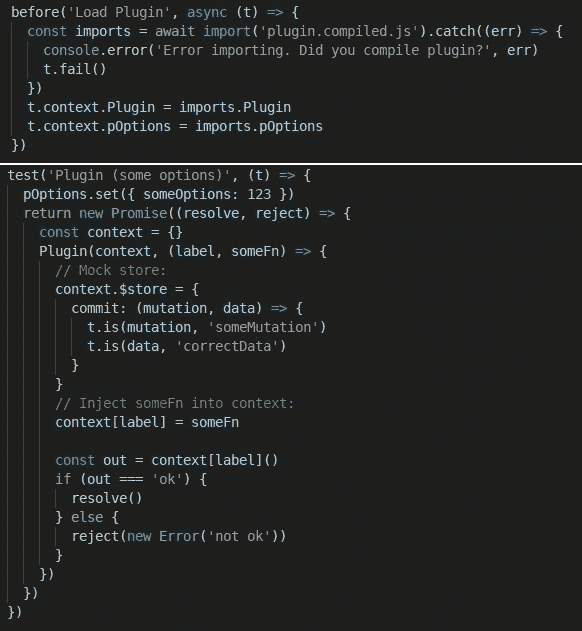
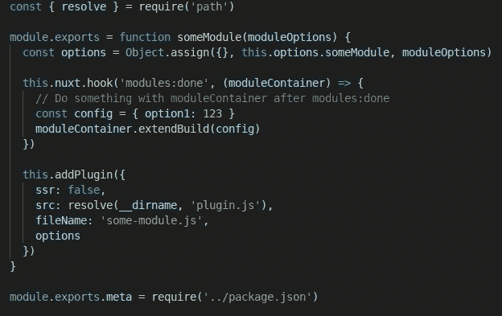
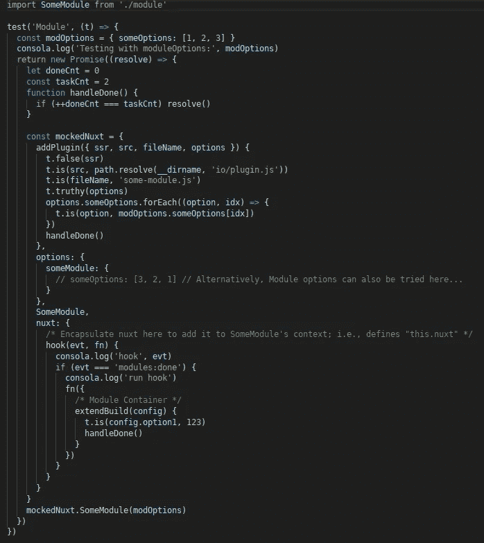

# Nuxt 自动化测试:棘手的部分

> 原文：<https://javascript.plainenglish.io/nuxt-automated-testing-the-tricky-parts-773f04481dd0?source=collection_archive---------4----------------------->

TL；DR——如果您点击了这篇文章，很可能您已经有点不知所措，试图对您的 Nuxt 应用程序的某些部分进行自动化测试。全面覆盖测试是另一个挑战，但值得努力。因为已经有很多很好的文章非常详细地描述了一般的自动化测试，所以本文将关注细节:主要是插件、模块和端到端测试的一些方面。

TL；DR2(2021 年 11 月 29 日更新)——随着 Nuxt3 的推出和 Nuxt 2.x 的最新稳定版本，这篇文章的大部分内容可能会过时。该框架已经更新，使得传递插件选项变得更加容易，因此自本文最初撰写以来，测试已经大大简化。

知识渊博和/或缺乏耐心的人可能希望跳过介绍，直接从下面的“测试 Nuxt 插件”部分开始。

**先决条件:**

*   讨论的软件利用了 [ava](https://github.com/avajs/ava) 测试框架(只是个人偏好)。不管选择了什么样的特定框架，测试框架通常是如何构造的知识应该有助于读者理解所示的代码。在 ava 中，`test`代表测试步骤，`t.is`、`t.true, t.pass, t.fail`用于执行断言，`t.timeout`用于控制给定测试步骤的超时。
*   这个讨论的软件利用[NYC/伊斯坦布尔](https://github.com/istanbuljs/nyc)命令行工具来获得测试覆盖。

**设置:**

*   在`npx create-nuxt-app`期间指定一个测试框架应该已经成功地设置好了一切。如果没有，请咨询我的 [Github repo](https://github.com/richardeschloss/nuxt-socket-io) ，它已经设置了测试、覆盖和 CI/CD。(很大程度上归功于 [Vinayak Kulkarni](https://medium.com/u/2853bf3e5a26?source=post_page-----773f04481dd0--------------------------------) ，因为他的[回购](https://github.com/vinayakkulkarni/nuxt-ava-e2e-unit-testing)是我测试工作的基础)。复制并运行已知的工作代码应该是最简单的开始方式。
*   也已经有很多很棒的文章详细描述了正确的测试设置。这种详细程度是值得的，但超出了本文的范围。

**简介:**

我喜欢成为某种程度上的极简主义者:我只想编写需要的代码。同样，说到测试，我只想测试我需要做的事情*。尽管很痛苦，我还是选择测试覆盖率，因为这样做总是会挤出两样东西:1)死代码和 2)诚实。当我说代码没有膨胀，100%的覆盖率就是证明。例如，任何人都可以在他们的测试中像这样撒谎:*

```
test('all my code', (t) => t.pass())
```

这个测试总是会通过，并且测试报告会说“通过”，但是如果眼睛也看到 0%的覆盖率，他们会知道没有代码被实际测试。

作为前面提到的目标的必然结果，我也只想模仿*我需要*做的事情。我不想嘲笑这个星球，只是最基本的东西。

**测试 Nuxt 插件:**

关于 Nuxt 插件，可以说一件至关重要的事情:插件并不完全是 JavaScript。它们看起来和感觉上都像 JavaScript，但是…这有点像幻觉。Nuxt 插件实际上是一个*预编译的 JS 模板*，Nuxt [在构建你的应用时会编译这个模板](https://github.com/nuxt/nuxt.js/blob/92c7f4ed249466870a477798f910c84eb1fdd18d/packages/builder/src/builder.js#L574)。具体来说，就是 Nuxt 用 [lodash](https://lodash.com/docs/4.17.15#template) 编译的嵌入式 Ruby ( [ERB](https://ruby-doc.org/stdlib-2.6.5/libdoc/erb/rdoc/ERB.html) )模板。使用这些模板是为了让 Nuxt 可以用您在 nuxt.config 中指定的插件选项来编译您的插件:

nuxt.config:

```
{
  ...
  plugins: [ './Plugin.js', { options: { userId: 123 } } ]
  ...
}
```

插件. js:

```
const myPluginOptions = <%= JSON.stringify(options) =>
```

当 Nuxt 构建您的应用程序时，编译后的插件将如下所示:

```
const myPluginOptions = { userId: 123 }
```

这看起来很简单，然而，当测试`‘./Plugin.js’`时，很可能需要用不同的选项进行测试。乍一看，似乎每个选项集都需要一个单独的编译步骤，写入`plugin.compiled.js`，然后将编译后的插件导入到测试中。然而，再次导入插件将要求我们记得清除先前持有的 require 缓存，否则，我们将总是用第一个选项集进行测试。此外，如果我们一次又一次地覆盖已编译的插件，我们在技术上改变了覆盖工具使用的源地图，从而使 100%的覆盖捕获无法实现。相反，如果我们选择编写多个编译后的文件，我们将得到这些文件的单独覆盖率，并且总覆盖率不会显示为 100%，即使一个文件有 10%，而另一个文件有 90%。但是，我们的目标仍然是报告 100%的总数，因为 CI 系统通常使用这个数字。

通过对插件处理选项的方式进行一些调整，测试可以变得更加容易:



Plugin Options: Another Approach

这里的想法是仅在测试模式下将 getters 和 setters 包装在插件选项周围。在任何其他模式下，插件选项将被限制在插件的范围内，setters 被禁用，插件选项仅来自`nuxt.config`。这样，插件只需要在所有测试运行之前编译一次，测试可以根据需要提供任意多的选项。

要编译上面的插件，人们可能认为用`lodash/template`就可以了，使用默认设置:

```
const content = (read plugin.js)
const compiled = template(content) // Problems await...
```

然而，这段代码忽略了一个关键的警告。在撰写本文时，`lodash`默认情况下不仅编译 ERB 模板，还编译 ES6 模板文字字符串。如果插件的代码编写如下:

`const errMsg = `${err} do something``

`lodash`的`compiled` 函数将期望被提供一个已定义的`err`，以便它可以相应地替换`err`令牌:

```
let pluginJS = compiled({options}) 
// --> lodash throws error: "err undefined!"const pluginJS = compiled({options, err: 'Umm'})
// --> lodash will create:
// const errMsg = 'Umm do something'
//(Probably not what you want)
```

然而，最有可能的是，当在你的插件中使用 ES6 模板文字时，你可能期望*你的代码*，而不是`lodash`来替换令牌。如果确实如此，`lodash`只需要一个插值覆盖，它只指定 ERB 模板，而不指定*ES6 模板文字(仅供参考，这正是 Nuxt 构建器所做的):*



Compile Plugin Example (with interpolate override)

上述示例将编译一个包含以下内容的插件:

```
// Using JSON.stringify (preferred)
const pluginOptions = <%= JSON.stringify(options) %>/* Using serialize (discouraged, but required if options contains functions)*/
const pluginOptions = <%= serialize(options) %> let err = 'Real error this time'
let errMsg = `${err} occurred`
// --> errMsg = 'Real error this time occurred'
// --> Your code replaced "err", lodash did not, as expected.
```

既然已经讨论了编译插件的方法，我们就来讨论插件测试和嘲讽。Nuxt 中的许多插件都有一个类似如下的结构:

```
function someFn(args) { const out = [do something with args]
  this.$store.commit('someData', 'correctData')
  this.$store.commit('someData', 'incorrectData')
  return out
}export default function(context, inject) { inject('someFn', someFn)
}
```

可以，Nuxt 插件可以和 Vuex 商店交互(`$store`附属于`this`)。但是，为了测试这个示例插件，我们不需要重新创建所有的 Vuex，只需要重新创建提交方法。所以，假设上面的插件被编译成一个临时文件`plugin.compiled.js`，我们可以这样测试它:

在所有测试之前，通过动态导入来加载编译后的插件`plugin.compiled.js`。然后，对于实际的插件测试，模拟上下文和注入函数。当插件运行时，在某些方法运行之后运行断言，在本例中是在调用`$store.commit`之后。这里需要注意的一个关键点是`$store`和`someFn`被封装在同一个对象中，这样当`someFn`点击它时`this`和`this.$store`被定义。



Loading Plugin with Mocks in Place

对于这个特殊的例子，有了这些检查，当插件提交不正确的数据时，测试应该会失败。即使测试将获得几乎 100%的覆盖率，它仍然会有一部分失败(这对我们的测试来说是一件好事！).

**测试 Nuxt 模块:**

Nuxt 中的许多模块具有以下结构:



Example Module

在上面的代码中，分配了模块选项，注册了一个 nuxt 挂钩，并添加了一个插件。幸运的是，为了测试这个模块，我们不需要模仿所有的 Nuxt，只需要模仿我们需要的部分。下图显示了这一点:



Example: Mocking to Test Nuxt Module

如上图所示，当`SomeModule`运行，遇到`this.nuxt`和`this.addPlugin`时，没有真正的 Nuxt 运行，也没有真正的插件添加正在进行。为了测试这个模块，这就有点过分了。编写测试是为了验证对于我们提供的选项，模块是否按照我们想要的方式响应。

并且，像在插件测试示例中一样，将模块封装在一个也包含模拟的对象中，在使用时为“`this`”提供了适当的上下文。

**Nuxt 端到端测试:**

关于端到端(e2e)测试(不仅仅是针对 Nuxt)需要知道的一件重要事情是，它通常需要更长的时间来运行，并且可靠地运行*可能更具挑战性。当运行 e2e 测试时，通常会有更多的事情超出测试人员的控制。例如，一些 e2e 测试需要在 Nuxt 上等待构建应用程序的所有*和*，这个时间不是恒定的，但通常会相对较长。必须为设置超时设置任意值。此外，当运行测试时，无法控制路由呈现时间，因此也需要指定任意的测试超时。因此，当希望只知道*增量代码变更的效果时，将 e2e 测试推迟到*单元测试通过后的*可能是个好主意。**

*然而，e2e 测试仍然提供了应用程序性能或退化的良好指示，并且在适当的情况下可能值得执行。幸运的是，Nuxt 有一些方法可以帮助我们对此进行量化:`renderRoute`和`renderAndGetWindow`。前者只给出 html(如果需要，需要传递给 JSDOM)，后者给出窗口(已经附加了 DOM)。可以通过以下方式检查性能:*

```
*test('Render time', async (t) => { const t.timeout(3000) // Rendering should take <= 3 sec console.time('renderTime')
  const window = await nuxt.renderAndGetWindow('localhost:3000') console.timeEnd('renderTime')
  // --> renderTime: 2500 ms t.pass() // Test passes if we get here in <= 3 sec
})*
```

*记录时间不是必要的，但仍然是有用的。分析呈现时间的 CI / CD 系统可以发现 web 应用程序的某些方面何时变得更糟，并抢先提供警告。也就是说，测试可能会连续通过，但可能会报告:“renderTime: 2500 ms，2600 ms，2700 ms…[接近失败，警告某人]”*

*在上面的代码中可能不太明显的是，隐藏在呈现方法中的是这些方法在内部使用的全局加载超时。设置`t.timeout(3000)`不会覆盖那些内部超时。相反，为了覆盖那些，`globals`属性只需要在`nuxt.config`中更新:*

```
*globals: {
  loadingTimeout: 5000
}*
```

*最后，需要注意的一件重要事情是:`nuxt.renderRoute`和`nuxt.renderAndGetWindow`将只在你构建并启动的 Nuxt 实例上工作，这一点可能很明显，也可能不明显，尤其是如果你来自 Selenium Webdriver 思维模式的话。Nuxt 不能神奇地与您已经在机器上启动的所有单独的 Nuxt 实例进行交互。因此，如果您计划运行两个单独的 Nuxt 实例，一个用于实际的应用程序(`npm run dev`)，另一个用于检测 UI ( `npm run test:e2e`)，那么单独实例中的测试将无法呈现应用程序的路径。对于这种工具，像 Selenium、Nightwatch、Cypress 这样的工具可能更适合本文。*

***其他棘手的部分(非 Nuxt 特有):***

*输入验证。在这方面我不会涉及太多细节，因为输入验证是一个更广泛的话题，不仅仅适用于 Nuxt 测试。我要说的是:代码仍然有可能通过测试并达到 100%的覆盖率，并且*仍然*引起用户的关注。测试可能不总是以用户可能的所有方式提供输入，并且对于验证具有嵌套复杂性的混合数据类型将花费多少计算成本，这是一个工程决策。*

***结论:***

*本文涵盖了自动化 Nuxt 测试时可能面临的一些不太明显的挑战。本文探讨了专门测试 Nuxt 插件、模块以及使用 Nuxt API 进行 e2e 测试的问题。关键的一点是，当你迭代时，只测试你所需要的，把全面的测试委托给你云中的 CI 系统。获得对测试的完全控制可以让这个过程变得更加愉快、可行和不那么令人畏惧。尽管乍一看可能不是这样，但在许多情况下，正确完成的自动化测试可以比热模块重载更快地给你带来满足感，尽管这听起来很疯狂。热模块重载是 web 开发中最整洁的事情之一，我觉得，然而我仍然认为自动测试的热重载更酷。只是我的看法。*

*测试愉快。我希望我在您的测试工作中为您节省了大量时间。*

*还在迷茫？受挫？在 [Linkedin](https://www.linkedin.com/in/richardeschloss/) 上找到我，让我知道我能帮上什么忙！*