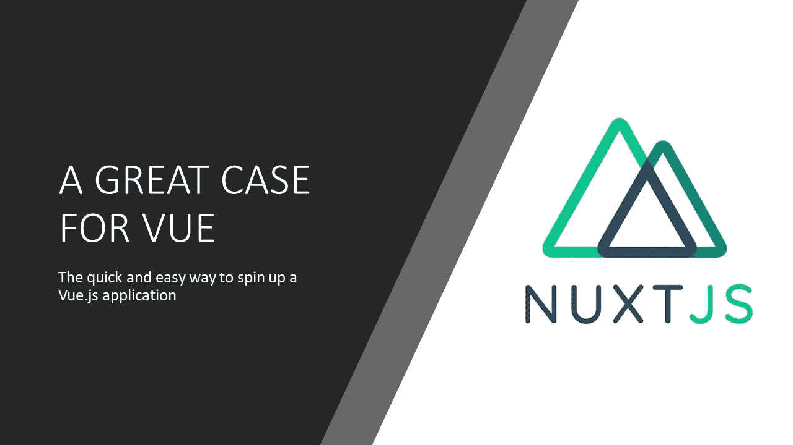
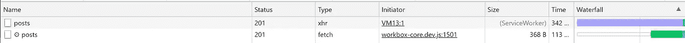
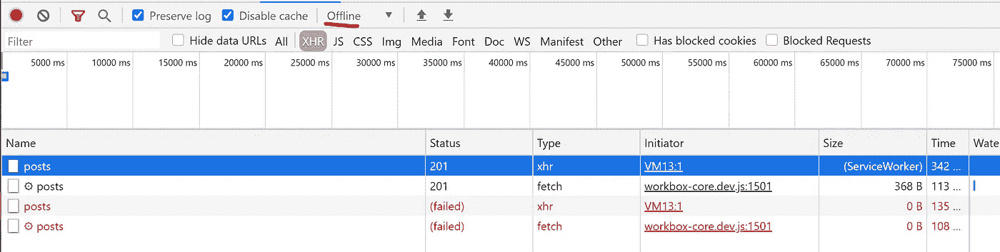
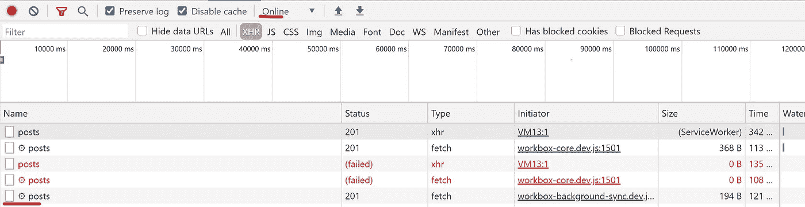

# 如何用 Nuxt.js 创建离线优先 PWA

> 原文：<https://javascript.plainenglish.io/nuxt-offline-first-pwa-tutorial-782df70b535?source=collection_archive---------4----------------------->

## 使用 Nuxt 在 Vue.js 中设置支持离线的应用程序的快速教程



# 我爱 Vue

我喜欢 Vue.js。这是一个奇妙的 JavaScript 框架——在我看来很容易超越其他产品——这说明了一些问题，因为我认为它们也很酷。是的，他们比 Vue 做得更好。他们中的一些人在 Vue 和 Vue 后来采用它之前就已经做了一些事情。但即便如此，还是有充分的理由支持 Vue。

快速浏览一遍:

1.  Vue 有很好的学习曲线。
2.  它鼓励在遗留项目中逐步采用。
3.  发展是由社区需求驱动的。
4.  Vue 维护者与其他框架维护者有着友好的关系，允许思想和概念的自由交流。

# 也许有些事情可以更好

这里还有更多的观点，但是，让我继续对 Vue.js 进行批评——根据您打算构建的应用程序的类型或应用程序的大小，搭建 Vue.js 应用程序，即使是使用 CLI 也可能是一件苦差事。

此外，关于创建 Vue 应用程序有一些必须注意的细节——这并不困难，但如果你打算使用 Vuex 或 Vue 路由器，那么在你可以启动商店或期望你的路线工作之前，需要少量的配置。

在保存文件的地方，是否有一个组件文件夹，或者如何进行布局，可能会有相当多的变化。当然，Vue CLI 在搭建新项目时会有所帮助，但是，例如对于 Vue 路由器，您需要继续修改 router index.js，以便准确记录路由。

这是很小的变化，但随着应用程序的不断发展和变化，很容易被遗忘。虽然任何应用程序，不管是什么语言或框架，最终都会有一个需要维护的项目清单，但我们应该尽可能保持清单较小，并在有意义的时候实现自动化。

# 输入 Nuxt.js。

如果我正在创建一个新的 Vue 项目，除非它非常小，否则我很少会使用 Vue CLI 而不是 Nuxt。Nuxt 让一切变得简单。路由已经预先配置好，并根据目录结构动态确定。它很容易理解用于确定布局、中间件和组件的选项。

事实上，你可以把这个博客的结构看作一个例子。这里是 [GitHub](https://github.com/RobotOptimist/macivor) 。

Nuxt 可以扮演很多角色。在这个博客中，它是一个基于 git 的 CMS 和静态站点生成器。但是我也用它创建了一个单页面应用程序，为浏览器提供了丰富的体验。它可以是一个通用的应用程序，非常容易地提供预渲染甚至服务器端渲染的页面。事实上，要创建服务器端呈现的应用程序而不是单页面应用程序，下面是 nuxt.config.js 中的配置行:

```
ssr: true, // will be a spa if set to false
```

如果不提供示例，很难描述如何使用 Nuxt——所以让我们一起创建一个 Nuxt 应用程序。

# 应用要求示例

首先，让我们得到一些要求。

让我们把它变成一个调查应用程序。是给需要定期检查消防栓的消防栓检查员用的(很确定这是个假工作)。所以它有这些要求:

1.  需要用户登录。
2.  以表单形式收集消防栓的相关数据。(消防栓序列号和状况)
3.  必须离线工作(消防栓并不总是在手机信号塔或无线网络附近)。
4.  连接(或重新连接)时必须传输消防栓数据。
5.  适合在手机或平板电脑上工作。

好极了。让我们对应用程序的架构做出一些决定。

它需要一个登录，所以我们将使用 Auth0。Auth0 将允许我们与其他认证系统集成，因此我们可以支持各种消防栓检查员公司。

它需要一个表单，所以我们将使用 bootstrap 来满足这个需求。还有更新更好的(？)，CSS 框架可用，但 bootstrap 将通过很少的工作为我们提供所需的一切(以及许多我们没有的东西)。

嗯，需求 3、4、5 确实指向 PWA ( [渐进式 Web 应用](https://web.dev/what-are-pwas/))。因此，我们也将使这个应用程序成为 PWA。

好的。现在怎么办？所有这些都可以通过 Nuxt 来完成。

# 用 Nuxt 做

对于认证，我们可以使用 [@nuxtjs/auth](https://auth.nuxtjs.org/) 。这很完美，因为它内置了与 Auth0 的集成。但是如果我不想使用 Auth0，它内置了对一些其他身份验证提供者的支持，或者我们可以扩展它以使用我们需要的任何身份验证提供者。

Nuxtjs/auth 有一个对 ajax 库 [@nuxtjs/axios](https://axios.nuxtjs.org/) 的依赖——这很完美，因为我们无论如何都需要它来传输表单数据。

我们还需要创建这个表单。我们选择了 bootstrap，所以我们将使用 [bootstrap-vue](https://bootstrap-vue.org/docs#getting-started-with-nuxtjs) ，它有一个方便的 Nuxt.js 模块来简化这一切。此外，bootstrap-vue 有一种方法来指定我们正在使用哪些 bootstrap 特性，因此我们可以使用 webpack(内置于 Nuxt 中)来清除其余的特性。太好了！对于 bootstrap 的缺点来说，这并不是一个完美的解决方案，但也是有意义的。

最后，我们有这个 PWA 要求。这也有一个模块。 [@nuxtjs/pwa](https://pwa.nuxtjs.org/setup) 看起来拥有我们需要的一切。它将处理所有的图标和清单，并允许我们轻松地注册一个服务人员，并确定当用户离线时应该使用什么路线和行为。

现在，注意所有我不需要指定的东西。我不需要调用 Vue 路由器，因为它已经在混合中。Vuex 也在里面，它是 nuxt/auth 的依赖项，但是我们自己可能不需要它。

我们通过运行以下命令来创建项目:

```
npx create-nuxt-app <project-name>
```

在运行时，它将允许我们使用一些选项来引入一些依赖项。PWA 是一个选项，但是仍然需要额外的 npm 安装。我们也将使用 Axios，所以现在使用它更有意义。我们也可以选择 bootstrap，或者其他 CSS 框架。

让我们继续并引入身份验证模块:

```
npm install @nuxtjs/auth
```

如果您还没有安装，请确保安装 Axios:

```
npm install @nuxtjs/axios
```

然后我们修改 nuxt.config.js 以添加到 modules 属性:

```
modules: [
  '@nuxtjs/axios',
  '@nuxtjs/auth'
],
auth: {
  // Options
}
```

脚手架工具也帮助我们选择了一个测试工具。我选择了 Jest。

谢谢提醒 Nuxt！测试很重要。但是我不会在本教程中讨论测试，抱歉。

最后，@nuxtjs/auth 提醒我们需要通过在存储目录中添加 index.js 文件来初始化 Vuex 存储。Nuxt 将自动导入 Vuex，并在添加 index.js 文件时对其进行配置。(这可以防止 Vuex 被添加到不需要它的项目中。)

接下来，让我们引入 PWA 模块:

```
npm install @nuxtjs/pwa
```

别忘了建立我们的清单！

```
pwa: {
  manifest: {
    name: 'Fire hydrant surveyor',
    short_name: 'Hydrant Surveyor',
    lang: 'en',
    display: 'standalone',
  },
}
```

Nuxt PWA 实际上是一个 5 个不同的模块，其中只有一个将需要我们的一些自定义代码。

*   图标模块——它将为 PWA 图标配置图标并使其可用。
*   元模块——它将为移动应用程序设置一些通用选项。
*   清单模块—使用配置的值创建清单文件。
*   工作箱模块——允许设置服务工作者和可缓存资源——这是我们为离线行为做大量工作的地方。
*   一个信号模块——注入一个 API，允许在移动设备上创建推送通知。

让我们来看看这一切是什么样子的:

[这里是](https://github.com/RobotOptimist/demo_survey_app/tree/initial-setup)。

就这样，我们有了一个具有 PWA 功能的功能应用程序，一个 CSS 框架和内置的身份验证。

此时，我们应该考虑我们剩余的任务:

1.  创建一个 Auth0 帐户，并将适当的信息添加到 nuxt 配置中。
2.  使用 auth0 登录和消防栓调查表构建适当的页面。
3.  将可缓存资产添加到 workbox(包含在 PWA 模块中)。
4.  配置和自定义服务人员来处理离线工作流。

让我们去争取吧。从#1 开始。

创建一个 Auth0 账户非常简单。可以使用 GitHub 登录。Auth0 会自动为您设置一个应用程序。然后，您可以获取 nuxtjs/auth 模块所需的所有信息。你需要在 Auth0 应用程序设置中设置一些东西，比如允许的来源，允许的回调 URIs 等等。你可以参考 [Auth0 文档](https://auth0.com/docs/get-started/dashboard/application-settings)来了解如何操作。

在 nuxt.config.js 中，您需要定义重定向和策略对象。请注意，回调和登录不能是相同的值。该模块需要路由到不同的页面，以便完成对从登录事件返回的用户数据的处理。

在 nuxt.config.js 中:

```
auth: {
  redirect: {
    login: '/',
    callback: options.redirectUri
  },
  strategies: {
    local: false,
    auth0: {
      domain: options.domain,
      client_id: options.client_id,
    }
  }
},
```

options 对象在一个单独的文件中定义:auth_config.js。为了方便起见，我为我的项目这样做了，但是对于一个真实的项目，我将使用一个. env 文件，这样我就可以通过 CI/CD 管道为每个环境注入正确的值。

```
export const options = {
  domain: '...',
  client_id: '...',
  redirectUri: '/signed-in' //or whatever you configure in Auth0 Application Settings
}
```

虽然其中包含的值不是机密的，但还是建议不要将该文件签入源代码管理。您可以稍后修改此文件，使其具有受众属性，并根据构建环境更改这些值。

接下来，我们将修改主路由以包含一个登录按钮。

```
<div class="links">
  <button
    class="button--green"
    @click="login"
  >
    Login
  </button>
</div>
```

我们将在 Vue 实例中定义一个登录方法。

```
export default {
  methods: {
    login() {
      this.$auth.loginWith('auth0')
    }
  }
}
```

*注意:在撰写本文时，有一个* [*问题*](https://github.com/nuxt-community/auth-module/issues/750) *需要安装一个额外的 npm 包。*

```
npm install nanoid@2.1.11
```

现在，当您对此进行测试时，您应该被重定向到 Auth0 登录页面。成功注册或登录后，您将被重定向回 redirect_uri，在这个示例项目中，我将其设置为 [http://localhost:3000。](http://localhost:3000.)

现在，让我们进一步修改组件模板，以便在登录后显示不同的内容。

```
<div class="links">
  <b-button
    v-if="!$auth.loggedIn"
    variant="primary"
    size="lg"
    @click="login"
  >
    Login
  </b-button>
  <b-button
    v-else
    variant="warning"
    @click="logout"
    size="lg"
  >
    Logout
  </b-button>
</div>
```

注意，我们开始为按钮使用 bootstrap-vue 组件。b-button 组件接受一个变量和一个大小属性。

现在，让我们确保页面的脚本部分是正确的:

```
import { mapGetters } from 'vuex'
export default {
  methods: {
    login() {
      this.$auth.loginWith('auth0')
    },
    logout() {
      this.$auth.logout();
    }
  },
  computed: mapGetters(['isAuthenticated']),
}
```

太好了！现在，通过这些简单的更改，我们有了一个带身份验证的应用程序。所以我们现在已经完成了第一点和第二点的一部分。

[下面是 GitHub 中的结果。](https://github.com/RobotOptimist/demo_survey_app/tree/configured-nuxt-auth)

#2 的剩余部分是构建调查表。作为一个组件，让我们快速地完成它。

Bootstrap-vue 让这一切变得非常简单。它包含了作为组件的引导类。

```
<template>
  <b-container fluid>
    <b-form-row>
      <b-col sm="3">
        <label for="serial-number">Hydrant Serial Number</label>
      </b-col>
      <b-col sm="9">
        <b-form-input
          type="text"
          v-model="serialNumber"
          id="serial-number"
          placeholder="Enter the hydrant serial number">
        </b-form-input>
      </b-col>
    </b-form-row>
    <b-form-row>
      <b-col sm="3">
        <label for="condition">Hydrant Condition</label>
      </b-col>
      <b-col sm="9">
        <b-form-select 
          v-model="condition" 
          :options="options" 
          id="condition">
        </b-form-select>
      </b-col>
    </b-form-row>
    <b-form-row align-h="end">
      <b-col cols="*">
        <b-button @click="submit">Submit</b-button>
      </b-col>
    </b-form-row>
  </b-container>
</template>
```

Bootstrap-vue 走的是把网格系统做成组件的路线。我有时会对这个决定提出异议，但它很容易使用。在这个模板中，容器(b-container)有一个行集合(b-row 或 b-form-row)。每行最多可以有 12 列。其他列换行到下一行。b-col 组件可以表示 1 到 12 之间的任意列数。然后，您可以决定对于每个视口大小，它应该占用多少列。

例如，您可能希望 bootstrap b-col 在 mobile 上占据 12 列(全角),因此您可以指定 cols="12 "作为 b-col 组件的属性。但是您可能会决定它应该在 tablet 上占据 6 列(半宽)，因此您会指定 sm="6 "，这也是一个属性。这允许你在 html 中声明一个元素应该如何在每个视窗中以宽度显示。非常方便！

除了 bootstrap-vue 为我们抽象出的相当不错的网格系统之外，还有许多我们可以使用的实用组件。在这个表单中，我只需要一个输入、一个选择和一个按钮——所以我使用 bootstrap-vue 版本。Bootstrap 为表单上的良好可访问性提供了开箱即用的支持，组件上的选项可以提醒您一些事情，例如设置占位符。

这是一个非常简单的表格——我们只需要几样东西。我们将通过发出结果把完成的结果发送回父节点。以下是组件的脚本部分:

```
export default {
  data() {
    return {
      serialNumber: "",
      condition: null,
      options: [
       { value: null, text: "Please choose a hydrant condition." },
       { value: "poor", text: "Poor" },
       { value: "fair", text: "Fair" },
       { value: "good", text: "Good" },
       { value: "excellent", text: "Excellent" },
     ],
    };
  },
  methods: {
    submit() {
      this.$emit("submit-form", { serialNumber, condition });
    },
  },
};
```

现在，父组件可以根据需要处理结果。让我们来看看父母。你猜怎么着让我们继续进行重构，以使用 bootstrap-vue。

```
<template>
  <b-container class="pt-5">
    <b-row align-h="center" class="mt-5">
      <b-col cols="*">
        <h1 class="title">Fire Hydrant Surveyor</h1>
      </b-col>
    </b-row>
    <b-row align-h="center" v-if="$auth.loggedIn">
      <b-col sm="9" class="my-4">
        <survey-form @submitForm="handleFormResult"></survey-form>
      </b-col>
    </b-row>
    <b-row align-h="center" class="mt-3">
      <b-col cols="*">
        <b-button 
          v-if="!$auth.loggedIn" 
          variant="primary" 
          size="lg" 
          @click="login">
            Login
        </b-button>
        <b-button 
          v-else 
          variant="warning" 
          @click="logout" 
          size="lg">
            Logout
        </b-button>
      </b-col>
    </b-row>
  </b-container>
</template>
```

在父组件中，我们还需要导入组件并定义处理程序:

```
import surveyForm from '../components/survey-form'
export default {
  components: [
   surveyForm
  ],
...
  methods: {
...
    async handleFormResult(formObj) {
      //do stuff
    }
  }
...
}
```

[这里是我们这一段冒险的 GitHub](https://github.com/RobotOptimist/demo_survey_app/tree/bootstrap-form)

现在我们需要弄清楚如何处理这些表单数据。我们将把数据发送到我们的服务器，但是我们想怎么做呢？我们还需要创建服务工作者来处理离线行为。

我发现有人创建了一个很好的测试 API，所以我可以发送表单数据，而不必部署整个其他项目，我只需要稍微修改一下数据就可以工作了。

```
async handleFormResult(formObj) {
  //https://jsonplaceholder.typicode.com/posts is a test API I'm borrowing
  //I'm making the data fit because I'm too lazy to make my own test API
  const post = {
    title: formObj.serialNumber,
    body: formObj.condition,
    userId: 1
   }
  try {
    const result = await   this.$axios.$post('https://jsonplaceholder.typicode.com/posts', post);
    console.log(result);
  } catch(e) {
    console.log(e);
  }
}
```

好了，现在当我发送请求时，我得到了一个发送到控制台的结果。只要我在线，一切看起来都很好。

但是我离线的时候呢？

事实证明，我们所需要的是 nuxt/pwa 模块，在这个模块中，workbox 将为我们处理所有的事情。

为了实现我们想要的行为——当应用程序离线时重新发送失败的请求——我们需要为 workbox 创建一个特殊的插件。

在插件文件夹中，我创建了一个名为`workbox-sync.js`的文件，并添加了以下代码:

```
const bgSyncPlugin = new workbox.backgroundSync.BackgroundSyncPlugin('formQueue', {
  maxRetentionTime: 24 * 60 // Retry for max of 24 Hours (specified in minutes)
});workbox.routing.registerRoute(
  /https:\/\/jsonplaceholder\.typicode\.com\/posts/,
  new workbox.strategies.NetworkOnly({
    plugins: [bgSyncPlugin]
  }),
  'POST'
);
```

我们正在创建一个新的后台同步插件，然后我们在一条路线上注册这个插件。workbox register route 方法有 3 个参数，一个用于路由的正则表达式(因此您可以使用正则表达式为一系列相似的路由定义相同的行为)、一个策略和 http 谓词。

接下来，您需要通过`nuxt.config.js`中的这些配置行将这个插件添加到工具箱中:

```
pwa: {
  ...
  workbox: {
    cachingExtensions: '@/plugins/workbox-sync.js',
    enabled: true //should be off actually per workbox docs due to complications when used in prod
  }
}
```

请注意，您不能在`workbox-sync.js`文件中进行导入。原因是插件被注入到了 workbox 模块为我们创建的 sw.js 脚本的中间。无法在脚本中间执行导入。

另外，你会注意到我有`enabled: true`,但是根据@nuxtjs/pwa workbox 文档，你通常不应该这样做，因为当你在开发和生产环境之间切换时，这会导致问题。我在这里做是因为太方便了。

现在，当我运行`npm run dev`时，workbox 将创建服务工人。如果我通过浏览器 devtools 将应用程序切换到离线状态，那么向服务器的发送将会失败，但是一旦我切换回在线状态，服务人员就会重新发送请求。

让我们来看看实际情况。

这里我们发送一个成功的请求。



但是让我们从开发工具中将我们的状态改为离线，并观察一个请求失败。



现在服务人员负责重新发送请求。它将使用与最初发送的信息相同的信息，所以如果您使用任何类型的过期身份验证数据，请小心。但是，如果我们有理由确信身份验证令牌将保持有效，直到我们的用户可以重新上线，那么这个解决方案将会非常有效。

如果您不能指望这一点，那么您可能需要使用一个替代的解决方案，在请求失败时，使用[local feed](https://github.com/nuxt-community/localforage-module)将数据保存在 indexdb 中。然后，您需要创建一个定制服务工作器，该工作器需要确定您是否重新联机，并使用最新的可用身份验证凭据重新发送数据。



对于我们代码的最终结果，让我们在这里看一下[。](https://github.com/RobotOptimist/demo_survey_app/tree/pwa-config)

我们用很少的定制代码满足了所有的需求。

现在进行部署，Auth0 需要配置为接受我的生产域名。

此外，我们需要继续重构出 **auth.config.js** 并用**替换它。env** 。

我照做了，首先安装了跨环境

```
npm install cross-env
```

然后我创造了。env 文件，并像这样填充它:

```
DOMAIN='...auth0.com' 
CLIENTID='aHashFromAuth0' 
REDIRECTURI='/signed-in'
```

然后，我从 nuxt.config 中删除了 auth.config 的导入，并用以下内容替换了这些选项:

```
auth: {
  redirect: {
    login: '/',
    callback: process.env.REDIRECTURI
  },
  strategies: {
    local: false,
    auth0: {
      domain: process.env.DOMAIN,
      client_id: process.env.CLIENTID,
    }
  }
},
```

现在我可以通过 CI/CD 管道注入变量。

这是最终的结果。

Nuxt 有各种各样的库和插件，可以帮助你实现你想做的事情。快速启动项目是非常好的，这样你就可以专注于业务需求。

希望这对任何做离线第一应用的人都有帮助！

*最初发表于*[T5【https://www.macivortech.com】](https://www.macivortech.com/blog/nuxt-offline-first-tutorial)*。*