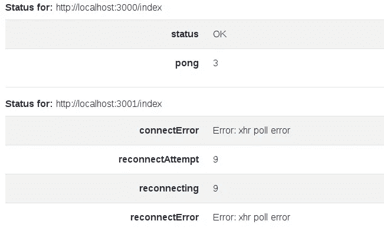

# Nuxt 插座。IO:连接状态和错误处理变得简单

> 原文：<https://javascript.plainenglish.io/nuxt-socket-io-connection-status-and-error-handling-made-easy-6fcf1c2ac43c?source=collection_archive---------4----------------------->

TL；DR——如果你在过去几年中一直从事 web 开发，你可能听说过关于错误处理的争论。"使用 try / catch！"，“不，使用 async / await /。接住！”，“不，用承诺/。接住！”。这里介绍了两个新特性，可以帮助开发人员清楚地了解给定 IO 套接字的连接状态，并以一种更干净、更主动的方式处理错误。随着插件承担起这一责任，现在开发人员对手头的问题有了一个全新的选择和视角，希望关于错误处理的整个争论会因为潜在前提的过时而变得平静。

声明:我是 [nuxt-socket-io](https://npmjs.com/package/nuxt-socket-io) 的作者

# 介绍

除非你是机器人先生，让他的代码第一次工作，否则当你的代码试图从你的后端或其他服务请求数据时，你很可能会遇到错误。最有可能的情况是，您的代码如下所示:

```
try { 
  const resp = await Svc.getData({ userId: 'abc123' })
  if (resp !== undefined) { // Note: Please don't do this. 
    // If it's undefined, it's an error if you were expecting a response.
    /* handle response */
  }
} catch (err) {
  /* handle error */ // this placeholder comment stays here forever
  throw new Error(err) // Note: Please don't do this! 
  // ^^ Don't catch an error just to throw it!)
}
```

这两个代码块看起来都很简单，而且有些优雅，但是当您有许多不同类型的请求要发送时，问题可能很快变得一团糟。在您意识到之前，您的代码将被许多 try/catch 块弄得乱七八糟。考虑到 VueJS 给了我们反应性属性，并让我们创建计算属性，当其他属性改变时，这些计算属性也会改变，我认为我们可以做得更好！

这是我的观点。当我调用一些方法来获取数据时，这些是我的期望:

```
// I want my request to be simple: (i.e., just make the request)
Svc.getData(...) // I just want to call this and have the response get sent directly to a property "resp".// Success handling: (if all was good, handle response)
function handleResp(resp) { // If I want to post-process resp, I call this
  /* handle resp */
  // The response is valid here, if not...
  // I have no business calling this function
}// Error handling: (if errors occurred, collect them and don't set property "resp")
emitErrors: { // <-- send any errors directly to this property
  getData: [{...}], // <-- send specific getData errors here
  // it's useful to include hints and timestamps
}
```

这样，我可以将我的关注点分开，并保持我的代码完全有组织。如果`emitErrors`变得真实，我可以基于此轻松地设计页面或组件的不同部分(使用*计算属性*)。另外，如果我可以消除*在`handleResp`方法中验证*响应的需要，我*也*消除了为此拥有*测试用例*的需要。节省的时间真的会越来越多。

# 连接状态

许多 IO 错误可以追溯到服务的实际连接。客户端连上了吗？这是要问的最基本的问题，但容易被忽视。幸运的是，socket.io-client 公开了几个事件，nuxt-socket-io 插件可以监听这些事件来确定状态*，如果*用户选择监听的话(下面解释)。下列事件是:

```
const clientEvts = [
  'connect_error', 
  'connect_timeout',
  'reconnect',
  'reconnect_attempt',
  'reconnecting',
  'reconnect_error',
  'reconnect_failed',
  'ping',
  'pong'
]
```

如果希望检查状态，用户只需通过在实例化`this.$nuxtSocket`的同一个组件上定义属性`socketStatus`来选择加入。然后,*插件*将自动设置状态(它将使用事件名称的大小写形式作为正确的名称，因为这是 Javascript 中的一个常见约定)。如果希望使用除`socketStatus`之外的专有名称，只需设置 ioOpts 属性`statusProp`。

示例:

```
data() {
  return {
    socketStatus: {}, // simply define this, and it will be populated with the status
    badStatus: {} // Status will be populated here if "statusProp == 'badStatus'"
  }
},
mounted() {
  this.goodSocket = this.$nuxtSocket({
    name: 'goodSocket',
    channel: '/index',
    reconnection: false
  }) this.badSocket = this.$nuxtSocket({
    name: 'badSocket',
    channel: '/index',
    reconnection: true,
    statusProp: 'badStatus' // This will cause 'badStatus' prop to be populated
  })
}
```

为了方便起见，SocketStatus.vue 组件现在也和 nuxt-socket-io 打包在一起，这将有助于可视化状态:(`import SocketStatus from ‘nuxt-socket-io/components/SocketStatus.vue`)

```
<socket-status :status="socketStatus"></socket-status>
<socket-status :status="badStatus"></socket-status>
```

将产生以下动态表格:



Example Socket Status for Two Sockets (one good vs. one bad)

因此，由于`socketStatus` props 是反应式的，所以基于连接状态显示或隐藏给定页面的某些部分变得很容易。

# 错误处理

即使连接是稳固的，仍然有可能发生 IO 错误。错误的两个主要类别可以被认为是:1)超时-和 2)非超时相关。该插件允许用户利用新的内置错误处理功能。

1) **处理超时错误**。如果客户端已连接，但发出了不支持的请求(该请求将永远得不到处理)，则可能会发生超时错误。当实例化`this.$nuxtSocket`时，用户通过在 IO 选项中指定一个`emitTimeout` (ms)来选择让插件处理超时错误:

```
this.socket = this.$nuxtSocket({ 
  channel: '/examples', 
  emitTimeout: 1000  // 1000 ms
})
```

然后，如果发生“发送超时”，有两种可能的结果。一个是，插件的方法将拒绝一个“emitTimeout”错误，这将取决于用户捕捉下游的错误:

```
this.someEmitMethod() 
.catch((err) => { // If method times out, catch the err
  /* Handle err */
})
```

上面允许用户以一种已经熟悉的方式编写代码，然而，我认为有一种更简单的方法来处理错误。

该插件可以提供一种完全不同的错误处理方式，这取决于用户是否允许。如果用户在组件上定义了一个属性“emitErrors”，而服务器以一个附加的错误作为响应(例如，一个具有已定义属性“emitError”的对象)，插件不会抛出错误，而是在组件上设置属性(`this.emitErrors`)并通过错误的 emit 事件组织`this.emitErrors`。这可能会产生更干净的代码，并使组件的计算属性更容易处理，当“emitErrors”属性更改时，这些计算属性也会更改:

```
data() {
  emitErrors: {} // Emit errors will get collected here, if resp.emitError is defined
}
...
this.someEmitMethod() // Now, when this times out, emitErrors will get updated (i.e., an error won't be thrown)
```

重要提示:为了让`this.emitErrors`得到更新，服务器必须将它的错误响应作为一个对象发送回来，并定义一个属性“emitError”。建议后端也将错误详细信息附加到响应中，以帮助进行故障排除。

2) **处理非超时错误**，比如错误请求，或者任何特定于应用程序后端的错误。同样，像以前一样，如果`this.emitErrors`在组件中定义，*和*响应是一个具有定义属性“emitError”的对象，属性`this.emitErrors`将在组件上设置，否则，将抛出“emitError”。如果希望对 emitErrors 属性使用不同的名称，可以通过在 ioOptions 中指定“emitErrors prop”来实现:

```
data() {
  myEmitErrors: {} // Emit errors will get collected here now
}mounted() {
  this.socket = this.$nuxtSocket({ 
    emitErrorsProp: 'myEmitErrors' 
  })
}
```

# 未兑现的承诺

在文章的开头，我的第一个代码片段提到了我希望空的响应被认为是一个错误。这仍然是我想考虑的事情，然而，在我写这篇文章的时候，插件并没有这样对待它。它只将定义的`resp.emitError`视为非超时错误。我认为现在更安全的做法是，假设不是所有的用户都希望我为他们处理他们的空响应，这就是为什么我要求他们以上述方式选择加入。如果有足够多的人想要自动的空响应处理，我会很高兴，但是我首先想看看人们在构建更多代码之前对代码的理解程度。一步步来。

# 结论

本文回顾了一种完全不同的，并且有望更简单的方法来处理 IO 连接状态和错误。当生活似乎只给我们提供了几种解决问题的方法时(尝试/抓住与承诺/抓住)，我喜欢尽可能想出另一种更省力的方法来解决问题。插件现在包括了其他的方式，我希望你会觉得有帮助！