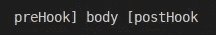
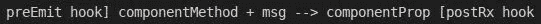
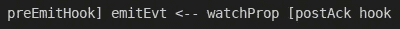
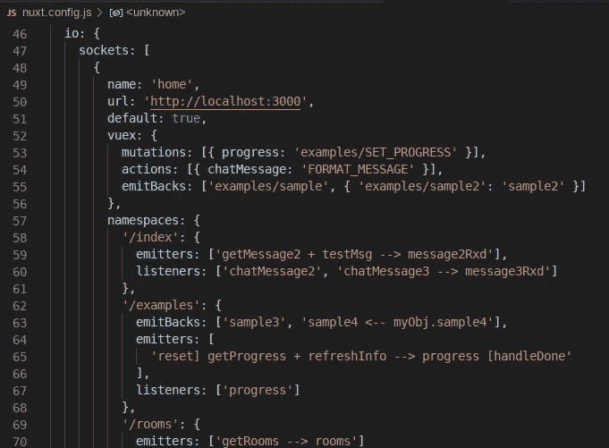

# nuxt-插座。IO:名称空间配置如何让您的生活变得无比简单

> 原文：<https://javascript.plainenglish.io/nuxt-socket-io-how-namespaces-config-may-make-your-life-insanely-easier-5d6947d2f9da?source=collection_archive---------6----------------------->

TL；DR——这份圣诞礼物来得有点晚，但我认为一旦它被完全理解，nuxt-socket-io 的用户会喜欢它的。现在，可以配置套接字了。IO 发射器、监听器和“发射回”直接在指定的*名称空间*的`nuxt.config`中。本文描述了如何利用这个新特性。

声明:我是 nuxt-socket-io 模块的作者。我在这里提出了一种新的语法，可能需要一些时间来适应，但我认为这是一种有意义的语法。以开放的心态对待它。

注意:语法中显示的箭头应该类似于我的封面图片中的箭头(两个破折号和一个“>”)。您看到的 Unicode 箭头只是该网站自动格式化的一部分。

**先决条件:**

1.  [Nuxt 插座介绍。IO](https://medium.com/javascript-in-plain-english/introduction-to-nuxt-socket-io-b78c5322d389) —这描述了 Nuxt 插座。IO 和基本设置。

**简介:**

插座。IO 是 web 的实时引擎，也是 Nuxt-Socket。IO 模块使得在 Nuxt 应用程序中使用它变得简单明了。很多时候，希望实例化套接字。组件内部的 IO 客户端，然后将通信范围限制在那些组件应该和将要关心的范围内。

例如，聊天室组件可能只想与聊天室服务对话，而房间的频道可能只想与该频道的服务对话。在特定渠道发送的信息不应该泄露到房间的其他地方。无论我们是否称它们为“通道”或“房间”，单词“名称空间”似乎对每种情况都是最合适的。另外，尽管“房间”和“频道”将我们的思维局限于“仅仅是一个聊天应用程序”，但另一方面，“名称空间”这个术语是通用的，它允许我们考虑所有 web 应用程序的范围通信。

除了将组件的 IO 范围限定为给定名称空间的 IO 之外，通常还希望在组件被销毁时发出断开连接的信号(即关闭套接字)。虽然开发人员自己完成清理步骤是个好习惯，但是对于给定应用程序中的每个组件来说，这种习惯要么很麻烦，要么很容易忘记。

因此，考虑到上述情况，nuxt-socket-io 插件和名称空间配置特性有以下目标:

*   插件必须允许在“nuxt.config”中为每个套接字配置名称空间。
*   该插件必须在页面和组件级别支持发射器、监听器和“发射回”的配置。
*   对于已经配置了模块的用户来说，配置必须和 vuex 选项(监听器和发送回)一样简单。
*   这个新特性必须支持一个新的、更直观的箭头(\-\-->)语法(两个破折号和一个“>”)。Medium.com 格式错误地连接了破折号)。这使得 IO 配置更容易进行版本控制，并在需要时与利益相关者(非开发人员)共享。
*   该配置必须支持在指定的 IO 事件之前和之后运行挂钩。
*   默认情况下，插件必须在组件被销毁之前自动断开套接字(通过将`teardown: false`选项传递给`this.$nuxtSocket`可以覆盖这一点)。
*   该插件通过鼓励应用程序开发人员编写更少但更一致的代码，让他们的生活变得更轻松。
*   该插件仍然必须公开 socket.io 客户端实例，以防开发人员需要直接访问客户端 API 方法。

    现在，可以在`nuxt.config`中配置名称空间了。每个套接字集可以有自己的名称空间配置，每个名称空间现在可以有发射器、监听器和发射回。该配置支持每个条目中的箭头语法，以帮助描述流(也支持前/后挂钩指定)。

**配置名称空间**

本节描述如何为每个名称空间配置发射器、监听器和发射回。一般语法是:

General Syntax

有时正文包括一个“+”、“←”或一个“→”。虽然字符“]”、“[”、“+”、“↓”和“→”的使用和位置非常严格，但是您为钩子、事件和道具使用的*名称*完全由您决定。

*具体的*语法如下:

*   **发射器:**

Emitter Syntax

**如何看待这个问题:IO 事件由`componentMethod`触发，事件“componentMethod”用“msg”发送(在组件中定义为`this.msg`)。当服务器响应时，该响应将发送到组件的 prop `componentProp`。`preEmit` hook 在事件发送前运行，`postRx` hook 在接收到数据后运行。这里的一个好东西是*插件*为你创建了*组件方法*,这样你就不必这么做了。只要调用它，它就会工作。

→挂钩`preEmit`和`postRx`是可选的，但是如果使用它们，则需要“]”和“[”字符，以便插件可以解析它们。这些钩子将在组件的方法部分定义，如`this.preEmit`和`this.postRx`
→`msg`是可选的，但如果使用，必须使用“+”字符
→`componentMethod`由插件自动创建，并发送同名事件。如果`componentMethod`被命名为“getMessage”，它发送事件“getMessage”
→这个`componentProp`是可选的，但是如果被输入，它将是一个属性，如果有响应返回，它将与响应一起被设置。这也是可选的，需要在组件上进行初始定义，否则它不会被设置。如果你试图渲染未定义的道具，Vuejs 也会抱怨。如果条目中省略了`componentProp`，箭头“→”也可以省略。

*   **听众**:

Listeners Syntax

**如何看待这个问题:当接收到事件“listenEvent”时，属性`this.componentProp`将被设置为该事件的数据。`preHook`将在接收数据时运行，但在设置`componentProp`之前。`postRx`设定`componentProp`后，挂钩将运行。

→两个`preHook`和`postRx`挂钩都是可选的。这里，`preHook`在接收数据时被调用，但*在*设置`componentProp`之前。`postRx`挂钩是在设置好道具后调用的。`this.preHook`和`this.postRx`需要在组件的方法部分定义，如果计划使用其中一个的话。
→如果使用箭头语法，当接收到`listenEvent`时，`componentProp`将设置该事件的数据。如果只输入了`listenEvent`,那么插件将尝试在同名的组件上设置一个属性。即，如果`listenEvent`是“progressRxd ”,那么插件将尝试在组件上设置`this.progressRxd`。
→重要提示:这个语法现在也可以作用于 Vuex 选项的突变和动作，它们也被设置为监听器。

*   **发射回来**:

Emitbacks Syntax

**如何思考这个问题:当一个组件的属性`watchProp`发生变化时，发回事件“emitEvt”。`preEmitHook`将在数据发出之前运行，而`postAck`将在服务器确认其事件(如果有的话)之后运行。

→ `preEmitHook`和`postAck`挂钩可选。`preEmitHook`在发出事件前运行，`postAck` hook 在收到确认消息(如果有)后运行。如果计划使用的话,`this.preEmitHook`和`this.postAck`需要在组件的方法中定义。
→ `watchProp`是组件上使用“myobj . child . grande”语法观察的属性。就像在组件上一样。
→ `emitEvt`是当`watchProp`改变时向服务器发出的事件名称。如果省略`watchProp`和箭头“←”，则`emitEvt`将兼作`watchProp`。
→重要提示:这个语法现在也可以在 Vuex 选项中工作，有一个重要的区别。在 Vuex(尤其是 Nuxt)中，监视属性路径可能需要正斜杠“/”。例如，如果 stores 文件夹中有一个“examples.js”文件，其状态属性为“sample”和“sample2”，则 watchProp 必须指定为“examples/sample”和“examples/sample2”。该规则的例外是“index.js ”,它被视为存储根。即 index.js 中的“样本”将简称为“样本”而非“索引/样本”)

**配置示例:**

以下面的配置为例:`nuxt.config.js`中的
:

Namespaces Config Example

1.  首先，我们来分析一下`/index`配置。

*   **发射器** :
    当`getMessage()`被调用时，事件“getMessage”将与组件数据`this.testMsg`一起发送。`this.testMsg`应该在组件上定义，但如果没有定义，则不会发送任何消息(当组件数据未定义时，插件会发出警告)。当收到响应时，组件上的`this.message2Rxd`将被设置为该响应。
*   **监听器** :
    当接收到`chatMessage2`时，将设置组件上的`this.chatMessage2`。当接收到`chatMessage3`时，映射的属性`this.message3Rxd`将被设置。

2.让我们来分析一下`/examples`的配置。

*   **发送回** :
    当`this.sample3`组件发生变化时，事件“sample3”将被发送回服务器。当`this.myObj.sample4`在组件中改变时，映射的事件“sample4”将被发射回来。
*   **发射器** :
    当`this.getProgress()`被调用时，首先会调用*`this.reset()`(如果定义了的话)，然后*事件“getProgress”会被发出，并带有消息`this.refreshInfo`。当收到响应时，`this.progress`将被设置为响应，然后`this.handleDone()`将被调用(如果已定义)。**
*   ****监听器** :
    当接收到事件“progress”时，`this.progress`将被设置为该数据。**

**聊天室:一个更令人兴奋的例子**

**想看一个稍微刺激一点的例子吗？看看我的[非常基础的]聊天室例子！**

**1.克隆我的 git 回购:[https://github.com/richardeschloss/nuxt-socket-io](https://github.com/richardeschloss/nuxt-socket-io)2。用`npm run dev:server`
3 运行服务器。前往聊天室页面:[https://localhost:3000/rooms](https://localhost:3000/rooms)尽情享受吧！(打开两个浏览器窗口，因为…你需要至少两个客户端进行对话；你也可以和自己聊天，如果你想的话:))**

**本系列的下一篇文章将有助于解释这个例子。**

****结论****

**这是关于 nuxt-socket-io 的新名称空间配置特性的一个相当长但很重要的讨论。虽然阅读本文所花费的时间可能比预期的要长，但是利用您在这里学到的知识，很有可能会大大减少您在未来的 web 应用程序上花费的时间。一开始可能会很颠簸，但我想随着时间的推移，你会习惯这种语法的。如果你讨厌它，不用担心…插件仍然会直接暴露 socket.io 客户端 API，所以如果需要，你的指尖会有。**

**下一条: [Nuxt 套接字。IO:如何在 10 分钟内创建隐形模式聊天应用](https://medium.com/javascript-in-plain-english/nuxt-socket-io-how-to-create-a-stealth-mode-chat-application-in-under-10-minutes-28e8e42ceae8?source=your_stories_page---------------------------)**

****信用/认可****

**感谢 apronti 的[打开了这个问题并询问了它。起初，我不认为有一个干净的方法来创建这个功能，我最初退出得太早。但是，经过更多的思考，我认为这个解决方案可能会让大多数用户满意(祈祷吧)。](https://medium.com/u/c6a10d62e582?source=post_page-----5d6947d2f9da--------------------------------)**