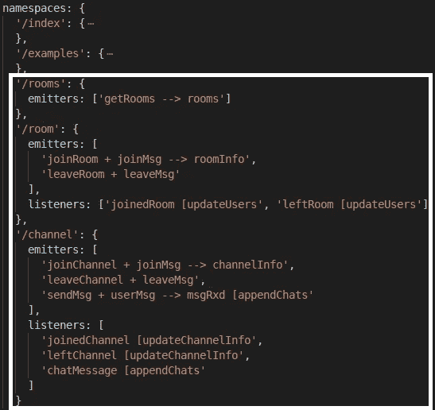
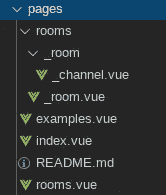
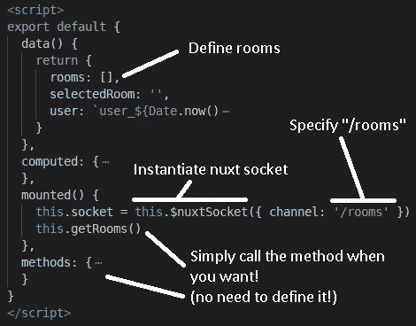
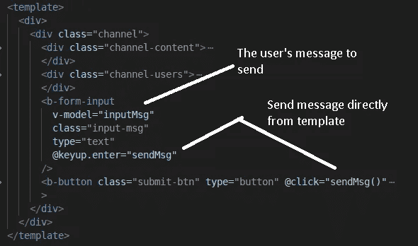
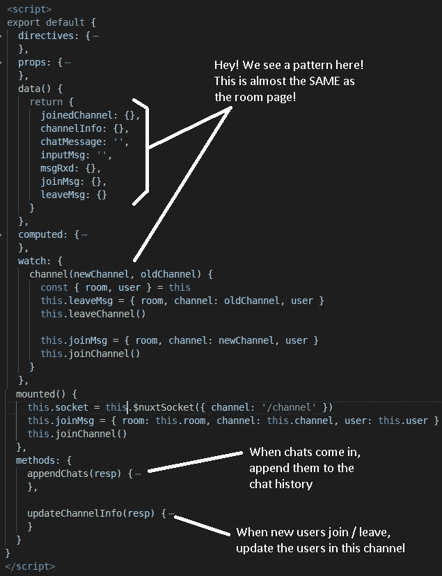

# Nuxt 插座。IO:如何在 10 分钟内创建一个秘密模式的聊天应用程序

> 原文：<https://javascript.plainenglish.io/nuxt-socket-io-how-to-create-a-stealth-mode-chat-application-in-under-10-minutes-28e8e42ceae8?source=collection_archive---------4----------------------->

TL；DR —在本系列的上一篇文章中，介绍了一个新的名称空间配置特性。该特性提供了一种特殊的语法，本文展示了如何配置该模块，在不到 10 分钟的时间内创建一个简单的匿名聊天应用程序。本文的目标是说明在`nuxt.config`中可以完成多少工作，以及在页面和组件级完成这项任务需要的代码要少多少。

声明:我是 [nuxt-socket-io](https://www.npmjs.com/package/nuxt-socket-io) 模块的作者。

# 推荐阅读:

1.  [Nuxt 插座介绍。IO](https://medium.com/javascript-in-plain-english/introduction-to-nuxt-socket-io-b78c5322d389) —这描述了 Nuxt 套接字。IO 和基本设置。
2.  [解释名称空间配置](https://dev.to/richardeschloss/nuxt-socket-io-how-namespaces-config-may-make-your-life-insanely-easier-23ml) —描述功能和语法。

上面的内容读起来很好，但是，我会试着写这篇文章，让例子容易理解，不管以前的知识。熟悉 Nuxt 和 VueJS 生态系统应该足以帮助您理解这个示例。

# 基本设置:

1.  克隆或派生我的 git 回购:[https://github.com/richardeschloss/nuxt-socket-io](https://github.com/richardeschloss/nuxt-socket-io)
2.  安装依赖项:`npm i`
3.  用`npm run dev:server`运行服务器
4.  打开至少两个浏览器标签，导航到聊天室页面:[https://localhost:3000/rooms](https://localhost:3000/rooms)尽情享受吧！简单的聊天消息应该在客户端之间来回发送。文章的其余部分简单地解释了正在发生的事情以及这是如何完成的。

# 配置名称空间:

*   首先让我们看看`nuxt.config.js`中的名称空间配置:

Namespaces Config

1.  首先，我们有一个用于`/rooms`的名称空间。这个名称空间只关心“房间”级别的任何通信。因此，有一个发射器将发出一个事件“getRooms ”,服务器将作出响应。当它出现时，我们将相应页面的数据`this.rooms`设置为该响应。如果我们愿意，我们也可以设置一个额外的发射器，比如“crudRoom + roomInfo - > rooms ”,它将发送一个事件“crudRoom”到**Cr**eate/**u**pdate/**d**delete 在`this.roomInfo`消息中指定的房间。返回的响应会将`this.rooms`设置为新的响应。如果比赛条件是一个问题，我们可以简单地改变目的地的名称。
2.  接下来，我们为`/room`命名空间。有两个发射器。一个发射器将发送带有消息“joinMsg”的事件“joinRoom”。在页面上，`this.joinMsg`将包含加入房间的用户的信息。服务器将处理套接字与唯一名称空间的连接，因为这就是 socket.io 服务器的工作方式(`socket.join`在服务器端完成)。成功加入后，服务器会做出响应,`this.roomInfo`将使用该数据进行设置。第二个发射器做与加入相反的事情:“leaveRoom”并发送消息“leaveMsg ”,其中包含用户离开房间。为了提醒*其他*客户端加入和离开事件，必须在客户端上设置监听器。在这里，我们简单地为“joinedRoom”和“leftRoom”事件指定侦听器，并指定一个 post 挂钩“updateUsers”在接收到新信息后运行。与步骤 1 一样，我们可能想要注册更多的发射器，用于编辑房间信息，或者通知现有用户其他房间范围内的事件。
3.  最后，我们有一个用于`/channel`的名称空间。什么是渠道？嗯，它真的就像“/房间”一样，只是房间里的房间。这里唯一的区别是我们将通道视为允许消息发送和接收的名称空间。因此，有一个发射器“sendMsg”，它将发送带有用户消息`this.userMsg`的“sendMsg”事件。服务器将回显用户的消息(确认收到)，在用户收到消息后，页面数据`this.msgRxd`将被设置，post 挂钩`appendChats`将把聊天添加到用户的聊天历史副本中。为了让房间里的其他人看到消息，他们需要监听“聊天消息”事件，并在收到消息后做完全相同的事情`appendChats`。注意:在我的例子中，我实际上并没有使用`this.msgRxd`，但是我仍然选择把它放在那里，以防我打算使用它。

# 页面结构

以下是页面在“页面”文件夹中的结构:

Page / Folder Structure

如果你是 Nuxt 的新手，这里有一个关于自动路线生成的 30 秒速成班(以及为什么 24.5k+的人喜欢 Nuxt): Nuxt 会根据文件夹和文件在“pages”文件夹中的结构自动创建嵌套路线。如果 pages 文件夹既包含*vue 文件又包含*同名文件夹，那么文件夹中的文件将被视为父 vue 文件的子文件。父 vue 文件只需要记住在模板中包含一个`<nuxt-child></nuxt-child>`，这样子页面就可以放在`<nuxt-child></nuxt-child>`元素所在的位置。此外，下划线在 NuxtJS 中有特殊的保留意义。它用于指示基于参数的路线。这正是我们想要的。当一个子页面想要获得那个 route 参数的值时，它通过在`$route.params[childPage]`中查找来实现。所以，“_room.vue”会看`$route.params.room`，“_channel.vue”会看`$route.params.channel`。

# 房间页面

以下是 rooms 页面的关键部分，它只关心“rooms”名称空间:

rooms.vue key parts

主要需求是实例化客户机，指定客户机使用的名称空间，并定义将接收数据的属性。这种情况下是`this.rooms`。你会注意到*不需要*来定义`getRooms`方法。事实上，这样做可能会破坏插件！你*已经*在 nuxt 配置中指定了一次，这就是所有要做的。插件会处理剩下的事情！

# 房间页面

以下是房间页面的关键部分:

room.vue key parts

这里，像以前一样，简单地定义在`nuxt.config`中输入的道具，当需要使用发射器方法时，只需*使用它们*。post 挂钩“updateUsers”是我们需要定义的唯一方法。

现在，我想我知道大多数读者会怎么想。如果插件可以创建发射器方法，难道它不能自动创建道具来为用户节省一个冗长的步骤吗？答案是肯定的，但有一个重要的警告。插件要承担这一责任，就必须为每个属性(很可能是一个对象)强制和假设一个数据类型。虽然将所有 IO 消息封装在*对象*中是我的个人风格，但是遵守格式`{ err: ..., data: ..., meta: ...}`可能所有用户都不想被迫这么做。而且，由于我不可能知道所有项目的需求，我可能会因为强制执行而疏远大量用户。一些用户可能想发送简单的数据类型(数字、字符串)或不同格式的对象。另外，通过这种方式，开发人员还可以控制其属性的初始值。

# 频道页面

最后，以下是渠道页面的关键部分:

channel.vue key parts

这看起来和房间页面几乎一模一样！事实上，如果付出更多的努力，我甚至可以在两个页面之间重用更多的代码！唯一真正的功能差异是在通道页面上，我们允许发送和接收消息。

用户的`inputMsg`封装在页面的`this.userMsg`对象中，当发送“sendMsg”事件时，该对象还将包含用户名。这主要是为了说明的目的，但是应该注意到，关于 *socket.io* 的一个有趣的事情是，每个套接字都有一个唯一的 ID(客户端和服务器在初始连接时都会知道`socket.id`)。对于每个事件，发送 socket.id 而不是用户名可能更合适。在这种情况下，服务器可以维护一个 id 到用户的映射。

# 奖金(你注意到额外的好东西了吗？)

1.  在服务器端，为了向 Nuxt 处理路由的方式致敬，我在后端的 IO 模块根据文件夹结构自动注册名称空间。“名称空间”文件夹中的文件将自动接受与名称空间匹配的连接`/[filename]`。这应该使得编写服务器端逻辑更加容易。简单地让方法镜像前端方法。
2.  页面级测试使测试比浏览器中的手动测试更快。如果你没有经历过`vue-test-utils`，你可能会学着爱上它。
3.  CSS-前端的网格。所以，如果你希望学习它，你可以从这些例子中学习(只要向下滚动到使用它的“风格”部分)。此外，room.vue 和 channel.vue 页面都使用它(因此您可以将一个 CSS 网格嵌套在另一个 CSS 网格中；最初，我认为这将打破东西，但显然不是)
4.  您的用户名不是真实姓名，而是根据您连接到房间页面的时间生成的伪随机数。任何时候你想改变你的用户名，你只需点击刷新页面，你会得到一个新的身份。所以有点像“隐形”模式(但不是真正的安全，不要完全依赖于此)。

# 注意事项

*   插件和示例仍有很大的改进空间。计划在不久的将来可能会有更好的错误处理。目前，开发人员将不得不处理后级挂钩中的错误，但我有一些在未来版本中改进解决方案的想法。幕后的 socket.io-client 也提供了错误消息，比如“连接失败”错误，这些错误可能可以被干净地处理。敬请关注。
*   该示例可以包括对 CRUD 操作的支持，以便用户可以创建、编辑或删除房间和频道。
*   页面的某些部分可能会进入组件，比如聊天历史中的每条聊天消息。

# 结论

好了，你知道了。在我的标题中，我承诺“10 分钟”，考虑到这是一个 7 分钟的阅读，你现在有 3 分钟的时间让它工作，不要让我成为一个骗子！:).我希望你喜欢它。没有必要为一个聊天应用程序向一些公司支付一大笔钱…你刚刚免费推出了一个！是的，我不会跟踪你们的聊天记录！聊天愉快！

下一篇: [Nuxt 插座。IO:连接状态和错误处理变得简单](https://medium.com/javascript-in-plain-english/nuxt-socket-io-connection-status-and-error-handling-made-easy-6fcf1c2ac43c?source=your_stories_page---------------------------)