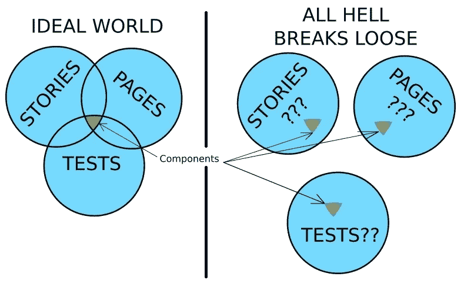
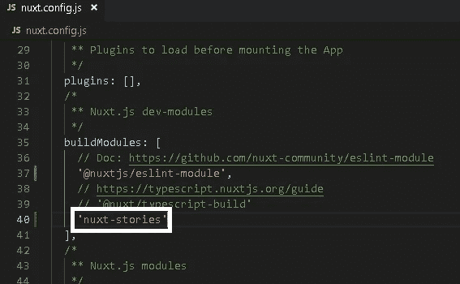
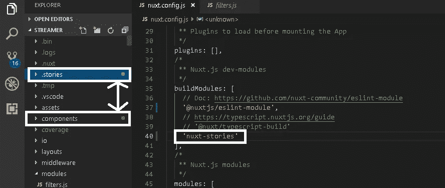
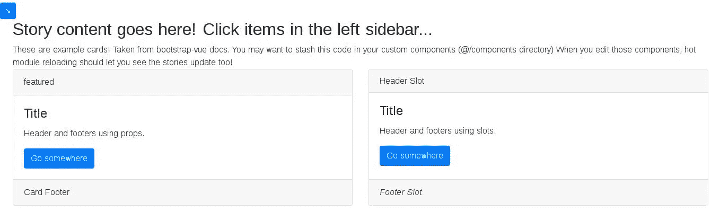

# Nuxt 故事书:无痛之路

> 原文：<https://javascript.plainenglish.io/nuxt-storybooking-the-painless-way-eb5a3653265f?source=collection_archive---------8----------------------->

TL；DR —“故事书”是组织项目和组件需求(也称为“故事”)的过程，通过这种方式，用户界面部分的所有方面都可以传达给所有利益相关者。这篇文章向读者介绍了[ [微小！](https://bundlephobia.com/result?p=nuxt-stories) *] [nuxt-stories](http://npmjs.com/package/nuxt-stories) 模块，旨在为 nuxt 框架提供相对轻松有趣的故事书。

声明:我是 nuxt-stories 模块的作者。(*我会尽量保持微小……)

**简介:**

恰当地记录和交流需求可以说是任何项目中最重要的部分。然而，在许多项目中，需求似乎很容易与实际编写的代码脱节。通常需求写在单独的静态位置，比如电子表格或幻灯片，而代码写在其他地方。这听起来像是组织关注点的一种相当简单的方法，但是当一次性的书面期望和不断变化的现实之间出现不匹配时，就会出现问题。通常需要不断迭代需求和代码，直到达到预期。对于 web 前端来说尤其如此，在那里许多需求可能是完全主观的(例如，基于审美)。

> 如果简单的英语要求不能被正确地解决，代码就没有机会了！

故事书试图通过将需求(又名“故事”)直接放在与代码库相同的工作空间中来解决这种脱节。这样，如果我们可以把 web 应用程序的每个页面简单地看作是组件和布局的集合，那么故事就可以很容易地访问它们。理想情况下，当故事书作者写故事时，实际的组件正在被编写和测试。因此，当这些组件在实际页面中使用时，页面将总是与需求保持同步。

Requirements Heaven vs. Requirements Hell

在上图中，让相同的组件与故事、测试和页面共享和同步是最理想的。从我的经验来看，当故事存在于分散的位置，并且，有时，以相互冲突或不明确的需求来编写时，它只会延迟真正的进展。可以理解，控制项目需求的人可能有最好的意图和深思熟虑的想法，但可能很快意识到需要进行重大调整。故事书将显示需要立即进行哪些调整。

虽然组件确实可以直接在页面上设计，但是开发人员很快就会发现，将它们与页面隔离开来设计要容易得多。有时希望看到虚拟数据而不是真实数据的组件是什么样子，因为…应用程序还没有创建！但是，即使这款应用已经投入生产，故事书也是在事后出现的(喘息！)，通常不希望“dummyData.json”文件污染页面文件夹。最好把它放在 stories 文件夹中(或者虚拟数据库！)，以及特殊的“UX/flavor-123”git 分支中。然后，快速改变视图只是简单地改变 git 分支。

**Nuxt 中的故事书**:

有很多很棒的故事书解决方案，很多都有很棒的社区、功能和附加组件。我非常尊重这些解决方案！这些远比我一周前开发的 Nuxt 模块有经验。然而，我选择创建这个模块是因为当它涉及到 Nuxt 时，当我想写故事书并且仍然使用一些“Nuxt 的东西”并且以“Nuxt 的方式”做事时，我面临了几个挑战。

最终，在这个问题上花了几个小时后，我有了重大的认识，Nuxt *已经*提供了一个强大的架构，可以简单地*扩展*以在需要时(即在开发模式下)包含故事书，而在不需要时(在生产中)省略。这意味着有了这个模块，启用故事书就像在 Nuxt config 中注册这个模块一样简单。留出一整个星期天来让故事书工作的需要已经一去不复返了。

**安装**:

1.  nuxt-stories 模块依赖于:glob、pify 和@nuxt/utils。这些应该在运行`npx create-nuxt-app`后就已经安装好了。如果没有，安装它们:`npm i -D glob pify @nuxt/utils`

2.安装模块:`npm i -D nuxt-stories`

该模块还将安装 bootstrap，用于设计示例故事的样式。安装后，将自动运行一个安装后脚本，将示例故事复制到项目文件夹的`.stories`目录中，以帮助您尽快开始。请放心，它会“轻轻地复制”，所以如果你已经有内容在该文件夹中，他们不会被覆盖。

**配置:**

在您的`nuxt.config.js`文件中，只需将`nuxt-stories`指定为您的`buildModules`之一。只有当您的环境处于开发模式或者您指定了`forceBuild: true`时，它才会被启用。有时，您可能希望将应用程序托管为静态站点，这样您也可以分享故事。然而，通常在生产中，您可能不想打包它们。

Enable storybooking with ONE line in nuxt.config!

**用法:(简单！)**

如前所述，当你第一次安装这个模块时，`.stories`文件夹应该已经创建好了，里面有一些例子。这个文件夹*和你的 pages 文件夹*完全一样，除了你的故事放在这个文件夹里。路径是使用 Nuxt 用来创建页面路径的相同的`createRoutes()`实用程序自动创建的，因此您可以类似地构建您的故事。为了避免与任何可能被命名为“故事”的真实路线冲突，故事路线将从“开始”。故事”。此外，您可能会发现在您的工作流程中使用。故事”非常接近你工作树中的“组件”文件夹。现在，在 IDE 中，在两个文件夹之间切换应该会快得多。

“.stories” is closer to “components”! Less eye movement, less mouse movement

要查看您的故事，请访问:`[http://[your](/[your)LocalHost]/.stories`。对于不耐烦的人，或者想试驾的人，你可以在这里看演示:

[https://nuxt-stories.netlify.com](https://nuxt-stories.netlify.com/)

“Card” stories (Navbars expanded)

“Card” stories (Navbars collapsed)

正如您所看到的，这相当简单明了，没有什么太令人兴奋的，但这正是关键所在。这些故事可以根据个人喜好完全定制。更喜欢 Vuetify 而不是 Bootstrap？没问题！关键的一点是，为了方便开发人员，需要的路线会随着故事的更新而自动生成。故事路线在`this.$router.options.routes`都有。如果开发人员已经习惯于在“pages”文件夹中创建页面，这应该看起来很熟悉！

**重要注意事项&已知怪癖**:

1.  故事路线需要一个“故事根”。该模块使用第一个找到的"。vue“文件在”。stories”文件夹作为故事的根。因此，如果您在中既有 index.vue 又有 root.vue 文件。stories”，将使用 index.vue，而不是其他。“index.vue”在 Nuxt 社区中更常用，这似乎是惯例。
2.  nuxt-stories 未来的每一次安装都将使用“温和复制”,这样就不会覆盖你已经完成的所有故事。如果有疑问，请在更新前提交您的故事。
3.  可能有一段时间，你希望像我一样将你的故事部署到一个静态网站上(这样你就可以很容易地与利益相关者分享它们)。简单的解释是:查看或复制我的 [gh-pages](https://github.com/richardeschloss/nuxt-stories/tree/gh-pages) 分支，看看我是如何配置的，然后简单地将你的 dist 推送给你的主机(不同的主机比其他主机更容易合作)。较长的解释是:选择”。stories”作为 stories 文件夹既是福也是祸。带有“.”的文件前缀通常被文件系统视为隐藏。如果你完全控制了服务器，你就可以提供隐藏文件。然而，其他平台不会包括隐藏文件，即使你推他们。因此，为了避免遇到 404 错误，您必须将。Stories”文件夹，就像“nuxtStories”或“stories”一样，只是确保不要与您的真实应用程序可能使用的任何其他真实“stories”路径冲突。
4.  ESLint 也可以忽略前缀为“.”的文件或文件夹。如果你打算包括”。stories”作为要链接的目录，您需要简单地“否定忽略”在`.eslintignore`中的目录，方法是添加行:`!/.stories`

**结论:**

如果幸运的话，如果我解释的没错，您现在应该已经在 Nuxt 应用程序中启用了 storybooking。在过去，编写和维护需求一直是令人生畏的枯燥任务，没有人愿意被打扰，但却一直被认为是最重要的。当你写的需求由*功能组件*组成，这些功能组件在你实际的应用程序页面中被保存和热重新加载时得到测试，你会立刻感到满足，你的应用程序正在做你和你的客户想要的事情(希望在比你预期的更短的时间内)。