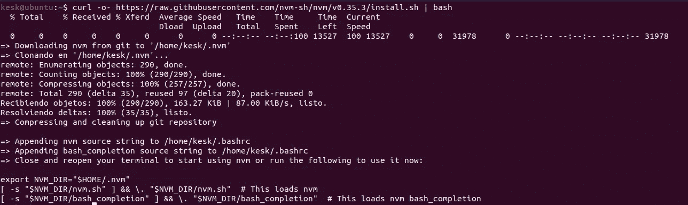
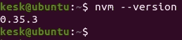
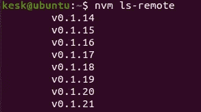
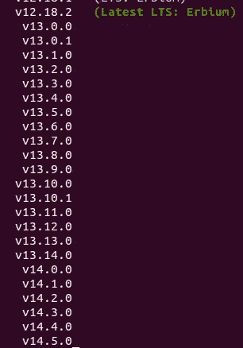
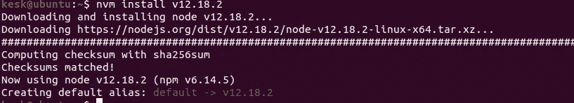
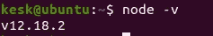
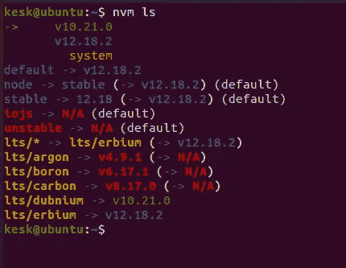
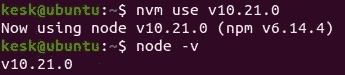

# NVM:前端开发者必备工具

> 原文：<https://javascript.plainenglish.io/nvm-a-must-know-tool-for-front-end-developers-e720b880fe33?source=collection_archive---------4----------------------->

## 使用节点的最简单方法


如果您使用 Angular、React 或其他框架或它们的不同版本，您将需要更改系统中 Node 的版本。但是在本地开发的节点环境之间切换并不容易，而且通常会减慢工作速度。

有一天我发现了 NVM，我的工作简化加速了。但是 NVM 是什么？

## 节点版本管理器

简单来说:NVM 是 [node.js](https://nodejs.org/en/) 的版本管理器。

NVM 是一种工具，它使 Node 现有版本之间的切换更加容易。当开发人员处理具有不同版本的 Node 的各种项目时，这尤其有用。如果没有 NVM，您必须不断卸载和重新安装节点版本及其全局软件包，才能使用不同的版本。

NVM 可以:

*   拥有多个项目，这些项目的库需要针对不同的版本进行构建。
*   如果你正在开发一个应用程序，NVM 会给你一个方法来绕过每次更新带来的障碍。
*   您可以快速测试应用程序在不同节点版本下的行为。
*   用一个简单的命令在本地下载 Node 的任何远程版本。
*   它使得用不同的 JavaScript 级别测试应用程序变得容易。
*   NVM 支持多种类型的外壳。

## 安装 NVM

NVM 的设置非常简单，请遵循以下步骤:

```
$ curl -o- [https://raw.githubusercontent.com/nvm-sh/nvm/v0.35.3/install.sh](https://raw.githubusercontent.com/nvm-sh/nvm/v0.35.3/install.sh) | bash
```

或者

```
$ wget -qO- [https://raw.githubusercontent.com/nvm-sh/nvm/v0.35.3/install.sh](https://raw.githubusercontent.com/nvm-sh/nvm/v0.35.3/install.sh) | bash
```

运行以上任一命令都会下载并运行安装脚本:



要检查 NVM 是否已正确安装，请打开一个新的终端并键入:

```
$ nvm -version
```

如果一切正常，您将获得安装的 NVM 软件包管理器的版本:



如果您的系统没有找到 NVM，请执行以下命令:

```
$ export NVM_DIR="$([ -z "${XDG_CONFIG_HOME-}" ] && printf %s "${HOME}/.nvm" || printf %s "${XDG_CONFIG_HOME}/nvm")"
[ -s "$NVM_DIR/nvm.sh" ] && \. "$NVM_DIR/nvm.sh"I
```

## 使用 NVM

NVM 使用起来很简单。

以下是最重要的命令列表:

要下载、编译并安装**最新**版本的 Node，请执行以下命令:

```
$ nvm install node
```

注意:Node 是请求 Node 的最新版本的别名。

向您显示节点的所有可用远程版本:

```
nvm -ls -remote
```



要安装和设置特定版本的节点:

```
$ nvm install v12.18.2
```



要显示本地安装的版本:

```
$ nvm ls
```



要使用节点的特定安装版本，请执行以下操作:

```
nvm use v10.21.0
```



如果出于某种原因，您希望使用系统安装的 Node 版本，可以使用特殊的默认别名“system”:

```
nvm use system
nvm run system --version
```

## 结论

知道如何使用 NVM 可以帮助你节省大量的时间和头痛。这不仅对开发团队极其重要，如果你独自工作也是如此。节点学习曲线小，背他的命令很直接。

如果您使用 Node，这是一个不可或缺的工具。

非常感谢你读给我听。我希望在我的日常工作中，使用这个工具对你和对我一样有用。

## 参考

[](https://github.com/nvm-sh/nvm) [## nvm-sh/nvm

### nvm 是 node.js 的版本管理器，设计为按用户安装，按 shell 调用。nvm 可以在任何…

github.com](https://github.com/nvm-sh/nvm) 

# 简单英语的 JavaScript

喜欢这篇文章吗？如果是这样，通过 [**订阅解码获得更多类似内容，我们的 YouTube 频道**](https://www.youtube.com/channel/UCtipWUghju290NWcn8jhyAw) **！**